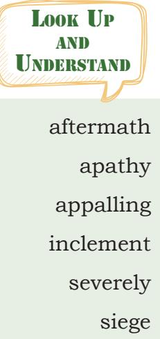
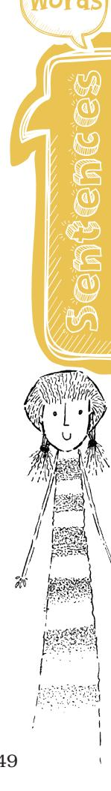
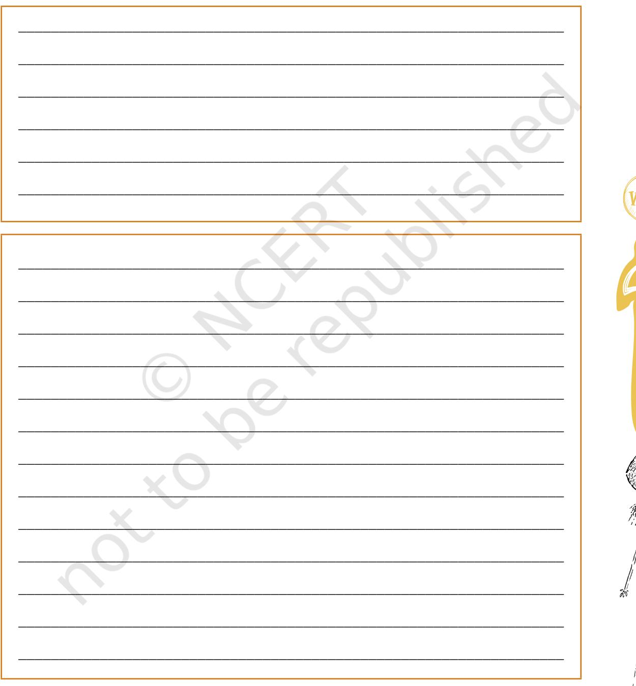
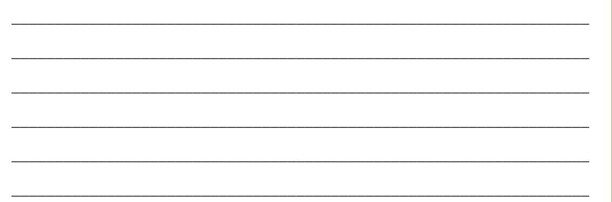

# 4 **From the Diary of Anne Frank**

;

# **Let's Begin**

UNIT

?

The World Wars fought in the past stand testimony to the fact that fighting wars brings severe human suffering. The sufferers, including women and children are left behind with trauma and indelible impressions on their minds. You have read in the Class X English textbook the account of one such war in the diary of Anne Frank who captured the miseries of war in her diary. Discuss how you may relate to Anne Frank's feelings of alienation and isolation.

# **Reading Comprehension**

## **Text I**

The following excerpt is from the diary of Lena Mukhina, a teenage girl who had undergone the atrocities of Germans when they fortified the city of Leningrad. The siege of Leningrad is an important landmark in the history of Russia. The siege of Leningrad lasted from September 1941 to 1944. The city was cut off from the rest of Russia. The Germans continuously bombarded the city which resulted in death, destruction, and starvation of the people. However, the resolute Russians were warned in the beginning that the enemy was at the gate and it was a question of life and death. They fought bravely and failed the Germans in their evil designs.

Read the excerpt and answer the questions that follow.

#### **Foreword from** *The Diary of Lena Mukhina*

No one could possibly have known that the city would remain in the grip of siege for 872 days and nights. But Leningrad's citizens had begun to feel the breath of war as early as September. Daily

Unit-4.indd 45 27-Jun-2019 04:19:28 PM

#### *Lena Mukhina*

inclement weather for the reduced visibility it brought. They came to dread sunny days and moonlit nights, when the Germans would be sure to bomb their city. Cloud cover, however, offered no protection from artillery fire: in just over six months from the start of the siege there were only thirty-two days when shells did not explode on the city's streets. Hunger soon set in. Between September and November 1941 the bread rations that had been announced in July were reduced five times, reaching their lowest point on 20 November—125 'blockade grams' for children, dependents and white-collar workers and 250g for manual workers, technicians and engineers. Rations of meat, butter, sugar and other food

air raids and artillery bombardment of residential neighbourhoods drove the city's inhabitants into bomb shelters, several times a day, and for hours at a time. People's initial curiosity in the aftermath of the first bomb attacks soon gave way to fear and then, in conditions of appalling hunger and cold, to apathy. Leningraders welcomed

items were severely reduced. The summer months and the beginning of autumn, when it was still possible to buy food without ration cards in ordinary shops and canteens were no more than a distant memory.

#### **Q.1. Infer the meanings of the following expressions. The first has been done for you as an example.**

- (a) to feel the breath of war: there were indications that war was going to start soon
________________________________________________.

________________________________________________.

________________________________________________.

- (b) appalling hunger and cold:________________________
- (c) start of the siege:________________________________
- (d) blockade grams: _________________________________

46 Words and Expressions 2 – Class X

Unit-4.indd 46 27-Jun-2019 04:19:29 PM

- **Q.2. List the words from the passage which are related to the war, for example 'bombardment'.** ____________________________________________________ ____________________________________________________ ____________________________________________________ **Q.3. Answer the following questions:** (a) Who were the captives as stated in the above passage? ________________________________________________ ________________________________________________ (b) Why did the people under siege welcome the bad weather conditions? ________________________________________________ ________________________________________________ (c) What were the fears in the mind of the people? ________________________________________________ ________________________________________________ (d) Have the people lost hope or reconciled to the existing situation? ________________________________________________ ________________________________________________ **Q.4. Tick the correct answer** '…when it was still possible to buy food without ration cards in ordinary shops and canteens were no more than a distant memory.' It means: (a) There was hope of getting ration soon.
	- (b) Citizens under siege had to show their ration cards for buying food.
	- (c) There were shops and canteen for buying food for the people under siege.
	- (d) The possibility of buying the food without a ration card as in the past, was no more than a memory now.

Sentences

Unit-4.indd 47 27-Jun-2019 04:19:30 PM

### **Reading Comprehension**

## **Text II**

There are many ways of recording the events, news, and personal experiences. Diary writing, logbook, daybook, journal, etc. are a few to name. The journal writing is about writing the everyday record of an event or writing about an event, activity or experience, etc.

The following is an excerpt from the beginning of *A Journal of the Plague Year* by Daniel Defoe.

#### *A Journal of the Plague Year*

It was about the beginning of September, 1664, that I, among the rest of my neighbours, heard in ordinary discourse that the plague was returned again in Holland; for it had been very violent there, and particularly at Amsterdam and Rotterdam, in the year 1663, whither, they say, it was brought, some said from Italy, others from the Levant, among some goods which were brought home by their Turkey fleet; others said it was brought from Candia; others from Cyprus. It mattered not from whence it came; but all agreed it was come into Holland again.

We had no such thing as printed newspapers in those days to spread rumours and reports of things, and to improve them by the invention of men, as I have lived to see practiced since. But such things as these were gathered from the letters of merchants and others who corresponded abroad, and from them were handed about by word of mouth only; so that things did not spread instantly over the whole nation, as they do now.

But it seems that the Government had a true account of it, and several councils were held about ways to prevent its coming over; but all was kept very private. Hence, it was that this rumour died off again, and people began to forget it as a thing we were very little concerned in, and that we hoped was not true; till the latter end of November or the beginning of December 1664 when two men, said to be Frenchmen, died of the plague in Long Acre, or rather at the upper end of Drury Lane. The family they were in endeavoured to conceal it as much as possible, but as it had gotten some vent in the discourse of the neighbourhood, the Secretaries of State got knowledge of it; and concerning themselves to inquire about it, in order to be certain of the truth, two physicians and a surgeon were ordered to go to the house

Unit-4.indd 48 27-Jun-2019 04:19:30 PM

and make inspection. This they did; and finding evident tokens of the sickness upon both the bodies that were dead, they gave their opinions publicly that they died of the plague. Whereupon, it was given in to the parish clerk, and he also returned them to the Hall; and it was printed in the weekly bill of mortality in the usual manner, thus — Plague 2. Parishes infected 1.

- **Q.1. The above passage is written in the English that was prevalent in the eighteenth century. Find some words and phrases from the text which seem different as compared to the English language usage at present. List them and find an appropriate substitute for each. Look at the example given below:**

| Example: whence—when |
| --- |
| _______________________________________________________________________ |
| _______________________________________________________________________ |
| _______________________________________________________________________ |
| _______________________________________________________________________ |
| _______________________________________________________________________ |

#### **Q.2. Answer the following questions:**

- (a) What is being talked about in the first paragraph of Daniel Defoe's journal?
_________________________________________________ _________________________________________________ _________________________________________________ _________________________________________________

- (b) How was news about important events circulated during those days?
_________________________________________________ _________________________________________________ _________________________________________________ _________________________________________________

Unit-4.indd 49 27-Jun-2019 04:19:30 PM

- (c) Why did the rumour about the plague die off?
_________________________________________________ _________________________________________________ _________________________________________________ _________________________________________________

_________________________________________________ _________________________________________________ _________________________________________________ _________________________________________________

- (d) How was the news about the plague confirmed?
#### **Q.3. Tick the correct answer.**

- '… the weekly bill of mortality' means:
- (a) The weekly payment of dues
- (b) The weekly news about the deaths
- (c) The statement about the hospital expenditure issued every week
- (d) The list which was issued weekly, of persons who died due to plague

# Vocabulary

- 1. Choose a word or expression that completes each of the following sentences. One has been done for you.
	- (a) I can't tell you the plan because I don't know about it . (him her it them)
	- (b) One should learn to defend_____________against bullies. (herself itself himself oneself)
	- (c) The girls____________were helping you were probably Rahul's friends.
		- (which who that they)
	- (d) These dresses belong to you. I am sure they are_________. (yours your yours' theirs)
	- (e) The fire caused serious___________to the group of houses. (damage damages injuries injury)

**Idiom** A baker's dozen: thirteen Egg on one's face: be embarrassed, feel foolish

Unit-4.indd 50 27-Jun-2019 04:19:31 PM

- (concerned to concern about concerned at concerned with)
(f) The board was________________plans for the tournament.

Idiomatic expressions

- 1. Refer to the lesson 'From the diary of Anne Frank' in your Class X textbook. There are some idiomatic expressions in the text. For example:
	- (a) Our entire class is quaking in its boots. Quake in (one's) boot: to tremble with fear or nervousness
	- (b) Until then we keep telling each other not to lose heart. Not to lose one's heart: not to lose hope or not to feel demoralised

Now, look at the idiomatic expressions given below. Use a dictionary to find out the meanings. Make sentences using the expressions.

all's fair in love and war icing on the cake call the shots chalk and cheese raining cats and dogs breaking the ice

- 2. Fill in the blanks using the contracted forms of the verbs. One has been done for you.
This is a beautiful flower. Is not it? Isn't it?

- (a) You should not eat so much. You________eat so much.
- (b) They have written the story. ________written the story.
- (c) Let us go watch a movie. _______go watch a movie.
- (d) He did not play tennis. He__________play tennis.
- (e) I could not find my friend in the crowd.

I _________find my friend in the crowd.

- (f) Here is your bag. __________your bag.
Sentences

Unit-4.indd 51 27-Jun-2019 04:19:31 PM

- (g) I would guide him. __________guide him.
- (h) They are not rich. They____________ rich.
- 3. Fill in the blanks with the phrasal verbs given below. Change the tense of the verbs wherever required. (breakdown, find out, look for, go out, check out) Suhasini wanted to__________________with her mother to the book shop. Her mother came back home very late. She said that her car__________________on the way back. She had to __________________a mechanic. She_________________several apps for roadside assistance but then_________________ that her internet was not working.

# Editing

- 1. Read this quote from Max Müller. There are errors in the text. Find out the errors and write the correct word in the space provided
"If I was asked under what sky the human mind ___________ has most fully developed some for its choicest gifts,

has most deeply pondered on the greatest problems

 of life, and has find solutions of some of them which 

___________ well deserve the attention even of them who have___________ studied Plato and Kant, I should pointed to India.

And if I were to ask me from what literature ___________ we who has been nurtured almost exclusively ___________

on the thoughts of Greeks and Romans, and of the Semitic race, the Jewish, may draw the corrective which is most want

in order to make our inner life more perfect, ___________

more comprehensive, more universal, in fact most truly human a life... ___________

again I should point to India."

#### *Max Müller*

___________

___________

___________

(Source: https://www.goodreads.com/quotes/1039434-if-iwere-asked-under-what-sky-the-human-mind)

52 Words and Expressions 2 – Class X

**Tongue twisters** I saw Susie sitting

in a shoeshine shop

Unit-4.indd 52 01-Jul-2019 01:47:52 PM

- 

#### **Comma**

Comma can be used in the opening and closing of a letter. *Dear Rashmi, I would like to thank you. Love, Rekha*

- 1. The following poem is taken from *The Diary of Lena Mukhina*.
	- (a) Ask your teacher to recite the poem. Listen to the poem attentively and identify the qualities mentioned.
	- (b) Discuss these qualities with your partner.
	- (c) Think of a person who has some of these qualities and talk about them to your partner. You can highlight the incidents and actions of the person that reflect these qualities.

Lena Mukhina's Diary 22 May 1941–25 May 1942

'Remember My Sad Story: Lena Mukhina's Siege Diary'

Consider any day on which you do not discover anything new or learn anything useful a lost day!

Anyone can become strong, smart and steadfast. There is only one essential requirement–will power!

Will power can conquer anything. A strong-willed person is persistent and determined.

People are not born brave, strong and smart. These qualities must be acquired through perseverance and with determination, like the ability to read and write.

# Writing

1. You have read in the passage 'A Journal of the Plague Year' by Daniel Defoe about how the news of plague was reported in those times. What are the means of reporting today?

Unit-4.indd 54 28-Jun-2019 09:43:30 AM

___________________________________________________________________

___________________________________________________________________

- 

| ___________________________________________________________________ |
| --- |
| ___________________________________________________________________ |
| ___________________________________________________________________ |
| ___________________________________________________________________ |
| ___________________________________________________________________ |
| ___________________________________________________________________ |
| ___________________________________________________________________ |
| ___________________________________________________________________ |
| ___________________________________________________________________ |
| ___________________________________________________________________ |
| ___________________________________________________________________ |

- 
- (a) Affected area(s)
- (b) Reasons of famine
- (c) Relief measures
- (d) Pictures, films, etc.

Prepare a poster using pictures and highlighting the information you have collected. Give a title of your choice to the poster and display it in the class.

# Do you know

One of the three islands in the Juan Fernandez archipelago, 700 km off the Pacific coast of Chile was discovered in the 16th century. Alexander Selkirk, the Scottish sailor was marooned there for four years and four months. He related his experience to Daniel Defoe, who wrote his famous adventure book Robinson Crusoe based on the sailor's experience, since then the island is known as Robinson Crusoe.

There is a seemingly unbelievable true story of the orphaned bear cub, which was found by Polish troops during World War II who travelled with them through Iraq, Syria, Palestine, Egypt, Italy and Scotland. During the war, Wojciech Narebski and his fellow Polish servicemen had to lift crates of heavy metal artillery. Fortunately for them, one of the soldiers had superhuman strength: Corporal Wojtek, a Syrian brown bear. When the bear saw that soldiers were struggling, he'd want to help... he'd come over, grab a crate and carry it to the truck. This can be heavy work, even for a bear. When Wojtek (bear) got tired, he would simply stack one crate on top of the other which also helped the soldiers because they didn't have to lift the crate off the ground. Of course, Corporal Wojtek (bear) got a reward of honey and marmalade. That was his favourite!

You know, things can happen that you wouldn't normally think are true. Collect some more stories under the title— 'Sometimes truth is stranger than fiction.'

Unit-4.indd 56 27-Jun-2019 04:19:32 PM

