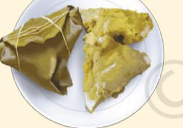
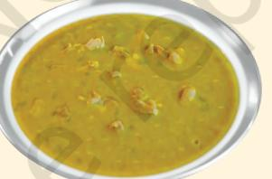
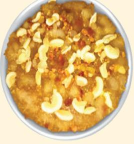
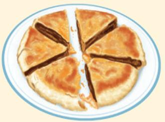
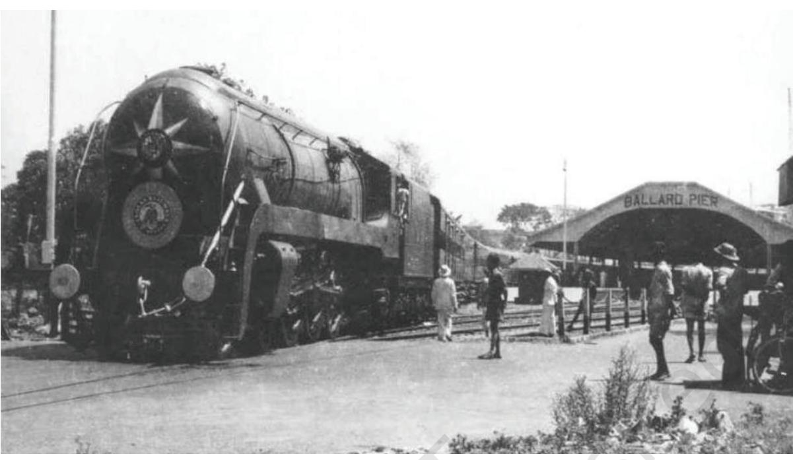

# 5 **Glimpses of India**

;

### **Let's Begin**

Unit

?

In the 'Glimpses of India' (*First Flight*, Class X textbook, NCERT) you have read about interesting people and places. India is a place of diversity in terms of culture, language, food, traditions, etc. There are many stories unknown to us about the way of life of people. Work in groups of four and find out about the following in any five Indian states.

- Dance form and music
- Art form
- Any other information

Mark these five places on a map and represent the information highlighting the interesting facts.

### **Reading Comprehension**

### **Text I**

The following is an excerpt about the Parsi community in India and their food.

Read the passage and answer the questions.

"*Aavoji*, *aavo*, *aavo*! Welcome to Delhi! Let me show you my beautiful city." The booming voice of Nowrosji Kapadia could be heard across the length and breadth of the platform. It was Nowrosji's favourite pastime: a walk to the Old Delhi railway station to greet the Frontier Mail as it chugged into Delhi from Mumbai to Peshawar. With this refrain, an eager Nowrosji would cajole Parsi visitors off the train and take them home for a meal and often persuade some to stay overnight or for a few days. He

Unit-5.indd 57 20-02-2023 09:35:34

### Look Up and Understand

cajole dainty extensive overruled vouch would use this opportunity to tell them about the advantages of shifting to Delhi. Though his wife Jer Bai would occasionally object to unknown visitors, she was always overruled. This was the beginning of the community of Parsis in Delhi....

...Writing about Parsis in the Delhi of old is not easy. There are memories of my grandparents and parents—a collective memory of generations past and people long gone, yet here in spirit....

During festive gatherings, the women went to town with the food; outside catering was unheard of. The poorer members of the community never knew who had paid for what. This tradition continued in the northern cities of Lucknow, Kanpur, and Allahabad well into the '70s. Sadly, that kind of life has almost gone forever.

Food preparations began two days in advance. *Dar ni pori* (rich pastry stuffed with sweetened lentils) and *malido* (*halwa*) were carried in big *vatus* (pots) and served with *puris*. Anyone who has made *malido* can vouch for the fact that you need strong biceps; it is an exhausting exercise. The first time I made it under my grandmother's supervision was also the last. I could hardly move my arms for the next two days! Since then, I gained a healthy respect for my dainty grandmother.

The menu was extensive. Breakfast would start with either *sev*—brown vermicelli cooked in milk and served with fresh cream—or *ravo*, semolina pudding, *Mithu dahi* or sweetened curd made with full cream milk was an absolute must. This was followed by *bafellaeeda*, hard-boiled eggs, and *kheemo kaleji*, mutton mince with liver. For lunch, there was almost always *smori dal chawal* and *macchi no patio*—white boiled rice with yellow *dal* offset by a tart and tangy fish curry.

Teatime was special at our home. My grandmother made it a point to dress for tea; I was made to do the same. Once we were ready, out came the treats: Parsi biscuits—*batasa*, *nankhatai* and flaky *khari*; *patrel*, rolled, steamed *arbi* leaves stuffed with *besan masala*; *kumas*, rich Parsi cake; and my favourite, *bhakra*, sweet deep fried doughnuts. That tradition has stayed with me. I certainly don't dress up, but I still need a snack with at least three cups of tea!...

> (Source: 'Down Memory Lane with the Parsis of New Delhi' by Shernaz Italia, *The Wire*)

Unit-5.indd 58 20-02-2023 09:35:35

### **Q.1. Infer the meaning of the following expressions**

- (a) Nowrosji would cajole Parsi visitors off the train.
 _________________________________________________ _________________________________________________ _________________________________________________

 _________________________________________________ _________________________________________________

 _________________________________________________ _________________________________________________

 _________________________________________________ _________________________________________________

 _________________________________________________ _________________________________________________ _________________________________________________

 _________________________________________________ _________________________________________________ _________________________________________________

 _________________________________________________ _________________________________________________ _________________________________________________

 _________________________________________________ _________________________________________________

- (b) Jer Bai would occasionally object to unknown visitors, she was always overruled.
- (c) ...outside catering was unheard of.
- (d) I gained a healthy respect for my dainty grandmother.

### **Q.2. Answer the following questions.**

- (a) "*Aavoji*, *aavo*, *aavo*! Welcome to Delhi! Let me show you my beautiful city." Who said this and why?
- (b) Why were Jer Bai's arguments always overruled?
- (c) Why do you think outside catering was unheard of?
- (d) According to the writer what "kind of life has almost gone forever"?

Unit-5.indd 59 20-02-2023 09:35:35

- (e) What has made the writer more respectful to her grandmother?
_________________________________________________

 _________________________________________________ _________________________________________________ _________________________________________________

 _________________________________________________ _________________________________________________ _________________________________________________ _________________________________________________

- (f) What was special about the tea time in the writer's home?
### **Q.3. Tick the correct answer.**

What is "an exhausting exercise"?

- (a) Preparing for the festival. ( )
- (b) Travelling from Mumbai to Peshawar. ( )
- (c) Writing about Parsis in old Delhi. ( )
- (d) Cooking *malido*, the Parsi style *halwa*. ( )

*Patara ni Machhi*

*Dhansak Lagan Nu Custard*

*Ravo*

*Parsi Malido Dar ni pori*

60 Words and Expressions 2 – Class X

Unit-5.indd 60 20-02-2023 09:35:35

- **Q.4. Make a list of Parsi delicacies as mentioned in the passage. A few are given above. You can add more to the list. Find the words for**  *Mithu dahi* **in your language.**
___________________________________________________________________________ ___________________________________________________________________________ ___________________________________________________________________________

___________________________________________________________________________

___________________________________________________________________________

___________________________________________________________________________

___________________________________________________________________________

### **Text II**

You have read about Coorg, its rainforests, and coffee and tea from Assam in 'Glimpses of India' (*First Flight*, Class X textbook, NCERT). The following extract is about the cultivation of coffee in Araku valley in Andhra Pradesh. The story of Araku Valley traverses an unusual trajectory through Adivasi empowerment, hot-air balloons and some of the best coffee in the world.

Read the passage given below and answer the questions.

Located at about 1,200m above sea level, the valley, tucked away in the north-eastern corner of Andhra Pradesh, shares a border with Odisha. For guests and participants at the Araku Balloon Festival (ABF), held between 18-20 January every year, this is sightseeing like nothing else.

The drive to far-flung coffee estates takes us through the five northern mandals of Anantha giri, Dumbriguda, Hukumpeta, Munchingi Puttu and Araku valley. The name Araku for the coffee was chosen simply because it sounded poetic. The view from the ground level is as impressive as the one from above the landscape changes from densely forested hills to sweeping valleys and terrace farms surrounding occasional village clusters. The journey of Araku Coffee from a livelihood initiative by the Naandi Foundation to a globally appreciated product has been in the making for over a decade. It is also intrinsically tied to the history of how coffee arrived in this valley. It was a British civil servant, N.S. Brodie, who introduced coffee to these hill tracts in 1898.

Look Up and Understand Sentences

bio-dynamic entrepreneurs intrinsically mandals terroirs (ter'wa:) trajectory traverses tucked

Unit-5.indd 61 20-02-2023 09:35:36

Today, Araku coffee is a brand that works with 517 villages and 10,986 farmers, all of whom are estate owners and entrepreneurs with a stake in the business. The reason the coffee is of such high quality is that it follows the best practices of bio-dynamic farming by creating an interconnected and symbiotic ecosystem. The soil is enriched through composting and a variety of shade trees are planted, including cash-yielding fruit trees like mango and jackfruit. Terroirs are assessed and careful standard operating procedures are put in place from "sapling to savouring", which ensures healthier plants and sweeter cherries and eventually a far superior coffee aroma and flavour.

> (Source: 'What's Brewing in Araku Valley?' by Diya Kohli, *livemint*, 23 February, 2019)

### **Q.1. Infer the meaning of the following:**

- (a) traverses an unusual trajectory
- (b) The drive to far-flung coffee estates

 _________________________________________________ _________________________________________________

 _________________________________________________ _________________________________________________

 _________________________________________________ _________________________________________________

- (c) densely forested hills
- (d) village clusters

### **Q.2. Find words from the text which mean the following:**

 _________________________________________________ _________________________________________________

- (a) in a place that is hidden (paragraph one)
- (b) distant or remote (paragraph two)
- (c) to improve the quality or flavour of something (paragraph four) ____________

____________

____________

____________

- (d) a smell specially a pleasant one (paragraph four)
62 Words and Expressions 2 – Class X

Unit-5.indd 62 20-02-2023 09:35:36

### **Q.3. Answer the following questions.**

- (a) What is unique about the Araku valley as stated in paragraph one?
 _________________________________________________ _________________________________________________ _________________________________________________

 _________________________________________________ _________________________________________________ _________________________________________________

 _________________________________________________ _________________________________________________ _________________________________________________ _________________________________________________

 _________________________________________________ _________________________________________________

- (b) Where is Araku valley?
- (c) Underline and write below the sentences, words, and expressions which indicate that Araku coffee has moved ahead of being the only means of livelihood.
- (d) State a historical fact about the coffee in the valley?
- (e) There are specific terms being used in the passage for the cultivation of coffee for example, terrace farms, biodynamic farming, etc. Find more such terms and their meanings.

### **Q.4. The expression "sapling to savouring" in paragraph four means: (Tick the right answer)**

 _________________________________________________ _________________________________________________ _________________________________________________

- (a) Coffee plants are taken care of from the stage of plantation till its beans are ready for an enjoyable cup of coffee. ( )
- (b) Coffee saplings are very delicate hence a lot of care is being taken of them. ( )

Sentences

Unit-5.indd 63 20-02-2023 09:35:36

- 

## **Idiom**

Butter someone up — to impress someone with flattery

- (c) The growth of coffee plants is dependent on shady trees. ( )
- (d) Coffee plant can give a cup of enjoyable coffee.( )

- 1. Match the sounds in Column A with the appropriate words from Column B.
### **Example:** rustling of leaves

The meanings of some words are given below which will help you to find out the words.

### **A B**

- (a) shuffling of chains
- (b) striking of leaves
- (c) puffing of feet
- (d) clanking of a match
- (e) sighing of the door
- 
- 
- (h) gurgling of hyenas
- (i) howling of water

- 
- 
- 
- (f) rustling of the wind
- (g) banging of an engine
	-

- Grammar
- 1. You have read about *-ing* and *-ed* adjectives in the textbook, the *First Flight*, page number 97. Read it agan to understand how these adjectives are used. These are also the present participles (-ing forms) and past participles (-ed forms) of verbs and are used as adjectives. Read the following sentences to know this.
	- Rita gave me a *welcoming* cup of coffee..
	- Her performance in the test was *pleasing*.
	- She appeared *delighted* with the gift.
	- The *bored* students became restless.

Unit-5.indd 64 20-02-2023 09:35:36

Now fill in the blanks of the sentences with past participle from one of the following words.

(infect, take, quote, use, watch, frighten, propose)

- (a) People demonstrated against the changes______________
- (b) The loud cheer went up from the students______________
- (c) After the editor read the article, she checked all the examples______________.
- (d) Rub the antiseptic cream in the______________area.
- (e) My wallet was among the things______________.
- (f) Cyclone Fani was a______________experience.
- 2. Rewrite in the past tense the following excerpt from the 'Glimpses of India' (*First Flight*, Class X textbook) and check your answers with a partner.

Birds, bees, and butterflies are there to give you company. Macaques, Malabar squirrels, langurs, and slender loris keep a watchful eye from the tree canopy. I do, however, prefer to step aside for wild elephants. The climb to the Brahmagiri hills brings you into a panoramic view of the entire misty landscape of Coorg. A walk across the rope bridge leads to the sixty-four acre island of Nisargadhama. Running into Buddhist monks from India's largest Tibetan settlement, at nearby Bylakuppe, is a bonus. The monks, in red, ochre, and yellow robes are amongst the many surprises that wait to be discovered by visitors searching for the heart and soul of India, right here in Coorg.

| ________________________________________________________________________ |
| --- |
| ________________________________________________________________________ |
| ________________________________________________________________________ |
| ________________________________________________________________________ |
| ________________________________________________________________________ |
| ________________________________________________________________________ |
| ________________________________________________________________________ |
| ________________________________________________________________________ |
| ________________________________________________________________________ |

Unit-5.indd 65 20-02-2023 09:35:36

### Editing

- 1. Some words have been wrongly spelt in the paragraph given below. Correct the words and read the paragraph aloud.
________________________________________________________________________ ________________________________________________________________________ ________________________________________________________________________ ________________________________________________________________________ ________________________________________________________________________

### **The Valley of Flowers**

The journey to the Valley of Flowers begins about 16 km away from Joshimath, at Govindghat (1,770 m) on the Rishikesh-Badrinath heightway. The Valley of Flowers is covered with a rich varity of magnifiscent plants.

Over the past few years, thousand of visitors have 'discovered' this idyll amidst the mountain. However, they live like marks only by way of empty cans, waste-paper and cigarete butts. Trakking in the area has resulted in the trampling of these delikate plants by humans and ponies. As a result, the government of India was compeled to ban all mountainering, trekking, expeditions and livestock grasing in the area, with effect from February 20, 1983. This is to privent further damage to one of our nation's unique repositories of natural beauty.

Unit-5.indd 66 20-02-2023 09:35:36

### Listening

Ask your classmate or teacher to read aloud the following passage from the text 'Glimpses of India' (*First Flight,*  Class X textbook). Listen carefully, and note down the keywords, main ideas and interesting expressions in your notebook while listening.

During our childhood in Goa, the baker used to be our friend, companion and guide. He used to come at least twice a day. Once, when he set out in the morning on his selling round, and then again, when he returned after emptying his huge basket. The jingling thud of his bamboo woke us up from sleep and we ran to meet and greet him. Why was it so? Was it for the love of the loaf? Not at all. The loaves were bought by some Paskine or Bastine, the maid-servant of the house! What we longed for were those bread-bangles which we chose carefully. Sometimes it was sweet bread of a special kind.

The baker made his musical entry on the scene with the 'jhang, jhang—sound of his specially made bamboo staff. One hand supported the basket on his head and the other banged the bamboo on the ground. He would greet the lady of the house with a "Good morning" and then place his basket on the vertical bamboo. We kids would be pushed aside with a mild rebuke and the loaves would be delivered to the servant. But we would not give up. We would climb a bench or the parapet and peep into the basket, somehow. I can still recall the typical fragrance of those loaves; loaves for the elders and the bangles for the children. Then we did not even care to brush our teeth or wash our mouths properly. And why should we? Who would take the trouble of plucking the mango leaf for the toothbrush? And why was it necessary at all? The tiger never brushed his teeth. Hot tea could wash and clean up everything so nicely, after all!

Now summarise the paragraph using your notes.

________________________________________________________________________ ________________________________________________________________________ ________________________________________________________________________ ________________________________________________________________________

Adverse — difficult Averse — strong feelings against

Sentences

Unit-5.indd 67 20-02-2023 09:35:36

## Speaking

Fun Facts

Advice — noun

Advise — verb

- 1. Excursions give opportunities to explore nature, places of historical interest, etc. Tourists are interested in meeting people, understanding their culture, and enjoying the variety in food. The Indian Railways have recently introduced glass Vistadome coach in train to provide a delightful travelling experience to the picturesque valley of Araku in Vishakhapatnam.
________________________________________________________________________ ________________________________________________________________________ ________________________________________________________________________ ________________________________________________________________________ ________________________________________________________________________ ________________________________________________________________________

> In groups of four, discuss and plan a budget trip to Araku valley. You may keep the following in mind while planning. Add more points to the following as per your requirement.

- Find out the location (look up the map) and accessibility to the places to be visited.
- Calculate the cost of the stay.
- Search for an economic and safe accommodation, perhaps a home stay.
- Find out the modes of transport and booking.

Now, prepare an itinerary of your excursion to Araku valley and share with the class.

- 2. Try repeating some of these tongue twisters:
	- (a) Pre shrunk shirts
	- (b) Six slim slick slender saplings
	- (c) The sixth sheikh's sixth sheep's sick
	- (d) Tie twine to three twigs
	- (e) Double bubble gum bubbles double

Unit-5.indd 68 20-02-2023 09:35:36

- -
	-
	-
	-
	-

| ________________________________________________________________________ |
| --- |
| ________________________________________________________________________ |
| ________________________________________________________________________ |
| ________________________________________________________________________ |
| ________________________________________________________________________ |
| ________________________________________________________________________ |
| ________________________________________________________________________ |
| ________________________________________________________________________ |
| ________________________________________________________________________ |
| ________________________________________________________________________ |
| ________________________________________________________________________ |
| ________________________________________________________________________ |
| ________________________________________________________________________ |
| ________________________________________________________________________ |
| ________________________________________________________________________ |

### 2. Write an advertisement for your favourite tea or coffee.

________________________________________________________________________ ________________________________________________________________________ ________________________________________________________________________ ________________________________________________________________________ ________________________________________________________________________ ________________________________________________________________________ ________________________________________________________________________ ________________________________________________________________________

- 3. You have read about breads and bakers in Goa. (*First Flight*, Class X).
Traditional breads are famous in Kashmir as well. It is said that a Kashmiri's day starts with a cup of piping hot *nun chai* (salty pink tea) and a crisp, freshly baked bread from the *Kandur* (the traditional baker). In Kashmir, the *Kandur*  shop isn't just a place where one goes to buy the morning and evening breads, it is a social hub. It is a place where you get to hear and participate in discussions that range from gossip to political discourses. The *Kandur* shop or *Kandur waan* as it is called in Kashmiri has variety of breads for different occasions that are baked in the Kandur's oven.

### **Read about some of the Kashmiri breads:**

- *Tsot-Girda* : is a medium sized round everyday bread that is a must on every breakfast table in Kashmir.
- *Lavasa* : is a puffy level bread made from *maida*.

*Tsochwor* or *Tilvor* : is a bagel shaped, slightly hard bread with a sprinkling of sesame seeds on top. The baker prepares '*tsochwor*' at noon time to be enjoyed with the afternoon tea.

- *Kulcha* : These are crispy palm-sized breads sprinkled with poppy seeds. These are—*mith* (sweet) and namkeen (savoury). The bread is taken with some traditional *Dodh Kehva* (milk *Kehva*).
- *Sheermal* : is another type of bread from Kashmir. It is mildly sweet.
- *Roath* : The sweet bread with a cake like texture is baked in traditional tandoor and is topped with

70 Words and Expressions 2 – Class X

Fun Facts

**Refuse as**

**verb and noun** The dump was so full that the workers had to refuse more refuse.

Unit-5.indd 70 20-02-2023 09:35:37

dry fruits. However, this one bread is made for grand occasions like weddings, child birth or engagements and served with *Kehva*.

- Now, collect information about breads, *parathas*, *rotis* in different parts of the country.
- You can talk to peers, teachers, parents, grandparents, community members and make use of internet.
- Make an interesting collage using pictures and write a few sentences about each bread based on the information you have gathered.

| ________________________________________________________________________ |
| --- |
| ________________________________________________________________________ |
| ________________________________________________________________________ |
| ________________________________________________________________________ |
| ________________________________________________________________________ |
| ________________________________________________________________________ |
| ________________________________________________________________________ |
| ________________________________________________________________________ |
| ________________________________________________________________________ |
| ________________________________________________________________________ |
| ________________________________________________________________________ |
| ________________________________________________________________________ |
| ________________________________________________________________________ |
| ________________________________________________________________________ |
| ________________________________________________________________________ |

- 1. The Frontier mail, the train mentioned in the passage on the Parsi community was the prestigious and luxurious train which was flagged off in 1928 from Bombay to Peshawar. It was the fastest train known for its punctuality. It covered the distance of 2,335 kms in record time of seventy two hours.

Unit-5.indd 71 20-02-2023 09:35:37

(Source: From the collection of pictures by Shri Mukul Jain, Western Railways, Indian Railway's website)

The train used to depart from Ballard Pier Mall Station at Bombay harbour for passengers arriving from England by ship and for the collection of mail brought in from steamers from Europe. It was fashionable to travel by Frontier Mail in those days!

- Our railways have undergone magical transformation since independence from electrification to high speed etc. Find more about Indian Railways and prepare a write up. You can add experiences of rail travel of the people.
- Collect the pictures and information about vintage, royal and luxury trains in India.

Unit-5.indd 72 20-02-2023 09:35:37

