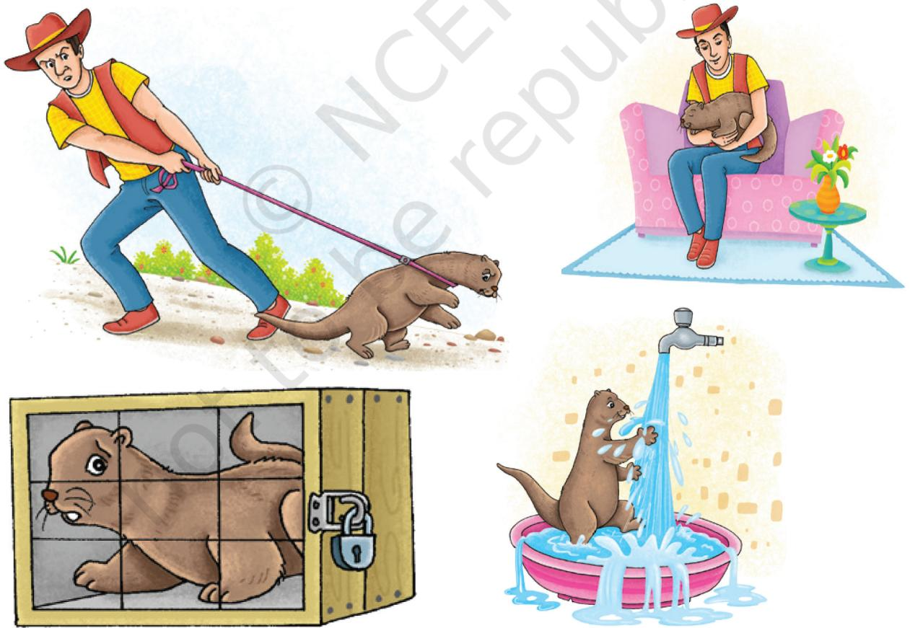
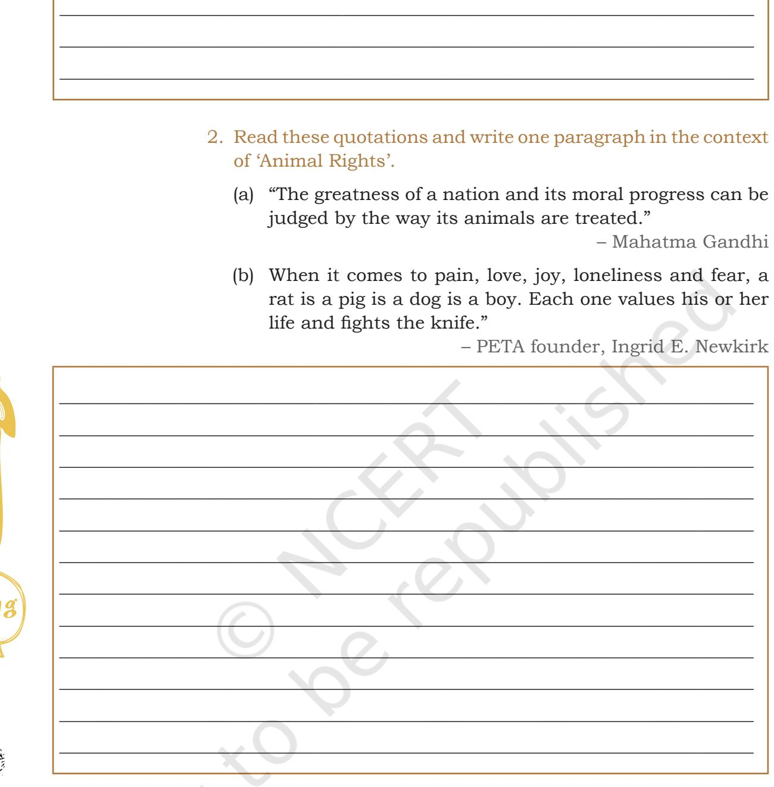

# 6 **Mijbil the Otter**

;

## **Let's Begin**

Unit

?

- 1. You have read the chapter 'Mijbil the Otter'. Discuss with your partner the commitment the author had towards Mijbil, what arrangements he made for his pet. What good care did he take like getting fish, taking it for a walk or exercise, providing things, and space to play etc. Make a list and then share with other friends in the class.

- 2. Find out which illustrations will go with your list.

Unit-6.indd 73 20-02-2023 09:39:50

- 3. Mijbil is an active animal who shows many emotions. Refer to the chapter and complete the following Table.

| What Mijbil Does | How Mijbil feels |
| --- | --- |
| 1. Plunges, rolls in water | 1. Goes wild with joy. |
| 2. | 2. |
| 3. | 3. |
| 4. | 4. |
| 5. | 5. |
| 6. | 6. |

arboreal inculcate Look Up and Understand

omnivorous rehabilitates

nocturnal

## **Reading Comprehension**

### **Text I**

The following is a story of a baby Civet cat that fell from a tree and was raised by humans. It is a true story from Assam written by Rommel Shunmugam who is a conservation photographer. Through his photo stories, he seeks to inculcate in children a love for nature and wildlife.

Civet cats are found in most parts of India. They are also called toddy cats. They live on palm trees and love to drink the sweet sap, which is collected by toddy tappers to make wine! Dharini and his family rescues and rehabilitates wild animals. These are mostly babies or animals that cannot look after themselves.

Unit-6.indd 74 20-02-2023 09:39:51

Reprint 2024-25

74 Words and Expressions 2 – Class X

#### **Baby Bhakat**

Hi! My name is Bhakat. I am a baby Civet cat. I am three month old. Shhh! I am taking a nap with my brothers. Yes, I live in a family of humans. They treat me like their own Baby!

My home is a little thatched hut by a river in a small village in Assam. The hut has an earthen floor and mud-splattered walls. Its doors are always open. I come and go as I please! Mama takes care of all three of us! Her name is Anjali. She cooks, cleans and plays with me. I secretly think she loves me the most. She lets me be real naughty!

Mama is about to make brunch! She is making *roti* and vegetables. I don't like vegetables, but I like fruits. I love meat. I am omnivorous. Mama always feeds me before anyone else! I love things dipped in milk. They are yummy!

The man of the house is Dharini. If not for him, I would not be alive today! My civet mother built a nest for me in a very tall coconut tree. One night I slipped and fell to the ground! When villagers found me they took me to Dharini. Dharini loves

animals. I began to live in his home. I was very small. I could not walk. I ate and slept a lot!

Do you know why my eyes are so large? That's because I am a nocturnal animal. I sleep in the day and am active in the night. My large eyes help me see better in the dark! I also have a very long tail! It helps me balance on tree-tops and branches. I mostly live on trees, though I do come down to the ground. Animals like me are called arboreal!

Inside Dharini's house, I always snooze in the rafters. I like being high up; it reminds me of trees! One day I woke up to find a strange sight, Dharini's house was filling with water! In the night, the river behind the house started overflowing its banks! Inside everything was helter-skelter. Things were piled on top of one another! The monsoon had arrived!

Dharini and Anjali carried us babies outside the house! There was water everywhere and it was very muddy! But the sun was out and it was not raining! I stayed high on the fence and made sure even my long tail did not get wet! Dharini went to pick snails. Sentences

Unit-6.indd 75 20-02-2023 09:39:52

Snails had climbed branches and walls to escape drowning in the flood! Every gardener knows that snails eat plants. By eating snails, I ensure that they do not overrun your garden. I maintain the balance of life in nature!

When it floods, you find fish everywhere! Dharini cast his net in the garden and began catching fishes. They are kept in a pan of water to keep them alive and fresh to eat!

Montu, my brother, tried to be naughty! He caught me and threatened to dip me in water! He got a scolding from Dharini. I hate to be in water! Back inside the house, it is time for me to play with Mama! I shall rest awhile and then be up again at night. Mama always leaves a midnight snack by the lantern!

*Rommel Shunmugam*

| Q.1. | Now read the following questions and tick the right answer. Dharini— |
| --- | --- |
|  | (a) is the land owner (b) loves animals |
|  | (c) is a gardener (d) is father of Bhakat |
| Q.2. | Civet cats are also called___________________. |
|  | (a) Baby cats (b) Night cats |
|  | (c) Toddy cats (d) Snail cats |
| Q.3. | Baby Bhakat loves to eat ___________________. |
|  | (a) roti (b) vegetables |
|  | (c) fruits (d) meat |
| Q.4. | Baby Bhakat hates to___________________. |
|  | (a) eat snails (b) be in water |
|  | (c) play with Mama (d) sleep in the rafter |
| Q.5. | The home for the Bhakat is_________________________. |
|  | (a) a garden near a river |
|  | (b) the roof of the little hut |
|  | (c) a little hut by a river |
|  | (d) the nest in a coconut tree |
| Q.6. | Tick the statement which is not true. |
|  | (a) Dharani and Anjali treat Bhakat as their own baby. |
|  | (b) They keep the door closed to keep Bhakat safe. |
|  | (c) Anjali plays with Bhakat and lets it be naughty. |
|  | (d) Anjali feeds Bhakat before anyone else. |

76 Words and Expressions 2 – Class X

Unit-6.indd 76 20-02-2023 09:39:52

## **Text II**

#### **Read the passage given below and answer the questions that follow.**

It's not easy having Elephants in your backyard.

Around the world, as communities expand, and natural wild places are reduced, people and wildlife are increasingly coming into conflict over living space and food.

It might be baboons in Namibia attacking young goats or elephants in Nepal eating crops or European bears and wolves killing livestock. The problem is universal, affects rich and poor, and is bad news for all concerned.

The impacts are often huge. People lose their crops and livestock (and therefore a source of income and food security), property, and sometimes their lives—even a severe injury caused by wildlife can result in a loss of livelihood. The animals, some of which are already threatened or even endangered, are sometimes killed in retaliation or to prevent future conflicts.

Human-wildlife conflict is happening more and more, affecting a lot of different species. The effects of climate change will probably make the problem worse.

Look Up and Understand Sentences

coexistence conflict endangered livestock retaliation

Unit-6.indd 77 20-02-2023 09:39:53

#### **How we are tackling human-wildlife conflict**

The solutions are often specific to the wildlife or area concerned, and are often creative and simple—for instance planting a barrier of crops that repel the animals (elephants and some other wildlife don't like chilli, for example).

An important aspect of the work is that it benefits both the animals and local people and actively involves the communities concerned (in the case of chilli, it can be sold to increase income). It's about finding solutions that lead to mutually beneficial coexistence.

The work has also often led to people being more enthusiastic and supportive of conservation, and has demonstrated that people can live alongside wildlife while developing sustainable livelihoods.

> (Source: https://www.wwf.org.uk/what-we-do/area-of-work/ preventing-human-wildlife-conflict)

_____________________________________________________

_____________________________________________________

_____________________________________________________

_____________________________________________________

_____________________________________________________

_____________________________________________________

_____________________________________________________

_____________________________________________________

_____________________________________________________

_____________________________________________________

- **Q.1. What happens when communities expand?**
- **Q.2. What is the meaning of "impact" in the passage? How it is affecting people and their life?**
- **Q.3. What will make the human-wildlife conflict more intense?**
- **Q.4. The passage talks about one solution to tackle human-wildlife conflict. What is it?**

78 Words and Expressions 2 – Class X

Unit-6.indd 78 20-02-2023 09:39:53

## **Q.5. These types of creative and simple solutions lead to—**

 **(Tick the statement(s) which is/are not true.)**

_____________________________________________________

_____________________________________________________

- (a) active community involvement.
- (b) generate income naturally.
- (c) mutually beneficial coexistence.
- (d) people live with wildlife happily.
- (e) be more enthusiastic and supportive of conservation
- (f) developing sustainable livelihood.

#### **Text II**

**Read the passage given below and answer the questions that follow.**

#### **Animal rights**

People who support animal rights recognise that all animals have an inherent worth, a value completely separate from their usefulness to humans. Every being with a will to live has the right to live free from exploitation and suffering.

All animals have the ability to suffer in the same way and to the same degree that humans do. They feel pain, pleasure, fear, frustration, loneliness, and familial love. Whenever we consider doing something that would interfere with their needs, we are morally obligated to take them into account.

People often ask if animal rights mean that animals should have the right to vote or drive a car. Of course, that would be silly because those aren't rights that would benefit animals. But animals have the right not to suffer at the hands of humans and to live their lives free from suffering and exploitation because they have an interest in doing so. That is the difference between equal consideration and equal treatment.

Almost everyone cares about animals in some context, whether it's a beloved family companion, an irresistibly cute kitten or a majestic wild animal seen in a documentary. After all, we each have some built-in capacity for empathy and compassion, as can consideration exploitation familial Understand

Look Up and

inherent

Sentences

Unit-6.indd 79 20-02-2023 09:39:53

#### Look Up and Understand

arbitrary compassion documentary empathy

be seen from the lengths that children often go to in order to help animals.

Logically and morally, there is no reason to differentiate in the way we treat the animals we share our homes with and those who are farmed for food. They are all individuals, with the same capacity to feel pain and fear. Animal rights help us to look past the arbitrary distinctions between different species, to rediscover our innate compassion, and to respect all animals equally.

Anyone who cares about animals can start putting these principles into practice every single day with the food they eat, the clothes they wear, and the products they buy. These choices are a form of non-violent protest that makes a real difference both by reducing the profits of corporations that harm or kill animals and by creating a growing market for cruelty-free food, fashion, services, and entertainment.

(Source: https://www.peta.org.uk/action)

- **Q.1. What do the people who support animal rights recognise?**
_____________________________________________________

_____________________________________________________

_____________________________________________________

_____________________________________________________

_____________________________________________________

_____________________________________________________

_____________________________________________________

_____________________________________________________

_____________________________________________________

_____________________________________________________

- **Q.2. As human beings, what are our moral obligations towards animals?**
- **Q.3. What is the right of animals as mentioned in paragraph three?**
- **Q.4. Why should we rediscover our empathy, compassion, and respect for animals?**

80 Words and Expressions 2 – Class X

Unit-6.indd 80 20-02-2023 09:39:53

- **Q.5. Anyone who cares about animals can start putting "these principles" into practice. What are "these principles"?**
_____________________________________________________

_____________________________________________________

_____________________________________________________

_____________________________________________________

_____________________________________________________

#### **Idiom**

Cat got your tongue—asked to a person who is at a loss of words.

Sentences

- 1. The following words are from the text you have read. The synonyms for each word are given. Find the odd one out.
	- (a) serious, grave, ridiculous, stern, solemn
	- (b) suitable, unfitting, appropriate, right, proper
	- (c) hostile, unfriendly, averse, agreeable, unreceptive
	- (d) peaceful, harmonious, quiet, serene, violent
	- (e) appalling, atrocious, wonderful, awful, dreadful
- 2. Look at the two sentences given below. These are from the text. Look at the words in italics. These are used as verbs. They can be used as nouns as well.
	- (a) By then it had *crossed* my mind…
	- (b) Camusfearna, *ringed* by water…

The noun forms of these two verbs are 'cross' and 'ring'.

- (a) I've put a *cross* on the map to show where the river Mahanadi is.
- (b) She put the *ring* back in the jewellery box.

A list of words is given below. Make sentences using these words as verb and noun.

______________________________________________________

- (c) Book
Unit 6 – Mijbil the Otter 81

Unit-6.indd 81 20-02-2023 09:39:53

|  | ______________________________________________________ |
| --- | --- |
|  | ______________________________________________________ |
| (d) | Mail |
|  | ______________________________________________________ |
|  | ______________________________________________________ |
|  | ______________________________________________________ |
|  | ______________________________________________________ |
| (e) | Cable |
|  | ______________________________________________________ |
|  | ______________________________________________________ |
|  | ______________________________________________________ |
|  | ______________________________________________________ |
| (f) | Sack |
|  | ______________________________________________________ |
|  | ______________________________________________________ |
|  | ______________________________________________________ |
|  | ______________________________________________________ |
| (g) | End |
|  | ______________________________________________________ |
|  | ______________________________________________________ |
|  | ______________________________________________________ |
|  | ______________________________________________________ |
| (h) | Head |
|  | ______________________________________________________ |
|  | ______________________________________________________ |
|  | ______________________________________________________ |
|  | ______________________________________________________ |
| (i) | Colour |
|  | ______________________________________________________ |
|  | ______________________________________________________ |
|  | ______________________________________________________ |
|  | ______________________________________________________ |

|
|  |

| ______________________________________________________ |
| --- |
| ______________________________________________________ |
| ______________________________________________________ |
| Grammar |
| 1. You have read about "noun modifiers" in the chapter 'Mijbil |
| the Otter', page 112. These give more information about a |
| noun, hence are called noun modifiers. These are adjectives |
| or adjective phrases. Let us look at more of the adjective |
| phrases and their usage. |
| Example: I went to a party. It was a Christmas party. The |
| party was lovely. |
| I went to a lovely Christmas party. |
| Now, join the sentences given below and make a simple |
| sentence with an adjective phrase. |
| s e |
| (a) I bought a Maruti car. The colour is blue. It is sporty. |
| c I bought_______________________________________car. |
| n (b) |
| He made a speech. The speech was short. The speech e |
| was interesting. t |
| n He made_______________________________speech. |
| e (c) Suresh went to a house. It was decorated beautifully. S |
| Suresh went_________________________________house. |
| (d) She bought a dress. It is a designer one but frightfully |
| expensive. |
| She bought _____________________________________dress. |
| (e) The food was tasty. It was prepared quickly. |
| ____________________________________food was tasty. |

______________________________________________________

Unit-6.indd 83 20-02-2023 09:39:54

- 2. Use the correct form of the word given in the bracket and fill in the blanks. One has been done for you.
His behaviour was disappointing. I expected him to be more polite. People present there were disappointed. (disappoint)

- (a) The death of 40 *jawans* was_______________. We were _______________when we heard the news. (shock)
- (b) I met an____________________person in the party. He was _________________in tasting each and every dish kept in the food counter. (interest)
- (c) Ravi is not very_________________to visit new places. He tells his friends no place is_________________compared to his village in Ranikhet. (excite)
- (d) She got a new guest in her house. She was_______________ by his handling the pups. His voice was more ________________when he was calling these pups near him. (amuse)
- (e) It is very humid in the Summers. I don't like this weather. This weather is________________. I am________________as I sweat a lot. Children are________________as they can't play outside. (disgust)
- 3. You have read about how to describe a repeated action in the past by using 'would' or *'*used to'*.* Go through the rules again and fill in the blanks with *'*would' or *'*used to' as appropriate.
	- (a) Every day she________________come home from work with a rose to give to her mother.
	- (b) I _______________ lend him my books when he was preparing for his examination.
	- (c) He_______________visit his friend in the hospital every evening.
	- (d) Each time I called him he______________________come immediately.
	- (e) During his hostel life, he_______________eat all kinds of food without grumbling.
	- (f) When I was a child, I_______________believe that fire flies were small fire balls.

Unit-6.indd 84 20-02-2023 09:39:54

## Editing

- 1. Use capital letters, full-stops, commas, and inverted commas wherever necessary in the following paragraph.
the land of the Bisnois in rajasthan is known for conservation of wildlife. it is a living religion to the Bishnois. It is said This is probably only one religion in the world that is founded on the principles of conserving nature. It has followers over ten lakhs. For these many people protection of living beings is a way of life for the ishnois tree is sacred and their empathy and love extend to all living beings on earth. They protect the ecosystem that surrounds the village which is a safe haven for blackbucks chinkaras vultures great Indian bustards peacocks etc they protect them from poachers and provide them plenty vegetation they keep water in the stone vessels for the animals to drink from, and hang water filled pots from the branches for the birds.

- 2. Parts of sentences are given below. Rearrange the parts and write meaningful sentences in the space provided. Use appropriate punctuation marks.
	- (a) a town in iraq/ in large numbers/ otters are found/ in the marshes near Basra.
	- (b) to the market/ we were fatigued/ having walked so far/ on account of
	- (c) 40 paramilitary personnel/ the suicide car/ pulwana district killed/ bombing in
	- (d) india's first semi-high speed train,/ was flagged off with excitement/ the inaugural trip of/ Vande Bharat Express,

Fun Facts Affluence —

having a great deal of money Effluence- a substance that flows out of something.

> Sentences

Unit-6.indd 85 20-02-2023 09:39:54

- (e) the eastern hemisphere/ the longer than all/ the nile is said to be/ other rivers in

| ___________________________________________________________________ |
| --- |
| ___________________________________________________________________ |
| ___________________________________________________________________ |
| ___________________________________________________________________ |
| ___________________________________________________________________ |
| ___________________________________________________________________ |
| ___________________________________________________________________ |
| ___________________________________________________________________ |
| ___________________________________________________________________ |
| ___________________________________________________________________ |
| ___________________________________________________________________ |
| ___________________________________________________________________ |

## Listening

- 1 . Following is a story of Gangaram, a 130 years old crocodile, who died in a Chhattisgarh village. Listen to the story carefully and answer the questions that follow. You can listen to the recorded story or ask your teacher, sibling or friend to read the story aloud.
The incident took place in Bawamohatra, a village in Bemetra district of Chhattisgarh. The residents of Bawamohatra gathered near the community pond and started weeping after they saw that the crocodile had died. The villagers were emotionally attached to the reptile and were heartbroken after his death. About 500 people of the small village attended the last rites of their beloved crocodile, Gangaram. The over three-metre long crocodile was buried in Chhattisgarh's Bawamohatra village after his last rites were performed by the villagers. A forest department official estimated that the crocodile was 130 years old. The crocodile was carried to its funeral on a tractor decorated with flowers and garlands. The villagers say Gangaram was friendly. Even the kids of

**Tongue twister** Nine nice night nurses nursing nicely

Unit-6.indd 86 20-02-2023 09:39:54

the village could swim around him. He had never harmed or attacked anyone. He was not a crocodile but a friend and a divine creature for them, who was worshipped in this village. Some say that he would even eat rice and dal which was served by the villagers and kids. He was very understanding and if he saw anyone swimming near him, he used to go to the other side of the pond. Villagers used to identify themselves with the crocodile as people used to call this village—*Magarmachha vala gaaon*, the Crocodile's village. In fact, the villagers now wish to build a statue of Gangaram near the pond to remember their friend, who got the village a new name. It may be weird, but it could be an example of how humans and animals can coexist without harming each other.

- 1. Why did the residents gather near the village pond?

|  | ______________________________________________________ |  |
| --- | --- | --- |
|  | ______________________________________________________ |  |
|  | ______________________________________________________ |  |
| 2. | Why were the villagers crying? |  |
|  | ______________________________________________________ | s |
|  | ______________________________________________________ | e |
|  | ______________________________________________________ | c |
| 3. | Who was Gangaram? | n |
|  | ______________________________________________________ | e |
|  |  | t |
|  | ______________________________________________________ | n |
|  | ______________________________________________________ | e |
| 4. | How big was he? | S |
|  | ______________________________________________________ |  |
| 5. | How old was he? |  |
|  | ______________________________________________________ |  |
| 6. | Give three reasons to justify Gangaram was friendly: |  |
|  | (a) Children could ______________________________. |  |
|  | (b) Gangaram never ______________________________. |  |
|  | (c) Gangaram was very ______________________________. |  |
| 7. | What was the new name given to the village and why? |  |
|  | ______________________________________________________ |  |
|  | ______________________________________________________ |  |

Unit-6.indd 87 20-02-2023 09:39:54

- 8. What will the villagers do to remember their friend?
______________________________________________________ ______________________________________________________ ______________________________________________________

- 1. We all have seen hand puppets on YouTube or during story telling sessions. Try to make one hand puppet of an Otter. The situation is: Mijbil playing with water and spilling water every where. Write a few dialogues between Mijbil and Maxwell. Be the characters and exchange dialogues.

| Maxwell | : | Oh! Mijbil, what have you done? |
| --- | --- | --- |
| Mijbil | : | He, he_____________________________________ |
|  |  | _________________________________________ |
| Maxwell | : | ___________________________________________ |
|  |  | _________________________________________ |
| Mijbil | : | ___________________________________________ |
|  |  | _________________________________________ |
| Maxwel | : | ___________________________________________ |
|  |  | _________________________________________ |
| Mijbil | : | ___________________________________________ |
|  |  | _________________________________________ |

- 2. You have read a story 'The Bond of Love' in the class IX textbook, *Beehive.* In this story, the author talks about a sloth bear that his wife kept as a pet. The sloth bear was sent to the Zoo when it became too big to be kept at home. Now, discuss in a group of four, the following points, list views, and then share in the class.
	- (a) Keeping any big wild animal, like the sloth bears, at home.
	- (b) Keeping unusual pets for pleasure
	- (c) Using tigers, lions, dancing bears in circus
	- (d) Making the monkeys dance, cock fighting, bull fighting for amusement

Unit-6.indd 88 20-02-2023 09:39:54

| Your views |
| --- |
| ___________________________________________________________________________ |
| ___________________________________________________________________________ |
| ___________________________________________________________________________ |
| ___________________________________________________________________________ |
| ___________________________________________________________________________ |
| ___________________________________________________________________________ |
| ___________________________________________________________________________ |
| ___________________________________________________________________________ |
| ___________________________________________________________________________ |
| ___________________________________________________________________________ |
| ___________________________________________________________________________ |
| ___________________________________________________________________________ |
| ___________________________________________________________________________ |
| ___________________________________________________________________________ |
| ___________________________________________________________________________ |

- 

| ___________________________________________________________________________ |
| --- |
| ___________________________________________________________________________ |
| ___________________________________________________________________________ |
| ___________________________________________________________________________ |
| ___________________________________________________________________________ |
| ___________________________________________________________________________ |
| ___________________________________________________________________________ |
| ___________________________________________________________________________ |
| ___________________________________________________________________________ |

Project

1. In a group of four, conduct research on the following question and write a report on the findings.

> What animals can be exported or imported under law? (Customs seizures show a variety of animals from reptiles, lizards, leopards to pythons, venomous reptile. These are carried in tiny suitcases and smuggled.)

Unit-6.indd 90 20-02-2023 09:39:55

- 2. Make a team of four students. Imagine a unique animal or bird as a pet. Draw the animal and write the following information about it.
	- (a) Name of the pet and draw the animal on a chart paper.
	- (b) My pet: (Make a table like the following and write its specifications)

| has | can | is |
| --- | --- | --- |
| For example: | Swim, fly, run, | Warm-blooded, |
| webbed feet, | grow tall, small | mammal, good |
| long legs. fat | size, | swimmer, |
| legs, etc. | hunt, carry | largest animal, |
| heavy body, | weight, guard the | smallest |
| very light | house, etc. | animal, good |
| weight, soft | communicate, | hunter, etc. |
| fur, feather, | sing, speak, make | sensitive, |
| sense of | variety of sounds | ferocious, short |
| smell, etc. | to communicate, | tempered, |
|  | show affection, | docile, smart, |
|  | emotion, etc. | etc. |

Sentences

Unit-6.indd 91 20-02-2023 09:39:55

| (c) | What all do you have to do to keep the animal with you | at home? (You can refer to the dos and don'ts given on |
| --- | --- | --- |
| page no. 102 of the textbook First Flight.) |  |  |
| (d) | Prepare a write up, share it in the class, and put it on the | wall for the class to read. |
| Notes | ___________________________________________________________________________ |  |
| ___________________________________________________________________________ |  |  |
| ___________________________________________________________________________ |  |  |
| ___________________________________________________________________________ |  |  |
| ___________________________________________________________________________ |  |  |
| ___________________________________________________________________________ |  |  |
| ___________________________________________________________________________ |  |  |
| ___________________________________________________________________________ |  |  |
| ___________________________________________________________________________ |  |  |
| ___________________________________________________________________________ |  |  |
| ___________________________________________________________________________ |  |  |
| ___________________________________________________________________________ |  |  |
| ___________________________________________________________________________ |  |  |
| ___________________________________________________________________________ |  |  |
| ___________________________________________________________________________ |  |  |
| ___________________________________________________________________________ |  |  |
| ___________________________________________________________________________ |  |  |
| ___________________________________________________________________________ |  |  |
| ___________________________________________________________________________ |  |  |
| ___________________________________________________________________________ |  |  |
| ___________________________________________________________________________ |  |  |
| ___________________________________________________________________________ |  |  |
| ___________________________________________________________________________ |  |  |
| ___________________________________________________________________________ |  |  |

