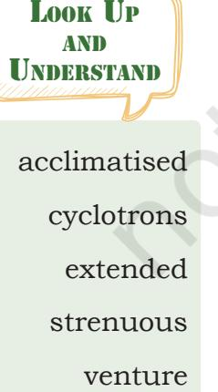
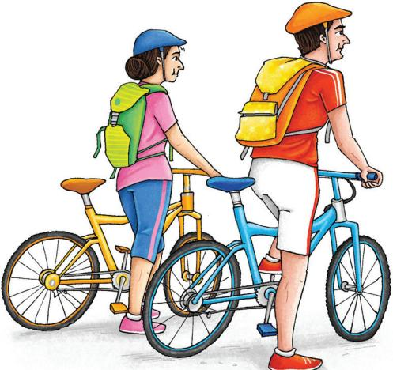
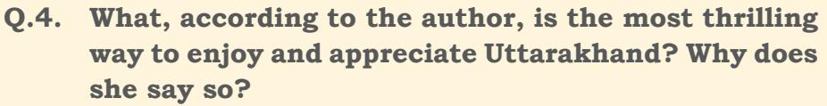
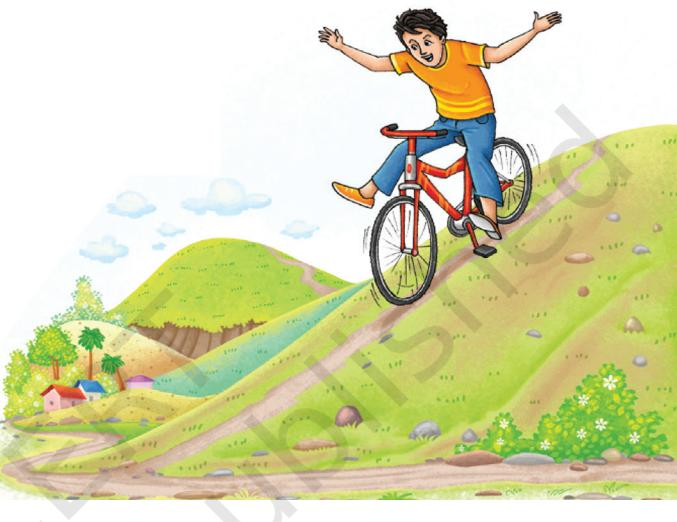
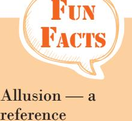
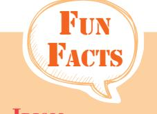
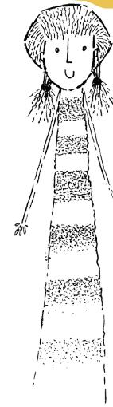
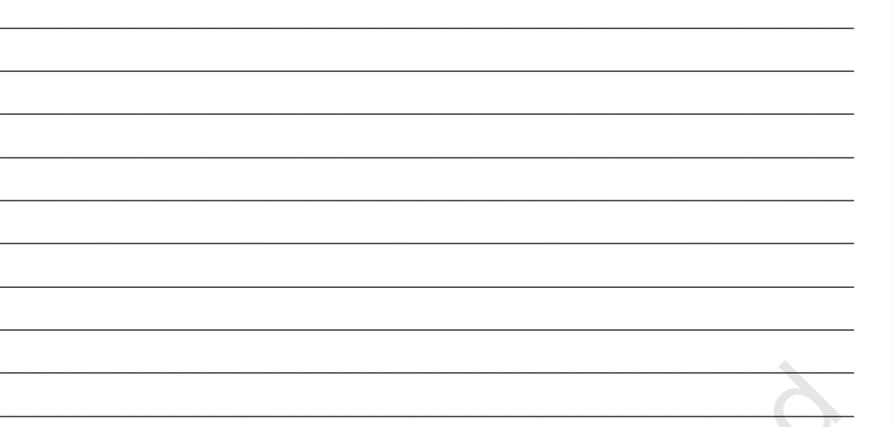
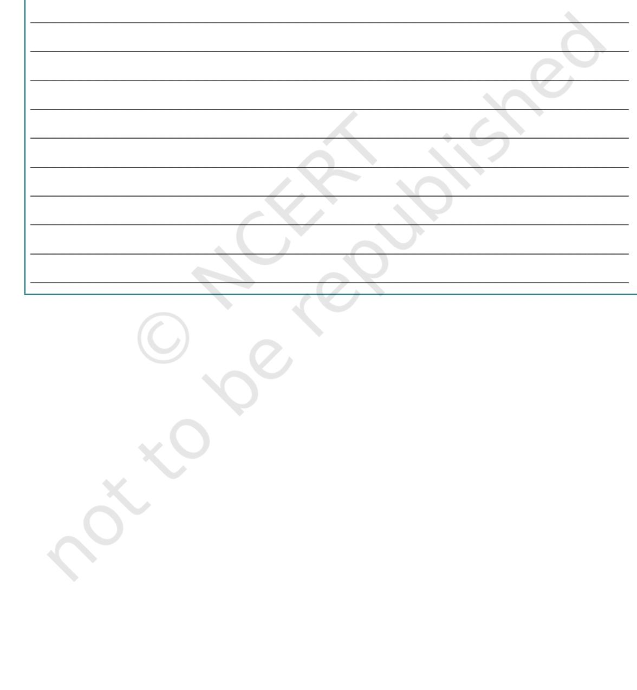

# 7 **Madam rides the Bus**

;

## **Let's Begin**

Unit

?

- 1. In the story 'Madam Rides the Bus', Valli took a bus ride on the bus that she wanted to for last several months. She knew that she had to buy tickets for this. So she saved money suppressing all temptation to buy things like peppermints, toys, balloons, etc., and paid for the ticket.

- • What all exciting things did she see from the bus?
- • Was the excitement the same on her return journey?

Discuss with your classmate and write a paragraph based on your discussion on the above mentioned questions.

| ___________________________________________________________________________ |
| --- |
| ___________________________________________________________________________ |
| ___________________________________________________________________________ |
| ___________________________________________________________________________ |
| ___________________________________________________________________________ |
| ___________________________________________________________________________ |
| ___________________________________________________________________________ |
| ___________________________________________________________________________ |
| ___________________________________________________________________________ |
| ___________________________________________________________________________ |

- 2. Have you undertaken any journey by bicycle, boat, bus, train, or on an elephant back? Share your experience with your friends in the class.
Unit-7.indd 93 20-02-2023 09:42:36

### **Reading Comprehension**

## **Text I**

Read the passage given below and answer the questions that follow.

Vishav Driman (65 year old) and her husband Kamal Jeet (69 year old) set out to discover the hidden treasure of Uttarakhand by bicycle. Vishav shares their post-retirement adventure.

#### **Pedalling through the Golden Years**

At a time when our peers were slowing down, relaxing and watching sunsets from their front porch, we found a new passion—cycling. We started out with short daily rides, but found ourselves looking forward to them more and more, so much that we decided to venture further and cover more ground. There were obvious health concerns—the risk of performing a physically strenuous activity at a high altitude, the most obvious of them. But it helped that we had lived in Uttarakhand's capital, Dehradun, our entire lives, and were therefore acclimatised to the cold winds and narrow winding roads that characterise this

beautiful state. We were also familiar with almost all the scenic mountain trails it had to offer.

Short rides extended to longer ones as we started falling deeper in love with not just the sport, but the very idea of discovering a world we had always been a part of, but never had the time to explore. Soon, a simple hobby turned into a project of sorts, and we started participating in cyclotrons and other cycling events being held in the city. Admiration and encouragement poured in from family members, friends and neighbours along the way, sparking a new thought—was it possible to travel across the state on our bicycles? It seemed daunting at first, but we knew we had to try. Our gear in place, our bikes serviced, and our minds set, we set off on an adventure we would remember for the rest of our lives.

Unit-7.indd 94 20-02-2023 09:42:37

In my opinion, there are very few ways to enjoy and appreciate the beauty of Uttarakhand and cycling is the most thrilling of them all. Sunlight filtering through the trees and a cool breeze gently caressing your faces as you ride, coupled with breathtaking views of sal forests spread like a green cover on the mountains and surrounding valleys, the experience of pedalling across the state is truly inexplicable. Of the many trails we navigated, there is one that occupies a special place in our hearts. It began from *Ghanta Ghar*, a popular tourist attraction in Dehradun, it took us through

some of the most picturesque locations of the state such as Kimadi, Hathi Paon, Mussoorie and Chaar Dukaan, right up to George Everest point. This 100km ride (approximately) is also one of the few routes in Uttarakhand that encapsulates all the element that one expects while cycling here—steep slopes, sharp curves, endless hills, lush forests, and off-road experiences.

(Source: by Vishav Driman, *India Travel360*)

- **Q.1. What is the meaning of the expression "when our peers were slowing down, relaxing and watching sunsets from their front porch" and in what context has the author used this?**
 **_____________________________________________________ _____________________________________________________ _____________________________________________________**

- **Q.2. What made Vishav and her husband confident to venture into Uttarakhand on their bicycles?**
 **_____________________________________________________ _____________________________________________________ _____________________________________________________**

- **Q.3. What was the strong passion that prompted the retired couple to take up this adventurous journey?**
Look Up and Understand Sentences

caressing daunting

encapsulates inexplicable

picturesque

Unit-7.indd 95 20-02-2023 09:42:39

 **_____________________________________________________ _____________________________________________________ _____________________________________________________**

 **_____________________________________________________ _____________________________________________________ _____________________________________________________**

- **Q.5. Which trail occupies a special place in the couple's heart?**
 **_____________________________________________________ _____________________________________________________ _____________________________________________________**

- **Q.6. What are the expectations of a cyclist from such an adventurous trip through the mountains? Did Vishav and Kamal Jeet get these experiences from the 100 km ride?**
 **_____________________________________________________ _____________________________________________________ _____________________________________________________**

## **Text II**

**Read the poem given below and answer the questions that follow.**

**Going Down Hill on a Bicycle**, **A Boy's Song**

With lifted feet, hands still, I am poised, and down the hill Dart, with heedful mind; The air goes by in a wind. Swifter and yet more swift, Till the heart with a mighty lift

heedful poised slackens and Understand

Look Up

treadles

vale

Unit-7.indd 96 20-02-2023 09:42:39

Makes the lungs laugh, the throat cry:— "O bird, see; see, bird, I fly.

"Is this, is this your joy? O bird, then I, though a boy, For a golden moment share Your feathery life in air!"

Say, heart, is there aught like this In a world that is full of bliss? 'Tis more than skating, bound Steel-shod to the level ground.

Speed slackens now, I float Awhile in my airy boat; Till, when the wheels scarce crawl, My feet to the treadles fall.

Alas, that the longest hill Must end in a vale; but still, Who climbs with toil, wheresoe'er, Shall find wings waiting there.

*Henry Charles Beeching*

| Q.1. | The poem describes the________________________of |
| --- | --- |
|  | going downhill on a bicycle. |
|  | (a) enjoyment |
|  | (b) happiness |
|  | (c) excitement |
|  | (d) satisfaction |
| Q.2. | Which line(s) depict the freedom like that of a bird |
|  | that the poet enjoys? |
|  | _____________________________________________________ |
|  | _____________________________________________________ |
|  | _____________________________________________________ |

Sentences

Unit-7.indd 97 20-02-2023 09:42:40

- **Q.3. Which is the experience the boy is sharing with the bird? What is the golden moment he is referring to?**
 **_____________________________________________________ _____________________________________________________ _____________________________________________________**

- **Q.4. What is the meaning of 'full of bliss' here? Can the boy find this kind of bliss in the world where he lives?**
 **_____________________________________________________ _____________________________________________________ _____________________________________________________**

- **Q.5. There is a comparison in the third stanza. What is it?**
 **_____________________________________________________ _____________________________________________________**

- **Q.6. What is the meaning of the last two lines of the poem? Does "toil" mean dedication, determination, and will power to climb the hill? What is the reward here?**
 **_____________________________________________________ _____________________________________________________**

- 1. Find out the words from the text 'Madam rides the Bus' that match with the given meanings.
	- (a) inquisitive __________________________________
	- (b) intricate __________________________________
	- (c) mesmerizing __________________________________
	- (d) immense __________________________________
	- (e) hardly __________________________________

Unit-7.indd 98 20-02-2023 09:42:40

- 1. Read the two sentences given below. The groups of words in italics are phrasal verbs.
This way she *picked up* various small details.

Valli said, "I am the one to *get on*."

The verbs *picked* and *get* are combined with *up* and *on*  respectively. Together they make phrasal verbs.

Now, complete each sentence using a verb from box A and a word from box B (by making a phrasal verb). Use the correct form of the verb wherever necessary.

|
|  |

- (a) It was evening. She__________________________the light.
- (b) Do not ______________________Ramesh. He was studying late at night yesterday.
- (c) The school bus______________________and had to be towed to the garage for repair.
- (d) They got in the car and_________________________.
- (e) She hurt herself as she was________________________of the car.
- (f) You have to__________________________the form yourself.

# Editing

- 1. Use capital letters and full stops wherever necessary and correct the spelling errors as well, in the following paragraph.
An exciting boat journey gliding crosswise the river from Godkhali jetty will take to a place of incredible mystic beauty of Nature.

The sundarbans a unesco World Heritage Site is located at the

South eastern tip of the 24 Paraganas district about 110 km

reference Illusion a mirage, hallucination, or magic trick

Sentences

Unit-7.indd 99 20-02-2023 09:42:40

from Kolkata it got its name from one of the mangrov plants known as Sundari (Heritiera Minor) Sundrbans are a part of the world's largest delta, formed by the mighty rivers ganga, brahmaputra and meghna it is one of the most attractive and alluring places remaining on earth, a truly undiscovered paradise the Sundarbans is the largest singl block of tidal, halophytic mangrove forests in the world. It is the largest tiger reserv and National Park

apart from being a unique largest mangrove eco-system of the world, the sundarbns has the world's largest deltaic mangroove forests and is also home to one of India's most iconic wildlife species - the royal bengal Ttger. The Sundarbans also serves as a crusial protective barrier for the inhabitents in and around Kolkata against the floods that result from the cyclones which are a regular occurrence. The Sundarbans have also been enlisted amongst the finalists in the New 7 Wonders of Nature.

# Listening

 1. Following is a passage on Mizoram and its people. When one visits this place, one is enchanted by its natural beauty and the vibrant culture of the state. Listen to the passage carefully and answer the questions that follow. You can listen to the recorded story or ask your teacher, sibling or friend to read the story aloud.

#### **Mizoram**

Once a tourist remarked, "I visited the Eastern States this time—where the people talk in songs and they always dance."

Unit-7.indd 100 20-02-2023 09:42:40

The eastern region of India is no doubt charmingly novel in many of its features. Mizoram, literally the land of Mizos is an expanse of blue-green hills. Mizoram is broken up lenghwise into five major mountain ranges gradually descending from the south to the north. The hills are rugged and their heights uneven. The name of the state Mizoram is made of two words. 'Mi' means human beings, 'Zo' means a hill. So, a 'Mizo' is a human dweller of a hill; Mizoram means the land of the hilldwellers. Aizawl is the capital town of the State built in tiers along the hill.

The Mizos have three main festivals—Mim Kut, Chapchar Kut and Pawl Kut. These festivals are associated with their agricultural activities during which they enjoy life by singing and dancing. The Mizos, blessed as they are with a beautiful environment and rich culture, are a vibrant and social people. They love to dance as much as they love to sing. They boast a number of folk and community dances handed down from one generation to the other through the ages. The dances are expressions of the gay, carefree spirit of the Mizos. It should be noted here that these dances are not intended for stage performance, rather they have been evolved for community involvement and participation.

> *English with a Purpose* A Textbook for Class XII (Core Course) NCERT, 2003

- 1. The land of Mizo is a large open area of_________________. The hills are________________and________________.
- 2. The state referred here is made of two names—
	- (a) 'Mi' means _____________________________.
	- (b) 'Zo' means _____________________________.
	- (c) and Mizoram means _____________________________.
- 3. Which activities are associated with Mizo festivals? How do Mizos enjoy these festivals?

____________________________________________________ ____________________________________________________

____________________________________________________

Unit-7.indd 101 20-02-2023 09:42:40

- 4. What are the special features of a Mizo dance?
- 5. The following statements characterise Mizo people. Tick the one which is not true.

____________________________________________________

____________________________________________________ ____________________________________________________

- (a) Mizos have a beautiful culture. ( )
- (b) They live in a beautiful natural environment. ( )
- (c) They are a protective people. ( )
- (d) They are a vibrant people. ( )
- (e) They love to dance and not so much to sing. ( )
- (f) They have a number of community and folk dances. ( )
- (g) The community involvement and participation is always there. ( )

## Speaking

- 1. Read Part II of the story 'Madam Rides the Bus'. There are many conversations between Valli, the conductor, and some elderly people in the bus. Convert the conversations into dialogues between the characters. Many words like commandingly, haughtily, loudly (shouted), smilingly, irritably, curtly etc. have been used in this part. These are the different ways in which the characters have spoken. These show the mood, emotion, and intention of the characters.
 Now, write the dialogues and then in groups of three, enact it as a skit in the class.

> It was a fine spring afternoon. The bus was just on the verge of leaving the village. Valli, a small eight year old girl, wanted to go on a bus ride.

Valli (loudly): Stop the bus! Stop the bus!

Conductor (without looking up): Who is it? Hurry then!

Valli (loudly): It's me, I am the one who has to get on the bus.

Conductor (smilingly): Oh. really!_________________________

Fun Facts **Tongue twister**

We surely shall see the sun shine soon

Unit-7.indd 102 20-02-2023 09:42:41

Valli (commandingly): I have to_________________________ Here is________________________________________________. (Conductor stretched out his hand to help her up.) Valli (smartly): I can_____________________________________ Conductor (jokingly): Oh, please__________________________ (The bus started to move forward with a roar. Valli stood up on the seat to see the outside world clearly.) A voice (anxiously): Listen, child_________________________ Valli (haughtily): There is nobody________________________ Conductor (smilingly): Oh, sir____________________________ Valli (angrily): I am ______________________________________ Conductor (mimicking her):______________________________ Valli (steadfastly): Because I______________________________ A voice (with concern): If you_____________________________ Valli (irritably): I'm not___________________________________

- 2. Two communicative tasks are given below. Practice with your partner.
#### **Communicative Task I**

(Offering, accepting and refusing help)

#### **Role Play**

| Chaman | : | Hello Prem. You look tired. Is there anything I |
| --- | --- | --- |
|  |  | can do to help you? |
| Prem | : | Thank you very much. I think I can manage. I |
|  |  | am preparing a chart on Children's Rights. |
| Chaman | : | It's a lot of work. Let me help you. |
| Prem | : | Thank you. But I've already collected all the |
|  |  | necessary information. |
| Chaman | : | I can help you in illustrating some of the rights. |
| Prem | : | Oh, can you? That sounds wonderful. |
| Chaman | : | Could you tell me the themes to be illustrated? |
| Prem | : | Here you are. I'm really thankful to you. |
| Chaman | : | What about children's duties? |

Sentences

Unit-7.indd 103 20-02-2023 09:42:41

- Prem : Oh, yes. It's a good suggestion. I'll list their duties also.
Chaman : Thank you.

#### **Pair or Group Work**

Write conversations like the one above imagining you are in the classroom. Use the clues given below.

- • Excuse me...
- • Yes?
- • I wonder if you could lend me our dictionary. I'm doing my class work.
- • I'm sorry. I'm using it right now. May be later.
- • That's okay. Thanks anyway.

Write similar conversations imagining you are in the following situations: in the kitchen; at the railway station; asking somebody to open the door; in a hospital; in the playground.

#### **Communicative Task II**

(Asking for information, indirect questions and question tags)

#### **Role Play**

| Vineet | : | Could you get me some warm clothes from the |
| --- | --- | --- |
|  |  | cupboard, please? |
| Ashima | : | Are you feeling cold? |
| Vineet | : | It's cold today, isn't it? |
| Ashima | : | Yes, it is. I shall have to light the fire soon. |
| Vineet | : | Oh, you have coal-fires, do you? |
| Ashima | : | Yes. We don't have a room heater. You have room |
|  |  | heaters, don't you? |
| Veneet | : | Yes. We do. But coal-fires are nice. They are more |
|  |  | comforting than a radiator, aren't they? |
| Ashima | : | Yes, but there is a lot more work than just |
|  |  | switching on a heater. We keep talking about |
|  |  | getting room heaters. |
| Vineet | : | I suppose coal-fires aren't very convenient, are |
|  |  | they? |
| Ashima | : | They certainly aren't. |

104 Words and Expressions 2 – Class X

Unit-7.indd 104 20-02-2023 09:42:41

#### **Pair or Group work**

Using the above piece as a model, ask for information, make requests and give your opinion regarding—the floods in Chennai, 'Cyberabad' (Hyderabad), a celebration in your school, a landslide during the Amarnath yatra, etc.

- 1. In the text, seeing Valli travelling alone in the bus, some of the characters showed concerns.
An elderly woman asked, "Are you alone, dear?"

The Conductor questioned, "Won't your mother be looking for you?"

The old woman continued asking, "Is it proper for such a young person to travel alone? Do you exactly know where you're going in town? What's the street? What's the house number?"

Do you think that the concerns of the elderly lady and the conductor are apt and genuine? Will you say that it is applicable to young boys as well? Discuss in groups, make note and then arrange a debate competition. You can consider the following points for discussion or debate. Then write a paragraph considering these issues and give your opinion as well.

- • Girls and boys of Valli's age can travel alone in a bus or auto rickshaw, etc.
- • Freedom should be given to them to move around.
- • Safety of the young children is of utmost concern.
- • What type of education should be given to them?
- • This is a vulnerable age and children are innocent.

**Idiom** Turn a blind eye — to ignore situations, facts, reality

Sentences

Unit-7.indd 105 20-02-2023 09:42:41

___________________________________________________________________________ ___________________________________________________________________________ ___________________________________________________________________________ ___________________________________________________________________________ ___________________________________________________________________________

- 

| ________________________________________________________________________ |
| --- |
| ________________________________________________________________________ |
| ________________________________________________________________________ |
| ________________________________________________________________________ |
| ________________________________________________________________________ |
| ________________________________________________________________________ |
| ________________________________________________________________________ |
| ________________________________________________________________________ |
| ________________________________________________________________________ |
| ________________________________________________________________________ |
| ________________________________________________________________________ |
| ________________________________________________________________________ |
| ________________________________________________________________________ |
| ________________________________________________________________________ |
| ________________________________________________________________________ |

- 1. Read the quick tips for travelling by a bike given below.
When you travel by a bike, Vishav says that the frame and tyres of the bike should be according to the rider's height. One should carry a hand pump, extra tubes, and a puncture kit for emergency situations. Right accessories such as sweat-resistant gloves, helmets, knee and elbow pads, and a pair of shoes is of utmost importance. It is also necessary to carry essentials like dry food, water, and Oral Rehydration Salts (ORS). A first-aid kit with pain killers, muscle relaxing balms, and band-aids are also advisable.

Now, prepare a list of things that you would like to suggest to people who want to travel by:

- (a) a train
- (b) a bus
- (c) a boat
- (d) a motorbike
- (e) on foot (for example a trek)
- 2. A. Copies of some tickets are given here. Collect some more train tickets, bus tickets, flight tickets, platform tickets, entry tickets for the zoo, cinema hall, metro rail etc.

| UAGG&B27242 |  |  |  |  |  |  |  |
| --- | --- | --- | --- | --- | --- | --- | --- |
| યાત્રા | HAPPY JOURNEY |  |  |  |  |  |  |
| 1 1 - |  |  |  |  |  |  |  |
| afferent |  |  |  |  |  |  |  |
| lalid | for 2 hours only |  |  |  |  |  |  |
| વાર તા | THE OFF PARTY | 11 | 54 : 76411 | No .. | PATY WITH FEATH | Fassenger Helpline |  |
| ( पी. एन. आर. और गाड़ी आगमनाप्रवान प्रक्तान न. 139 | छ भारतीय रेल यात्री हेल्युवाईन न. 138 | PNR & Train Arrival / Departure Enquiry No. 139 | All India Passengers Helpline No. 138 |  |  |  |  |
| 2 |  |  |  |  |  |  |  |

Sentences

Unit-7.indd 107 20-02-2023 09:42:41

- • Make a collage.
- • Study the information given in these tickets.
- • Draw a table to enter the information like PNR number, time of departure, time of arrival, confirmed ticket, waitlisted ticket, RAC status in train, seat number, food preferences, price of the ticket, number of passengers, etc.
- • How are these tickets different from each other?

 B. Write a paragraph on 'Why it is essential to travel with a ticket?

Unit-7.indd 108 20-02-2023 09:42:41

