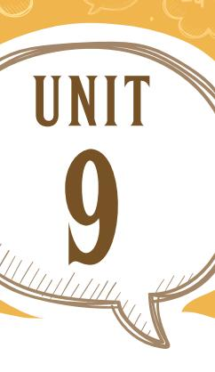

?

# 9 **The Proposal**

;

### **Let's Begin**

- 1. Facial expressions are non-verbal communications. These expressions play an important role in a play. They are powerful communication tools. The human face is extremely expressive. It is able to convey countless emotions without saying a word. Expressions tell us the mood of the characters in the play. Some facial expressions are given below. The facial expressions are for happiness, sadness, anger, surprise, fear, and disgust. Look at the facial expressions and write which emotion do they express.
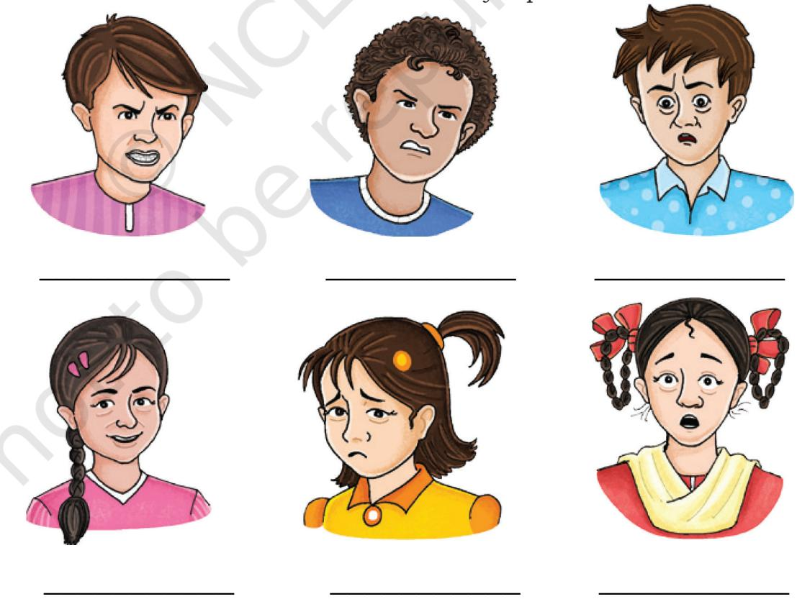

Unit-9.indd 124 5/1/2023 11:24:10 AM

- 2. You have read 'The Proposal', a one act play. It is a farce. The play is set in only one location, the drawing room of Chubukov's house. All three characters in the play are quarrelsome people and they quarrel over petty issues. Lomov and Natalya start with the issue like a piece of land that is situated at the border between the two neighbors' properties. The discussion turns into a quarrel and the marriage proposal is forgotten. They shout at each other. They are again dragged into an argument over the superiority of each other's dogs. So, they drag their ancestors in their foolish quarrel. They again abuse each other and call names.
Now, make groups of four and discuss the following points. While conducting the discussion, try to use the facial expressions given above.

- • The marriage proposal is a mockery of romance and marriage in the upper class.
- • The pride in property, even the superiority of dogs, take priority over love and marriage.
- • The characters lack patience, stop listening to each other, and then contradict each other.
- • Do you think these quarrels will promise a happy life?
- • What qualities would you consider for a well-matched couple?
- • Do you think all of us should know how to manage our anger?

### **Reading Comprehension**

### **Text I**

### **How Can We Control Anger?**

Do you get angry when your mother switches off the television? Do you get upset when you lose a game? Do you crib when your teacher does not pay attention to you? Most of us can have "yes" as an answer to one or more of these situations. Anger sometimes gets the better of us and leaves us to regret the consequences later. The question is 'How can we control anger?'

Anger is a normal and healthy emotion only if we know how to respond to it. Uncontrolled anger can often harm us directly or Sentences

Unit-9.indd 125 20-02-2023 09:48:34

aggressive assertive consequences distress grudge uncontrolled

Look Up and Understand indirectly whether we realise or not. Before we learn to address the issue, let us revisit the concept of anger. Anger is nothing but absence of peace with oneself, people or situations around us. We express it either by being assertive or aggressive.

Let us all become the managers of our own anger. When angry, take a few moments to calm down (take five deep breaths, count up to ten, drink water, change your place) before responding. More often than not we do not have control over the situations that distress us. Getting physically active reduces stress. Funny dances, clapping, thumping your feet, a walk, making funny faces at the mirror, etc., go a long way in helping us let go of the anger or the frustration inside us. Once we have our feelings under control, go through all the aspects of the situation and try to see the same situation from different perspectives. If it is a problem try to equip yourself with a few solutions before entering the same situation. Avoid holding a grudge with people and learn when to seek help from others. Realising your own shortcomings can become one of the greatest strengths of character over the years to come.

We can never control circumstances, people or situations as they are constantly changing. The only thing we can control is our response. So we have to increase our capacity to tolerate, ability to understand, and learn to nurture love for others.

### **Q.1. What do you understand by the word 'anger'?**

 **_____________________________________________________ _____________________________________________________ _____________________________________________________**

**Q.2. List any four strategies to manage anger.**

**Q.3. How can you develop strengths of character as given in the passage above?**

 **_____________________________________________________ _____________________________________________________ _____________________________________________________**

 **_____________________________________________________ _____________________________________________________ _____________________________________________________**

126 Words and Expressions 2 – Class X

Unit-9.indd 126 20-02-2023 09:48:34

### **Q.4. Anger management helps you in (Tick the correct answer.)—**

- (a) remaining always happy
- (b) developing strength of character
- (c) remaining stress free
- (d) learning how to respond to the situation
- **Q.5. What is under our control? How can we make it a positive one?**

 **_____________________________________________________ _____________________________________________________ _____________________________________________________ _____________________________________________________**

### **Text II**

#### **On Violence**

There is a great deal of violence in the world. There is physical violence and also inward violence. Physical violence is to kill another, to hurt other people consciously, deliberately or without thought, to say cruel things, full of antagonism and hate and inwardly, inside the skin, to dislike people, to hate people, to criticise people. Inwardly, we are always quarrelling, battling, not only with others, but with ourselves. We want people to change, we want to force them to our way of thinking.

In the world, as we grow up, we see a great deal of violence, at all levels of human existence. The ultimate violence is war—the killing for ideas, for so-called religious principles, for nationalities, the killing to preserve a little piece of land. To do that, man will kill, destroy, maim, and also be killed himself. There is enormous violence in the world, the rich wanting to keep people poor, and the poor wanting to get rich and in the process hating the rich. And you, being caught in society, are also going to contribute to this.

There is violence between husband, wife, and children. There is violence, antagonism, hate, cruelty, ugly criticism, anger—all this is inherent in man, inherent in each human being. It is

Look Up and Understand Sentences

antagonism consciously deliberately inherent

maim

Unit-9.indd 127 20-02-2023 09:48:34

inherent in you. And education is supposed to help you to go beyond all that, not merely to pass an examination and get a job. You have to be educated so that you become a really beautiful, healthy, sane, rational human being, not a brutal man with a very clever brain who can argue and defend his brutality. You are going to face all this violence as you grow up. You will forget all that you have heard here, and will be caught in the stream of society. You will become like the rest of the cruel, hard, bitter, angry, violent world, and you will not help to bring about a new society, a new world.

But a new world is necessary. A new culture is necessary. The old culture is dead, buried, burnt, exploded, and vaporised. You have to create a new culture. A new culture cannot be based on violence. The new culture depends on you because the older generation has built a society based on violence, based on aggressiveness and it is this that has caused all the confusion, all the misery. The older generations have produced this world and you have to change it. You cannot just sit back and say, "I will follow the rest of the people and seek success and position." If you do, your children are going to suffer. You may have a good time, but your children are going to pay for it. So, you have to take all that into account, the outward cruelty of man to man in the name of god, in the name of religion, in the name of self-importance, in the name of the security of the family. You will have to consider the outward cruelty and violence, and the inward violence which you do not yet know.

(Source: 'On Violence', *On Education* by J. Krishnamurti)

**Q.1. What is the physical violence that J. Krishnamurti is talking about?**

 **_____________________________________________________ _____________________________________________________ _____________________________________________________ _____________________________________________________**

### **Q.2. What is the violence that cannot be expressed?**

 **_____________________________________________________ _____________________________________________________**

128 Words and Expressions 2 – Class X

aggressiveness

Look Up and Understand

brutality

exploded

vaporised

Unit-9.indd 128 20-02-2023 09:48:34

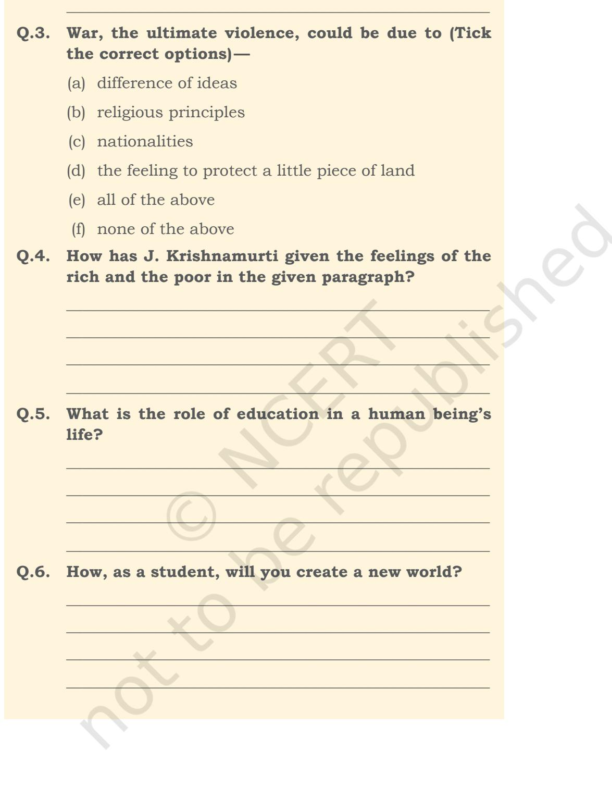

 **_____________________________________________________**

Sentences

Unit-9.indd 129 20-02-2023 09:48:34

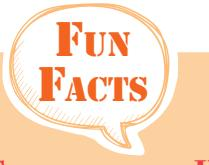

**Silent letter: H** Honest Hour Honour

Vocabulary

- 1. Some verbs are given below. Write their nouns and adverb forms in the space provided.

| verb | noun | adverb |
| --- | --- | --- |
| encourage |  |  |
| excite |  |  |
| trouble |  |  |
| beautify |  |  |
| tremble |  |  |

### **Reported speech**

- 1. Some children are taken to a health clinic for a regular checkup. Rewrite the sentences they speak in reported speech. (Use complain, say, tell, ask, inquire, mention, etc., wherever necessary.)
Ashish : I feel sleepy all the time.

- Neha : I get pain in my legs when I run.
- Sonal : I'm fine.
- Ritu : I had fever last week.
- Akash : Why do I always cough?

___________________________________________________________________________ ___________________________________________________________________________ ___________________________________________________________________________ ___________________________________________________________________________

- Rehman : Should I walk everyday to keep myself fit?
- Sumi : Oh, thank you, Doctor. Now I know the reason for my constant stomach-ache.

130 Words and Expressions 2 – Class X

Unit-9.indd 130 20-02-2023 09:48:35

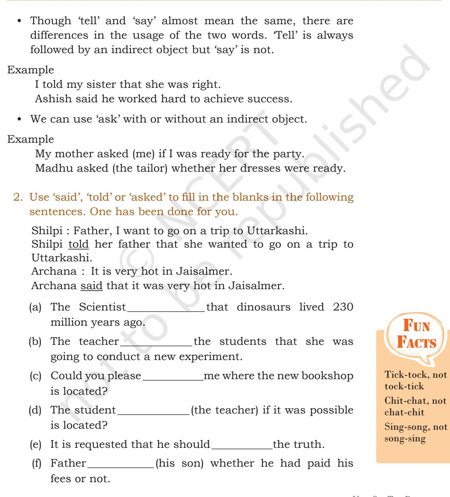

___________________________________________________________________________ ___________________________________________________________________________ ___________________________________________________________________________ ___________________________________________________________________________ ___________________________________________________________________________ ___________________________________________________________________________

Unit 9 – The Proposal 131

Sentences

Unit-9.indd 131 20-02-2023 09:48:35

### **Jumbled Sentences**

- 1. Join the parts of the sentences given below and write meaningful sentences.
	- (a) by giving ultimate/individual can transform everything/ expression to /the inner determination of an/the infinite potential of human being

______________________________________________________

______________________________________________________

______________________________________________________

______________________________________________________

______________________________________________________

______________________________________________________

______________________________________________________

______________________________________________________

______________________________________________________

______________________________________________________

- (b) down many a time/but keep rising/that you may go/the Sun teaches us
- (c) but how much love/much we give/we put into giving/it's not how
- (d) fit for human habitation/would mould the world/the citizens of tomorrow/into a globe
- (e) you must hear/to be a great leader /and pains of people/ the unspoken joys

# Listening

- 1. You have read a play by Anton Chekov. Given below is a story by the same author. Listen and enjoy the recorded
132 Words and Expressions 2 – Class X

Unit-9.indd 132 20-02-2023 09:48:35

story or someone may read it aloud to you. Then answer the questions that follow.

### **Vanka**

(Vanka Zhukov, a nine-year old boy, was made an assistant to Alyakhin, the Shoemaker. He didn't go to bed on Christmas Eve. When everyone in the shop had gone to Church, he began to write on a crumpled sheet of paper. "Dear Grandfather Konstantin, he wrote", I'm writing a letter to you. I wish you a Merry Christmas and all good things from the Lord God. I've no father and mother, and you are all I have left.")

Vanka raised his eyes to the dark windowpane. In his imagination he saw his grandfather Konstantin standing there. His grandfather was a night watchman on the estate of a rich man. Konstantin was a small, thin and lively old man of sixty-five whose face was always crinkling with laughter. In the daytime the old man slept in the servant's kitchen or cracked jokes with the cooks. At night, wrapped in a big sheepskin coat he made rounds of the estate, blowing his whistle at regular intervals. He was always followed by his dogs, Brownie and Eel. Eel was a particularly remarkable dog. He was extremely respectful and endearing and looked lovingly on friends and strangers alike; yet no one trusted him. He would creep behind someone and bite his leg or run off with a peasant's chicken. Many a time Eel was beaten mercilessly, yet he always managed to survive.

At this very moment, Vanka thought, grandfather was probably standing by the gates, looking up at the bright red windows of the village church and cracking jokes with the servants.

"What about a pinch of snuff?" he would say, holding out his snuffbox to the women.

The women would take a pinch and sneeze and the old man would feel happy about it. "Fine for frozen noses, eh!" he'd say.

The dogs, too, were given snuff. Brownie would sneeze, shake her head and walk away looking hurt. Eel, too polite to sneeze, only wagged his tail.

Vanka looked through the window. The weather was glorious. The air was fresh. The night was very dark, but the roofs of the houses and trees were all covered with snow.

Fun Facts **Silent letter: B** Lamb Climb Bomb

Sentences

Unit-9.indd 133 20-02-2023 09:48:35

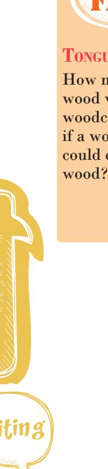

Fun Facts **Tongue twister**

How much wood would a woodchuck chuck if a woodchuck could chuck

Stars twinkled in the sky and it appeared that they had been washed and placed there only for the holidays.

Vanka sighed, and went on writing: "Yesterday I was given a beating. That was because when I was rocking the baby in the cradle, I unfortunately fell asleep. Another day the mistress of the house asked me to clean the fish. I didn't know how, so she rubbed the fish all over my face. My friends laughed at me. Then there's nothing to eat. In the morning they give me bread, there is porridge for dinner and in the evening only bread again. The master and the mistress eat all the good things themselves. I sleep in the corridor and when the baby cries, I don't get any sleep at all because I've to rock the cradle. Dear Grandfather, please take me away from here, take me to the village, it's more than I can bear." Vanka rubbed his eyes with his fists and sobbed.

"I'll grind your snuff for you, he went on", I'll pray to God to keep you healthy and if I ever do anything wrong, you can beat me as you like. If you think there's no place for me then I can clean boots or even work as a shepherd boy. Grandfather, it's more than I can bear. I thought of running away to the village, but I don't have any boots. If you'll help me now, I'll feed you when I grow up and when you die I'll pray for your soul just like I do for my mother.

"Dear Grandfather, when they put up the Christmas tree at the big house, please take down a golden walnut for me and hide it in the green box. Ask the young mistress Olga, and say it is for Vanka."

Vanka sighed and gazed in the direction of the window. He remembered it was grandfather who always went to the forest to cut down a Christmas tree for the rich people, taking Vanka with him. They had a wonderful time together, the snow falling, the trees crackling and hares springing across the trees,

When the tree had been chopped down, grandfather would drag it to the big house and they would start decorating it. The young mistress Olga, Vanka's favourite, was the busiest of all. Vanka's mother, when alive, had worked as Olga's maid. Then Olga had given him all the sweets and played a lot with Vanka. But after his mother's death, Vanka was sent to the kitchen to be with his grandfather and from there to Alyakhin, the shoemaker.

Unit-9.indd 134 20-02-2023 09:48:35

"Come to me, dear grandfather," Vanka wrote on, "Please, take me away from here, have pity on me, a poor orphan. They are always beating me. I'm terribly hungry and so miserable that I'm always crying. Remember me to all my friends. I remain your grandson, Ivan Zhukov. Dear grandfather, please come soon."

Vanka folded the sheet of paper and then put it in an envelope he had bought the previous day. He thought for a while, then wrote the address: To Grandfather in the Village. He added the words: Konstantin Makarich. He was happy that no one had disturbed him while he was writing his letter. He ran out to the street to post it. Vanka had been told by the clerks that letter were dropped in boxes from where they were carried all over the world on mail coaches drawn by horse and driven by drunken drivers, while the bells jingled. Vanka ran to the nearest mailbox and put his letter in it.

An hour later, lulled by sweetest hopes, he was fast asleep. He dreamed of a stove. His grandfather was sitting beside it, reading out his letter to the cooks. Eel, the dog, was walking round the stove, wagging his tail.

Anton Chekov

- (a) Vanka went to bed early on Christmas Eve as___________ ______________________________________________________. (b) Why, of all people, did he write a letter to his grandfather? ______________________________________________________ ______________________________________________________ (c) How was his grandfather a very lovable person? ______________________________________________________ ______________________________________________________ (d) Vanka was beaten_______________________________times. (e) Vanka was beaten because____________________________. (f) What was Vanka prepared to do for grandfather if he was taken away from the shoemaker? ______________________________________________________
______________________________________________________

Sentences

Unit-9.indd 135 20-02-2023 09:48:35

- (g) He was sent to Alyakhin, the shoe-maker, to
- (h) Who does Vanka remember most at Christmas, next to his grandfather?

______________________________________________________

______________________________________________________

______________________________________________________

______________________________________________________

______________________________________________________

______________________________________________________

______________________________________________________

______________________________________________________

______________________________________________________

______________________________________________________

______________________________________________________

______________________________________________________

- (i) How did he address the letter?
__________________________.

- (j) Did he sleep well after posting the letter? What did he dream?
### Speaking

- 1. Enact the play in the class. Keep in mind— dialogue delivery tone, voice modulation; non-verbal communications— facial expressions, gestures, movements, etc. Many things are communicated through these non-verbal tools.
- 2. A communicative task is given below. Practice in pairs or groups.

### **Task I**

(Discussing, giving opinions, agreeing, and disagreeing)

### **Role Play**

Smita : Well! What do you think about violence on television?

136 Words and Expressions 2 – Class X

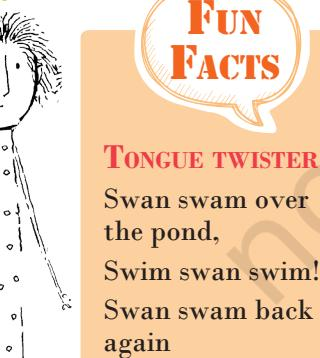

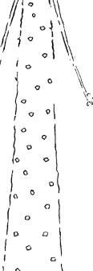

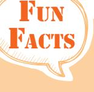

Well swum swan!

Unit-9.indd 136 20-02-2023 09:48:35

- Romila : If you ask me, there is too much violence on television. Children should not be exposed to it.
- Smita : I don't agree with you. Why do you say so?
- Romila : It's not wise to expose children to a lot of fighting, shooting, stabbing, and killing.
- Smita : But children find it thrilling.
- Romila : No, they don't. On the contrary it brutalises them and makes them insensitive. They look upon violence and killing as common place incidents.
- Smita : But the young people now-a-days are quite violent.
- Romila : Precisely. It is the influence of television. Wouldn't it be better if through television we give them the message of peace and togetherness.

### **Pair or Group Work**

Discuss with your friends the following topics—people going abroad for studies, building a dispensary in place of a playground, sports cannot be a profession, or any topic that is of interest to you and your friends.

## Fun Facts

**Idiom** Bury the hatchet — to stop conflict and make peace

Sentences

### Writing

- 1. Letters in the olden times were carried by mail coaches driven by horses. How are they carried today? List the types of letters sent by different means of transport.

| _____________________________________________________________________ |
| --- |
| _____________________________________________________________________ |
| _____________________________________________________________________ |
| _____________________________________________________________________ |
| _____________________________________________________________________ |
| _____________________________________________________________________ |
| _____________________________________________________________________ |
| _____________________________________________________________________ |

Unit-9.indd 137 20-02-2023 09:48:36

- 2. You have listened to the story of Vanka. Try writing an e-mail to your grandfather describing your life. Have you ever felt as bad as Vanka did? What did you do to feel happy again?
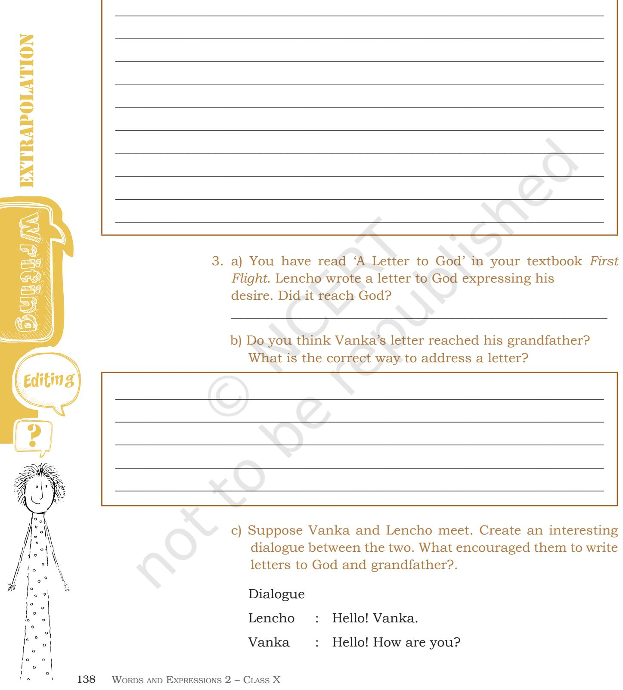

Unit-9.indd 138 20-02-2023 09:48:36

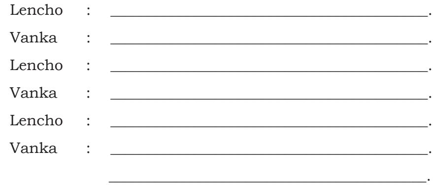

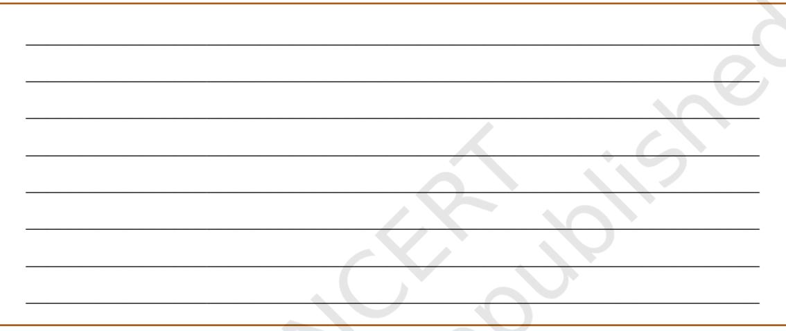

- 

Proofreading symbols generally in use have been strongly influenced by the British Standard's Institution's BS 5261 Part 2: 1976 and supplements. The most common are included here.

| Instruction | Textual mark | Marqinal mark |
| --- | --- | --- |
| Correction is concluded | None |  |
| Insert in text the matter indicated in the | × | New matter followed by |
| margin |  |  |
| Insert additional matter identified by a letter | Followed by, e.g. < A | The relevant section of the |
| in a diamond |  | copy should be supplied with |
|  |  | the corresponding letter marked |
|  |  | on it in a diamond, e.g. < A> |
| Delete | / through character(s) or H |  |
|  | through words to be deleted |  |
| Close up and delete space between | linking characters |  |
| characters or words |  |  |
| Delete and close up | through character or H 1 through |  |
|  | characters, e.g. character charalaalcter |  |
| Substitute character or substitute part of | / through character or I I through | New character or new word(s) |
| one or more word(s) | word(s) | followed by / |
| Substitute or insert full point or decimal | / or through character where required |  |
| point |  |  |
| Substitute or insert colon | through character where required |  |
| Substitute or insert semicolon | or K through character where required | or |
| Substitute or insert comma | or ( through character where required |  |
| Substitute or insert solidus (oblique) | or through character where required |  |
| Substitute or insert character in superior | or A through character where required | or V under character |
| (superscript) position |  | 4 or |
| Substitute or insert character in inferior | through character where required | or A over character |
| (subscript) position |  |  |
| Substitute or insert opening or closing | / or through character where required |  |
| parenthesis, square bracket, or curly brace |  |  |
| Substitute or insert hyphen | / or through character where required |  |
| Substitute or insert rule | through character, e.g. | Give the size of rule in marginal |
|  |  | 4 mm mark 1 em |
| Set in or change to bold type | ww under character(s) to be set or changed |  |
| Set in or change to bold italic type | under character(s) to be set or changed |  |
| Set in or change to italic | under character(s) to be set or changed | ctal) or |
| Change italic to upright (roman) type | Encircle character(s) to be changed | or |
| Set in or change to capital letters | = under character(s) to be set or changed |  |
| Change capital letters to lower-case letters | Encircle character(s) to be changed |  |
| Spell out number or abbreviation | Encircle matter to be changed (38 pp. |  |
| Set in or change to small capital letters | = under character(s) to be set or changed | S. cap) or |
| Set in or change to capital letters for initial | = under initial letters and = | = where space does not |
| letters and small capital letters for the rest | under rest of the word(s) | permit textual marks, encircle |
| of the word(s) |  | the affected area instead |

Unit-9.indd 140 20-02-2023 09:48:36

| Instruction | Textual mark | Marqinal mark |
| --- | --- | --- |
| Change small capital letters to lower-case | Encircle character(s) to be changed |  |
| letters |  |  |
| Start new paragraph |  | or |
| Run on (no new paragraph) |  |  |
| Transpose characters or words | L 7 between characters or words, | or LD |
|  | numbered when necessary |  |
| Transpose lines |  |  |
| Invert type | Encircle character to be inverted |  |
| Transpose a number of lines | ਤ | To be used when the sequence |
|  | 2 | cannot be clearly indicated |
|  | 1 | otherwise. Rules extend from the |
|  |  | margin into the text, with each line |
|  |  | to be transplanted numbered in the |
|  |  | correct sequence |
| Centre | [] or [ enclosing matter to be centred ] |  |
| Insert space between characters | between characters affected | or # |
| Insert space between words | between words affected | or (more) |
| Reduce space between characters | between characters affected | or ( Less # |
| Reduce space between words | between words affected |  |
| Equalize space between characters or words | between characters or words affected | or |
| Close up to normal interlinear spacing | each side of column linking lines ) |  |
| Insert space between lines or paragraphs | or | The marginal mark extends |
|  |  | between the lines of text. |
|  |  | Give the size of the space to |
|  |  | be inserted if necessary |
| Reduce space between lines or paragraphs |  | The marginal mark extends between the lines of text. Give |
|  |  | the amount by which the space |
|  |  | is to be reduced if necessary |
| Take over character(s), word(s), or line to |  | The textual mark surrounds the |
| next line, column, or page |  | matter to be taken over and |
|  |  | extends into the margin |
| Take back character(s), word(s), or line to |  | The textual mark surrounds the |
| previous line, column, or page |  | matter to be taken back and |
|  |  | extends into the margin |
| Insert or substitute em space, en space, or | □ (em), ¤ (en), | ロ (em), a (en), |
| thin space | + or 9 (thin) | * or 9(thin) |
| Indent |  | LL |
| Cancel indent |  | F |
| Move matter specified distance to the right | enclosing matter to be | 디 |
|  | moved to the right |  |
| Move matter specified distance to the left | I L enclosing matter to be the left |  |
| Correct vertical alignment | = |  |
| Correct horizontal alignment | Single line above and below misaligned |  |
|  | matter, e.g. misaligned |  |
| Correction made in error. Leave unchanged | under characters to remain |  |
| Remove extraneous mark(s) or replace | Encircle mark(s) to be removed or |  |
| damaged character(s) | character(s) to be changed |  |
| Wrong font. Replace by character(s) of | Encircle character(s) to be changed |  |
| correct font |  |  |
| Refer to appropriate authority anything of | Encircle word(s) affected | ? |
| doubtful accuracy |  |  |

Unit-9.indd 141 20-02-2023 09:48:37

| ___________________________________________________________________________ |
| --- |
| ___________________________________________________________________________ |
| ___________________________________________________________________________ |
| ___________________________________________________________________________ |
| ___________________________________________________________________________ |
| ___________________________________________________________________________ |
| ___________________________________________________________________________ |
| ___________________________________________________________________________ |
| ___________________________________________________________________________ |
| ___________________________________________________________________________ |
| ___________________________________________________________________________ |
| ___________________________________________________________________________ |
| ___________________________________________________________________________ |
| ___________________________________________________________________________ |
| ___________________________________________________________________________ |
| ___________________________________________________________________________ |
| ___________________________________________________________________________ |
| ___________________________________________________________________________ |
| ___________________________________________________________________________ |
| ___________________________________________________________________________ |
| ___________________________________________________________________________ |
| ___________________________________________________________________________ |
| ___________________________________________________________________________ |
| ___________________________________________________________________________ |
| ___________________________________________________________________________ |
| ___________________________________________________________________________ |
| ___________________________________________________________________________ |

