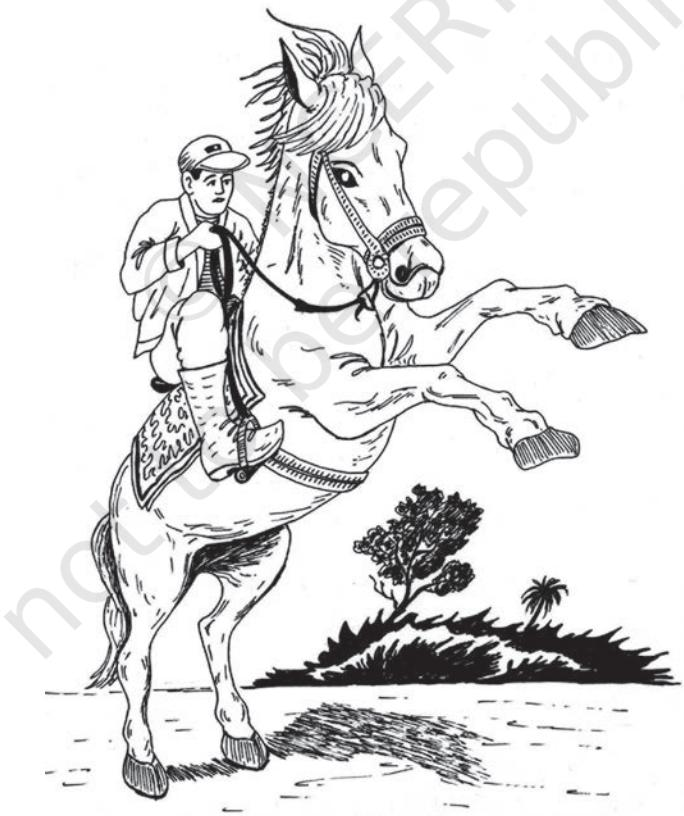
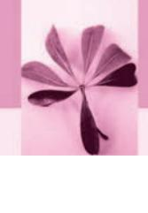
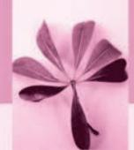

William Saroyan

This story is about two poor Armenian boys who belong to a tribe whose hallmarks are trust and honesty.

ONE day back there in the good old days when I was nine and the world was full of every imaginable kind of magnificence, and life was still a delightful and mysterious dream, my cousin Mourad, who was considered crazy by everybody who knew him except me, came to my house at four in the morning and woke me up tapping on the window of my room.

Aram, he said.

1

I jumped out of bed and looked out of the window.

I couldn't believe what I saw.

It wasn't morning yet, but it was summer and with daybreak not many minutes around the corner of the world it was light enough for me to know I wasn't dreaming.

My cousin Mourad was sitting on a beautiful white horse.

I stuck my head out of the window and rubbed my eyes.

Yes, he said in Armenian. It's a horse. You're not dreaming. Make it quick if you want to ride.

I knew my cousin Mourad enjoyed being alive more than anybody else who had ever fallen into the world by mistake, but this was more than even I could believe.

In the first place, my earliest memories had been memories of horses and my first longings had been longings to ride.

This was the wonderful part.

In the second place, we were poor.

This was the part that wouldn't permit me to believe what I saw.

We were poor. We had no money. Our whole tribe was povertystricken. Every branch of the Garoghlanian1 family was living in the most amazing and comical poverty in the world. Nobody could understand where we ever got money enough to keep us with food in our bellies, not even the old men of the family. Most important of all, though, we were famous for our honesty. We had been famous for our honesty for something like eleven centuries, even when we had been the wealthiest family in what we liked to think was the world. We were proud first, honest next, and after that we believed in right and wrong. None of us would take advantage of anybody in the world, let alone steal.

Consequently, even though I could see the horse, so magnificent; even though I could smell it, so lovely; even though I could hear it breathing, so exciting; I couldn't believe the horse had anything to do with my cousin Mourad or with me or with any of the other members of our family, asleep or awake, because I knew my cousin Mourad couldn't have bought the horse, and if he couldn't have bought it he must have stolen it, and I refused to believe he had stolen it.

No member of the Garoghlanian family could be a thief.

I stared first at my cousin and then at the horse. There was a pious stillness and humour in each of them which on the one hand delighted me and on the other frightened me.

Mourad, I said, where did you steal this horse?

Leap out of the window, he said, if you want to ride.

It was true, then. He had stolen the horse. There was no question about it. He had come to invite me to ride or not, as I chose.

Well, it seemed to me stealing a horse for a ride was not the same thing as stealing something else, such as money. For all I knew, maybe it wasn't stealing at all. If you were crazy about

1 an Armenian tribe

horses the way my cousin Mourad and I were, it wasn't stealing. It wouldn't become stealing until we offered to sell the horse, which of course, I knew we would never do.

Let me put on some clothes, I said.

All right, he said, but hurry.

I leaped into my clothes.

I jumped down to the yard from the window and leaped up onto the horse behind my cousin Mourad.

 That year we lived at the edge of town, on Walnut Avenue. Behind our house was the country: vineyards, orchards, irrigation ditches, and country roads. In less than three minutes we were on Olive Avenue, and then the horse began to trot. The air was new and lovely to breathe. The feel of the horse running was wonderful. My cousin Mourad who was considered one of the craziest members of our family began to sing. I mean, he began to roar.

Every family has a crazy streak in it somewhere, and my cousin Mourad was considered the natural descendant of the crazy streak in our tribe. Before him was our uncle Khosrove, an enormous man with a powerful head of black hair and the largest moustache in the San Joaquin Valley2 , a man so furious in temper, so irritable, so impatient that he stopped anyone from talking by roaring, It is no harm; pay no attention to it.

That was all, no matter what anybody happened to be talking about. Once it was his own son Arak running eight blocks to the barber's shop where his father was having his moustache trimmed to tell him their house was on fire. This man Khosrove sat up in the chair and roared, It is no harm; pay no attention to it. The barber said, But the boy says your house is on fire. So Khosrove roared, Enough, it is no harm, I say.

My cousin Mourad was considered the natural descendant of this man, although Mourad's father was Zorab, who was practical and nothing else. That's how it was in our tribe. A man could be the father of his son's flesh, but that did not mean that he was also the father of his spirit. The distribution of the various kinds of spirit of our tribe had been from the beginning capricious and vagrant.

We rode and my cousin Mourad sang. For all anybody knew we were still in the old country where, at least according to

2 one of the long interior valleys of California

some of our neighbours, we belonged. We let the horse run as long as it felt like running.

At last my cousin Mourad said, Get down. I want to ride alone.

Will you let me ride alone? I asked.

That is up to the horse, my cousin said. Get down.

The horse will let me ride, I said.

We shall see, he said. Don't forget that I have a way with a horse.

Well, I said, any way you have with a horse, I have also.

For the sake of your safety, he said, let us hope so. Get down.

All right, I said, but remember you've got to let me try to ride alone.

I got down and my cousin Mourad kicked his heels into the horse and shouted, Vazire, run. The horse stood on its hind legs, snorted, and burst into a fury of speed that was the loveliest

thing I had ever seen. My cousin Mourad raced the horse across a field of dry grass to an irrigation ditch, crossed the ditch on the horse, and five minutes later returned, dripping wet.

The sun was coming up.

Now it's my turn to ride, I said.

My cousin Mourad got off the horse.

Ride, he said.

I leaped to the back of the horse and for a moment knew the most awful fear imaginable. The horse did not move.

Kick into his muscles, my cousin Mourad said. What are you waiting for? We've got to take him back before everybody in the world is up and about.

I kicked into the muscles of the horse. Once again it reared and snorted. Then it began to run. I didn't know what to do. Instead of running across the field to the irrigation ditch the horse ran down the road to the vineyard of Dikran Halabian where it began to leap over vines. The horse leaped over seven vines before I fell. Then it continued running.

My cousin Mourad came running down the road.

I'm not worried about you, he shouted. We've got to get that horse. You go this way and I'll go this way. If you come upon him, be kindly. I'll be near.

I continued down the road and my cousin, Mourad went across the field toward the irrigation ditch.

It took him half an hour to find the horse and bring him back.

> All right, he said, jump on. The whole world is awake now. What will we do? I said.

Well, he said, we'll either take him back or hide him until tomorrow morning.

He didn't sound worried and I knew he'd hide him and not take him back. Not for a while, at any rate.

Where will we hide him? I said.

I know a place, he said.

How long ago did you steal this horse? I said.

It suddenly dawned on me that he had been taking these early morning rides for some time and had come for me this morning only because he knew how much I longed to ride.

Who said anything about stealing a horse? he said.

Anyhow, I said, how long ago did you begin riding every morning?

Not until this morning, he said.

Are you telling the truth? I said.

Of course not, he said, but if we are found out, that's what you're to say. I don't want both of us to be liars. All you know is that we started riding this morning.

All right, I said.

He walked the horse quietly to the barn of a deserted vineyard which at one time had been the pride of a farmer named Fetvajian. There were some oats and dry alfalfa in the barn.

We began walking home.

It wasn't easy, he said, to get the horse to behave so nicely. At first it wanted to run wild, but, as I've told you, I have a way with a horse. I can get it to want to do anything I want it to do. Horses understand me.

How do you do it? I said.

I have an understanding with a horse, he said.

Yes, but what sort of an understanding? I said.

A simple and honest one, he said.

Well, I said, I wish I knew how to reach an understanding like that with a horse.

You're still a small boy, he said. When you get to be thirteen you'll know how to do it.

I went home and ate a hearty breakfast.

That afternoon my uncle Khosrove came to our house for coffee and cigarettes. He sat in the parlour, sipping and smoking and remembering the old country. Then another visitor arrived, a farmer named John Byro, an Assyrian who, out of loneliness, had learned to speak Armenian. My mother brought the lonely visitor coffee and tobacco and he rolled a cigarette and sipped and smoked, and then at last, sighing sadly, he said, My white horse which was stolen last month is still gone — I cannot understand it.

My uncle Khosrove became very irritated and shouted, It's no harm. What is the loss of a horse? Haven't we all lost the homeland? What is this crying over a horse?

That may be all right for you, a city dweller, to say, John Byro said, but what of my surrey? What good is a surrey without a horse?

Pay no attention to it, my uncle Khosrove roared.

I walked ten miles to get here, John Byro said.

You have legs, my uncle Khosrove shouted.

My left leg pains me, the farmer said.

Pay no attention to it, my uncle Khosrove roared.

That horse cost me sixty dollars, the farmer said.

I spit on money, my uncle Khosrove said.

He got up and stalked out of the house, slamming the screen door.

My mother explained.

He has a gentle heart, she said. It is simply that he is homesick and such a large man.

The farmer went away and I ran over to my cousin Mourad's house.

He was sitting under a peach tree, trying to repair the hurt wing of a young robin which could not fly. He was talking to the bird.

What is it? he said.

The farmer, John Byro, I said. He visited our house. He wants his horse. You've had it a month. I want you to promise not to take it back until I learn to ride.

> It will take you a year to learn to ride, my cousin Mourad said. We could keep the horse a year, I said.

My cousin Mourad leaped to his feet.

What? he roared. Are you inviting a member of the Garoghlanian family to steal? The horse must go back to its true owner.

When? I said.

In six months at the latest, he said.

He threw the bird into the air. The bird tried hard, almost fell twice, but at last flew away, high and straight.

Early every morning for two weeks my cousin Mourad and I took the horse out of the barn of the deserted vineyard where we were hiding it and rode it, and every morning the horse, when it was my turn to ride alone, leaped over grape vines and small trees and threw me and ran away. Nevertheless, I hoped in time to learn to ride the way my cousin Mourad rode.

One morning on the way to Fetvajian's deserted vineyard we ran into the farmer John Byro who was on his way to town.

Let me do the talking, my cousin Mourad said. I have a way with farmers.

Good morning, John Byro, my cousin Mourad said to the farmer.

The farmer studied the horse eagerly.

Good morning, son of my friends, he said. What is the name of your horse?

My Heart, my cousin Mourad said in Armenian.

A lovely name, John Byro said, for a lovely horse. I could swear it is the horse that was stolen from me many weeks ago. May I look into his mouth?

Of course, Mourad said.

The farmer looked into the mouth of the horse.

Tooth for tooth, he said. I would swear it is my horse if I didn't know your parents. The fame of your family for honesty is well known to me. Yet the horse is the twin of my horse. A suspicious man would believe his eyes instead of his heart. Good day, my young friends.

Good day, John Byro, my cousin Mourad said.

Early the following morning we took the horse to John Byro's vineyard and put it in the barn. The dogs followed us around without making a sound.

The dogs, I whispered to my cousin Mourad. I thought they would bark.

They would at somebody else, he said. I have a way with dogs.

My cousin Mourad put his arms around the horse, pressed his nose into the horse's nose, patted it, and then we went away.

That afternoon John Byro came to our house in his surrey and showed my mother the horse that had been stolen and returned.

I do not know what to think, he said. The horse is stronger than ever. Better-tempered, too. I thank God. My uncle Khosrove, who was in the parlour, became irritated and shouted, Quiet, man, quiet. Your horse has been returned. Pay no attention to it.

1. You will probably agree that this story does not have breathless adventure and exciting action. Then what in your opinion makes it interesting?

- 2. Did the boys return the horse because they were conscience-stricken or because they were afraid?
- 3. "One day back there in the good old days when I was nine and the world was full of every imaginable kind of magnificence, and life was still a delightful and mysterious dream..." The story begins in a mood of

nostalgia. Can you narrate some incident from your childhood that might make an interesting story?

- 4. The story revolves around characters who belong to a tribe in Armenia. Mourad and Aram are members of the Garoghlanian family. Now locate Armenia and Assyria on the atlas and prepare a write-up on the Garoghlanian tribes. You may write about people, their names, traits, geographical and economic features as suggested in the story.
## TRY THIS OUT

"The horse stood on its hind legs, snorted, and burst into a fury of speed that was the loveliest thing I had ever seen." These lines could be an artist's delight. Try to draw a picture as depicted in the above lines.

