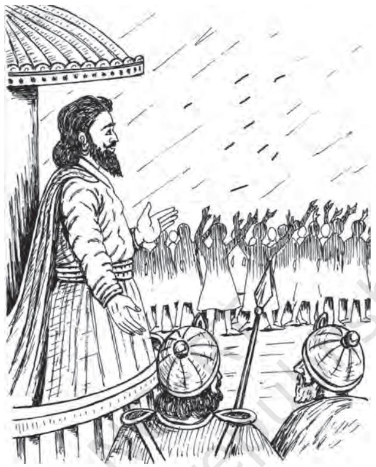

## *5 The Tale of Melon City*

Vikram Seth ikram Sethikram Seth

*The following poem is taken from Mappings which was published in 1981 and is included in the Collected Poems by Vikram Seth. The king, in this poem, is 'just and placid.' Does he carry his notion of justice a bit too far?*

## (After Idries Shah)

In the city of which I sing There was a just and placid King.

The King proclaimed an arch should be Constructed, that triumphally

Would span the major thoroughfare To edify spectators there.

The workmen went and built the thing. They did so since he was the King.

The King rode down the thoroughfare To edify spectators there.

Under the arch he lost his crown. The arch was built too low. A frown

Appeared upon his placid face. The King said, 'This is a disgrace.

The chief of builders will be hanged.' The rope and gallows were arranged.

The chief of builders was led out. He passed the King. He gave a shout,

'O King, it was the workmen's fault' 'Oh!' said the King, and called a halt

To the proceedings. Being just (And placider now) he said, 'I must

Have all the workmen hanged instead.' The workmen looked surprised, and said,

'O King, you do not realise The bricks were made of the wrong size.'

'Summon the masons!' said the King. The masons stood there quivering.

'It was the architect...', they said, The architect was summoned.

'Well, architect,' said His Majesty. 'I do ordain that you shall be

Hanged.' Said the architect, 'O King, You have forgotten one small thing.

*You* made certain amendments to The plans when I showed them to *you.'*

The King heard this. The King saw red. In fact he nearly lost his head;

But being a just and placid King He said, 'This is a tricky thing.

I need some counsel. Bring to me The wisest man in this country.'

The wisest man was found and brought, Nay, carried, to the Royal Court.

He could not walk and could not see, So old (and therefore wise) was he —

But in a quavering1 voice he said, 'The culprit must be punished.

Truly, the arch it was that banged The crown off, and it must be hanged'.

To the scaffold2 the arch was led When suddenly a Councillor said —

'How can we hang so shamefully What touched your head, Your Majesty?'

'True,' mused the King. By now the crowd, Restless, was muttering aloud.

The King perceived their mood and trembled And said to all who were assembled —

'Let us postpone consideration Of finer points like guilt. The nation

Wants a hanging. Hanged must be Someone, and that immediately.'

The noose was set up somewhat high. Each man was measured by and by.

But only one man was so tall He fitted. One man. That was all.

He was the King. His Majesty Was therefore hanged by Royal Decree.

1 trembling

2 platform for the execution of criminals

'Thank Goodness we found someone,' said The Ministers, 'for if instead

We had not, the unruly town Might well have turned against the Crown.'

'Long live the King!' the Ministers said. 'Long live the King! The King is dead.'

They pondered the dilemma; then, Being practical-minded men,

Sent out the heralds to proclaim (In His [former] Majesty's name):

'The next to pass the City Gate Will choose the ruler of our state,

As is our custom. This will be Enforced with due ceremony.'

A man passed by the City Gate. An idiot. The guards cried, 'Wait!

Who is to be the King? Decide!' 'A melon,' the idiot replied.

This was his standard answer to All questions. (He liked melons.) 'You

Are now our King,' the Ministers said, Crowning a melon. Then they led

(Carried) the Melon to the throne And reverently set it down.

* * *

This happened years and years ago. When now you ask the people, 'So —

Your King appears to be a melon. How did this happen?', they say, 'Well, on

Account of customary choice. If His Majesty rejoice

In being a melon, that's OK With us, for who are we to say

What he should be as long as he Leaves us in Peace and Liberty?'

The principles of *laissez faire* Seem to be well-established there.

- 1. Narrate 'The Tale of Melon City' in your own words.
- 2. What impression would you form of a state where the King was 'just and placid'?
- 3. How, according to you, can peace and liberty be maintained in a state?
- 4. Suggest a few instances in the poem which highlight humour and irony.
- 5. 'The Tale of Melon City' has been narrated in a verse form. This is a unique style which lends extra charm to an ancient tale. Find similar examples in your language. Share them in the class.

## **NOTES**

