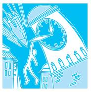
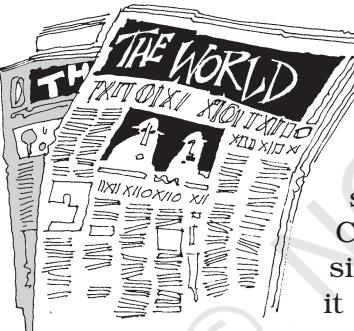
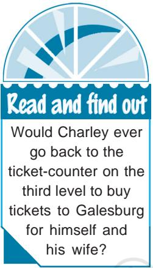

## 1 The Third Level

## Jack Finney

## **Before you read**

Have you ever had any curious experience which others find hard to believe?

THE presidents of the New York Central and the New York, New Haven and Hartford railroads will swear on a stack of timetables that there are only two. But I say there are three, because I've been on the third level of the Grand Central Station. Yes, I've taken the obvious step: I talked to a psychiatrist friend of mine, among others. I told him about the third

level at Grand Central Station, and he said it was a wakingdream wish fulfillment. He said I was unhappy. That made my wife kind of mad, but he explained that he meant the modern world is full of insecurity, fear, war, worry and all the rest of it, and that I just want to escape. Well, who doesn't? Everybody I know wants to escape, but they don't wander down into any third level at Grand Central Station.

But that's the reason, he said, and my friends all agreed. Everything points to it, they claimed. My stamp collecting, for example; that's a 'temporary refuge from reality.' Well, maybe, but my grandfather didn't need any refuge from reality; things were pretty nice and peaceful in his day, from all I hear, and he started my collection. It's a nice collection too, blocks of four of practically every U.S. issue, first-day covers, and so on. President Roosevelt collected stamps too, you know.

Anyway, here's what happened at Grand Central. One night last summer I worked late at the office. I was in a hurry to get uptown to my apartment so I decided to take the subway from Grand Central because it's faster than the bus. Now, I don't know why this should have happened to me. I'm just an ordinary guy named Charley,

thirty-one years old, and I was wearing a tan gabardine suit and a straw hat with a fancy band; I passed a dozen men who looked just like me. And I wasn't trying to escape from anything; I just wanted to get home to Louisa, my wife.

I turned into Grand Central from Vanderbilt Avenue, and went down the steps to the first level, where you take trains like the Twentieth Century. Then I walked down another flight to the second level, where the suburban trains leave from, ducked into an arched doorway heading for the subway — and got lost. That's easy to do. I've been in and out of Grand Central hundreds of times, but I'm always bumping into new doorways and stairs and corridors. Once I got into a tunnel about a mile long and came out in the lobby of the Roosevelt Hotel. Another time I came up in an office building on Forty-sixth Street, three blocks away.

Sometimes I think Grand Central is growing like a tree, pushing out new corridors and staircases like roots. There's probably a long tunnel that nobody knows about feeling its way under the city right now, on its way to Times Square, and maybe another to Central Park. And maybe — because for so many people through the years Grand Central has been an exit, a way of escape — maybe that's how the tunnel I got into... But I never told my psychiatrist friend about that idea.

The corridor I was in began angling left and slanting downward and I thought that was wrong, but I kept on walking. All I could hear was the empty sound of my own footsteps and I didn't pass a soul. Then I heard that sort of hollow roar ahead that means open space and people talking. The tunnel turned sharp left; I went down a short flight of stairs and came out on the third level at Grand Central Station. For just a moment I thought I was back on the second level, but I saw the room was smaller, there were fewer ticket windows and train gates, and the information booth in the centre was wood and oldlooking. And the man in the booth wore a green eyeshade and long black sleeve protectors. The lights were dim and sort of flickering. Then I saw why; they were open-flame gaslights.

The Third Level 3

There were brass spittoons on the floor, and across the station a glint of light caught my eye; a man was pulling a gold watch from his vest pocket. He snapped open the cover, glanced at his watch and frowned. He wore a derby hat, a black four-button suit with tiny lapels, and he had a big, black, handlebar mustache. Then I looked around and saw that everyone in the station was dressed like eighteen-ninety-something; I never saw so many beards, sideburns and fancy mustaches in my life. A woman walked in through the train gate; she wore a dress with leg-ofmutton sleeves and skirts to the top of her high-buttoned shoes. Back of her, out on the tracks, I caught a glimpse of a locomotive, a very small Currier & Ives locomotive with a funnel-shaped stack. And then I knew.

To make sure, I walked over to a newsboy and glanced at the stack of papers at his feet. It was The World; and The World hasn't been published for years. The lead story said something about President Cleveland. I've found that front page since, in the Public Library files, and it was printed June 11, 1894.

I turned toward the ticket windows knowing that here — on the third level at Grand Central — I could buy tickets that would take Louisa and me anywhere in the United States we wanted to go. In the year 1894. And I wanted two tickets to Galesburg, Illinois.

Have you ever been there? It's a wonderful town still, with big old frame houses, huge lawns, and tremendous trees whose branches meet overhead and roof the streets. And in 1894, summer evenings were twice as long, and people sat out on their lawns, the men smoking cigars and talking quietly, the women waving palm-leaf fans, with the fire-flies all around, in a peaceful world. To be back there with the First World War still twenty years off, and World War II over forty years in the future... I wanted two tickets for that.

4 Vistas

The clerk figured the fare — he glanced at my fancy hatband, but he figured the fare — and I had enough for two coach tickets, one way. But when I counted out the money and looked up, the clerk was staring at me. He nodded at the bills. ''That ain't money, mister,'' he said, ''and if you're trying to skin me, you won't get very far,'' and he glanced at the cash drawer beside him. Of course the money was old-style bills, half again as big as the money we use nowadays, and different-looking. I turned away and got out fast. There's nothing nice about jail, even in 1894.

And that was that. I left the same way I came, I suppose. Next day, during lunch hour, I drew three hundred dollars out of the bank, nearly all we had, and bought old-style currency (that really worried my psychiatrist friend). You can buy old money at almost any coin dealer's, but you have to pay a premium. My three hundred dollars bought less than two hundred in old-style bills, but I didn't care; eggs were thirteen cents a dozen in 1894.

But I've never again found the corridor that leads to the third level at

Grand Central Station, although I've tried often enough.

Louisa was pretty worried when I told her all this, and didn't want me to look for the third level any more, and after a while I stopped; I went back to my stamps. But now we're both looking, every weekend, because now we have proof that the third level is still there. My friend Sam Weiner disappeared! Nobody knew where, but I sort of suspected because Sam's a city boy, and I used to tell him about Galesburg — I went to school there — and he always said he liked the sound of the place. And that's where he is, all right. In 1894.

Because one night, fussing with my stamp collection, I found — Well, do you know what a first-day cover is? When a new stamp is issued, stamp collectors buy some and use them to mail envelopes to themselves on the very first day of sale; and the postmark proves the date. The envelope is called a first-day cover. They're never opened; you just put blank paper in the envelope.

That night, among my oldest first-day covers, I found one that shouldn't have been there. But there it was. It was there because someone had mailed it to my grandfather at his home in Galesburg; that's what the address on the envelope said. And it had been there since July 18, 1894 — the postmark showed that — yet I didn't remember it at all. The stamp was a six-cent, dull brown, with a picture of President Garfield. Naturally, when the envelope came to Granddad in the mail, it went right into his collection and stayed there — till I took it out and opened it.

The paper inside wasn't blank. It read:

941 Willard Street Galesburg, Illinois July 18, 1894

Charley

I got to wishing that you were right. Then I got to believing you were right. And, Charley, it's true; I found the third level! I've been here two weeks, and right now, down the street at the Daly's, someone is playing a piano, and they're all out on the front porch singing 'Seeing Nelly Home.' And I'm invited over for lemonade. Come on back, Charley and Louisa. Keep looking till you find the third level! It's worth it, believe me!

The note is signed Sam.

At the stamp and coin store I go to, I found out that Sam bought eight hundred dollars' worth of old-style currency. That ought to set him up in a nice little hay, feed and grain business; he always said that's what he really wished he could do, and he certainly can't go back to his old business. Not in Galesburg, Illinois, in 1894. His old business? Why, Sam was my psychiatrist.

6 Vistas

## Reading with Insight

- 1. Do you think that the third level was a medium of escape for Charley? Why?
- 2. What do you infer from Sam's letter to Charley?
- 3. 'The modern world is full of insecurity, fear, war, worry and stress.' What are the ways in which we attempt to overcome them?
- 4. Do you see an intersection of time and space in the story?
- 5. Apparent illogicality sometimes turns out to be a futuristic projection? Discuss.
- 6. Philately helps keep the past alive. Discuss other ways in which this is done. What do you think of the human tendency to constantly move between the past, the present and the future?
- 7. You have read 'Adventure' by Jayant Narlikar in Hornbill Class XI. Compare the interweaving of fantasy and reality in the two stories.

