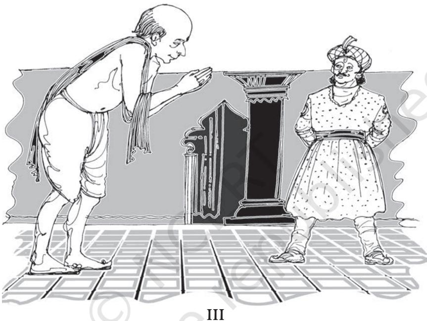
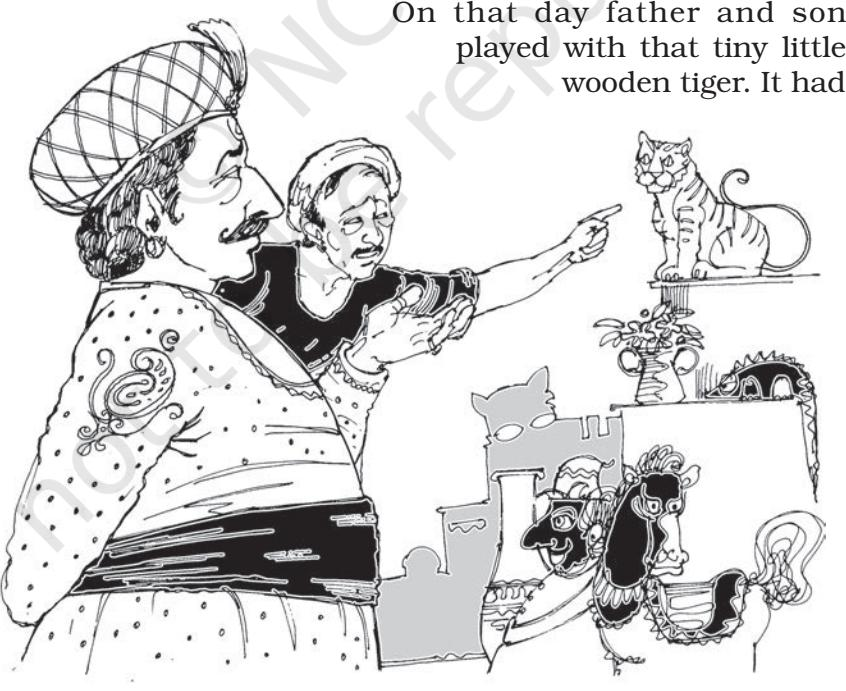

# 2 The Tiger King

## Kalki

I

#### **Before you read**

8 Vistas

What is the general attitude of human beings towards wild animals?

THE Maharaja of Pratibandapuram is the hero of this story. He may be identified as His Highness Jamedar -General, Khiledar-Major, Sata Vyaghra Samhari, Maharajadhiraja Visva Bhuvana Samrat, Sir Jilani Jung Jung Bahadur, M.A.D., A.C.T.C., or C.R.C.K. But this name is often shortened to the Tiger King.

I have come forward to tell you why he came to be known as Tiger King. I

have no intention of pretending to advance only to end in a strategic withdrawal. Even the threat of a Stuka bomber will not throw me off track. The Stuka, if it likes, can beat a hasty retreat from my story.

Right at the start, it is imperative to disclose a matter of vital importance about the Tiger King. Everyone who reads of him will experience the natural desire to meet a man of his indomitable courage face-to-face. But there is no chance of its fulfilment. As Bharata said to Rama about Dasaratha, the Tiger King has reached that final abode of all living creatures. In other words, the Tiger King is dead.

The manner of his death is a matter of extraordinary interest. It can be revealed only at the end of the tale. The most fantastic aspect of his demise was that as soon as he was born, astrologers had foretold that one day the Tiger King would actually have to die.

"The child will grow up to become the warrior of warriors, hero of heroes, champion of champions. But..." they bit their lips and swallowed hard. When compelled to continue, the astrologers came out with it. "This is a secret which should not be revealed at all. And yet we are forced to speak out. The child born under this star will one day have to meet its death."

At that very moment a great miracle took place. An astonishing phrase emerged from the lips of the ten-dayold Jilani Jung Jung Bahadur, "O wise prophets!''

Everyone stood transfixed in stupefaction. They looked wildly at each other and blinked.

''O wise prophets! It was I who spoke.''

This time there were no grounds for doubt. It was the infant born just ten days ago who had enunciated the words so clearly.

The chief astrologer took off his spectacles and gazed intently at the baby.

''All those who are born will one day have to die. We don't need your predictions to know that. There would be some sense in it if you could tell us the manner of that death,'' the royal infant uttered these words in his little squeaky voice.

The chief astrologer placed his finger on his nose in wonder. A baby barely ten days old opens its lips in speech! Not only that, it also raises intelligent questions! Incredible! Rather like the bulletins issued by the war office, than facts.

The chief astrologer took his finger off his nose and fixed his eyes upon the little prince.

''The prince was born in the hour of the Bull. The Bull and the Tiger are enemies, therefore, death comes from the Tiger,'' he explained.

You may think that crown prince Jung Jung Bahadur was thrown into a quake when he heard the word 'Tiger'. That was exactly what did not happen. As soon as he heard it pronounced, the crown prince gave a deep growl. Terrifying words emerged from his lips.

''Let tigers beware!''

This account is only a rumour rife in Pratibandapuram. But with hindsight we may conclude it was based on some truth.

II

Crown prince Jung Jung Bahadur grew taller and stronger day by day. No other miracle marked his childhood days apart from the event already described. The boy drank the milk of an English cow, was brought up by an English nanny, tutored in English by an Englishman, saw nothing but English films — exactly as the crown princes of all the other Indian states did. When he

came of age at twenty, the State, which had been with the Court of Wards until then, came into his hands.

But everyone in the kingdom remembered the astrologer's prediction. Many continued to discuss the matter. Slowly it came to the Maharaja's ears.

There were innumerable forests in the Pratibandapuram State. They had tigers in them. The Maharaja knew the old saying, 'You may kill even a cow in self-defence'. There could certainly be no objection to killing tigers in self-defence. The Maharaja started out on a tiger hunt.

The Maharaja was thrilled beyond measure when he killed his first tiger. He sent for the State astrologer and showed him the dead beast.

''What do you say now?'' he demanded.

''Your majesty may kill ninety-nine tigers in exactly the same manner. But...'' the astrologer drawled.

''But what? Speak without fear.''

"But you must be very careful with the hundredth tiger.''

10 Vistas

''What if the hundredth tiger were also killed?''

''Then I will tear up all my books on astrology, set fire to them, and…''

''And…''

''I shall cut off my tuft, crop my hair short and become an insurance agent,'' the astrologer finished on an incoherent note.

From that day onwards it was celebration time for all the tigers inhabiting Pratibandapuram.

The State banned tiger hunting by anyone except the Maharaja. A proclamation was issued to the effect that if anyone dared to fling so much as a stone at a tiger, all his wealth and property would be confiscated.

The Maharaja vowed he would attend to all other matters only after killing the hundred tigers. Initially the king seemed well set to realise his ambition.

Not that he faced no dangers. There were times when the bullet missed its mark, the tiger leapt upon him and he fought the beast with his bare hands. Each time it was the Maharaja who won.

At another time he was in danger of losing his throne. A high-ranking British officer visited Pratibandapuram. He was very fond of hunting tigers. And fonder of being photographed with the tigers he had shot. As usual, he wished to hunt tigers in Pratibandapuram. But the Maharaja was firm in his resolve. He refused permission. ''I can organise any other hunt. You may go on a boar hunt. You may conduct a mouse hunt. We are ready for a mosquito hunt. But tiger hunt! That's impossible!''

The British officer's secretary sent word to the Maharaja through the dewan that the durai himself did not have to kill the tiger. The Maharaja could do the actual killing. What was important to the durai was a photograph of himself holding the gun and standing over the tiger's carcass. But the Maharaja would not agree even to this proposal. If he relented now, what would he do if other British officers turned up for tiger hunts?

Because he prevented a British officer from fulfilling his desire, the Maharaja stood in danger of losing his kingdom itself.

The Maharaja and the dewan held deliberations over this issue. As a result, a telegram was despatched forthwith to a famous British company of jewellers in Calcutta. 'Send samples of expensive diamond rings of different designs.'

Some fifty rings arrived. The Maharaja sent the whole lot to the British officer's good lady. The king and the minister expected the duraisani to choose one or two rings and send the rest back. Within no time at all the duraisani sent her reply: 'Thank you very much for your gifts.'

In two days a bill for three lakh of rupees came from the British jewellers. The Maharaja was happy that though he had lost three lakh of rupees, he had managed to retain his kingdom.

### IV

The Maharaja's tiger hunts continued to be highly successful. Within ten years he was able to kill seventy tigers. And then, an unforeseen hurdle brought his mission to a standstill. The tiger population became extinct in the

12 Vistas

forests of Pratibandapuram. Who knows whether the tigers practised birth control or committed harakiri? Or simply ran away from the State because they desired to be shot by British hands alone?

One day the Maharaja sent for the dewan. ''Dewan saheb, aren't you aware of the fact that thirty tigers still remain to be shot down by this gun of mine?'' he asked brandishing his gun.

Shuddering at the sight of the gun, the dewan cried out, ''Your Majesty! I am not a tiger!''

> ''Which idiot would call you a tiger?'' "No, and I'm not a gun!''

"You are neither tiger nor gun. Dewan saheb, I summoned you here for

a different purpose. I have decided to get married.''

The dewan began to babble even more. ''Your Majesty, I have two wives already. If I marry you ...''

''Don't talk nonsense! Why should I marry you? What I want is a tiger...''

''Your Majesty! Please think it over. Your ancestors were married to the sword. If you like, marry the gun. A Tiger King is more than enough for this state. It doesn't need a Tiger Queen as well!''

The Maharaja gave a loud crack of laughter. ''I'm not thinking of marrying either a tiger or a gun, but a girl from the ranks of human beings. First you may draw up statistics of tiger populations in the different native states. Next you may investigate if there is a girl I can marry in the royal family of a state with a large tiger population.''

The dewan followed his orders. He found the right girl from a state which possessed a large number of tigers.

Maharaja Jung Jung Bahadur killed five or six tigers each time he visited his father -in-law. In this manner, ninety-nine tiger skins adorned the walls of the reception hall in the Pratibandapuram palace.

The Maharaja's anxiety reached a fever pitch when there remained just one tiger to achieve his tally of a hundred. He had this one thought during the day and the same dream at night. By this time the tiger farms had run dry even in his father-in-Iaw's kingdom. It became impossible to locate tigers anywhere. Yet only one more was needed. If he could kill just that one single beast, the Maharaja would have no fears left. He could give up tiger hunting altogether.

But he had to be extremely careful with that last tiger. What had the late

chief astrologer said? "Even after killing ninety-nine tigers the Maharaja should beware of the hundredth...'' True enough. The tiger was a savage beast after all. One had to be wary of it. But where was that hundredth tiger to be found? It seemed easier to find tiger's milk than a live tiger.

Thus the Maharaja was sunk in gloom. But soon came the happy news which dispelled that gloom. In his own state sheep began to disappear frequently from a hillside village.

It was first ascertained that this was not the work of Khader Mian Saheb or Virasami Naicker, both famed for their ability to swallow sheep whole. Surely, a tiger was at work. The villagers ran to inform the Maharaja. The Maharaja announced a three-year exemption from all taxes for that village and set out on the hunt at once.

The tiger was not easily found. It seemed as if it had wantonly hid itself in order to flout the Maharaja's will.

The Maharaja was equally determined. He refused to leave the forest until the tiger was found. As the days passed, the Maharaja's fury and obstinacy mounted alarmingly. Many officers lost their jobs.

One day when his rage was at its height, the Maharaja called the dewan and ordered him to double the land tax forthwith.

''The people will become discontented. Then our state too will fall a prey to the Indian National Congress.''

''In that case you may resign from your post,'' said the king.

The dewan went home convinced that if the Maharaja did not find the tiger soon, the results could be catastrophic. He felt life returning to him only when he saw the tiger which had been brought from the People's Park in Madras and kept hidden in his house.

At midnight when the town slept in peace, the dewan and his aged wife dragged the tiger to the car and shoved it into the seat. The dewan himself drove the car straight to the forest where the Maharaja was hunting. When they reached the forest the tiger launched its satyagraha and refused to get out of the car. The dewan was thoroughly exhausted in his efforts to haul the beast out of the car and push it down to the ground.

On the following day, the same old tiger wandered into the Maharaja's presence and stood as if in humble supplication, "Master, what do you command of me?'' It was with boundless joy that the Maharaja took careful aim at the beast. The tiger fell in a crumpled heap.

''I have killed the hundredth tiger. My vow has been fulfilled,'' the Maharaja was overcome with elation.

Ordering the tiger to be brought to the capital in grand procession, the Maharaja hastened away in his car.

After the Maharaja left, the hunters went to take a closer look at the tiger. The tiger looked back at them rolling its eyes in bafflement. The men realised that the tiger was not dead; the bullet had missed it. It had fainted from the shock of the bullet whizzing past. The hunters wondered what they should do. They decided that the Maharaja must not come to know that he

had missed his target. If he did, they could lose their jobs. One of the hunters took aim from a distance of one foot and shot the tiger. This time he killed it without missing his mark.

Then, as commanded by the king, the dead tiger was taken in procession through the town and buried. A tomb was erected over it.

A few days later the Maharaja's son's third birthday was celebrated. Until then the Maharaja had given his entire mind over to tiger hunting. He had had no time to spare for the crown prince. But now the king turned his attention to the child. He wished to give him some special gift on his birthday. He went to the shopping centre in Pratibandapuram and searched every shop, but couldn't find anything suitable. Finally he spotted a wooden tiger in a toyshop and decided it was the perfect gift.

The wooden tiger cost only two annas and a quarter. But the shopkeeper knew that if he quoted such a low price to the Maharaja, he would be punished under the rules of the Emergency. So, he said, ''Your Majesty, this is an extremely rare example of craftsmanship. A bargain at three hundred rupees!''

''Very good. Let this be your offering to the crown prince on his birthday,'' said the king and took it away with him.

16 Vistas

been carved by an unskilled carpenter. Its surface was rough; tiny slivers of wood stood up like quills all over it. One of those slivers pierced the Maharaja's right hand. He pulled it out with his left hand and continued to play with the prince.

The next day, infection flared in the Maharaja's right hand. In four days, it developed into a suppurating sore which spread all over the arm.

Three famous surgeons were brought in from Madras. After holding a consultation they decided to operate. The operation took place.

The three surgeons who performed it came out of the theatre and announced, "The operation was successful. The Maharaja is dead."

In this manner the hundredth tiger took its final revenge upon the Tiger King.

## Reading with Insight

- 1. The story is a satire on the conceit of those in power. How does the author employ the literary device of dramatic irony in the story?
- 2. What is the author's indirect comment on subjecting innocent animals to the willfulness of human beings?
- 3. How would you describe the behaviour of the Maharaja's minions towards him? Do you find them truly sincere towards him or are they driven by fear when they obey him? Do we find a similarity in today's political order?
- 4. Can you relate instances of game-hunting among the rich and the powerful in the present times that illustrate the callousness of human beings towards wildlife?
- 5. We need a new system for the age of ecology a system which is embedded in the care of all people and also in the care of the Earth and all life upon it. Discuss.

