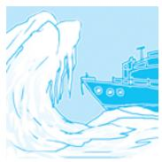
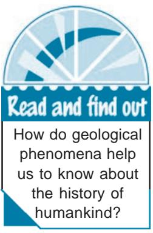
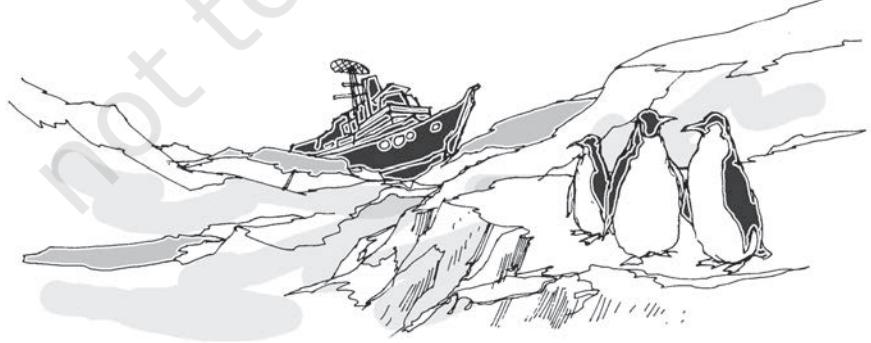
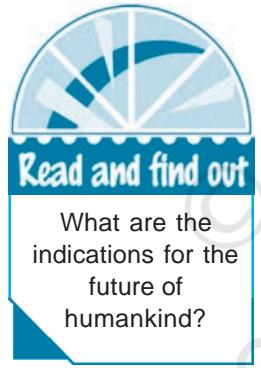
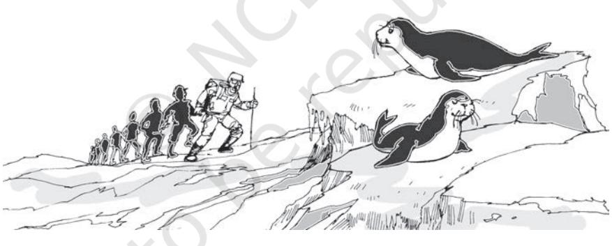

3

# Journey to the end of the Earth

## Tishani Doshi Tishani DoshiTishani Doshi

#### **Before you read**

If you want to know more about the planet's past, present and future, the Antarctica is the place to go to. Bon Voyage!

EARLY this year, I found myself aboard a Russian research vessel — the Akademik Shokalskiy — heading towards the coldest, driest, windiest continent in the world: Antarctica. My journey began 13.09 degrees north of the Equator in Madras, and involved crossing nine time zones, six checkpoints, three bodies of water, and at least as many ecospheres.

By the time I actually set foot on the Antarctic continent I had been travelling over 100 hours in combination of a car, an aeroplane and a ship; so, my first emotion on facing Antarctica's expansive white landscape and uninterrupted blue horizon was relief, followed up with an immediate and profound wonder. Wonder at its immensity, its isolation, but mainly at how there could ever have been a time when India and Antarctica were part of the same landmass.

## Part of history

18 Vistas

Six hundred and fifty million years ago, a giant amalgamated southern supercontinent — Gondwana — did indeed exist, centred roughly around the present-day Antarctica. Things were quite different then: humans hadn't arrived on the global scene, and the climate was much warmer, hosting a huge variety of flora and fauna. For 500 million years Gondwana thrived, but around the time when the dinosaurs were wiped out and the age of the mammals got under way, the landmass was forced to separate into countries, shaping the globe much as we know it today.

To visit Antarctica now is to be a part of that history; to get a grasp of where we've come from and where we could possibly be heading. It's to understand the significance of Cordilleran folds and pre-Cambrian granite shields; ozone and carbon; evolution and extinction. When you think about all that can happen in a million years, it can get pretty mind-boggling. Imagine: India pushing northwards, jamming against Asia to buckle its crust

and form the Himalayas; South America drifting off to join North America, opening up the Drake Passage to create a cold circumpolar current, keeping Antarctica frigid, desolate, and at the bottom of the world.

For a sun-worshipping South Indian like myself, two weeks in a place where 90 per cent of the Earth's total ice volumes are stored is a chilling prospect (not just for circulatory and metabolic functions, but also for the imagination). It's like walking into a giant ping-pong ball

Journey to the end of the Earth 19

devoid of any human markers — no trees, billboards, buildings. You lose all earthly sense of perspective and time here. The visual scale ranges from the microscopic to the mighty: midges and mites to blue whales and icebergs as big as countries (the largest recorded was the size of Belgium). Days go on and on and on in surreal 24-hour austral summer light, and a ubiquitous silence, interrupted only by the occasional avalanche or calving ice sheet, consecrates the place. It's an immersion that will force you to place yourself in the context of the earth's geological history. And for humans, the prognosis isn't good.

### Human impact

Human civilisations have been around for a paltry 12,000 years — barely a few seconds on the geological clock. In that short amount of time, we've managed to create quite a ruckus, etching our dominance over Nature with our villages, towns, cities, megacities. The rapid increase

of human populations has left us battling with other species for limited resources, and the unmitigated burning of fossil fuels has now created a blanket of carbon dioxide around the world, which is slowly but surely increasing the average global temperature.

Climate change is one of the most hotly contested environmental debates of our time. Will the West Antarctic ice sheet melt entirely? Will the Gulf Stream

ocean current be disrupted? Will it be the end of the world as we know it? Maybe. Maybe not. Either way, Antarctica is a crucial element in this debate — not just because it's the only place in the world, which has never sustained a human population and therefore remains relatively 'pristine' in this respect; but more importantly, because it holds in its ice-cores half-million-year-old carbon records trapped in its layers of ice. If we want to study and examine the Earth's past, present and future, Antarctica is the place to go.

20 Vistas

Students on Ice, the programme I was working with on the Shokalskiy, aims to do exactly this by taking high school students to the ends of the world and providing them with inspiring educational opportunities which will help them foster a new understanding and respect for our planet. It's been in operation for six years now, headed by Canadian Geoff Green, who got tired of carting celebrities and retired, rich, curiosity-seekers who could only 'give' back in a limited way. With Students on Ice, he offers the future generation of policy-makers a life-changing experience at an age when they're ready to absorb, learn, and most importantly, act.

The reason the programme has been so successful is because it's impossible to go anywhere near the South Pole and not be affected by it. It's easy to be blasé about polar ice-caps melting while sitting in the comfort zone of our respective latitude and longitude, but when you can visibly see glaciers retreating and ice shelves collapsing, you begin to realise that the threat of global warming is very real.

Antarctica, because of her simple ecosystem and lack of biodiversity, is the perfect place to study how little changes in the environment can have big repercussions. Take the microscopic phytoplankton — those grasses of the sea that nourish and sustain the entire Southern Ocean's food chain. These single-celled plants use the sun's energy to assimilate carbon and synthesise organic compounds in that wondrous and most important of

Journey to the end of the Earth 21

processes called photosynthesis. Scientists warn that a further depletion in the ozone layer will affect the activities of phytoplankton, which in turn will affect the lives of all the marine animals and birds of the region, and the global carbon cycle. In the parable of the phytoplankton, there is a great metaphor for existence: take care of the small things and the big things will fall into place.

#### Walk on the ocean

My Antarctic experience was full of such epiphanies, but the best occurred just short of the Antarctic Circle at 65.55 degrees south. The Shokalskiy had managed to wedge herself into a thick white stretch of ice between the peninsula and Tadpole Island which was preventing us from going any further. The Captain decided we were going to turn around and head back north, but before we did, we were all instructed to climb down the gangplank and walk on the ocean. So there we were, all 52 of us, kitted out in Gore-Tex and glares, walking on a stark whiteness that seemed to spread out forever. Underneath our feet was a metre-thick ice pack, and underneath that, 180 metres of living, breathing, salt water. In the periphery Crabeater seals were stretching and sunning themselves on ice floes much like stray dogs will do under the shade of a banyan tree. It was nothing short of a revelation: everything does indeed connect.

Nine time zones, six checkpoints, three bodies of water and many ecospheres later, I was still wondering about the beauty of balance in play on our planet. How would it be if Antarctica were to become the warm place that it once used to be? Will we be around to see it, or would we have gone the way of the dinosaurs, mammoths and woolly rhinos? Who's to say? But after spending two weeks with a bunch of teenagers who still have the idealism to save the world, all I can say is that a lot can happen in a million years, but what a difference a day makes!

22 Vistas

# Reading with Insight

- 1. 'The world's geological history is trapped in Antarctica.' How is the study of this region useful to us?
- 2. What are Geoff Green's reasons for including high school students in the Students on Ice expedition?
- 3. 'Take care of the small things and the big things will take care of themselves.' What is the relevance of this statement in the context of the Antarctic environment?
- 4. Why is Antarctica the place to go to, to understand the earth's present, past and future?

For more information on Students on Ice visit www.studentsonice.com

Journey to the end of the Earth 23

