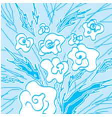
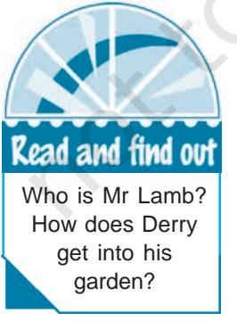
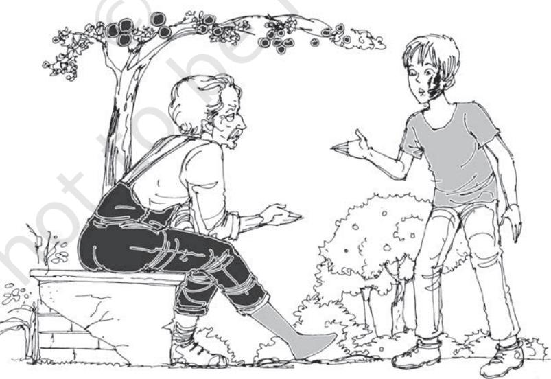
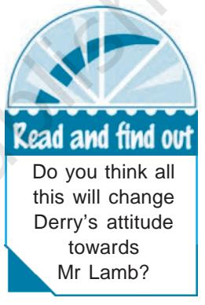
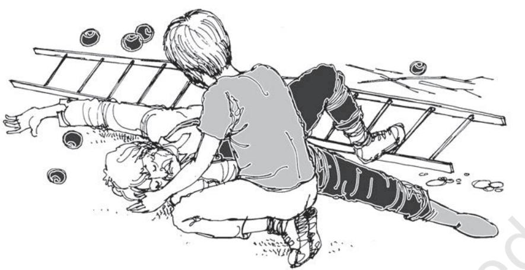

# On The Face Of It

5

### Susan Hill Susan HillSusan Hill

#### **Before you read**

This is a play featuring an old man and a small boy meeting in the former's garden. The old man strikes up a friendship with the boy who is very withdrawn and defiant. What is the bond that unites the two?

#### SCENE ONE

Mr Lamb's garden [There is the occasional sound of birdsong and of tree leaves rustling. Derry's footsteps are heard as he walks slowly and tentatively through the long grass. He pauses, then walks on again. He comes round a screen of bushes, so that when Mr Lamb speaks to him he is close at hand and Derry is startled]

48 Vistas

| MR LAMB: | Mind the apples! |
| --- | --- |
| DERRY: | What? Who's that? Who's |
|  | there? |
| MR LAMB: | Lamb's my name. Mind the |
|  | apples. Crab apples those are. |
|  | Windfalls in the long grass. |
|  | You could trip. |
| DERRY: | I there I thought this was |
|  | an empty place. I didn't know |
|  | there was anybody here |

- MR LAMB: That's all right. I'm here. What are you afraid of, boy? That's all right.
DERRY: I thought it was empty....an empty house.

- MR LAMB: So it is. Since I'm out here in the garden. It is empty. Until I go back inside. In the meantime, I'm out here and likely to stop. A day like this. Beautiful day. Not a day to be indoors.
DERRY: [Panic] I've got to go.

- MR LAMB: Not on my account. I don't mind who comes into the garden. The gate's always open. Only you climbed the garden wall.
- DERRY: [Angry] You were watching me.
- MR LAMB: I saw you. But the gate's open. All welcome. You're welcome. I sit here. I like sitting.
- DERRY: I'd not come to steal anything.
- MR LAMB: No, no. The young lads steal....scrump the apples. You're not so young.
- DERRY: I just....wanted to come in. Into the garden.
- MR LAMB: So you did. Here we are, then.

DERRY: You don't know who I am.

- MR LAMB: A boy. Thirteen or so.
- DERRY: Fourteen. [Pause] But I've got to go now. Good-bye.
- MR LAMB: Nothing to be afraid of. Just a garden. Just me.
- DERRY: But I'm not....I'm not afraid. [Pause] People are afraid of me.
- MR LAMB: Why should that be?
- DERRY: Everyone is. It doesn't matter who they are, or what they say, or how they look. How they pretend. I know. I can see.

MR LAMB: See what?

DERRY: What they think.

MR LAMB: What do they think, then?

- DERRY: You think.... 'Here's a boy.' You look at me...and then you see my face and you think. 'That's bad. That's a terrible thing. That's the ugliest thing I ever saw.' You think, 'Poor boy.' But I'm not. Not poor. Underneath, you are afraid. Anybody would be. I am. When I look in the mirror, and see it, I'm afraid of me.
On the Face of It 49

MR LAMB: No, Not the whole of you. Not of you.

- DERRY: Yes!
[Pause]

- MR LAMB: Later on, when it's a bit cooler, I'll get the ladder and a stick, and pull down those crab apples. They're ripe for it. I make jelly. It's a good time of year, September. Look at them....orange and golden. That's magic fruit. I often say. But it's best picked and made into jelly. You could give me a hand.
- DERRY: What have you changed the subject for? People always do that. Why don't you ask me? Why do you do what they all do and pretend it isn't true and isn't there? In case I see you looking and mind and get upset? I'll tell....you don't ask me because you're afraid to.
- MR LAMB: You want me to ask....say so, then.
- DERRY: I don't like being with people. Any people.
- MR LAMB: I should say....to look at it.... I should say, you got burned in a fire.
- DERRY: Not in a fire. I got acid all down that side of my face and it burned it all away. It ate my face up. It ate me up. And now it's like this and it won't ever be any different.

MR LAMB: No.

DERRY: Aren't you interested?

- MR LAMB: You're a boy who came into the garden. Plenty do. I'm interested in anybody. Anything. There's nothing God made that doesn't interest me. Look over there....over beside the far wall. What can you see?
- DERRY: Rubbish.
- MR LAMB: Rubbish ? Look, boy, look....what do you see?
- DERRY: Just....grass and stuff. Weeds.
- MR LAMB: Some call them weeds. If you like, then....a weed garden, that. There's fruit and there are flowers, and trees and herbs. All sorts. But over there....weeds. I grow weeds there. Why is one green, growing plant called a weed and another 'flower'? Where's the difference. It's all life.... growing. Same as you and me.
- DERRY: We're not the same.
- MR LAMB: I'm old. You're young. You've got a burned face, I've got a tin leg. Not important. You're standing there.... I'm sitting here. Where's the difference?
- DERRY: Why have you got a tin leg?
- MR LAMB: Real one got blown off, years back. Lamey-Lamb, some kids say. Haven't you heard them? You will. Lamey-Lamb. It fits. Doesn't trouble me.
- DERRY: But you can put on trousers and cover it up and no one sees, they don't have to notice and stare.
- MR LAMB: Some do. Some don't. They get tired of it, in the end. There's plenty of other things to stare at.
- DERRY: Like my face.
- MR LAMB: Like crab apples or the weeds or a spider climbing up a silken ladder, or my tall sun-flowers.
- DERRY: Things.
- MR LAMB: It's all relative. Beauty and the beast.
- DERRY: What's that supposed to mean?
- MR LAMB: You tell me.
- DERRY: You needn't think they haven't all told me that fairy story before. 'It's not what you look like, it's what you are inside. Handsome is as handsome

does. Beauty loved the monstrous beast for himself and when she kissed him he changed into a handsome prince.' Only he wouldn't, he'd have stayed a monstrous beast. I won't change.

- MR LAMB: In that way? No, you won't.
- DERRY: And no one'll kiss me, ever. Only my mother, and she kisses me on the other side of my face, and I don't like my mother to kiss me, she does it because she has to. Why should I like that? I don't care if nobody ever kisses me.
- MR LAMB: Ah, but do you care if you never kiss them.
- DERRY: What?
- MR LAMB: Girls. Pretty girls. Long hair and large eyes. People you love.

DERRY: Who'd let me? Not one.

- MR LAMB: Who can tell?
- DERRY: I won't ever look different. When I'm as old as you, I'll look the same. I'll still only have half a face.
- MR LAMB: So you will. But the world won't. The world's got a whole face, and the world's there to be looked at.

DERRY: Do you think this is the world? This old garden?

- MR LAMB: When I'm here. Not the only one. But the world, as much as anywhere.
DERRY: Does your leg hurt you?

MR LAMB: Tin doesn't hurt, boy!

DERRY: When it came off, did it?

- MR LAMB: Certainly.
DERRY: And now? I mean, where the tin stops, at the top?

MR LAMB: Now and then. In wet weather. It doesn't signify.

- DERRY: Oh, that's something else they all say. 'Look at all those people who are in pain and brave and never cry and never complain and don't feel sorry for themselves.'
MR LAMB: I haven't said it.

- DERRY: And think of all those people worse off than you. Think, you might have been blinded, or born deaf, or have to live in a wheelchair, or be daft in your head and dribble.
MR LAMB: And that's all true, and you know it.

- DERRY: It won't make my face change. Do you know, one day, a woman went by me in the street — I was at a bus-stop — and she was with another woman, and she looked at me, and she said.... whispered....only I heard her.... she said, "Look at that, that's a terrible thing. That's a face only a mother could love."
- MR LAMB: So you believe everything you hear, then?
- DERRY: It was cruel.
- MR LAMB: Maybe not meant as such. Just something said between them.
- DERRY: Only I heard it. I heard.
- MR LAMB: And is that the only thing you ever heard anyone say, in your life?
- DERRY: Oh no! I've heard a lot of things.
- MR LAMB: So now you keep your ears shut.
- DERRY: You're....peculiar. You say peculiar things. You ask questions I don't understand.
- MR LAMB: I like to talk. Have company. You don't have to answer questions. You don't have to stop here at all. The gate's open.
- DERRY: Yes, but...
- MR LAMB: I've a hive of bees behind those trees over there. Some hear bees and they say, bees buzz. But when you listen to bees for a long while, they humm....and hum means 'sing'. I hear them singing, my bees.
- DERRY: But....I like it here. I came in because I liked it....when I looked over the wall.
- MR LAMB: If you'd seen me, you'd not have come in.
- DERRY: No.

MR LAMB: No.

- DERRY: It'd have been trespassing.
- MR LAMB: Ah. That's not why.
- DERRY: I don't like being near people. When they stare....when I see them being afraid of me.
- MR LAMB: You could lock yourself up in a room and never leave it. There was a man who did that. He was

afraid, you see. Of everything. Everything in this world. A bus might run him over, or a man might breathe deadly germs onto him, or a donkey might kick him to death, or lightning might strike him down, or he might love a girl and the girl would leave him, and he might slip on a banana skin and fall and people who saw him would laugh their heads off. So he went into this room, and locked the door, and got into his bed, and stayed there.

- DERRY: For ever?
- MR LAMB: For a while.
- DERRY: Then what?
- MR LAMB: A picture fell off the wall on to his head and killed him. [Derry laughs a lot]
- MR LAMB: You see?
- DERRY: But....you still say peculiar things.
- MR LAMB: Peculiar to some.
- DERRY: What do you do all day?
- MR LAMB: Sit in the sun. Read books. Ah, you thought it was an empty house, but inside, it's full. Books and other things. Full.
- DERRY: But there aren't any curtains at the windows.

- MR LAMB: I'm not fond of curtains. Shutting things out, shutting things in. I like the light and the darkness, and the windows open, to hear the wind.
- DERRY: Yes. I like that. When it's raining, I like to hear it on the roof.
- MR LAMB: So you're not lost, are you? Not altogether? You do hear things. You listen.
- DERRY: They talk about me. Downstairs, When I'm not there. 'What'll he ever do? What's going to happen to him when we've gone? How ever will he get on in this world? Looking like that? With that on his face?' That's what they say.

54 Vistas

- MR LAMB: Lord, boy, you've got two arms, two legs and eyes and ears, you've got a tongue and a brain. You'll get on the way you want, like all the rest. And if you chose, and set your mind to it, you could get on better than all the rest.
DERRY: How?

- MR LAMB: Same way as I do.
DERRY: Do you have any friends?

- MR LAMB: Hundreds.
- DERRY: But you live by yourself in that house. It's a big house, too.
- MR LAMB: Friends everywhere. People come in.... everybody knows me. The gate's always open. They come and sit here. And in front of the fire in winter. Kids come for the apples and pears. And for toffee. I make toffee with honey. Anybody comes. So have you.
- DERRY: But I'm not a friend.
- MR LAMB: Certainly you are. So far as I'm concerned. What have you done to make me think you're not?
- DERRY: You don't know me. You don't know where I come from or even what my name is.
- MR LAMB: Why should that signify? Do I have to write all your particulars down and put them in a filing box, before you can be a friend?
- DERRY: I suppose...not. No.
- MR LAMB: You could tell me your name. If you chose. And not, if you didn't.
- DERRY: Derry. Only it's Derek....but I hate that. Derry. If I'm your friend, you don't have to be mine. I choose that.

MR LAMB: Certainly.

- DERRY: I might never come here again, you might never see me again and then I couldn't still be a friend.
MR LAMB: Why not?

- DERRY: How could I? You pass people in the street and you might even speak to them, but you never see them again. It doesn't mean they're friends.
- MR LAMB: Doesn't mean they're enemies, either, does it?
- DERRY: No they're just....nothing. People. That's all.
- MR LAMB: People are never just nothing. Never.
- DERRY: There are some people I hate.
- MR LAMB: That'd do you more harm than any bottle of acid. Acid only burns your face.
- DERRY: Only....
- MR LAMB: Like a bomb only blew up my leg. There's worse things can happen. You can burn yourself away inside.
- DERRY: After I'd come home, one person said, "He'd have been better off stopping in there. In the hospital. He'd be better off with others like himself." She thinks blind people only ought to be with other blind people and idiot boys with idiot boys.
- MR LAMB: And people with no legs altogether?
- DERRY: That's right.
- MR LAMB: What kind of a world would that be?
- DERRY: At least there'd be nobody to stare at you because you weren't like them.
- MR LAMB: So you think you're just the same as all the other people with burned faces? Just by what you look like? Ah....everything's different. Everything's the same, but everything is different. Itself.
- DERRY: How do you make all that out?
- MR LAMB: Watching. Listening. Thinking.
- DERRY: I'd like a place like this. A garden. I'd like a house with no curtains.

MR LAMB: The gate's always open.

- DERRY: But this isn't mine.
- MR LAMB: Everything's yours if you want it. What's mine is anybody's.
- DERRY: So I could come here again? Even if you were out....I could come here.
- MR LAMB: Certainly. You might find others here, of course. DERRY: Oh....
- MR LAMB: Well, that needn't stop you, you needn't mind.
- DERRY: It'd stop them. They'd mind me. When they saw me here. They look at my face and run.

56 Vistas

- MR LAMB: They might. They might not. You'd have to take the risk. So would they.
- DERRY: No, you would. You might have me and lose all your other friends, because nobody wants to stay near me if they can help it.
- MR LAMB: I've not moved.
- DERRY: No....
- MR LAMB: When I go down the street, the kids shout 'Lamey-Lamb.' But they still come into the garden, into my house; it's a game. They're not afraid of me. Why should they be? Because I'm not afraid of them, that's why not.

DERRY: Did you get your leg blown off in the war?

- MR LAMB: Certainly.
- DERRY: How will you climb on a ladder and get the crab apples down, then?
- MR LAMB: Oh, there's a lot of things I've learned to do, and plenty of time for it. Years. I take it steady.
- DERRY: If you fell and broke your neck, you could lie on the grass and die. If you were on your own.
- MR LAMB: I could.
- DERRY: You said I could help you.

MR LAMB: If you want to.

- DERRY: But my mother'll want to know where I am. It's three miles home, across the fields. I'm fourteen. but they still want to know where I am.
- MR LAMB: People worry.

DERRY: People fuss.

- MR LAMB: Go back and tell them.
- DERRY: It's three miles.
- MR LAMB: It's a fine evening. You've got legs.
- DERRY: Once I got home, they'd never let me come back.
- MR LAMB: Once you got home, you'd never let yourself come back.
- DERRY: You don't know....you don't know what I could do.
- MR LAMB: No. Only you know that.
- DERRY: If I chose....
- MR LAMB: Ah....if you chose. I don't know everything, boy. I can't tell you what to do.

| DERRY: | They tell me. |
| --- | --- |
| MR LAMB: | Do you have to agree? |
| DERRY: | I don't know what I want. I want something no |
|  | one else has got or ever will have. Something just |
|  | mine. Like this garden. I don't know what it is. |
| MR LAMB: | You could find out. |
| DERRY: | How? |
| MR LAMB: | Waiting. Watching. Listening. Sitting here or going |
|  | there. I'll have to see to the bees. |
| DERRY: | Those other people who come here do they talk |
|  | to you? Ask you things? |
| MR LAMB: | Some do, some don't. I ask them. I like to learn. |
| DERRY: | I don't believe in them. I don't think anybody ever |
|  | comes. You're here all by yourself and miserable |
|  | and no one would know if you were alive or dead |
|  | and nobody cares. |
| MR LAMB: | You think what you please. |
| DERRY: | All right then, tell me some of their names. |

MR LAMB: What are names? Tom, Dick or Harry. [Getting up] I'm off down to the bees.

DERRY: I think you're daft....crazy....

MR LAMB: That's a good excuse.

DERRY: What for? You don't talk sense.

MR LAMB: Good excuse not to come back. And you've got a burned-up face, and that's other people's excuse.

DERRY: You're like the others, you like to say things like that. If you don't feel sorry for my face, you're frightened of it, and if you're not frightened, you think I'm ugly as a devil. I am a devil. Don't you? [Shouts]

[Mr Lamb does not reply. He has gone to his bees.] DERRY: [Quietly] No. You don't. I like it here.

[Pause. Derry gets up and shouts.]

I'm going. But I'll come back. You see. You wait. I can run. I haven't got a tin leg. I'll be back.

[Derry runs off. Silence. The sounds of the garden again.]

- MR LAMB: [To himself] There my dears. That's you seen to. Ah....you know. We all know. I'll come back. They never do, though. Not them. Never do come back. [The garden noises fade.]
#### SCENE TWO

Derry's house.

| MOTHER: | You think I don't know about him, you think. I |
| --- | --- |
|  | haven't heard things? |
| DERRY: | You shouldn't believe all you hear. |
| MOTHER: | Been told. Warned. We've not lived here three |
|  | months, but I know what there is to know and |
|  | you're not to go back there. |
| DERRY: | What are you afraid of? What do you think he is? |
|  | An old man with a tin leg and he lives in a huge |
|  | house without curtains and has a garden. And I |
|  | want to be there, and sit and listen to things. |
|  | Listen and look. |
| MOTHER: | Listen to what? |
| DERRY: | Bees singing. Him talking. |
| MOTHER: | And what's he got to say to you? |

- DERRY: Things that matter. Things nobody else has ever said. Things I want to think about.
MOTHER: Then you stay here and do your thinking. You're best off here.

DERRY: I hate it here.

- MOTHER: You can't help the things you say. I forgive you. It's bound to make you feel bad things....and say them. I don't blame you.
- DERRY: It's got nothing to do with my face and what I look like. I don't care about that and it isn't important. It's what I think and feel and what I want to see and find out and hear. And I'm going back there. Only to help him with the crab apples. Only to look at things and listen. But I'm going.

MOTHER: You'll stop here.

- DERRY: Oh no, oh no. Because if I don't go back there, I'll never go anywhere in this world again.
[The door slams. Derry runs, panting.] And I want the world....I want it....I want it.... [The sound of his panting fades.]

#### SCENE THREE

Mr Lamb's garden [Garden sounds: the noise of a branch shifting; apples thumping down; the branch shifting again.]

- MR LAMB: Steady....that's....got it. That's it... [More apples fall]
And again. That's it....and....

[A creak. A crash. The ladder falls back, Mr Lamb with it. A thump. The branch swishes back. Creaks. Then silence. Derry opens the garden gate, still panting.]

DERRY: You see, you see! I came back. You said I wouldn't and they said....but I came back, I wanted....

[He stops dead. Silence.] Mr Lamb, Mr....You've..... [He runs through the grass. Stops. Kneels] Mr Lamb, It's all right....You fell....I'm here, Mr Lamb, It's all right. [Silence]

I came back. Lamey-Lamb. I did.....come back. [Derry begins to weep.]

THE END

## Reading with Insight

- 1. What is it that draws Derry towards Mr Lamb inspite of himself?
- 2. In which section of the play does Mr Lamb display signs of loneliness and disappointment? What are the ways in which Mr Lamb tries to overcome these feelings?
- 3. The actual pain or inconvenience caused by a physical impairment is often much less than the sense of alienation felt by the person with disabilities. What is the kind of behaviour that the person expects from others?
- 4. Will Derry get back to his old seclusion or will Mr Lamb's brief association effect a change in the kind of life he will lead in the future?

How about...

using your imagination to suggest another ending to the above story.

62 Vistas

