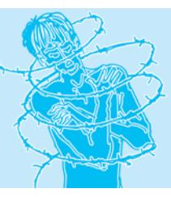
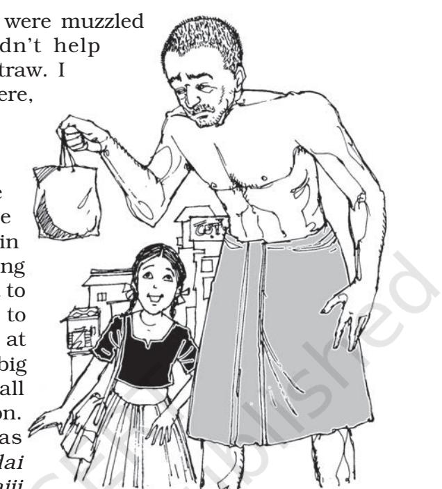

# Memories of Childhood

6

### Zitkala-Sa and Bama

### **Before you read**

This unit presents autobiographical episodes from the lives of two women from marginalised communities who look back on their childhood, and reflect on their relationship with the mainstream culture. The first account is by an American Indian woman born in the late nineteenth century; the second is by a contemporary Tamil Dalit writer.

Gertrude Simmons Bonnin, born in 1876, was an extraordinarily talented and educated Native American woman who struggled and triumphed in a time when severe prejudice prevailed towards Native American culture and women. As a writer, she adopted the pen name 'Zitkala-Sa' and in 1900 began publishing articles criticising the Carlisle Indian school. Her works criticised dogma, and her life as a Native American woman was dedicated against the evils of oppression.

Bama is the pen-name of a Tamil Dalit woman from a Roman Catholic family. She has published three main works: an autobiography, 'Karukku', 1992; a novel, 'Sangati', 1994; and a collection of short stories, 'Kisumbukkaaran', 1996. The following excerpt has been taken from 'Karukku'. 'Karukku' means 'Palmyra' leaves, which with their serrated edges on both sides, are like double-edged swords. By a felicitous pun, the Tamil word 'Karukku', containing the word 'karu', embryo or seed, also means freshness, newness.

#### I. The Cutting of My Long Hair ..........ZITKALA-SA

The first day in the land of apples was a bitter-cold one; for the snow still covered the ground, and the trees were bare. A large bell rang for breakfast, its loud metallic voice crashing through the belfry overhead and into our sensitive ears. The annoying clatter of shoes on bare floors gave us no peace. The constant clash of harsh noises, with an undercurrent of many voices murmuring an unknown tongue, made a bedlam within which I was securely tied. And though my spirit tore itself in struggling for its lost freedom, all was useless.

A paleface woman, with white hair, came up after us. We were placed in a line of girls who were marching into the dining room. These were Indian girls, in stiff shoes and closely clinging dresses. The small girls wore sleeved aprons and shingled hair. As I walked noiselessly in my soft moccasins, I felt like sinking to the floor, for my blanket had been stripped from my shoulders. I looked hard at the Indian girls, who seemed not to care that they were even more immodestly dressed than I, in their tightly fitting clothes. While we marched in, the boys entered at an opposite door. I watched for the three young braves who came in our party. I spied them in the rear ranks, looking as uncomfortable as I felt. A small bell was tapped, and each of the pupils drew a chair from under the table. Supposing this act meant they were to be seated, I pulled out mine and at once slipped into it from one side. But when I turned my head, I saw that I was the only one seated, and all the rest at our table remained standing. Just as I began to rise, looking shyly around to see how chairs were to be used, a second bell was sounded. All were seated at last, and I had to crawl back into my chair again. I heard a man's voice at one end of the hall, and I looked around to see him. But all the others hung their heads over their plates. As I glanced at the long chain of tables, I caught the eyes of a paleface woman upon me. Immediately I dropped my eyes, wondering why I was so keenly watched by the strange woman. The man ceased his mutterings, and then a third bell was tapped. Every

64 Vistas

one picked up his knife and fork and began eating. I began crying instead, for by this time I was afraid to venture anything more.

But this eating by formula was not the hardest trial in that first day. Late in the morning, my friend Judewin gave me a terrible warning. Judewin knew a few words of English; and she had overheard the paleface woman talk about cutting our long, heavy hair. Our mothers had taught us that only unskilled warriors who were captured had their hair shingled by the enemy. Among our people, short hair was worn by mourners, and shingled hair by cowards!

We discussed our fate some moments, and when Judewin said, "We have to submit, because they are strong," I rebelled.

"No, I will not submit! I will struggle first!" I answered.

I watched my chance, and when no one noticed, I disappeared. I crept up the stairs as quietly as I could in my squeaking shoes, — my moccasins had been exchanged for shoes. Along the hall I passed, without knowing whither I was going. Turning aside to an open door, I found a large

> room with three white beds in it. The windows were covered with dark green curtains, which made the room very dim. Thankful that no one was there, I directed my steps toward the corner farthest from the door. On my hands and knees I crawled under the bed, and huddled myself in the dark corner.

From my hiding place I peered out, shuddering with

fear whenever I heard footsteps near by. Though in the hall loud voices were calling my name, and I knew that even Judewin

Memories of Childhood 65

was searching for me, I did not open my mouth to answer. Then the steps were quickened and the voices became excited. The sounds came nearer and nearer. Women and girls entered the room. I held my breath and watched them open closet doors and peep behind large trunks. Some one threw up the curtains, and the room was filled with sudden light. What caused them to stoop and look under the bed I do not know. I remember being dragged out, though I resisted by kicking and scratching wildly. Inspite of myself, I was carried downstairs and tied fast in a chair.

I cried aloud, shaking my head all the while until I felt the cold blades of the scissors against my neck, and heard them gnaw off one of my thick braids. Then I lost my spirit. Since the day I was taken from my mother I had suffered extreme indignities. People had stared at me. I had been tossed about in the air like a wooden puppet. And now my long hair was shingled like a coward's! In my anguish I moaned for my mother, but no one came to comfort me. Not a soul reasoned quietly with me, as my own mother used to do; for now I was only one of many little animals driven by a herder.

#### II. We Too are Human Beings ..........BAMA

When I was studying in the third class, I hadn't yet heard people speak openly of untouchability. But I had already seen, felt, experienced and been humiliated by what it is.

 I was walking home from school one day, an old bag hanging from my shoulder. It was actually possible to walk the distance in ten minutes. But usually it would take me thirty minutes at the very least to reach home. It would take me from half an hour to an hour to dawdle along, watching all the fun and games that were going on, all the entertaining novelties and oddities is the streets, the shops and the bazaar.

The performing monkey; the snake which the snakecharmer kept in its box and displayed from time to time; the cyclist who had not got off his bike for three days, and who kept pedalling as hard as he could from break of

66 Vistas

day; the rupee notes that were pinned on to his shirt to spur him on; the spinning wheels; the Maariyaata temple, the huge bell hanging there; the pongal offerings being cooked in front of the temple; the dried fish stall by the statue of Gandhi; the sweet stall, the stall selling fried snacks, and all the other shops next to each other; the street light always demonstrating how it could change from blue to violet; the narikkuravan huntergypsy with his wild lemur in cages, selling needles, clay beads and instruments for cleaning out the ears — Oh, I could go on and on. Each thing would pull me to a stand-still and not allow me to go any further.

At times, people from various political parties would arrive, put up a stage and harangue us through their mikes. Then there might be a street play, or a puppet show, or a "no magic, no miracle" stunt performance. All these would happen from time to time. But almost certainly there would be some entertainment or other going on.

Even otherwise, there were the coffee clubs in the bazaar: the way each waiter cooled the coffee, lifting a tumbler high up and pouring its contents into a tumbler held in his other hand. Or the way some people sat in front of the shops chopping up onion, their eyes turned elsewhere so that they would not smart. Or the almond tree growing there and its fruit which was occasionally blown down by the wind. All these sights taken together would tether my legs and stop me from going home.

And then, according to the season, there would be mango, cucumber, sugar-cane, sweet-potato, palm-shoots, gram, palm-syrup and palm-fruit, guavas and jack-fruit. Every day I would see people selling sweet and savoury fried snacks, payasam, halva, boiled tamarind seeds and iced lollies.

Gazing at all this, one day, I came to my street, my bag slung over my shoulder. At the opposite corner, though, a threshing floor had been set up, and the landlord watched the proceedings, seated on a piece of sacking spread over a stone ledge. Our people were hard at work, driving cattle in pairs, round and round, to tread out the grain from the straw. The animals were muzzled so that they wouldn't help themselves to the straw. I stood for a while there, watching the fun.

Just then, an elder of our street came along from the direction of the bazaar. The manner in which he was walking along made me want to double up. I wanted to shriek with laughter at the sight of such a big man carrying a small packet in that fashion. I guessed there was something like vadai or green banana bhajji

in the packet, because the wrapping paper was stained with oil. He came along, holding out the packet by its string, without touching it. I stood there thinking to myself, if he holds it like that, won't the package come undone, and the vadais fall out?

The elder went straight up to the landlord, bowed low and extended the packet towards him, cupping the hand that held the string with his other hand. The landlord opened the parcel and began to eat the vadais.

After I had watched all this, at last I went home. My elder brother was there. I told him the story in all its comic detail. I fell about with laughter at the memory of a big man, and an elder at that, making such a game out of carrying the parcel. But Annan was not amused. Annan told me the man wasn't being funny when he carried the package like that. He said everybody believed that they were upper caste and therefore must not touch us. If they did, they would be polluted. That's why he had to carry the package by its string.

68 Vistas

When I heard this, I didn't want to laugh any more, and I felt terribly sad. How could they believe that it was disgusting if one of us held that package in his hands, even though the vadai had been wrapped first in a banana leaf, and then parcelled in paper? I felt so provoked and angry that I wanted to touch those wretched vadais myself straightaway. Why should we have to fetch and carry for these people, I wondered. Such an important elder of ours goes meekly to the shops to fetch snacks and hands them over reverently, bowing and shrinking, to this fellow who just sits there and stuffs them into his mouth. The thought of it infuriated me.

How was it that these fellows thought so much of themselves? Because they had scraped four coins together, did that mean they must lose all human feelings? But we too are human beings. Our people should never run these petty errands for these fellows. We should work in their fields, take home our wages, and leave it at that.

My elder brother, who was studying at a university, had come home for the holidays. He would often go to the library in our neighbouring village in order to borrow books. He was on his way home one day, walking along the banks of the irrigation tank. One of the landlord's men came up behind him. He thought my Annan looked unfamiliar, and so he asked, "Who are you, appa, what's your name?" Annan told him his name. Immediately the other man asked, "Thambi, on which street do you live?" The point of this was that if he knew on which street we lived, he would know our caste too.

Annan told me all these things. And he added, "Because we are born into this community, we are never given any honour or dignity or respect; we are stripped of all that. But if we study and make progress, we can throw away these indignities. So study with care, learn all you can. If you are always ahead in your lessons, people will come to you of their own accord and attach themselves to you. Work hard and learn." The words that Annan spoke to me that day made a very deep impression on me. And I studied hard, with all my breath and being, in a frenzy almost.

Memories of Childhood 69

As Annan had urged, I stood first in my class. And because of that, many people became my friends.

## Reading with Insight

- 1. The two accounts that you read above are based in two distant cultures. What is the commonality of theme found in both of them?
- 2. It may take a long time for oppression to be resisted, but the seeds of rebellion are sowed early in life. Do you agree that injustice in any form cannot escape being noticed even by children?
- 3. Bama's experience is that of a victim of the caste system. What kind of discrimination does Zitkala-Sa's experience depict? What are their responses to their respective situations?

|  |
| --- |
|  |
|  |
|  |
|  |
|  |
|  |
|  |
|  |
|  |
|  |
|  |
|  |
|  |
|  |
|  |
|  |
|  |
|  |
|  |

|  |
| --- |
|  |
|  |
|  |
|  |
|  |
|  |
|  |
|  |
|  |
|  |
|  |
|  |
|  |
|  |
|  |
|  |
|  |
|  |

