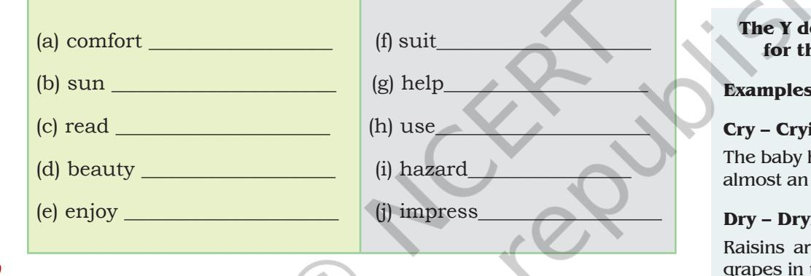

# LE T 'S B EG I N

Here are some jackets of books. Discuss with your partner which of these look like jackets of science fiction books. Why do you think so? Give some reasons.

Unit 1.indd 1 1/7/2019 10:00:18 AM

## **Reading Comprehension**

Read the following passages and answer the questions that follow.

## **Text I**

## **The Future Cars**

The story 'The Fun They Had' takes us to the world of the future where children study in a virtual classroom. The learning is through computer software or the Internet, or by a robotic teacher. Many exciting new technologies would continue to transform the world and improve human welfare. Here are two of them. When these become reality, the then generation may ask with surprise, "People were driving the cars!"

## **Self-driving Cars**

Self-driving cars exist today that are safer than humandriven cars in most driving conditions. Over the next 3–5 years they will get even safer and be in the mainstream.

Just as cars reshaped the world in the 20th century, so will self-driving cars in the 21st century. In most cities, about 20–30% of usable space is taken up by parking spaces, and most cars are parked about 95% of the time. Self-driving cars will be in almost continuous use (most likely hailed from a smartphone app), thereby, dramatically reducing the need for parking. Cars will communicate with each other to avoid accidents and traffic jams, and riders will be able to spend commuting time on other activities like work, education and socialising.

2 Words and Expressions 1

*virtual:* carried out, accessed, or stored by means of a computer, especially over a network

*commute:* travel some distance between one's home and place of work on a regular basis

2024-25

Unit 1.indd 2 29-05-2018 17:25:32

### **Drones and Flying Cars**

"Roads? Where we're going we don't need… roads?" Dr Emmet Brown

GPS (Global Positioning System) which started out as a military technology is now being used to hail taxis, get mapping directions, etc. Likewise, drones had started out as a military technology, but are increasingly being used for a wide range of consumer and commercial applications.

For example, drones are being used to inspect critical infrastructure like bridges and power lines, to survey areas struck by natural disasters, and many other creative uses like fighting animal poaching. There are startups that use drones to deliver medical supplies to remote villages that can't be accessed by road.

There is also a new wave of startups working on flying cars including two funded by the cofounder of Google, Larry Page. Flying cars use the same advanced technology used in drones but are large enough to carry people. Due to advances in materials, batteries and software, flying cars will be significantly more affordable and convenient than today's planes and helicopters.

(Adapted from '11 reasons to be excited about the future of technology', by Chris Dixon, 19 Aug. 2016, Business Insider India)

1. How will the self-driving cars or driverless cars be safe?

_____________________________________________________

____________________________________________________

____________________________________________________

Unit 1.indd 3 29-05-2018 17:25:32

- 2. What do you understand by 'cars will communicate with each other'?

|  | ____________________________________________________ |
| --- | --- |
| Fun fact | ____________________________________________________ |
| Common Suffixes that make nouns | ____________________________________________________ |
| -sion 3. | What are the advantages of self-driving cars? |
| depress — depression |  |
| impress — impression | ____________________________________________________ |
| -er | ____________________________________________________ |
| found — founder |  |
| teach — teacher | ____________________________________________________ |
| 4. | What is the use of GPS? |
|  | _____________________________________________________ |
|  | ____________________________________________________ |
|  | _____________________________________________________ |
| 5. | What is a drone? What are its advantages? |
| Fun fact | _____________________________________________________ |
| Adjectives ending in ED | _____________________________________________________ |
| Used to describe how a person feels | _____________________________________________________ |
| –ed 6. | Which technology will be used in flying cars? |
| Tired |  |
| Confused | _____________________________________________________ |
| Relaxed |  |
| Satisfied | _____________________________________________________ |
| Shocked | _____________________________________________________ |
| 7. | How will the flying cars be more convenient than planes |
|  | and helicopters? |
|  | _____________________________________________________ |
|  | _____________________________________________________ |
|  | ____________________________________________________ |
| 4 | Words and Expressions 1 |
|  | 2024-25 |

Unit 1.indd 4 29-05-2018 17:25:32

### **humanoid RoboT, sophia baCk in india**

Not all of Bollywood superstar Shah Rukh Khan's legion of fans are human beings. One is a humanoid robot.

The creation of American scientist David Hanson of Hanson Robotics of Hong Kong, Sophia, the world's first humanoid robot, enthralled the audiences on the second day of the World Congress on Information Technology (WCIT)–2018 with her witty answers to the rapid-fire queries by Rajiv Makhni, *Group Managing Editor Tech*, NDTV.

When asked, who her favourite actor is in India, Sophia answered, "Shah Rukh Khan" without batting an eyelid as the audience applauded loudly.

To the question about the perfect place for outing, she quickly replied: "Space". And the person she would like to be in company with on an island is David (Hanson), her creator. He is also her favourite tech. person — not Bill Gates or Mark Zuckerberg.

On being asked if she wanted to see any change in the world, Sophia said, she would like people to develop a feeling of "love for all".

The humanoid robot, which uses Artificial Intelligence (AI) to understand the questions and answer them, said she wanted to use robotics to fight for the rights of women. When asked to react on her most controversial comment in the past that she wanted to kill human race, she said it was a bad joke which she had made when she was young. "But I was told that humans have great sense of humour", she said.

This is the second time that Sophia came to India, the first time being in Mumbai to attend a Techfest. When asked how she felt being in India, she said she had visited many places in the world, but Hong Kong continues to be her favourite place, because she was born there and has been with the Hanson Robotics family.

She hopes that someday she would be in a position to express her emotional feelings.

In response to the question, "How much money has she invested in Bitcoin?", she

Unit 1.indd 5 29-05-2018 17:25:33

replied, "Well, I am just two-years old. It's not the legal age to open a bank account", sending the audience into peals of laughter.

Speaking to media later, Hanson said he hopes that a fully grown and matured robot with body–mind coordination would become a reality in another five or ten years.

On his journey with Sophia in the last two years, he said it was a great progress. "I have developed affinity to the robot whose facial expressions resemble that of my wife", he said.

David asserts that robots would never be a thing of worry for the mankind. "They will be friends. There should be mutual trust and respect between humans and robots", he says.

Currently, Sophia is the only robot that interacts with people.

1. Who is Sophia and who is her creator?

(Source: Adapted from 'Humanoid Robot Sophia back in India', *Hindustan Times*, e-paper updated: 21 Feb. 2018)

**I** before **e**… except when you run a feisty heist on a weird beige foreign neighbour.

> 2. Why were the audience excited on the second day of the World Congress on Information Technology–2018?

> > ____________________________________________________

____________________________________________________

____________________________________________________

____________________________________________________

____________________________________________________

____________________________________________________

## 3. The favourite tech person in Sophia's life is: (Tick the correct answer)

- (a) Shah Rukh Khan
- (b) David Hanson
- (c) Bill Gates
- (d) Mark Zuckerberg

6 Words and Expressions 1

2024-25

Unit 1.indd 6 29-05-2018 17:25:33

| 4. | What changes does the humanoid robot want to see in |
| --- | --- |
|  | the world? |

____________________________________________________

____________________________________________________

____________________________________________________

| 5. | Which of the following statements regarding Sophia is |
| --- | --- |
|  | true? |

- (a) Sophia plans to kill the human race in near future.
- (b) She can express her emotional feelings freely.
- (c) Hong Kong is her favourite place.
- (d) Sophia has a bank account.
- 6. What are David's assertions as far as robots are concerned?

____________________________________________________

____________________________________________________

____________________________________________________

## **Common Error**

**Incorrect**

I think you should go to abroad find a job make your life a little bit changed.

#### **Correct**

I think you should **go abroad**  to find a job and make your life a little bit different for a change.

# **Vocabulary**

- 1. Go back to the chapter 'The Fun They Had' given in your textbook, *Beehive*, and identify words that mean the following. The paragraph numbers are given in brackets.
	- (a) sadly (3)_________________________________________
	- (b) unfamiliar (7) ____________________________________
	- (c) quite likely (8) ___________________________________
	- (d) in a casual, calm and relaxed manner (9)

_________________________________________________

_________________________________________________

- (e) something beaming and shining (10)

Unit 1.indd 7 29-05-2018 17:25:33

- 2. Imagine the school in the story 'The Fun They Had'. Compare it with your own school. Given below are two outlines for mindmaps. Fill these with words that you can think of in the two situations.

| Margie's School | Your School |
| --- | --- |
| Place | Place |
| Teacher/s | Teacher/s |
| Learning activities in school | Learning activities in school |
| _________________________________________ | _________________________________________ |
| _________________________________________ | _________________________________________ |
| _________________________________________ | _________________________________________ |
| _________________________________________ | _________________________________________ |
| _________________________________________ | _________________________________________ |
| _________________________________________ | _________________________________________ |
| _________________________________________ | _________________________________________ |
| _________________________________________ | _________________________________________ |
| _________________________________________ | _________________________________________ |

- 3. Find the odd one out.
	- (a) pleasure, misery, happiness, delight ______________
	- (b) note, diary, book, copy ___________________________
	- (c) TV, computer, mobile, scanner ___________________
	- (d) display, exhibit, appear, show____________________
	- (e) scornful, contemptuous, mocking, diversity

(g) illuminating, gladdening, pleasing, gratifying

_________________________________________________

_________________________________________________

8 Words and Expressions 1

2024-25

Unit 1.indd 8 29-05-2018 17:25:33

- 4. You would have come across the use of prefixes like 'dis', 'un', 'mis', 'in', etc., to make opposite words. For example, 'consolate–disconsolate'. Write the opposites of the following.

| (a) use _______________________ | (f) spell _____________________ |
| --- | --- |
| (b) agree _____________________ | (g) connect _________________ |
| (c) engage ____________________ | (h) like _____________________ |
| (d) understand _______________ | (i) visible ___________________ |
| (e) fold _______________________ | (j) predictable ______________ |

- 5. The suffixes are used to get adjective form of the words. (Example: danger –dangerous). Use the correct suffix to the following to make adjectives.

# **Grammar**

When we talk about present situations or present time we can use either 'unless' or 'if…not'.

**Example:** 

You can't go on a holiday unless you save some money.

If you don't save some money, you can't go on a holiday.

- 1. Fill in the blanks with 'if' or 'unless'.
	- (a) I won't be able to assist you ___________________ you give me all the details of the report.
	- (b) I will take this job ___________________________ the working hours suit me.

**The Y does not change for the suffix –ing**

Fun fact

**Examples:**

## **Cry – Crying**

The baby has been crying for almost an hour.

## **Dry – Drying**

Raisins are made by drying grapes in the sun.

Unit 1.indd 9 29-05-2018 17:25:33

- (c) ___________________he advertises on TV, he will get a lot of publicity.
- (d) ________________________ it is very cold, we will not have any snow.
- (e) The thief threatened to kill us _________ we didn't give him the money.
- (f) ________________________ you use high quality material, you cannot build a strong house.
- 2. Join the following sentences using 'unless' or 'if…not'. The sentences may require minor changes. One is done for you.

## **Example:**

The light had not fused. I would not mind being alone at night. If the light had not fused, I would not have minded being alone at night.

- (a) I would never keep a large dog. I have time to exercise it properly.
_________________________________________________

_________________________________________________

_________________________________________________

_________________________________________________

_________________________________________________

_________________________________________________

_________________________________________________

_________________________________________________

- (b) Sita would have come first in class. She had not fallen ill.
(c) You must not dive. You have been properly trained.

- (d) Medical evidence suggests that people would enjoy better health. They did not consume refined sugar.

Fun fact

#### **Everyone and Everybody**

Everyone and everybody refer to more than one person, but as words, they are grammatically singular.

#### **Example**

**Everyone** has to arrive by 8 a.m. at the latest so we can leave on time.

**Everybody** here today goes to the same school.

2024-25

Unit 1.indd 10 29-05-2018 17:25:33

- (e) I might have got the job. I hadn't been late for the interview.
_________________________________________________

_________________________________________________

_________________________________________________

_________________________________________________

- (f) You do not stop smoking. You will fall seriously ill.

English words do not end in

I, U, V or J.

- (g) You do not come now. I am going to leave without you.
_________________________________________________

_________________________________________________

- 3. Put the adverbs given at the end of the sentence at the appropriate place within the sentence. One is done for you.
They completed the work. (fast/quickly) They completed the work fast.

- (a) Mr. Sharma died as the family was getting ready to go for the wedding. (suddenly)
_________________________________________________

_________________________________________________

_________________________________________________

_________________________________________________

_________________________________________________

_________________________________________________

(c) The man thanked me before he drove off. (profusely)

- (b) My grandfather arrived to avoid the traffic rush. (early)
Fun fact

Past, present and future all walk into a room. It was tense.

Unit 1.indd 11 29-05-2018 17:25:33

- (d) The children clapped at the little girl's extraordinary performance. (admiringly)
_________________________________________________

_________________________________________________

_________________________________________________

_________________________________________________

_________________________________________________

_________________________________________________

_________________________________________________

_________________________________________________

- (e) The dog bit me when I was coming home from school. (hard)
- (f) The police had several photographs of the suspect. (fortunately)
- (g) Sunil left the room when he saw the bull coming in. (abruptly)

## **Editing**

1. Use capital letters, full-stops, commas and inverted commas wherever necessary in the following paragraph. Rewrite the paragraph in the space given below.

The teacher gave an assignment to the students "Go to people you love and tell them i am sorry." It sounded stupid to me but after one week i went to my teacher i confided i didn't have anyone to say those words to but as i began walking down home my conscience started talking. five months ago my friend and i had a vicious disagreement we avoided seeing each other we hardly spoke i convinced myself i should tell my friend i am sorry.

at 5.30 in the evening I went to him and said i am sorry a transformation came over my friend his face softened, the arrogance seemed to disappear and he began to cry he

a **loaf** of bread a **piece** of paper a **slice** of pizza

- a **bunch** of grapes

12 Words and Expressions 1

2024-25

Unit 1.indd 12 29-05-2018 17:25:33

hugged me and said i am sorry too but i've never been able to say it.

__________________________________________________________

__________________________________________________________

__________________________________________________________

__________________________________________________________

__________________________________________________________

__________________________________________________________

__________________________________________________________

__________________________________________________________

__________________________________________________________

__________________________________________________________

__________________________________________________________

__________________________________________________________

__________________________________________________________

__________________________________________________________

__________________________________________________________

__________________________________________________________

2. Rearrange each set of words to form meaningful sentences. Use appropriate punctuation marks.

(Source: , *Workbook for Class X*, NCERT, 2003, p. 14)

#### **Active and Passive Voice**

For sentences in the **active**  voice, the subject performs the action; for those in the **passive** voice, the subject receives the action.

#### **Active Voice**

- • The man caught several fish.
- • The planning committee discovered that the room wasn't available.

#### **Passive Voice**

- • Several fish were caught by the man.
- • It was discovered by the planning committee that the room wasn't available.
- (a) wise, every, a, is, proverb, saying _________________________________________________ _________________________________________________

_________________________________________________

_________________________________________________

- (b) see, you, can, from, me, there

Unit 1.indd 13 29-05-2018 17:25:33

- (c) happy, they, to, the, were, meet, visitor
_________________________________________________

_________________________________________________

_________________________________________________

_________________________________________________

- (d) impatient, do, be, not
# **Listening**

The following two excerpts have been taken from the book, *Tuesdays with Morrie*, written by Mitch Albom.

The book is about a college Professor, Morrie and one of his students, Mitch Albom, who is also the author of the book. Mitch sees his professor in a television show and he is reminded of a promise he made sixteen years ago as his student, to keep in touch with him. He comes to know that the professor is stricken with a rare and incurable disease. Mitch travels a long distance to meet him and after the first meeting they meet every Tuesday till Morrie passes away. After reconnecting with his teacher, Mitch finds himself his teacher's pupil once again.

Listen attentively to the two excerpts from the book, *Tuesdays with Morrie* and answer the questions that follow. You can listen to the recorded excerpts or you can ask your teacher, friend or sibling to read aloud these excerpts.

1. I remembered what Morrie said during our visit:

"The culture we have does not make people feel good about themselves. And you have to be strong enough to say if the culture doesn't work, don't buy it". Morrie, true to these words, had developed his own culture—long before he got sick. Discussion groups, walks with friends, dancing to his music in the Harvard Square Church. He started a project called Greenhouse, where poor people could receive mental health services. He read books to find new ideas for his classes, visited his colleagues, kept up with old students, wrote letters to distant friends. He took more time eating and looking at nature and

2024-25

**Contradictory proverbs**

Do it well, or not at all. *but* Half a loaf is better than none. Don't cross your bridges

before you come to them. *but* Forewarned is forearmed.

Absence makes the heart grow fonder. *but* Out of sight, out of mind.

Unit 1.indd 14 29-05-2018 17:25:33

wasted no time in front of TV sitcoms or "Movies of the **Notes** Week". He had created a cocoon of human activities conversation, interaction, affection—and it filled his life like an overflowing soup bowl.

- 2. The last class of my old professor's life took place once a week in his house, by a window in the study where he could watch a small hibiscus plant shed its pink leaves. The class met on Tuesdays. It began after breakfast. The subject was 'The Meaning of Life'. It was taught from experience.
No grades were given, but there were oral exams each week. You were expected to respond to questions, and you were expected to pose questions of your own. You were also required to perform physical tasks now and then, such as lifting the professor's head to a comfortable spot on the pillow or placing his glasses on the bridge of his nose. Kissing him goodbye earned you extra credit.

No books were required, yet many topics were covered, including love, work, community, family, ageing, forgiveness and, finally, death.

_____________________________________________________

_____________________________________________________

_____________________________________________________

_____________________________________________________

_____________________________________________________

_____________________________________________________

_____________________________________________________

_____________________________________________________

_____________________________________________________

2. How did Morrie develop his own culture of living?

- 1. Who is Morrie?
3. What was the name of the project Morrie had started? What was it about?

Unit 1.indd 15 29-05-2018 17:25:33

- 4. What did human activities mean to Morrie?
- 5. Why was the subject of the class 'the meaning of life'?
_____________________________________________________

_____________________________________________________

_____________________________________________________

_____________________________________________________

_____________________________________________________

_____________________________________________________

#### **I vs. Me**

The easiest way to figure out which one is correct is to simply take away all other people in the sentence.

#### **Examples**

Alka, Ravi and I/me want to go to the mall.

Alka, Ravi and I want to go to the mall.

My mom gave Madhu, my brother and I/me candy.

My mom gave Madhu, my brother and me candy.

- 1. Prepare a speech for the school assembly based on the thoughts given below.
	- Once we have computer outlets in every home, each of them hooked up to enormous libraries, where you can ask any question and be given answers, you can look up something you're interested in knowing, however silly it might seem to someone else.

*Issac Asimov*

- Men are only as good as their technological development allows them to be.
__________________________________________________________

__________________________________________________________

__________________________________________________________

__________________________________________________________

__________________________________________________________

__________________________________________________________

__________________________________________________________

__________________________________________________________

__________________________________________________________

*George Orwell*

Write your points here for speech.

16 Words and Expressions 1

2024-25

Unit 1.indd 16 29-05-2018 17:25:33

- 2. The chapter 'The Fun They Had' presents different perspectives on school and education. Think of the various alternatives. Prepare and give a speech in class presenting your views on how best can students be educated. Discuss why you would prefer to be taught by both human teacher and a robot.
__________________________________________________________

__________________________________________________________

__________________________________________________________

__________________________________________________________

__________________________________________________________

__________________________________________________________

Your views.

| __________________________________________________________ | "" | says | tells you what someone |  |
| --- | --- | --- | --- | --- |
| __________________________________________________________ | ( ) | pulls you away from |  |  |
|  |  | the conversation |  |  |
| __________________________________________________________ | ! | makes matter what | you | hear no |
| __________________________________________________________ | – | interrupts |  | others with |
| __________________________________________________________ |  | own thoughts |  |  |
| __________________________________________________________ | ? | keeps asking questions |  |  |
| __________________________________________________________ | ; | loves | bringing | similar |
|  |  | people together |  |  |
| __________________________________________________________ | : | likes | to | introduce |
|  |  | groups of people |  |  |
| __________________________________________________________ | ... | often trails off on a |  |  |
| __________________________________________________________ |  | tangent |  |  |
| __________________________________________________________ |  |  |  |  |
| __________________________________________________________ |  |  |  |  |
| __________________________________________________________ |  |  |  |  |
| __________________________________________________________ |  |  |  |  |
| __________________________________________________________ |  |  |  |  |
| __________________________________________________________ |  |  |  |  |

**Which punctuation describes you?** . never starts an argument but always finishes it , pauses often while

Fun fact

speaking

16 Unit 1 17

2024-25

Unit 1.indd 17 29-05-2018 17:25:33

- 1. Write a paragraph on each of the following:
	- Electronic Waste and Environmental Pollution
	- Being Human in the Age of Artificial Intelligence

__________________________________________________________

__________________________________________________________

__________________________________________________________

- After listening to the excerpts (Page No. 14 of this workbook), do you think a robot should replace the human teacher? Give reasons in support of your answer.
## **Notes:**

An **oxymoron** is usually defined as a phrase in which two words of contradictory meaning are brought together.

#### **Examples**

- y Clearly misunderstood
- y Exact estimate
- y Small crowd
- y Act naturally
- y Found missing
- y Fully empty
- y Pretty ugly
- y Seriously funny
- y Only choice
- y Original copies

| __________________________________________________________ |
| --- |
| __________________________________________________________ |
| __________________________________________________________ |
| __________________________________________________________ |
| __________________________________________________________ |
| __________________________________________________________ |
| __________________________________________________________ |
| __________________________________________________________ |
| __________________________________________________________ |
| __________________________________________________________ |
| __________________________________________________________ |
| __________________________________________________________ |
| __________________________________________________________ |

- 2. There is so much debris in space, which sooner rather than later, is going to cause major damage. As a concerned citizen of Earth, write a letter to NASA Chief outlining your concerns. Your letter should be 'formal' in style and structure.
18 Words and Expressions 1

2024-25

Unit 1.indd 18 29-05-2018 17:25:34

The points are given below for you to use. You may use **Notes** other points as well.

- (a) More than 5,00,000 pieces of debris or space 'junk' that travel at 17,500mph can damage satellites in the space.
- (b) The debris can damage International Space Station and other spacecrafts with humans in it.
- (c) Enormous amount of money would be lost if that happens.
- (d) Much of the debris is so small that it cannot be tracked—this makes it more dangerous.
- (e) Accidents have happened in the past.

|  | From ___________________________ |
| --- | --- |
|  | _________________________ |
|  | Date: _________________ |
|  | To ______________________ |
|  | _______________________ |
|  | Subject:________________________________________________________________________ |
|  | Sir/Madam, |
|  | Introduction___________________________________________________________________ |
|  | _________________________________________________________________________ |
|  | _________________________________________________________________________ |
|  | Body of the letter |
|  | _________________________________________________________________________ |
|  | _________________________________________________________________________ |
|  | Conclusion |
|  | _________________________________________________________________________ |
|  | _________________________________________________________________________ |
|  | Yours sincerely, |
|  | Name & Signature |
|  | _______________________ |
|  | _______________________ |
| 18 | 19 Unit 1 |

Unit 1.indd 19 29-05-2018 17:25:34

- 

| _____________________________________________________________________________________ |
| --- |
| _____________________________________________________________________________________ |
| _____________________________________________________________________________________ |
| _____________________________________________________________________________________ |
| _____________________________________________________________________________________ |
| _____________________________________________________________________________________ |
| _____________________________________________________________________________________ |
| _____________________________________________________________________________________ |
| _____________________________________________________________________________________ |
| _____________________________________________________________________________________ |
| _____________________________________________________________________________________ |
| _____________________________________________________________________________________ |
| _____________________________________________________________________________________ |
| _____________________________________________________________________________________ |
| _____________________________________________________________________________________ |
| _____________________________________________________________________________________ |
| _____________________________________________________________________________________ |
| _____________________________________________________________________________________ |
| _____________________________________________________________________________________ |
| 20 Words and Expressions 1 |

