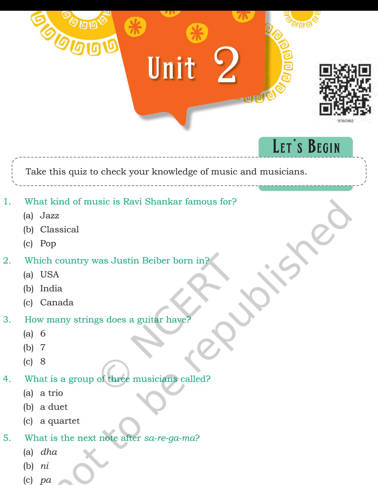
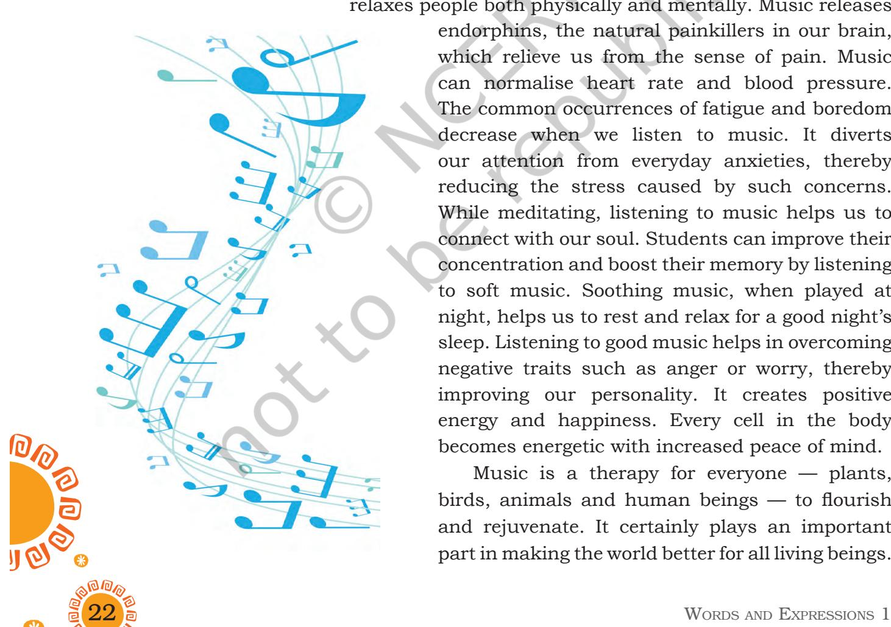
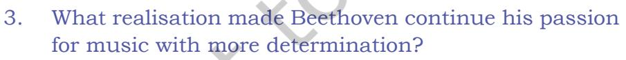
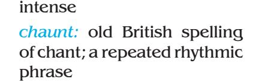
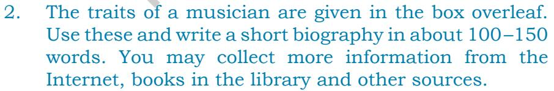
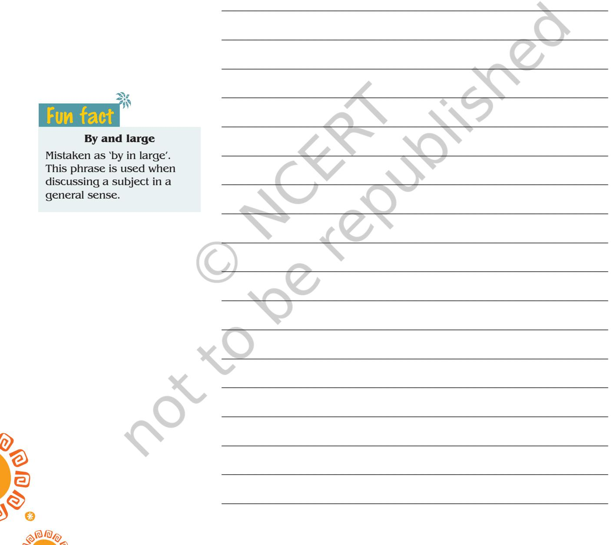

- 6. What is the next note after do-re-mi?
	- (a) ti
	- (b) fa
	- (c) so

Unit 2.indd 21 1/7/2019 10:01:22 AM

# **Notes Reading Comprehension**

In this section, you will read three texts on music in different perspectives. The first one will enlighten you about the effective role of music in our lives, the second reflects on the life of the famous music composer, Ludwig van Beethoven, and the third is a poem by William Wordsworth where he appreciates the melody of a song.

Read the texts carefully and answer the questions that follow.

### **Text I**

#### **Role of Music in Life**

Today, we are rushing through life and everyone seems to be pressurised and stressed about one or the other thing. Stress has become an inescapable part of our lives. Many of our illnesses are a result of stress, and to deal with it, we need certain ways to relax our body and mind. Listening to music, particularly gentle, calming and melodious music, relaxes people both physically and mentally. Music releases

> endorphins, the natural painkillers in our brain, which relieve us from the sense of pain. Music can normalise heart rate and blood pressure. The common occurrences of fatigue and boredom decrease when we listen to music. It diverts our attention from everyday anxieties, thereby reducing the stress caused by such concerns. While meditating, listening to music helps us to connect with our soul. Students can improve their concentration and boost their memory by listening to soft music. Soothing music, when played at night, helps us to rest and relax for a good night's sleep. Listening to good music helps in overcoming negative traits such as anger or worry, thereby improving our personality. It creates positive energy and happiness. Every cell in the body becomes energetic with increased peace of mind.

> Music is a therapy for everyone — plants, birds, animals and human beings — to flourish and rejuvenate. It certainly plays an important part in making the world better for all living beings.

*inescapable:* unable to be avoided or denied

2024-25

Unit 2.indd 22 30-05-2018 11:41:15

22 Unit 2 23 Complete the following statements by selecting the most appropriate options given below. 1. ________________ helps in relaxation of our body and mind. (a) Pop music (b) Soothing music (c) Jazz music (d) Rock music 2. The natural painkillers released in our brain are ________________. (a) Insulin (b) Endorphins (c) Endocrine (d) Glycerin 3. Music is helpful in improving the _____________ of students. (a) concentration (b) emotion (c) relaxation (d) anxiety 4. Which word from the passage means the same as 'to renew'? _______________________________ (a) rejuvenate (b) enhance (c) release (d) relieve 5. List the benefits of music mentioned in the passage. _____________________________________________________ _____________________________________________________ _____________________________________________________ _____________________________________________________ _____________________________________________________ _____________________________________________________ _____________________________________________________ **Common suffixes that make nouns - ment**  agree — agreement move — movement **- y** monarch — monarchy discover — discovery Fun fact

2024-25

Unit 2.indd 23 30-05-2018 11:41:15

## **Notes Text II**

#### **Beating the Odds**

The musical accomplishments of composer Ludwig van Beethoven have been all the more remarkable for the fact that he lost his hearing ability from an early age. He developed the symptoms of tinnitus, a constant sound of ringing in his ears that made it difficult for him to hear. He is compared to Mozart for his genius, and is considered the most eminent musician after Mozart.

Although his formal education never went beyond the elementary level, he trained in music under Joseph Haydn. He has always been acclaimed as a brilliant piano maestro. His father and grandfather were the court musicians of a German prince. Young Ludwig was often made to perform for his father's drinking companions in the middle of the night, and was even beaten if he protested.

For the first thirty years of his life, Beethoven could listen to and play music effortlessly. As a result, he understood sounds of musical instruments and the pitch of the singing voices. He knew the harmony between music and singing before he became completely deaf. His deafness was not sudden, but a gradual decline. This slow process of losing his

> hearing activated his mind to imagine how his compositions would sound like. When he became completely deaf, he started to observe the vibrations of the piano. The observations helped him realise that he could not hear the high notes of the piano. To be able to hear his own compositions, he sawed off the legs of his piano. The piano touched the floor, and Beethoven would press his ear to the floor, banging the piano keys to listen to the high notes in his compositions.

> The most significant aspect of Beethoven's character was that he did not give up. With a brave heart, he confronted the greatest challenge

*beating the odds:* to succeed despite not having a good chance of succeeding

Unit 2.indd 24 30-05-2018 11:41:15

a musician can face, and continued living his dream of composing music. Deafness could not deter him from achieving the pinnacle of musical success. He fought against the greatest obstacle and won.

His quality of 'never giving up' strengthened him. It made him come to terms with his deafness in a dynamic and constructive way. These qualities led him to become a famous composer.

- 1. Read the following statements and write true (T) or false (F).
	- (a) Although he composed a lot of music, Beethoven never learned to play music himself. (T/F)
	- (b) His deafness was not a sudden loss of hearing. (T/F)
	- (c) He composed most of his music early in his life, before he became deaf. (T/F)
	- (d) His musical skills were compared to Haydn. (T/F)
	- (e) Beethoven cut down the legs of his piano to hear the notes of the keys from the floor. (T/F)

_____________________________________________________

_____________________________________________________

_____________________________________________________

_____________________________________________________

_____________________________________________________

_____________________________________________________

_____________________________________________________

_____________________________________________________

_____________________________________________________

_____________________________________________________

- 2. How could Beethoven compose music despite his loss of hearing?
*pinnacle:* the most successful point

#### **Common Spelling Errors**

- It's "tomorrow", not "tommorrow".
It's "noticeable", not "noticable".

2024-25

Unit 2.indd 25 30-05-2018 11:41:15

- 4. Which word in the following is similar in meaning to 'skillful' (para 1)?
_____________________________________________________

- (a) brilliant
- (b) masterly
- (c) talented
- (d) genius

# **Text III**

Read the poem carefully and answer the question that follows.

## **the solitaRy ReapeR**

Behold her, single in the field, Yon solitary Highland lass! Reaping and singing by herself; Stop here, or gently pass! Alone she cuts and binds the grain, And sings a melancholy strain; O listen! for the Vale profound Is overflowing with the sound.

> No Nightingale did ever chaunt More welcome notes to weary bands Of travellers in some shady haunt, Among Arabian sands: A voice so thrilling ne'er was heard In spring-time from the Cuckoo-bird, Breaking the silence of the seas Among the farthest Hebrides.

Will no one tell me what she sings? Perhaps the plaintive numbers flow For old, unhappy, far-off things, And battles long ago: Or is it some more humble lay, Familiar matter of to-day? Some natural sorrow, loss, or pain, That has been, and may be again?

26 WORDS AND EXPRESSIONS 1

2024-25

*profound:* very great or

Unit 2.indd 26 30-05-2018 11:41:16

Whate'er the theme, the Maiden sang As if her song could have no ending; I saw her singing at her work, And o'er the sickle bending; I listened, motionless and still; And, as I mounted up the hill, The music in my heart I bore, Long after it was heard no more.

*—William Wordsworth*

# 1. Complete the summary of the poem given below with a suitable word/phrase in each blank.

The poet finds a young Highland girl who (a)________________alone and sings to herself. The poet asks us to listen carefully, because the whole (b) ________________ is filled with the overflowing sound of her singing. He asks us to either (c)________________and listen to her sad song, or gently pass by so as not to disturb her.

He goes on to say that no nightingale ever sang a more (d)_________________song to bands of tired (e)_______________ in the Arabian Desert. The poet asserts that the beauty of the girl's singing exceeds that of the cuckoo's in the (f)________________. Her singing is also the only thing which (g) ________________the silence of the valley.

The poet tries to (h) ________________what the girl is singing about. He is unable to get the words of the song clearly. He thinks that perhaps she is singing about old sorrows or (i) _________________fought long ago, or more routine concerns of life or even some (j) ________________ which she has endured and may endure again.

At the end, he quietly walks away with a feeling that he may never be able to find out the (k)________________of her never-ending song. Nevertheless, he asserts that her singing has captured his imagination so much that he will (l) ________________the music in his heart long after it is heard no more.

That chair is not BROKE. That chair is BROKEN. You, however, might be BROKE if you can't afford to fix the chair that's BROKEN.

Unit 2.indd 27 30-05-2018 11:41:16

- 1. The following words and phrases occur in the given passages and poem. Given below are the words and their meanings. Match each meaning with the word.

| Text 1 |  |
| --- | --- |
| relieves | substances produced by the brain that |
|  | have painkilling and tranquillising |
|  | effects on the body |
| endorphins | power to live or grow |
| exhaustion | to free from anxiety, fear, pain, etc. |
| rejuvenate | tiredness |
| vitality | to restore to a former state; make fresh |
|  | or new again |
| Text 2 |  |
| prodigy | constantly repeated |
| persistent | to cut or divide |
| virtuoso | to make or become worse or inferior in |
|  | character, quality, value, etc. |
| deterioration | something that obstructs or hinders |
|  | progress |
| sawed | a person, especially a child or young |
|  | person, having extraordinary talent or |
|  | ability |
| obstacle | a person who excels in musical technique |
|  | or execution |
| Text 3 |  |
| behold | tired |
| yon | girl |
| lass | look, see |
| melancholy | climbed |
| vale | expressing sorrow |
| strain | causing sadness |
| weary | that |
| plaintive | melody |
| mounted | valley |

28 Words and Expressions 1

2024-25

Unit 2.indd 28 30-05-2018 11:41:16

# 2. Word search

Look at the grid given here.

| e | l | c | l | a | r | a | t | i | s | a | p |
| --- | --- | --- | --- | --- | --- | --- | --- | --- | --- | --- | --- |
| h | h | x | y | l | o | p | h | o | n | e | i |
| a | n | e | e | v | t | d | o | e | s | b | a |
| i | a | n | h | e | h | s | b | a | r | c | n |
| m | h | n | a | t | r | a | r | l | t | y | o |
| o | p | i | a | n | e | r | e | s | a | p | l |
| n | e | m | u | r | d | o | a | e | b | r | a |
| i | t | f | p | i | e | d | m | l | l | a | b |
| u | u | d | u | u | f | p | a | u | a | t | b |
| m | l | n | n | t | g | n | p | d | r | i | c |
| j | f | t | g | o | j | n | a | t | o | t | c |
| o | g | p | i | k | a | l | o | h | d | g | d |

- A. Find the names of the musical instruments in the grid. They can be found in different directions: up-down, down-up, left-right, right-left and diagonally.
Name the musical instruments.

- B. Use the pictures as clues. Write the appropriate name of the instrument in each blank given below. One has been done as an example.
__________________________________________________________

__________________________________________________________

__________________________________________________________

__________________________________________________________

- (a) Evelyn Glennie is a Xylophone player.
- (b) Zakir Hussain plays the _________________.
- (c) Hariprasad Chaurasia plays the _________________.

Unit 2.indd 29 30-05-2018 11:41:18

- (d) V. Doraiswamy Iyenger plays the __________________.
- (e) Bismillah Khan plays the ____________________.
- (f) Amjad Ali Khan plays the _____________________.

# **Grammar**

- 1. In the lesson 'The Sound of Music' you have read that 'adjectives' can be used before a noun and after the verb 'be'.
# **Example:**

The book is *interesting*. The *interesting* book.

The table is *round*. The *round* table.

But 'adjectives' can have many forms.

**Examples:**

- 1. He chose a pipe with a natural hollow stem that was  *longer* and *broader*.
- 2. Ustad Bismillah Khan was awarded India's *highest* civilian award.
- 3. My mother is the *most beautiful* woman in the world.

Here the adjectives *longer* and *broader* refer to the comparative degree*;* and *highest* and *most beautiful* refer to the superlative degree.

'Er' is used for the comparative degree for shorter words and 'more' is used for longer words.

**Example:**

Let's go to the local market. The vegetables are *cheaper* there. But in Supermarket these are *more expensive*.

- A. Now fill in the blanks with appropriate comparative adjectives.
	- (a) He was not audible. His voice was not loud. Can you request him to be a bit ____________________(loud)?
	- (b) There are many peaks in the Himalayas. Everest is _____________________________ (high) peak in India.
	- (c) With 9 degree Celsius it was colder yesterday, and with 4 degree Celsius it is ___________ (cold) today.
	- (d) Our police is the____________________ (reliable) in the country.
	- (e) My sister is_____________________(serious) than me.

30 Words and Expressions 1

**Commonly misunderstood phrases** 

#### **For all intents and purposes**

This phrase means for all practical purposes.

#### **Sneak peek**

Often mistaken as 'sneak peak'.

This phrase means to take an early look at something.

2024-25

Unit 2.indd 30 30-05-2018 11:41:18

|
|  |

- (g) Living in the countryside is _______________________ (peaceful) than living in a town.
- (h) My father is _____________________________________ (important) person in my life.

B. Fill in the blanks with appropriate superlative degree 'most'/'est'.

- (a) With so many vehicles, the roads of Delhi have become___________________ (crowded) ones in India.
- (b) Yesterday was_____________________ (cold) day of the month.
- (c) The book is interesting. It is_____________________ (interesting) book I have ever read.
- (d) This hotel is cheaper. But that one is__________________________ (cheap) in the town.
- (e) _______________________ (old) member of my family is my grandfather.
- (f) Lata Mangeshkar has___________________________ (melodious) voice in the country.
- 2. In the same lesson, use of 'to-verb' has been explained. Let's do some more activities on this. Join the two sets of sentences given below, and make one sentence. The first one is done for you.
	- 1. 'May I help you?' 'Okay' He offered to help her.
	- 2. 'Let's go to the Old Age Home in the evening.' 'That's fine.' She arranged ___________________ to the Old Age Home in the evening.
	- 3. 'What would you like to eat?', asked Shivani's mother.

'I don't have an appetite', replied Shivani. Shivani refused _________________________________.

- 4. 'Post the letter. Don't forget.' Don't forget_____________________________________.

#### **Literally**

Literally is often misused to express intensity when in fact, it is a word that implies something is completely true. Don't use literally unless something is true.

Unit 2.indd 31 30-05-2018 11:41:18

- 5. 'Can you participate in the music concert?' 'It's fine with me.' She agreed ________________________________ in the music concert.

A **homophone** is a word that sounds the same as another word but differs in meaning and/or how it's spelled.

#### **Examples**

| cereal | – | serial |
| --- | --- | --- |
| morning | – | mourning |
| profit | – | prophet |
| stationary | – | stationery |

# **Editing**

Some words have been omitted in the paragraph given below. Write the appropriate words and rewrite the paragraph.

The following words were written/the tomb of/Anglican Bishop of Westminster Abbey:

When I was young/free and my imagination had no limits, I dreamed/changing the world. As I grew older and wiser, I discovered/world would not change, so I shortened my sights somewhat and decided/change only my country.

But it too seemed immovable. As I grew/my twilight years, in one last desperate attempt, I settled/changing only my family, those closest to me, but alas, I couldn't.

And now as I lay/ my deathbed, I suddenly realise: If I had only changed myself first, then/ an example I could have changed my family.

From their inspiration and encouragement, I could then have been able/better my country and, who knows, I may have even changed the world.

__________________________________________________________

__________________________________________________________

__________________________________________________________

__________________________________________________________

__________________________________________________________

__________________________________________________________

__________________________________________________________

__________________________________________________________

__________________________________________________________

__________________________________________________________

32 Words and Expressions 1

2024-25

Unit 2.indd 32 30-05-2018 11:41:18

| Listening |
| --- |

A passage on the healing aspect of music is given below. You need to listen to the passage read by your teacher/ classmate carefully and answer the question that follows. You may listen to the passage twice, if required.

__________________________________________________________

__________________________________________________________

__________________________________________________________

__________________________________________________________

__________________________________________________________

__________________________________________________________

__________________________________________________________

__________________________________________________________

#### **Music as a Therapy**

 "Rhythm and harmony find their way into the inward places of the soul", rightly said by Plato. Music is often referred to as 'food' for the soul due to the several benefits we can derive from experiencing it.

Music can be pleasure for some, and a way to relax for others. It also motivates and energises listeners. Music is, indeed, a universal language, which can bring nations together and unite people with different faiths as it touches one's soul. In the mainstream, music is mainly known for its entertainment quotient, but the Indian culture also talks about the healing effects of music through 'Raga Chikitsa'. *Raga Chikitsa* has helped in reviving an ancient healing practice known as *Nada Yoga*.

*Nada* is a musical sound, which is believed to have curative effects on the body and soul of all creatures. Consequently, its power is therapeutic and is used in curing diseases. Medical research has found music therapy to aid patients in pain management. It is not surprising, as music affects the body and mind significantly.

One experiences positive energy by listening to music. Music lifts one from clouds of desolation. Rhythms, *desolate:* giving an impression of bleak and dismal emptiness

Unit 2.indd 33 30-05-2018 11:41:18

*sedative:* promoting calm or inducing sleep

**Notes** particularly upbeat music, helps one distract oneself from situations that cause stress and brightens one's mood. Music lowers anxiety levels, relaxes mind and brings optimism. It is said that listening to soft, sedative music once a day can help overcome depression.

> Music therapy finds its traces in mythology. The story of Hippocrates, the Greek father of medicine dates back to 400 B.C. He is known to have used music to cure his patients. This therapy also aids stroke victims to heal at a faster rate, since it increases the patient's emotional comforts and motivates them to move towards the path of recovery. On the other hand, adolescents, too, are benefitted by music in terms of emotional, social and psychological well being. Music is a force that purifies beings from within.

> According to you, which FOUR of the following statements are true?

- (a) *Nada Yoga* treats diseases through *Raga Chikitsa*.
- (b) Music is a universal language that reaches souls.
- (c) Music therapy dates back to 400 B.C.
- (d) Hippocrates played music to treat the patients.
- (e) Upbeat tunes help stroke victims recover faster.
- (f) Music helps adolescents to discover their identity.

# **Speaking**

Two students need to come to the front of the class for a role play. One plays the role of Thyagaraja, a famous singer, and the other the role of the interviewer, Rohit, a Radio Jockey (RJ). The interview is about the singer's initiatives in helping people through music.

- RJ Rohit : Do you think music has any effect on people's lives?
- Thyagaraja : Yes, I believe music surely has a positive effect on people's lives. It helps when you are stressed, or depressed about something. Apart from these, music is a good way of relaxing and feeling good about life.
- RJ Rohit : What, according to you, could be the influence of music on young children?

2024-25

Unit 2.indd 34 30-05-2018 11:41:18

| Thyagaraja | : | Now-a-days, young children get |
| --- | --- | --- |
|  |  | distracted easily. Music helps them in |
|  |  | concentrating on what they are doing. |
| RJ Rohit | : | How does music help patients? |
| Thyagaraja | : | Listening to music relaxes patients. The |
|  |  | process of healing becomes faster when |
|  |  | they are in a relaxed state of mind. |
| RJ Rohit | : | Thank you very much. You are doing a |
|  |  | great job for the humankind. |

# **Writing**

- 1. Listening to music has become a part of our lives for many reasons. We listen to different types of music today.
Discuss in pairs the following question:

- Is the traditional music of a country more important than its contemporary music? Write your views in about 50–60 words.
___________________________________________________

___________________________________________________

___________________________________________________

### **Adjectives ending in ING**

Used to describe something that causes an emotion.

**-ing**

Tiring Confusing Relaxing Satisfying Shocking

Unit 2.indd 35 30-05-2018 11:41:18

A. R. Rahman: Indian composer, singer, songwriter, music producer, musician and philanthropist; born in Chennai on 6 January 1967; graduated from Trinity College, Oxford University; famous in integrating Indian classical music with electronic music, world music and traditional orchestral arrangements; recipient of the Padmashri and the Padma Vibhushan awards; two Oscars and a Golden Globe; a notable humanitarian and philanthropist; donates and raises money for a number of causes and charities.

## **Biographical Sketch**

36 Words and Expressions 1

2024-25

Unit 2.indd 36 30-05-2018 11:41:18

# **Project**

- 1. Sit in groups of four. Each of you find information on the folk music of your state and of one of the neighbouring states. You may seek information from the community, library, Internet and other sources. Now, ask questions to each other in the group to complete the table below.

| Names of | the folk | music |  |
| --- | --- | --- | --- |
| States performed | where | they | are |
| Any | instrument/s |  | used |
| (you may instruments) | illustrate |  | the |
| Performers |  |  |  |

**Lie/Lay**

These two words are often misused for the other. Lie means to rest on a surface while lay means to put something in place.

- 2. Prepare a report in your group and present it to the class. Then, share your suggestions in the class to popularise the folk music in your community.
- 3. 'The Sound of Music' is a biographical piece about Evelyn Glennie, a famous percussionist, who listened to sound without hearing it. Collect information about people/children who have overcome their physical barriers and have achieved success in their lives.

*percussion:* musical instruments that one plays by hitting them with hand or a stick, for example, drums

36 Unit 2 37

Unit 2.indd 37 31-05-2018 16:02:51

