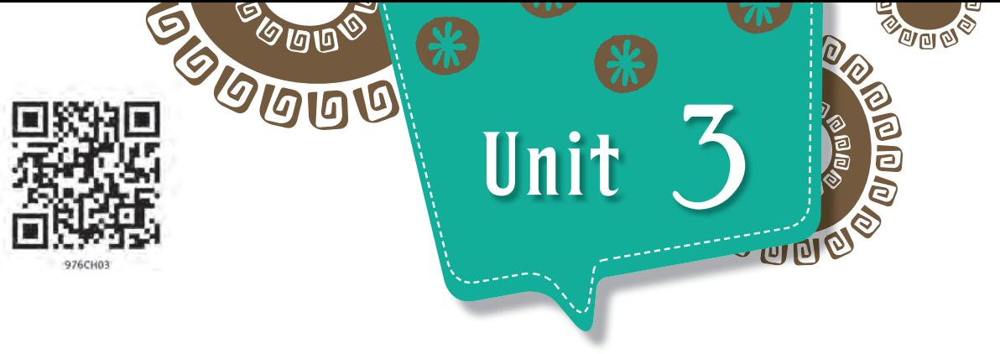
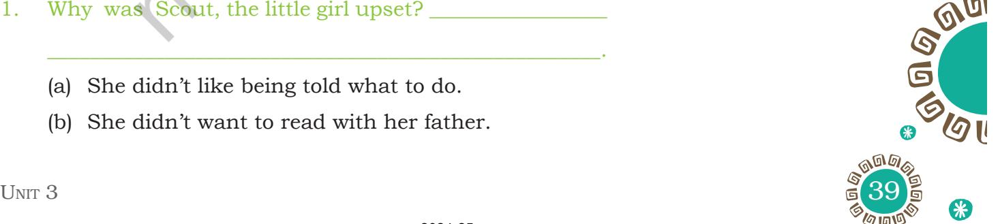
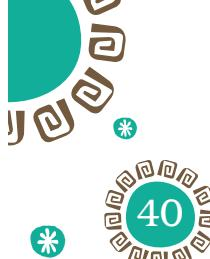
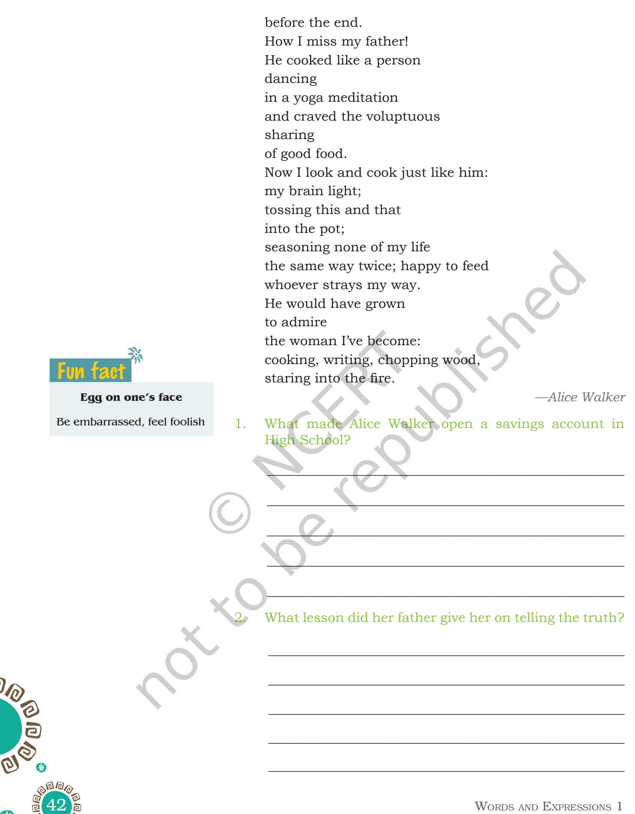
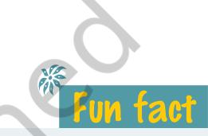
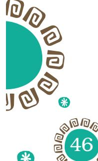
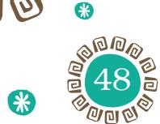

The story of 'The Little Girl', in *Beehive*, is about the changing attitude of a girl child towards her father.

- As you are grown up now, you may want to interact with your parents on many issues. How will you go about it?
- Do you feel a communication gap between you and your parents which leads to unpleasantness?
- What are your feelings at that time?
- How do you cope with that situation?

## **READING COMPREHENSION**

Read the following text and answer the questions that follow.

LE T 'S B EG I N

### **Text I**

This is an extract from Harper Lee's *To Kill a Mocking Bird*. After supper, Atticus sat down with the paper and called, "Scout, ready to read?". I ran crying, went to the front porch. Atticus followed me. "Something wrong, Scout?" I told Atticus I didn't feel very well and didn't think I'd go to school any more if it was alright with him. Atticus sat down in the swing and crossed his legs. His fingers wandered to his watch pocket; he said that was the only way he could think. He waited in amiable silence, and I sought to reinforce my position: "You never went to school and you do alright, so I'll just stay home too. You can teach me like Granddaddy taught you 'n' Uncle Jack." "No I can't", said

Unit 3.indd 38 1/7/2019 10:03:16 AM

Atticus. "I have to make a living. Besides, they'd put me in jail if I kept you at home. Now what's the matter? Bit by bit, I told him the day's misfortunes. "And the teacher said you taught me all wrong, so we can't ever read any more, ever. Please don't send me back, please Sir." Atticus stood up and walked to the end of the porch. When he completed his examination of the wisteria vine he strolled back to me. "First of all", he said, "if you can learn a simple trick, Scout, you'll get along a lot better with all kinds of folks. You never really understand a person until you consider things from his point of view-" "Sir?" "-until you climb into his skin and walk around in it". "But if I keep on goin' to school, we can't ever read any more…" "That's really bothering you, isn't it?" "Yes sir."

When Atticus looked down at me I saw the expression on his face that always made me expect something. "Do you know what a compromise is?", he asked. "Bending the law?" "No, an agreement reached by mutual concessions. It works this way", he said. "If you'll concede the necessity of going to school, we'll go on reading every night just as we always have. Is it a bargain?"

"Yes sir!"

"We'll consider it sealed without the usual formality", Atticus said, when he saw me preparing to spit.

As I opened the front screen door Atticus said, "By the way, Scout, you'd better not say anything at school about our agreement". "Why not?" "I'm afraid our activities would be received with considerable disapprobation by the more learned authorities."

My brother and I were accustomed to our father's diction, and we were at all times free to interrupt Atticus for a translation when it was beyond our understanding. "Huh, Sir?"

"I never went to school", he said, "but I have a feeling that if you tell Miss Caroline we read every night she'll get after me, and I wouldn't want her after me".

____________________________________________________.

1. Why was Scout, the little girl upset? _________________

- (a) She didn't like being told what to do.
- (b) She didn't want to read with her father.

*wisteria vine:* a genus of flowering plants

*bargain:* an agreement between two or more people as to what each will do for the other

*disapprobation:* strong moral disapproval

2024-25

Unit 3.indd 39 29-05-2018 17:30:00

- (c) She didn't want to stop reading with her father.
____________________________________________________.

- (d) She didn't want to read with her teacher.
- 2. How did Atticus, her father, react to her outburst?____
	- (a) He was angry.
	- (b) He was patient.
	- (c) He was annoyed.
	- (d) He was sad.
- 3. What little advice did Atticus give to his little girl to cope up with situations that might upset her?________
	- (a) to know and understand that life isn't fair.
	- (b) to stay calm and then run away from the problem.

____________________________________________________.

- (c) to try and see from the other person's point of view.
- (d) to face her fears by expressing how she felt.
- 4. How was the matter eventually resolved?______________
	- (a) Atticus agreed to allow her to learn from home.

____________________________________________________.

- (b) Atticus agreed to continue reading as before.
- (c) Atticus agreed to speak to her teacher.
- (d) Atticus agreed to allow only the teacher to teach her.

5. "I'm afraid our activities would be received with considerable disapprobation by the more learned authorities." In this context, the word 'disapprobation' might mean____________________________________.

- (a) disapproval
- (b) disturbance
- (c) disgrace
- (d) disorientation
- 6. Atticus decided to come to a compromise and to read to Scout but asked her not to mention it to her teacher because____________________________________________.
	- (a) he respected the wishes of the teacher yet didn't want to disappoint his daughter.

2024-25

#### **Supposed**

This is often misused as 'suppose to' which is incorrect because it lacks the letter 'd.'

Unit 3.indd 40 29-05-2018 17:30:00

- (b) he might get into trouble with the teacher who **Notes** might come after him.
- (c) he only cared for his daughter and thought the teacher was incorrect.
- (d) he was afraid that the teacher may not like it and Scout might get into trouble.
- 7. The word 'reinforce' means the following—fortify, brace, stiffen, strengthen, underpin.

Find the contextual meaning of 'reinforce' in the passage._________________________________________

#### **Text II**

Read the poem and answer the questions given below. You can recite too to appreciate the idea in the poem.

#### **Poem at Thirty-Nine**

How I miss my father. I wish he had not been so tired when I was born. Writing deposit slips and cheques I think of him. He taught me how. This is the form, he must have said: the way it is done. I learned to see bits of paper as a way to escape the life he knew and even in high school had a savings account. He taught me that telling the truth did not always mean a beating; though many of my truths must have grieved him

Fun fact

#### **Bemused**

This word is not related to 'amuse' in any way. Bemused means bewildered or perplexed.

Unit 3.indd 41 29-05-2018 17:30:00

2024-25

Unit 3.indd 42 29-05-2018 17:30:00

#### 3. Tick () the correct answer.

What does 'dancing in yoga meditation' mean in the poem?

- (a) To cook relaxedly and with full concentration.
- (b) To cook while doing yoga exercises.
- (c) To cook food after doing yoga meditation.
- (d) Take lessons in cooking by joining class on yoga meditation.
- 4. Fill in the blank to complete the following statement.

Alice Walker becomes nostalgic for her father and wishes, had he been alive he would have admired her for__________________________________________________

#### **Contradictory proverbs**

The best things in life are free. *but* There's no such thing as free lunch.

Birds of a feather flock together. *but* Opposites attract.

- 5. Why do you think the title of the poem is 'Poem at Thirty-Nine'?
_____________________________________________________

_____________________________________________________

_____________________________________________________

_____________________________________________________

_____________________________________________________

# **Vocabulary**

- 1. Look at the words—see, watch, look at, view, observe, catch, glimpse. These are all synonyms. Fill in the blanks with appropriate words. You can change the tense where it is required.
	- (a) We ________________________a television programme on tourism in India. It was very informative.
	- (b) Somebody is keeping a __________________________ over the tower.
	- (c) The ___________________from the cliff is panoramic.
	- (d) You can't afford to fall sick again,_________________ your diet.

Unit 3.indd 43 29-05-2018 17:30:00

- (e) She ______________________________the amazing view and drew a picture.
- (f) If you are able to ______________________________a _______________ of dancing dolphins, you are lucky.
- 2. Look at the following sentence:

By that time he had his spectacles on and looked at her over them...

> Here, look means *lay one's eye on or to direct one's gaze in a specified direction.*

> Use appropriate words from the synonyms given below in the following sentences.

> > glance, gaze, stare, peep, watch, see, observe

- (a) Ginny___________________at her watch. (take a brief or hurried look)
- (b) The door was ajar and she couldn't resist ________________________in. (look quickly and furtively at something)
- (c) Lucy____________________him playing. (look at or observe attentively over a period of time)
- (d) He could only________________________her in astonishment. (look steadily and intently, especially in admiration, surprise or thought)
- (e) She______________________ that all the seats were already occupied. (notice or perceive something)
- (f) In the distance, she could____________________ the blue horizon. (perceive with the eyes)
- (g) He__________________________at her in amazement. (look fixedly or vacantly at someone or something with one's eyes wide open)

3. Study the use of the word 'little' in the following sentence:

To the little girl he was a figure to be feared. Here, *little* means small in size.

Now, consult a dictionary and find out the meaning of *little* in the following sentences. The first one has been done for you.

My little sister—young or younger sister

- (a) I was a bodyguard for a little while: _______________
_____________________________________________________

#### **At the end / In the end**

At the end means "at the time when something ends". In the end means "finally".

#### **Examples:**

At the end of the play, there was great applause.

The conclusion is given at the end of the passage.

The subject looked difficult in the beginning, but everyone could understand it in the end.

Arti and Rati didn't like each other when they first met, but became good friends in the end.

44 Words and Expressions 1

2024-25

Unit 3.indd 44 29-05-2018 17:30:01

(b) This little car does have a few problems: __________

_____________________________________________________

_____________________________________________________

_____________________________________________________

(c) We got a little help from a training scheme: ________

(d) I have little doubt of their identity: _________________

### **Grammar**

- 1. Read the following passage and underline the reporting verbs.
	- (i) Anu's mother agreed that Anu could go to the party but cautioned her not to have too many sweets. The dentist has advised her not to eat too many sweets.
	- (ii) Anita reminded Leena to buy milk and keep it in the fridge because Vrinda wanted to have coffee in the evening. Leena insisted that she would only make coffee. Anita agreed to her request.
	- (iii) We decided to go to our village near Goa on holiday. Mona recommended going to the beach. The coast guard advised us against going into the water. He also warned us about the weak bridge. He warned the children not to cross the bridge there. We thanked him and went back.
	- (iv) The teacher explained the functioning of the heart with the help of a model. He wished us good luck for our practical exam. He also reminded us that the classes would resume from Tuesday.
- 2. Read the following sentences and choose the correct reporting verb from the options given against each sentence.
	- (i) He ___________________me against eating junk food.

A) advised B) told C) suggested

- (ii) The teacher ______________________me to telephone my mother. A) informed B) advised C) reminded

#### **Farther/ Further**

'Farther' refers to physical distance. 'Further' means advancement.

#### **Examples:**

The teacher asked the students to move **farther**  from the stage.

The students did not ask any **further** questions from the teacher.

Unit 3.indd 45 29-05-2018 17:30:01

- (iii) He ___________________to get me a cup of tea.
- A) offered B) said C) invited
- (iv) She __________________________Ruchi of stealing her book.
- A) told B) accused C) admitted
- (v) The host ___________________for the delay.
	- A) said B) apologised C) regretted
- (vi) The Police later __________________that one of the convicts had been arrested.
- A) convinced B) declared C) confirmed
- (vii) The little girl ___________________to wear the sweater.
	- A) refused B) denied C) said no
- (viii) He _________________taking the train as the road was terrible.

A) invited B) claimed C) suggested

**Editing**

- 1. Use capital letters, full-stops, commas and inverted commas wherever necessary in the following paragraph. Rewrite the paragraph in the space given below.
My little 10 years daughter Sarah was born with a muscle missing in her foot and wears a brace all the time. she came home jumping up and down one beafutiful spring day to tell me that she had competed in "field day"- that's where they have lots of races and other competitive events

because of her leg support my mind raced as I tried to think of encouragement for my sarah i wanted to tell some hard facts of life not letting this to get her down But, before I could get my word out, she said, Daddy, I won two of the races! I couldn't believe that! and then Sarah came out with a declaration, I had an advantage.

Ah, i knew it. i thought she must have been given a head start, some kind of physical advantage. but again, before I could say anything, she said, Daddy, i didn't get a

2024-25

**Like two peas in a pod** Nearly identical, very similar They're like two peas in a pod.

Unit 3.indd 46 29-05-2018 17:30:01

| __________________________________________________________ |
| --- |
| __________________________________________________________ |
| __________________________________________________________ |
| __________________________________________________________ |
| __________________________________________________________ |
| __________________________________________________________ Fun fact |
| __________________________________________________________ |
| Eat like a horse |
| Eat a lot __________________________________________________________ Eat like a bird |
| __________________________________________________________ Eat a little |
| __________________________________________________________ |
| __________________________________________________________ |
| __________________________________________________________ |
| __________________________________________________________ |
| __________________________________________________________ |
| __________________________________________________________ |
| __________________________________________________________ |
| __________________________________________________________ |
| 2. Rearrange each set of words to make sentences. Use |
| appropriate punctuation marks. |
| (a) a resident of Noida near Delhi/is visually impaired/ |
| George Abraham. |
| _________________________________________________ |
| _________________________________________________ |
| _________________________________________________ |

- (b) confidence and competitive spirit/and infuses discipline among the participants/ it provides
_________________________________________________

_________________________________________________

_________________________________________________

_________________________________________________

_________________________________________________

_________________________________________________

_________________________________________________

________________________________________________

_________________________________________________

- (c) he has helped/the brain behind the World Cup Cricket/the disable to dream
- (d) to the blind school in Delhi/it was a chance visit/ that changed his life
# **Listening**

Listen to the song twice. Answer the questions that follow. Then sing the song together.

- Que Sera, Sera When I was just a little girl I asked my mother What will I be Will I be pretty? Will I be rich? Here's what she said to me Que sera, sera Whatever will be, will be
The future's not ours to see

Que sera, sera

What will be, will be When I grew up and fell in love

48 Words and Expressions 1

2024-25

Unit 3.indd 48 29-05-2018 17:30:01

I asked my sweetheart What lies ahead Will we have rainbows? Day after day Here's what my sweetheart said Que sera, sera Whatever will be, will be The future's not ours to see Que sera, sera What will be, will be Now I have Children of my own They ask their mother What will I be? Will I be handsome? Will I be rich? I tell them tenderly Que sera, sera Whatever will be, will be The future's not ours to see Que sera, sera What will be, will be Que Sera, Sera

(It is a popular song written by the song writing team of Jay Livingston and Ray Evans in 1956.)

- 1. What are the questions the poet asked her mother when she was a little girl?
_____________________________________________________

_____________________________________________________

_____________________________________________________

_____________________________________________________

_____________________________________________________

_____________________________________________________

Unit 3.indd 49 29-05-2018 17:30:01

- 3. She asked a question to her sweetheart. What was it?
_____________________________________________________

_____________________________________________________

_____________________________________________________

_____________________________________________________

_____________________________________________________

_____________________________________________________

_____________________________________________________

_____________________________________________________

_____________________________________________________

_____________________________________________________

_____________________________________________________

_____________________________________________________

- 4. What was his answer? Was it simillar to that of her mother's?
- 5. Now the poet has become a mother. What questions do her children ask her?
- 6. What is her answer to her children?
**Speaking**

Look at the questions given below. Discuss with your partner. Jot down the points and make an oral presentation in the class.

- 1. Do you have questions about your future?
- 2. Whom do you discuss them with?
- 3. How often do you discuss your worries or queries with your parents?
- 4. Whom do you feel most comfortable sharing them with?

50 Words and Expressions 1

2024-25

#### **Hyphen and En dash**

A **hyphen (-)** is the shortest dash most commonly used to combine words.

**Example:** well-being, mid-October, two-thirds, far-off, deep-fried, in-depth, mother-in-law.

**En dash (–)** is slightly longer than a hyphen, and is used for page ranges, years and months.

**Example:** 20–50, 2015–16, July–August 2018

En dash is also used to compare or indicate connection between two words.

**Example:** Hindi–English, North–South, May–June, liberal–conservative, good– bad.

*Tip: If 'to' can be replaced by a dash or vice versa then that would definitely be an En dash.*

Unit 3.indd 50 29-05-2018 17:30:01

| __________________________________________________________ |
| --- |
| __________________________________________________________ |
| __________________________________________________________ |
| __________________________________________________________ |
| __________________________________________________________ |
| __________________________________________________________ |
| __________________________________________________________ |
| __________________________________________________________ |
| __________________________________________________________ |
| __________________________________________________________ |
| Fun fact __________________________________________________________ Walk on eggshells |
| __________________________________________________________ Try hard not to upset |
| someone |
| __________________________________________________________ I've been walking on |
| eggshells around my friend. |
| __________________________________________________________ |
| __________________________________________________________ |
| __________________________________________________________ |
| __________________________________________________________ |
| __________________________________________________________ |
| __________________________________________________________ |
| __________________________________________________________ |
| __________________________________________________________ |
| __________________________________________________________ |
| Writing |

| Your address |  |  |
| --- | --- | --- |
| __________________________ |  |  |
| __________________________ |  |  |
| Date:___________________ |  |  |
| My Dear____________________________(Salutation) |  |  |
| (Introduction) |  |  |
| __________________________________________________________________________ |  |  |
| __________________________________________________________________________ |  |  |
| __________________________________________________________________________ |  |  |
| __________________________________________________________________________ |  |  |
| (Body of the letter) |  |  |
| __________________________________________________________________________ |  |  |
| __________________________________________________________________________ |  |  |
| __________________________________________________________________________ |  |  |
| __________________________________________________________________________ |  |  |
| __________________________________________________________________________ |  |  |
| __________________________________________________________________________ |  |  |
| (Closing statement) |  |  |
| __________________________________________________________________________ |  |  |
| __________________________________________________________________________ |  |  |
| __________________________________________________________________________ |  |  |
| __________________________________________________________________________ |  |  |
| __________________________________________________________________________ |  |  |
| Yours affectionately, |  |  |
| ____________________ |  |  |
| 52 | Words | and Expressions 1 |

# **Project**

- 1. Conduct an interview with your parents and find out how things have changed over time. Your project must contain a minimum of 10 questions.
Some ideas/topics you could include in the questionnaire are:

- (i) What they thought was a really fun thing to do.
- (ii) The music they listened to.
- (iii) They movies they liked.
- (iv) And the television shows they enjoyed.
- (v) Why they liked these things back then?
- (vi) When my parents were my age, what were they not allowed to do?
- (vii) Why were they not allowed to do those things?
- (viii) What did their parents believe in?
- (ix) What did they disagree with their parents about?
- (x) How much money did they have for themselves as pocket money?
- (xi) What was the maximum amount they were allowed to spend on?
- (xii) In what ways are your parents like their parents? In what ways are they different?
- (xiii) Who were the people your parents admired when they were teenagers?
- (xiv) What were some things they worried about?
- 2. Write the interview in the form of a newspaper article. You could submit it to your school's newspaper or website, or in audio or video form which can be posted on your school's website.
- 3. Share key moments and insights from the interview, and then discuss ways to bridge the generation gap and find common ground.

52 Unit 3 53

Unit 3.indd 53 29-05-2018 17:30:01

