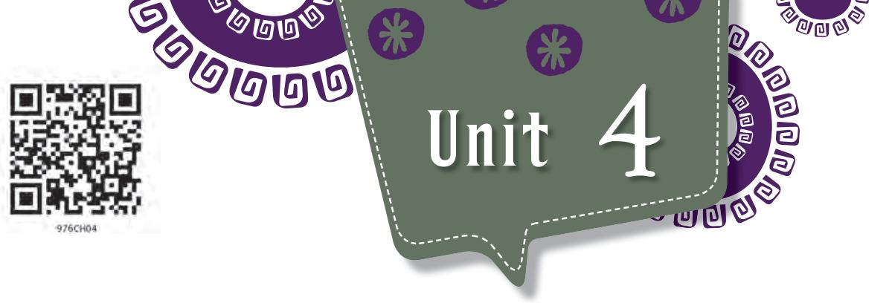
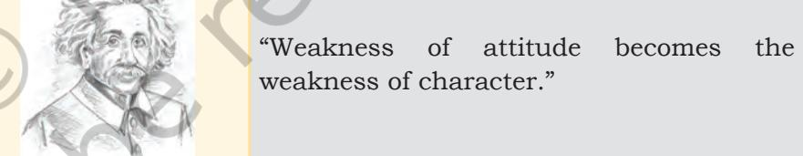
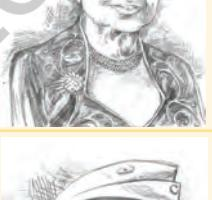
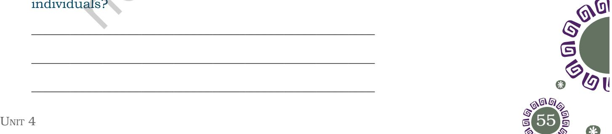

# LE T 'S B EG I N

Look at the pictures and identify who they are. Write their names in the given spaces. The quotes against each picture may also help you recognise them.

#### **Picture of different personalities Quotes**

"It is very simple to be happy, but it is very difficult to be simple."

"The best and the most beautiful things in the world cannot be seen or even touched – they must be felt with the heart."

"One individual may die for an idea, but that idea will, after his death, incarnate itself in a thousand lives."

Unit 4.indd 54 1/7/2019 10:05:19 AM

- 2024-25
Unit 4.indd 55 30-05-2018 11:50:58

- • How do the quotes reflect the beautiful mind of the **Notes** personalities mentioned? Discuss in pairs of four, jot down your points, and then present to the class.
# **Reading Comprehension**

Read the passage below and answer the questions that follow.

### **Text I**

#### **The World as I See It**

In my opinion, the present symptoms of decadence are explained by the fact that the development of industry and machinery has made the struggle for existence very much more severe, greatly to the detriment of the free development of the individual. But the development of machinery means that less and less work is needed from the individual for the satisfaction of the community's needs. A planned division of labour is becoming more and more of a crying necessity and this division will lead to the material security of the individual. This security and the spare time and energy which the individual will have at his command can be made to further his development. In this way the community may regain its health, and we will hope that future historians will explain the morbid symptoms of present-day society as the childhood ailments of an aspiring humanity, due entirely to the excessive speed at which civilisation was advancing.

(An extract from *The World As I See It* by A. Einstein)

- 1. What is responsible for the present degradation of individual development?
_____________________________________________________

_____________________________________________________

_____________________________________________________

_____________________________________________________

_____________________________________________________

_____________________________________________________

2. What is the meaning of development in relation to individuals?

*decadence:* moral or cultural decline as characterised by excessive indulgence in pleasure or luxury

*detriment:* the state of being harmed or damaged

- 3. What is the 'planned division of labour'? How will it be helpful in human development?
_____________________________________________________

_____________________________________________________

_____________________________________________________

- 4. What does the phrase 'symptoms of decadence' mean in the opening line?
	- (a) diagnosis of degradation
	- (b) warning signs of depravity
	- (c) signs of prosperity
	- (d) diagnosis of indifference
- 5. The phrase 'crying necessity' in the opening paragraph means:
	- (a) urgent need
	- (b) weeping need
	- (c) sad need
	- (d) average need

#### 6. Circle the odd one out

- (a) presence, distance, existence, being, alive
- (b) possible,feasible,probable,unthinkable, obtainable
- (c) violence, assault, roughness, passivity, fierceness
- (d) conflict, contest, contention, rivalry, accord
	- (e) consolation, compassion, annoyance, sympathy, support

#### **Text II**

#### Read the following text and answer the questions.

#### **When Einstein wrote to Gandhi**

In 1931, Albert Einstein wrote the following short letter of admiration to another of the world's greatest minds, Mohandas Gandhi. Despite their intentions, the pair never met in person.

#### *Respected Mr. Gandhi,*

*I use the presence of your friend in our home to send you these lines. You have shown through your words, that it* 

2024-25

Unit 4.indd 56 30-05-2018 11:50:58

#### **Did You Know?**

The sentence "the quick brown fox jumps over the lazy dog" uses all the letters of the alphabet in the English language.

*is possible to succeed without violence even with those who* **Notes** *have not discarded the method of violence. We may hope that your example will spread beyond the borders of the country, and will help to establish an international authority, respected by all, that will take decisions and replace war conflicts. With sincere admiration Yours*

*(Signed, 'A. Einstein') I hope that I will be able to meet you face to face someday.*

#### **Gandhi's response**

*LONDON, October 18, 1931*

*DEAR FRIEND,*

*I was delighted to have your beautiful letter sent through Sundaram. It is great consolation to me that the work I am doing finds favour in your sight. I do indeed wish that we could meet face to face and that too in India at my Ashram. Yours Sincerely (Signed, 'M.K Gandhi')*

(Source: *Letters of Note, Volume 2*, by Shaun Usher)

- 1. Albert Einstein admired M.K. Gandhi because: [tick () the right answer]
	- (a) Gandhi discarded the method of violence.
	- (b) Gandhi showed that it is possible to succeed without violence with those who have discarded the method of violence.
	- (c) Gandhi showed that it is possible to succeed without violence only with those who have discarded the method of violence.
	- (d) Gandhi showed that it is possible to succeed without violence with all irrespective of whether they have continued or discarded the method of violence.
- 2. Where did Gandhi wish to meet Einstein? [tick () the right answer]
	- (a) his residence in London
	- (b) his Ashram in India
	- (c) his Ashram in London
	- (d) during his tour to London

56 Unit 4 57

Unit 4.indd 57 30-05-2018 11:50:58

|  |  | 3. | Why does Einstein want Gandhi's example to go |  |  | beyond |
| --- | --- | --- | --- | --- | --- | --- |
|  |  |  | India? |  |  |  |
|  |  |  | _____________________________________________________ |  |  |  |
|  |  |  | _____________________________________________________ |  |  |  |
|  |  |  | _____________________________________________________ |  |  |  |
|  |  |  | _____________________________________________________ |  |  |  |
|  |  | 4. | You have read the chapter and the exchange of |  |  | letters |
|  |  |  | between A. Einstein and M. K. Gandhi. What similarities |  |  |  |
|  |  |  | do you find in the ideas of both the personalities? |  |  |  |
|  |  |  | _____________________________________________________ |  |  |  |
|  |  |  | _____________________________________________________ |  |  |  |
| Fun fact |  |  | _____________________________________________________ |  |  |  |
| Conjunctions to |  |  | _____________________________________________________ |  |  |  |
| remember |  |  |  |  |  |  |
| and | because | 5. | Find the opposites of the words given below |  |  | from |
| but | contrary to before |  | Einstein's letter. | if |  |  |
| then | besides |  |  |  |  |  |
| when | even though |  | fail_________________________________ |  |  |  |
|  |  |  | (c) peace______________________________ |  |  |  |
| although | despite |  |  |  |  |  |
| while | however |  |  |  |  |  |
|  |  |  | (e) enemy_____________________________ |  |  |  |
| in addition to | so |  |  |  |  |  |
|  |  |  |  |  |  | letter, |
|  |  |  | (a) satisfied you |  |  |  |
|  |  |  | (b) delighted you |  |  |  |
|  |  |  | (c) appreciated by you |  |  |  |
|  |  |  | (d) not accepted by you |  |  |  |
|  |  | If |  |  |  |  |
|  |  | If | you can keep your head when all about you |  |  |  |
|  |  |  | Are losing theirs and blaming it on you; |  |  |  |
|  |  | If | you can trust yourself when all men doubt you, |  |  |  |
|  |  |  | But make allowance for their doubting too; |  |  |  |
|  |  | If | you can wait and not be tired by waiting, |  |  |  |
|  |  |  | Or, being lied about, don't deal in lies, |  |  |  |
|  |  |  | (b) |  |  |  |
|  |  |  | (a) impossible_________________________ |  |  |  |
| as well as | also |  |  |  |  |  |
|  |  |  | (d) absence____________________________ |  |  |  |
| after | nevertheless |  |  |  |  |  |
|  |  | 6. | In the context of Gandhi's response to Einstein's |  |  |  |
|  |  |  | 'finds favour in sight' means: |  | your |  |
|  |  | Text III |  |  |  |  |

58 Words and Expressions 1

2024-25

Unit 4.indd 58 30-05-2018 11:50:58

Or, being hated, don't give way to hating, And yet don't look too good, nor talk too wise;

If you can dream—and not make dreams your master; If you can think—and not make thoughts your aim; If you can meet with triumph and disaster And treat those two impostors just the same; If you can bear to hear the truth you've spoken Twisted by knaves to make a trap for fools, Or watch the things you gave your life to broken,

And stoop and build 'em up with wornout tools;

If you can make one heap of all your winnings And risk it on one turn of pitch-and-toss, And lose, and start again at your beginnings And never breathe a word about your loss; If you can force your heart and nerve and sinew To serve your turn long after they are gone, And so hold on when there is nothing in you Except the Will which says to them: "Hold on";

If you can talk with crowds and keep your virtue, Or walk with kings—nor lose the common touch; If neither foes nor loving friends can hurt you; If all men count with you, but none too much; If you can fill the unforgiving minute With sixty seconds' worth of distance run— Yours is the Earth and everything that's in it, And—which is more—you'll be a Man, my son!

*—Rudyard Kipling*

- 1. Which lines in the poem tell us to have self control, a clear head and not to become bitter when people speak against us? Stanza 1
_____________________________________________________

_____________________________________________________

- 2. One must be just as graceful in losing as he is in winning.
*impostor:* a person who assumes a false identity in order to deceive or defraud

*knave:* a dishonest or unscrupulous man

58 Unit 4 59

Unit 4.indd 59 31-05-2018 16:06:01

**Notes** What are the two words in the poem that can replace the underlined ones? Stanza 2

_____________________________________________________

- 3. In the third stanza what does the poet mean by 'And lose, and start again'?
_____________________________________________________

- 4. There is a necessity to treat all people equal and amidst people we should not lose our self 'who we are'? How has the poet expressed this in the fourth stanza?
- 5. List two things from each stanza that we can do to make the Earth ours, as given in the poem.

_____________________________________________________

_____________________________________________________

_____________________________________________________

_____________________________________________________

#### **Different usages of Regret**

I regret to inform you that the musical concert is cancelled.

I regret missing the study tour.

Maya left her job with no regrets.

Do you regret declining the offer to be the class monitor?

### **Vocabulary**

1. Read the paragraphs mentioned against each explanation and find out the words in that paragraph which best match the explanation given. Refer to the chapter 'A Truly Beautiful Mind' given in your textbook, *Beehive*.

> (a) A word used disapprovingly to talk about a person who is unusual and doesn't behave like others._____________________________(paragraph 1)

- (b) Taking part in an activity for pleasure, not as a job.____________________________(paragraph 3)
- (c) Respecting and allowing many different types of beliefs or behaviour._________________(paragraph 5)
- (d) A person who is lacking in or hostile or smugly indifferent to cultural values, intellectual pursuits, etc.________________________________(paragraph 7)
- (e) Relating to work that needs special training or education.__________________________(paragraph 8)

60 Words and Expressions 1

2024-25

Unit 4.indd 60 30-05-2018 11:50:58

#### 2. Einstein was a *world* citizen.

This means he does not belong to one country because his contributions to science and the society have moved beyond the borders of his country.

'World' has different meanings in a variety of contexts. Read the sentences given below and find out the meanings of 'world' in each sentence.

- (a) My mother means the world to me.
- (b) Vasco da Gama sailed round the world.
- (c) He is a big name in the world of fashion.
- (d) Stars from the sporting and artistic worlds participated in the function.

_________________________________________________

_________________________________________________

_________________________________________________

_________________________________________________

_________________________________________________

- (e) She is a simple person in real world as well as in the movies.
# **Grammar**

#### **Participle Clause**

You have read about and done exercises on participle clauses (*Beehive*, p. 52). We know that participle clause is a form of adverbial clause which enables us to say information in a more economical way. We can use participle clauses when the participle and verb in the main clause have the same subject.

**Example:** Waiting for John, I made some tea.

- 1. Choose the correct option for the sentences below.
	- (a) Waiting for the doctor, ____________________________

 ________________________________ [a big noise scared everybody, Dave read a magazine, the alarm went off]

**Elicit / Illicit Elicit** is a verb that means "to bring out". **Illicit** is an adjective which means "unlawful".

**Incorrect:** The questionnaire was intended to illicit information on disaster management.

**Correct:** The questionnaire was intended to elicit information on disaster management.

**Incorrect:** An upright person does not shy away from reporting elicit incidents to the Police.

**Correct:** An upright person does not shy away from reporting illicit incidents to the Police.

Unit 4.indd 61 30-05-2018 11:50:58

- (b) ____________________________________ in the jungle, George had to find the way out on his own. [having lost, lost, losing]
- (c) _____________________________________ our pottery will last for generations. [treating with care/you treat with care/treated with care]
- (d) ____________________________________ a holiday, all the banks were closed. [having been/been/ being]
- (e) ____________________________________ for so long, he had lost all hope. [being unemployed/unemployed/ having been unemployed]
- 2. Join the following sentences using a present-participle as given in the example.

**Example:** 

We walked along the footpath. We saw an accident. Walking along the footpath, we saw an accident.

- (*Note*: Out of the two actions, the one which takes place first is changed into present participle.)
- (a) He stood by the side of a temple. He asked people to go in.
- (b) She came out of the room. She greeted the visitors.

_________________________________________________

_________________________________________________

_________________________________________________

_________________________________________________

_________________________________________________

_________________________________________________

_________________________________________________

- (c) He heard the news. He started crying.
(d) He found the lock broken. He rang up the Police.

- _________________________________________________
62 Words and Expressions 1

2024-25

If something can be counted, use **"FEWER"**.

- **•**  fewer cars
- • fewer letters
- **•**  fewer chairs
- • fewer people

Unit 4.indd 62 31-05-2018 16:08:24

(e) He felt sleepy. He went to bed.

# **Editing**

There is an error in each line. Underline the incorrect word and write the correct word in the blank given. The first one has been done for you as an example.

_________________________________________________

_________________________________________________

I entred the manager's office and sat down. entered I have just lost five hundred rupees and I felt very upset.

(a) _________________________________________ "I leave the

money in my desk," I said, (b)____________________________

"and it is not there now". The manger was very sympathetic

but he can do nothing. (c)_______________________"Everyone

loses money theses days,"(d) ______________________________

he said. He start to complain about this wicked world,

(e)_____________________________________but is interrupted

by a knock at the door. (f)_________________

## **Listening**

#### Listen to the story given below. The teacher or your classmate will read the story aloud. Listen to it carefully and then answer the questions that follow.

Gautama Buddha was journeying through the Kosala region. He was warned not to pass through the deep jungle, as it was the den of a famous robber chief, Angulimala. He was the terror of the whole countryside. He lived by plundering travellers and feared no one. He had committed many murders. All attempts to capture the inhuman Angulimala had failed. So he continued his crimes unpunished. The people of Kosala pleaded with the Buddha not to expose himself to the dangers of the robber's territory.

But Gautama Buddha knew no fear. The warnings of the people of Kosala did not affect him. He made his way into the jungle. Angulimala got enraged at this boldness. He was

If something cannot be counted, use **"LESS"**.

- **•**  less sorrow
- • less time
- **•**  less air
- • less pain

*plunder:* to steal things from a place or people using force

Unit 4.indd 63 30-05-2018 11:50:58

#### *self-possessed:* calm, confident and in control of one's feelings

Fun fact

**Words with prefixes En and Un**

#### **En**

Enlist Endangered Enable Enrich Entrust

#### **Un**

Unable Unachievable Unprepared Unaware Uncertain

determined to kill the intruder. But when he saw the Buddha, calm and self-possessed, and heard his words of kindness, the robber hesitated. His arm, which had been uplifted to kill, fell helpless by his side. His wrath cooled, and he knelt down before the Buddha. He confessed all his sins and declared his faith in the Buddha. When the people saw the new disciple following his Master, they were amazed and could not believe that this was the ferocious man who had been a terror for so long. Angulimala became a monk. His past was forgotten, and he was widely respected for his holiness.

- 1. Why did the people of Kosala warn the Buddha not to go into the jungle?
_____________________________________________________

_____________________________________________________

_____________________________________________________

_____________________________________________________

_____________________________________________________

_____________________________________________________

_____________________________________________________

_____________________________________________________

_____________________________________________________

_____________________________________________________

_____________________________________________________

_____________________________________________________

- 2. Why was Angulimala considered to be a terror?
3. What enraged Angulimala when he saw the Buddha?

4. Why did the robber hesitate to kill the Buddha?

5. What kind of transformation took place in Angulimala?

- 6. Why did people start respecting Angulimala?
64 Words and Expressions 1

2024-25

Unit 4.indd 64 30-05-2018 11:50:58

# **Speaking**

A debate competition is being organised in your school. Take a stand for or against this statement: "Our happiness in life depends entirely on our mental attitude." Prepare an outline of the main points in the order in which you wish to present them (in about 100 words), giving reasons for your point of view.

- • Debate is a contest between two speakers or two groups of speakers to show skill and ability in arguing.
- • A proposition, a question or a problem is required for this purpose, which can be spoken for or against.
- • To participate in a debate, one must prepare for it. So, one must prepare an outline of the main points in the order in which one is going to argue.
- • There are the limitations of time (only 5 to 6 minutes are allowed).
- • The speaker addresses the audience.
- • Every topic/subject has its own vocabulary. These must be learnt.
- • The speaker addresses the Chair (Mr President/ Madam), 'submits' an argument, 'appeals' for sympathetic understanding and support, 'questions' the opponent's views and 'concludes' an argument.

Write the outline of the main points, then make a presentation in the class. Topic

__________________________________________________________

__________________________________________________________

__________________________________________________________

__________________________________________________________

__________________________________________________________

__________________________________________________________

__________________________________________________________

__________________________________________________________

__________________________________________________________

Introduce the topic with a quotation.

Highlight the main points.

**Principle / Principal**

**Principal:** head of the institution

**Principle:** basic truth or law

**Incorrect:** The principle encourages the children to participate in sports.

**Correct:** The Principal encourages the children to participate in sports.

**Incorrect:** Two principals of happiness are kindness and love.

**Correct:** Two principles of happiness are kindness and love.

64 Unit 4 65

Unit 4.indd 65 30-05-2018 11:50:58

Elaborate the points by arguing logically and convincingly.

__________________________________________________________

__________________________________________________________

__________________________________________________________

__________________________________________________________

__________________________________________________________

__________________________________________________________

__________________________________________________________

__________________________________________________________

Give your opinion in the concluding paragraph.

# **Writing**

- • In groups of four, discuss in favour of or against the topic:
- "New technology is common, New thinking is rare."
- • Each group presents their points and the whole class brainstorms on the topic.
- • Jot down all the points discussed.
- • Write an argumentative article giving logical and relevant reasons along with your points of view.

## **Project**

You have read about Stephen Hawking in Class VIII. Go through the text once again and gather information about his genius. You can also search web resources. Follow the steps given below and then write what made Hawking a genius.

- (i) Who is a genius?
- (ii) What are the attributes that make a person a genius?
- (iii) How is Stephen Hawking a genius?
- (iv) What is he famous for?
- (v) What books has he written?
- (vi) Refer to the obituaries written by people on him and find out his inspiring qualities.

66 Words and Expressions 1

2024-25

Unit 4.indd 66 30-05-2018 11:50:58

