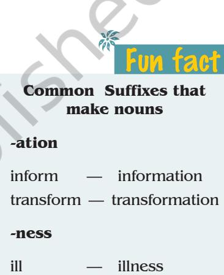
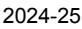
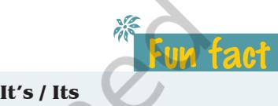
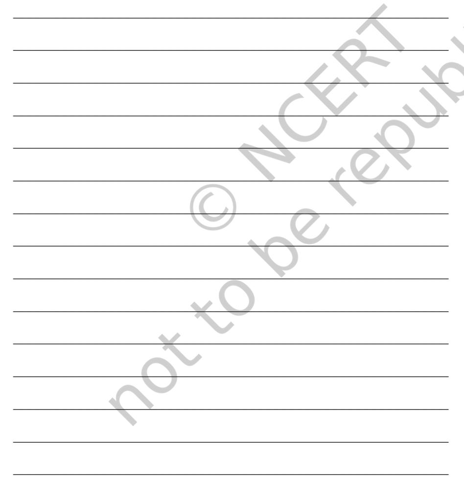
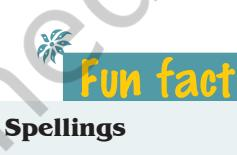
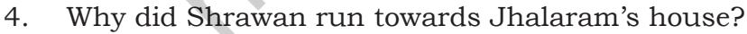
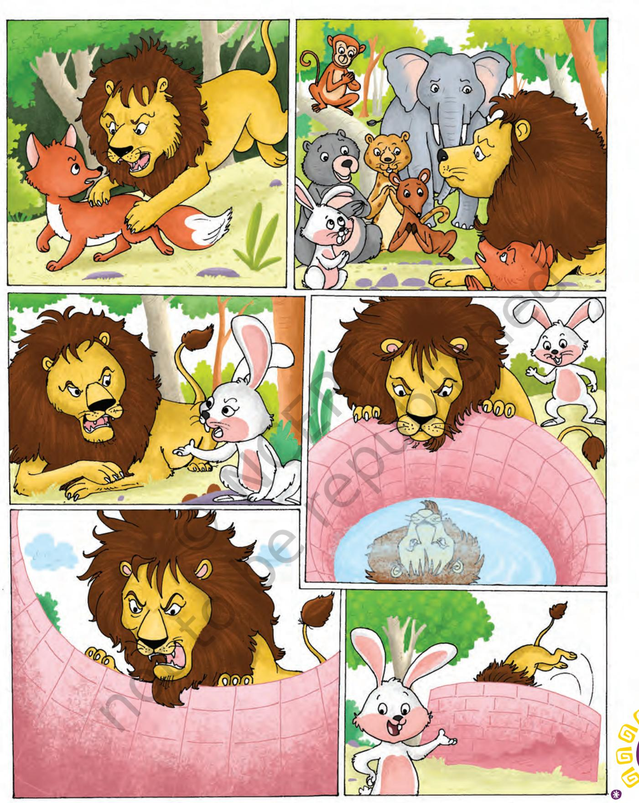
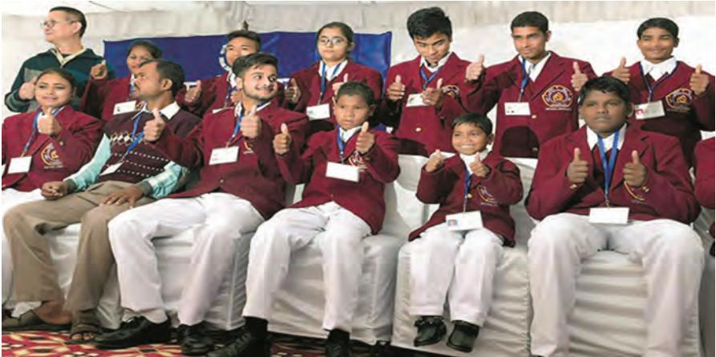

# LE T 'S B EG I N

You have read the story 'The Snake and the Mirror'. Now read the poems given in the textbook, *Beehive*, 'The Snake Trying' (page 125) and 'Green Snake' (page 126).

- Note the actions of these three snakes.
- Note the reactions of the story writer and the poets. What do they feel?
- Do you think any of the snakes wanted to do any harm?
- What is the human behaviour towards them?

Discuss all these points with your partner and together share with your other friends.

# **READING COMPREHENSION**

Read the passage given below and answer the questions that follow.

**Text I**

### **THE MIRACULOUS ESCAPE**

I had been very wealthy and prosperous and was leading a very comfortable life. I had all the worldly pleasures with me. But soon I became bored of my idle life. The urge to go on a voyage became stronger and stronger day by day. It haunted me like anything. So one day I boarded a ship and went trading from island to island with other merchants.

When we started, the weather was fine and the sea was calm. But on the fourth day of our voyage, our ship was caught in a terrific/terrible hurricane and we wandered from our set course. The tempest continued for several days and drove us near an island. The captain of the ship

Unit 5.indd 67 1/7/2019 10:06:19 AM

was reluctant to cast anchor at the port as it was a much dreaded place.

The violent waves of the sea had exhausted us. We were all tired and hungry so we went in search of food and water. We were fortunate enough to find fruit trees and a stream of fresh and cool water which gave us strength and energy and relieved us from hunger.

It had started getting dark. As we were tired we went to sleep but were soon startled by a rustling noise which came from a very long and huge python like serpent gliding swiftly towards us. We ran to save our lives but the serpent was quick enough to swallow one of my companions. We kept running till we had covered a good enough distance from the serpent. We felt a bit relieved but at the same time sad as we had lost a friend of ours. We took shelter on the top of a tree and thought ourselves to be safe.

But we were mistaken for we had hardly slept a little time when we heard a hissing sound which alarmed and frightened us. Coiling itself round the tree, the serpent reached my other companion who was positioned somewhat lower than me on the tree. It swallowed him and went away. Terror stricken I clung to the branch of the tree tightly and I did not know when I fell asleep. It was daylight when I awoke. I climbed down. It seemed to me that I had no courage left. It took me no time to realise that if I would not think of a way to escape soon, I would be a dead man. It was just a matter of time when I would also be swallowed like my two other companions. The instinct to prevent one's life is greater than any fear or frustration.

I thought I should spare no means to save myself. I collected a lot of dry wood and bushes and tied them into a bundle with reeds. I arranged them in a circular structure round the tree and tied some of them with the branches of the tree. In this way I made a tent like structure in which I sat after dusk and securely tied from within. I had the satisfaction that whatever I could do I did it to prevent myself. This time when the serpent arrived he crept round the tree but he could not penetrate the defensive structure I had made around me. It just sat and waited the whole night like a cat that waits for the mouse to emerge out of its hole.

*rustle:* make a soft, muffled crackling sound like that caused by the movement of dry leaves or paper

*alarm:* a warning of danger

*penetrate:* force a way into or through

68 Words and Expressions 1

2024-25

Unit 5.indd 68 30-05-2018 11:52:48

At dawn the serpent crept back but I dared not come out of my fortress. I lay there half dead and almost suffocated.

When the Sun began to shine, I came out of my wooden fortress. I was so desperate that I ran towards the seashore. When I was about to jump into the sea, I saw a ship sailing at some distance. I shouted wildly, I took off my shirt and waved it too, which attracted the sailors on the ship and a rescue boat was immediately sent for me. This was my miraculous escape from the deadly serpent.

(Source: Anonymous)

Discuss what effect did the story have an you? What would you have done, if you were in the narrator's place? Does it teach you how to save yourself from danger? Now based on your reading of the story, answer the questions that follow. You may read the story again.

- 1. What made the narrator go on a voyage?
	- (a) He was rich and satisfied with his life.
	- (b) He felt bored of his life.
	- (c) He had urge to go on a voyage.
	- (d) He was adventurous.
- 2. How did the narrator and his friends feed themselves?
	- (a) They ate fish.
	- (b) They could not find anything to eat.
	- (c) They ate fruits to survive.
	- (d) They ate the food they had brought with themselves.

_____________________________________________________

_____________________________________________________

_____________________________________________________

_____________________________________________________

_____________________________________________________

- 3. The narrator and his companions were on the tree. The serpent swallowed his companion but not the narrator. Why?
68 Unit 5 69

2024-25

Unit 5.indd 69 30-05-2018 11:52:48

*wildly:* uncontrolled; unrestrained; very enthusiastic or excited

kind — kindness

- 4. How did the narrator save himself from the serpent?
_____________________________________________________

_____________________________________________________

_____________________________________________________

_____________________________________________________

- 5. Find the words in the story which mean the nearest to the words given below.
	- (a) rich (First para) __________________________________
	- (b) moved (Second para) _____________________________
	- (c) tired (Third para) ________________________________
	- (d) scared (Fifth para) _______________________________
	- (e) urge (Fifth para) _________________________________
- 6. Now find words in the story which mean the opposite of the given words.
	- (a) poor (First para) _________________________________
	- (b) weak (Third para) ________________________________
	- (c) enforce (Third para) ______________________________
	- (d) insecurely (Sixth para) _________________________
	- (e) offensive (Sixth para) ____________________________

## **Vocabulary**

1. The story of Miraculous Escape has a number of words which describe the narrator's feeling of fear and getting tired of the journey. List the words of the two feelings and experiences.

| Fear | Getting tired |
| --- | --- |
| Terrific, ____________________, | Exhausted, __________________, |
| ____________,________________, | ____________,________________, |
| ____________,________________, | ____________,________________, |
| ____________,________________, | ____________,________________, |

Unit 5.indd 70 30-05-2018 11:52:48

### **Common Error**

#### **Incorrect:**

Arti is living far away with India.

#### **Correct:**

Arti is living far away from India.

- 2. Can you now add suffix which can mean or relate to the word 'fear'? First one has been done for you.

|  |  | Fear |
| --- | --- | --- |
| (a) | fearsome | (e) fear _________________ |
| (b) | fear ______________________ | (f) fear _________________ |
| (c) | fear ______________________ | (g) fear _________________ |
| (d) | fear ______________________ | (h) fear _________________ |

# **Grammar**

### **Reported Speech:** Reporting questions

- 1. You have learnt how to report questions from direct to indirect speech. Here is a paragraph with direct speech questions. Read them carefully and report into indirect speech. Rewrite the paragraph in the space given below.
 Once an old man asked a young boy, "Who do you think are the most intelligent people?" The young man said in return, "Who do you think so?" The old man said, "How can sons and daughters be intelligent without learning from their parents?" The young man said, "How did you as a parent learn?" The old man said, "Why are you hijacking my question by asking me back?" The young man said, "Didn't you know that you as a parent, now have learnt all the things on your own?" The old man said, "How do you say that we all learnt from others?" The young man said, "Why do you ask me about how to operate electronic gadget all the time?" The old man said, "Why can't I ask you because I have paid for the gadget you use?"

__________________________________________________________

__________________________________________________________

__________________________________________________________

__________________________________________________________

__________________________________________________________

**Incorrect:**  I do believe its her hard work.

#### **Correct:**

I do believe it's her hard work.

**Incorrect:**  The dog is waving it's tail.

**Correct:**  The dog is waving its tail.

Unit 5.indd 71 30-05-2018 11:52:48

- 2. Now here is a set of sentences given in indirect speech. Change them into direct speech.
__________________________________________________________

__________________________________________________________

__________________________________________________________

__________________________________________________________

__________________________________________________________

__________________________________________________________

__________________________________________________________

__________________________________________________________

__________________________________________________________

| Indirect Speech | Direct Speech |
| --- | --- |
| (a) Romesh asked Lata whether she | (a) Romesh |
| could go with him for a picnic the |  |
| next day. |  |
| (b) Lata replied why had he asked her | (b) Lata |
| to join. |  |
| (c) Romesh asked Lata why she was | (c) Romesh |
| questioning him. |  |
| (d) Lata replied there was no use | (d) Lata |
| visiting the place she had seen |  |
| before. |  |
| (e) Romesh asked Lata what was | (e) Romesh |
| wrong in visiting the same place |  |
| again for the place was not the |  |
| same. |  |
| Editing |  |
| 1. | Some of the prepositions are incorrectly used in the |

- following story. Correct them and read the story aloud. Then rewrite the story in the space given below.

72 Words and Expressions 1

2024-25

Unit 5.indd 72 30-05-2018 11:52:48

### **The Dog and His Bone Notes**

A hungry dog while searching about food found a bone. He picked it out and held it tightly in his mouth and ran out into the woods, to a safe place to enjoy it in ease. He growled and frowned at anyone who attempted to take it over. He chewed the bone for a very long time and this made him quite thirsty. He came to a stream to quench his thirst. He trotted around the footbridge and happened to glance into the water. He saw his own reflection in the water. Thinking it was another dog with a bigger bone, he growled and scowled towards it. The reflection growled and scowled back. Being greedy by nature, he wanted that bone too. He snapped his sharp teeth at the image on the water. He barked at the other dog, hoping to scare him into giving that bone. His own big bone fell with a splash, went over of sight, the moment he opened his mouth to bite!

*footbridge:* a bridge for pedestrians

## Fun fact

**On and off/ Off and on**

#### **On and off**

**Meaning:** at regular intervals **Incorrect:**

He has been working off and on several months to complete his PhD thesis.

#### **Correct:**

He has been working on and off several months to complete his PhD thesis.

#### **Off and on**

**Meaning:** occasionally **Incorrect:** He visits me on and off. **Correct:** 

He visits me off and on.

72 Unit 5 73

Unit 5.indd 73 30-05-2018 11:52:48

- 2. Rearrange each set of words to make sentences. Use appropriate punctuation marks.
	- (a) when I gave her, the bad news, she turned pale

_________________________________________________

_________________________________________________

_________________________________________________

_________________________________________________

_________________________________________________

_________________________________________________

_________________________________________________

_________________________________________________

_________________________________________________

_________________________________________________

_________________________________________________

_________________________________________________

#### **Accept / Except**

Accept is a verb which means "to receive".

Except is used as a preposition and means "not including".

#### **Incorrect:**

Sandhya excepted her student's offer to drive her home.

#### **Correct:**

Sandhya accepted her student's offer to drive her home.

#### **Incorrect:**

The paper submissions can be done on weekdays, accept Mondays.

#### **Correct:**

The paper submissions can be done on weekdays, except Mondays.

(b) become rotten, as it has, the apple, don't eat

(c) great friends, last quarrel, after their, they became

- (d) first and only novel, after her, got a prize, she became famous
## **Listening**

How brave are you? Take a minute to think over this question. There are people who risk their lives to save someone's life from danger. Here is a child who dared and saved lives. Let us listen to the story of a braveheart.

#### **The Brave Hearts**

On October 26, 2009, Jhalaram's hut in the village Sarneshwar in Rajasthan, suddenly caught fire. His two daughters, aged two-and-a-half years and one year, as well as ten goats were in the hut at that time.

74 Words and Expressions 1

2024-25

Unit 5.indd 74 30-05-2018 11:52:48

Shrawan Kumar, a six-year old boy, was playing in his house at a distance of about 200 feet. Seeing smoke coming out from Jhalaram's house, he ran towards it. He saw the children sitting on a cot and screaming for help, and the goats caught in the flames.

Shrawan entered the house, lifted the younger child in one arm and pulling the older one by the hand, brought them out safely. He took them to his house, then ran to inform his father and the children's father.

The elders rushed to the site. But by that time, the goats had died and the household belongings had been destroyed in the fire. It was Shrawan Kumar's daring act that saved the lives of the two children.

> (Shrawan Kumar, 6 years old, Sarneshwar, Rajasthan) (Source: *Children's World*, May 2012)

Your teacher will read out the story. Listen to the story carefully and answer the questions below. You may ask the teacher to read out the story more than once.

_____________________________________________________

_____________________________________________________

_____________________________________________________

_____________________________________________________

_____________________________________________________

_____________________________________________________

_____________________________________________________

_____________________________________________________

_____________________________________________________

_____________________________________________________

_____________________________________________________

_____________________________________________________

- 1. Where is the village of Sarneshwar?
- 2. Whose hut had caught fire?

| British | American |
| --- | --- |
| Colour | Color |
| Honour | Honor |
| Programme | Program |
| Travelling | Traveling |
| Fulfil | Fulfill |
| Centre | Center |
| Dialogue | Dialog |
| Grey | Gray |

- 3. Who all were there in the hut when it caught fire?

Unit 5.indd 75 30-05-2018 11:52:48

- 5. How did Shrawan save the two children?
_____________________________________________________

_____________________________________________________

_____________________________________________________

_____________________________________________________

_____________________________________________________

_____________________________________________________

- 6. What happened to the goats?
# Fun fact

#### **Superfluous commas**

Many times, commas are used liberally even when they are not necessary.

#### **Incorrect:**

Hari never went into the city, because he did not feel comfortable driving in traffic.

#### **Correct:**

Hari never went into the city because he did not feel comfortable driving in traffic.

#### **Incorrect:**

Roma wants to get a degree in Fine Arts, or Music.

#### **Correct:**

Roma wants to get a degree in Fine Arts or Music.

#### **Incorrect:**

The book on the table, belongs to Sara.

#### **Correct:**

The book on the table belongs to Sara.

### **Writing**

- 1. A group of pictures are given here. They make a story. This story is from the *Tales of Panchatantra*.

76 Words and Expressions 1

2024-25

Unit 5.indd 76 30-05-2018 11:52:49

## **Speaking**

Imagine yourself as the narrator in the story 'The Miraculous Escape' and describe your experience during your voyage. Jot down the points you want to speak on. Then narrate your experience to your partner. You may begin like this:

I have been thinking of going on a voyage. And here came the opportunity to sail on a ship! I enjoyed the bule sea, the silence all around, amazing sunrise for a week. Then suddenly one day.......

__________________________________________________________

__________________________________________________________

__________________________________________________________

__________________________________________________________

__________________________________________________________

__________________________________________________________

__________________________________________________________

**Your points:**

2024-25

Unit 5.indd 77 30-05-2018 11:52:49

| Now write the story in the lines provided below. Provide a |
| --- |
| suitable title to the story. |
| ________________________________ |
| ____________________________________________________________________________________ |
| ____________________________________________________________________________________ |
| ____________________________________________________________________________________ |
| ____________________________________________________________________________________ |
| ____________________________________________________________________________________ |
| ____________________________________________________________________________________ |
| ____________________________________________________________________________________ |
| ____________________________________________________________________________________ |
| ____________________________________________________________________________________ |
| ____________________________________________________________________________________ |
| ____________________________________________________________________________________ |
| ____________________________________________________________________________________ |
| ____________________________________________________________________________________ |
| ____________________________________________________________________________________ |
| ____________________________________________________________________________________ |

2. Courage needs no age and comes after we let go of all our fears. Every year, on the Republic Day, National Bravery Awards are given to selected children for their act of bravery against all odds. These children are able to achieve this glory as they overcome their moments of fear and do their best to save precious lives.

Make a list of any five such children and their actions for which they have been awarded the National Bravery Award. Write a few paragraphs on each child. Keep your writings in the Class Library or the Reading Club for all your friends to read.

2024-25

Unit 5.indd 78 30-05-2018 11:52:49

(Source: https://www.ndtv.com/india-news/national-bravery-awards-2018-meet-the-18-bravehearts-of-india-1802479)

# **Project**

- 1. The stories of 'The Snake and the Mirror' and 'The Miraculous Escape' show how people face danger and are scared of animals. As children, many of us fear stray dogs. Both adults and children are scared of snakes. Fear exists in most of us. Some fears have bases and others do not. Let us conduct a survey of what people fear about. You may follow the guidelines given below.
	- Form groups of four, and select an area for your survey. It may be your classmates, teachers or people in your neighbourhood.
	- Develop a questionnaire to collect information about the fears people have. You may have at least eight to ten questions.
	- Decide how many people you will ask the questions for the survey.
	- Ask people the questions.
	- Write their opinions in tabular form.
	- Now write the first draft of the report.
	- You may add graphic representations of the information and the data collected.
	- Edit and write the report to make it final.
	- Present it in a report form to the class.
	- You can also make a PowerPoint presentation.

78 Unit 5 79

Unit 5.indd 79 30-05-2018 11:52:50

