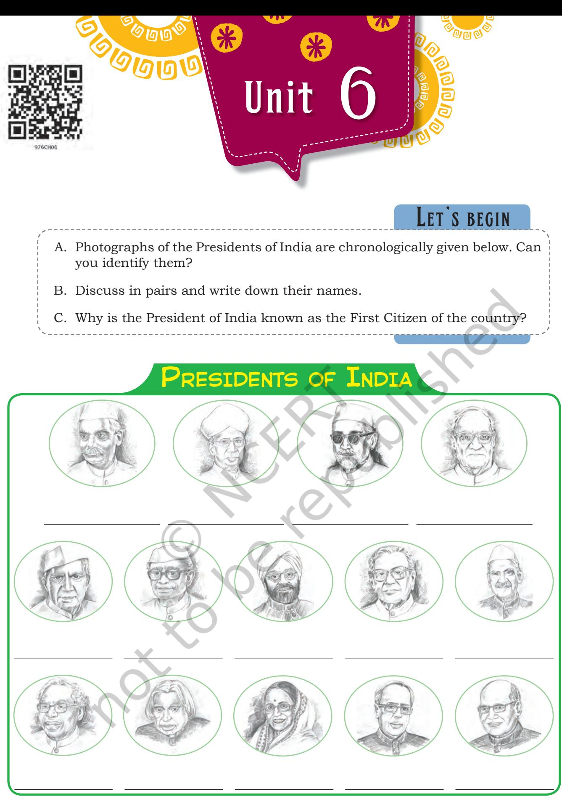
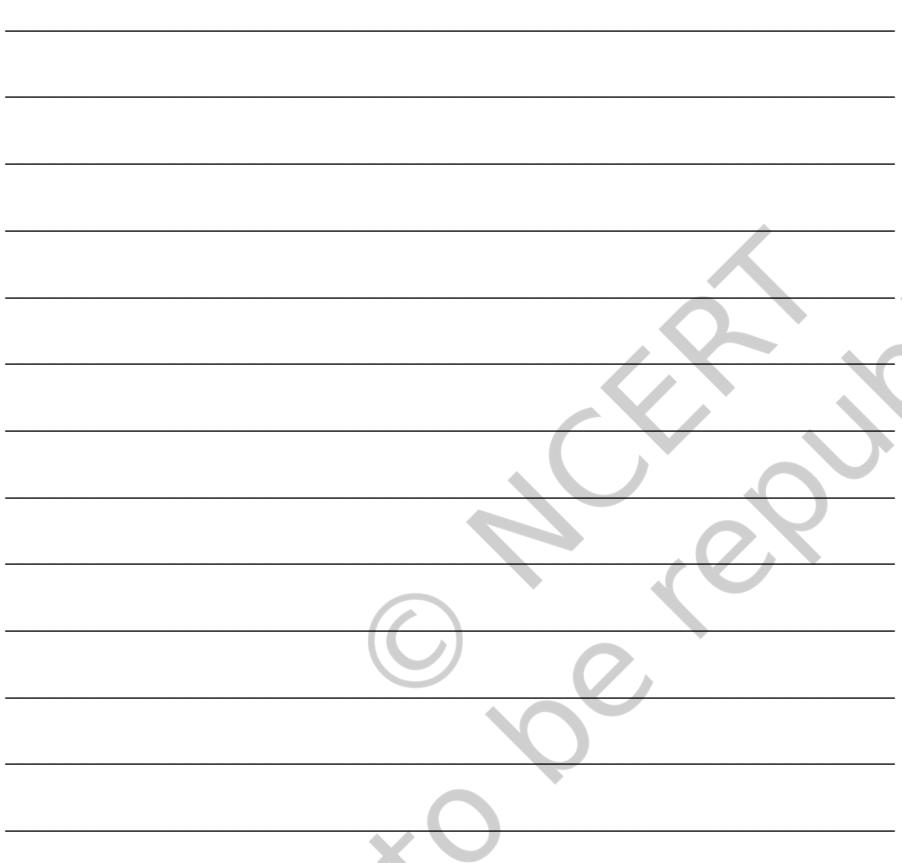
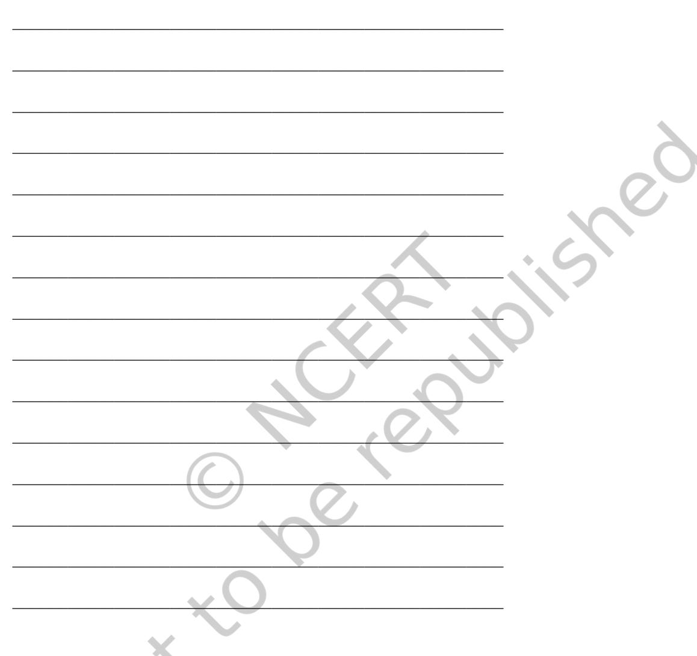

Unit 6.indd 80 1/7/2019 10:10:41 AM

## **Reading Comprehension Notes**

Read the following passages and answer the questions that follow.

#### **Text I**

I must have been about seven when my father left Porbandar for Rajkot to become a member of the Rajasthanik Court. There I was put into a primary school, and I can well recollect those days, including the names and other particulars of the teachers who taught me. As at Porbandar, so here, there is hardly anything to note about my studies. I could only have been a mediocre student. From this school I went to the suburban school and thence to high school, having already reached my twelfth year. I do not remember having ever told a lie, during this short period, either to my teachers or to my school-mates. However, I used to be very shy and avoided all company. My books and my lessons were my sole companions. To be at school at the stroke of the hour and to run back home as soon as the school closed—that was my daily habit. There is an incident which occurred at the examination during my first year at high school and which is worth recording. Mr Giles, the educational Inspector, had come on a visit of inspection. He had set us five words to write as a spelling exercise. One of the words was 'Kettle'. I had misspelt it. The teacher tried to prompt me with the point of his boot, but I would not be prompted. It was beyond me to see that he wanted me to copy the spelling from my neighbour's slate, for I had thought that the teacher was there to supervise us against copying. The result was that all the boys, except myself, were found to have spelt every word correctly. I could never learn the art of 'copying'. Yet the incident did not in the least diminish my respect for my teacher. I was by nature, blind to the faults of elders. Later I came to know of many other failings of this teacher, but my regard for him remained the same. Two other incidents belonging to the same period have always clung to my memory. As a rule I had distaste for any reading beyond my school books. The daily lessons had to be done, because I disliked being taken to task by my teacher as much as I disliked deceiving him. Therefore I would do the lessons,

*prompt:* cause someone to take a course of action

*deceive:* give a mistaken impression

Unit 6 81

Unit 6.indd 81 30-05-2018 11:55:47

*indelible:* not able to be forgotten

#### **On time / In time**

**On time:** At the planned time, neither early nor late **In time:** With time to spare, before something happens

#### **Examples:**

The flight arrived **on time**.

We arrived **in time** to check in.

I reached the station just **in time** to catch the train.

If you are not **on time**, the teacher won't let you enter the classroom.

**Notes** but often without my mind in them. Thus, when even the lessons could not be done properly, there was of course no question of any extra reading. But somehow my eyes fell on a book purchased by my father. It was *Shravana Pitribhakti Nataka*. I read it with intense interest. One of the pictures I was shown was of Shravana carrying, by means of slings fitted for his shoulders, his blind parents on a pilgrimage. The book and the picture left an indelible impression on my mind.

> (An excerpt from *The Story of My Experiments with Truth*, Mohandas Karamchand Gandhi)

- 1. Choose the correct option from the bracket and fill in the blanks.
	- (a) Mohandas Karamchand Gandhi was a/an __________________________ student. ( average, poor, intelligent)
	- (b) As a boy, Mohandas used to be very _______________ and avoided all company. (timid, fearful, outspoken)
	- (c) The teacher tried to ______________________________ him with the point of his boot. (suggest, force, instruct)
	- (d) Young Mohandas________________________________ any reading beyond his school books. (disliked, liked, hated)
	- (e) He read *Shravana Pitribhakti* with ________________ interest. (great, least, little)
- 2. Answer the following questions in brief. (30 words)
	- (a) Where did Mohandas complete his primary education?

_________________________________________________

_________________________________________________

82 Words and Expressions 1

2024-25

Unit 6.indd 82 30-05-2018 11:55:47

- (b) Who were Mohandas Gandhi's sole companions in his childhood?
_________________________________________________

_________________________________________________

_________________________________________________

_________________________________________________

_________________________________________________

_________________________________________________

_________________________________________________

_________________________________________________

- (c) Which incident given in the passage reflects Mohandas's honesty?
- (d) Which two things did Mohandas dislike the most?

**Common Error Incorrect:**  Are you a saler, Raju? **Correct:** Are you a salesman, Raju?

- (e) What did the picture of Shravana convey to Mohandas Gandhi?
- (f) Pick out five qualities and traits which young Mohandas Karamchand Gandhi had. One is done for you.

Absolutely non-judgemental, couldn't see the bad qualities of his teacher.

__________________________________________________________ __________________________________________________________ __________________________________________________________ __________________________________________________________ __________________________________________________________ __________________________________________________________ __________________________________________________________ __________________________________________________________

82 Unit 6 83

2024-25

Unit 6.indd 83 30-05-2018 11:55:47

- **Notes** 3. Locate words from the passage with similar meaning:
	- (a) reduce __________________________ (b) only one __________________________ (c) dupe __________________________
		- (d) permanent effect __________________________

### **Text II**

Indra Krishnamurthy Nooyi is an Indian American business executive. She is the Chairman and Chief Executive Officer of Pepsico. She is one among the world's most powerful women. She delivered the following speech at the Rashtrapati Bhawan on 14 December 2013. She was named one of the 25 Greatest Living Legends by NDTV, and was awarded by the then President of India, Pranab Mukherjee at the Rashtrapati Bhawan.

Read the speech delivered by Indra Nooyi and answer the questions that follow.

*Mr President and NDTV, thank you very much for this incredible honour.*

*Malcom Gladwell in his book, Outliers says: "Who you are cannot be separated from where you came from."*

*I left India 35 years ago, went to the USA and had tremendous success in the meritocracy. But none of that could have happened if I would not have had wonderful upbringing very much here in India. So I have a lot to thank India for. Now my three lessons I would like to share with you.*

*First, please be a lifelong student. You know when we were kids, we used to ask questions like "Why is the sky blue?", "Why the birds flying so high?" But for some reasons, as we get older, that curiosity goes away. And if we are happy with the knowledge we have, then we are actually going to atrophy. So, please remain a lifelong student, don't lose that curiosity.*

*Second, whatever you do, throw yourself into it, throw your head, heart and hands into it. I look at my job not as a* 

*meritocracy:* a ruling or influential class of educated or able people

*atrophy:* gradual decline in effectiveness or vigour due to underuse or neglect

84 Words and Expressions 1

2024-25

Unit 6.indd 84 30-05-2018 11:55:47

*job, I look at it as a Calling, as a Passion and I don't care about the hours, about the hardships, because to me everything is a joy. So whatever you do, please look upon it as a Calling, a Passion, not as a job, not as something temporary.*

*The third and the most important one, please help others rise. Greatness comes not from a position, but from helping build a future. All of us in position of power have an obligation to pull others up. You know, as I stand here today, I look at my responsibility not as accepting an honour, I look upon it as accepting a challenge and a responsibility, an obligation to actually make it possible for people who are younger to come up and achieve levels of greatness, so they too can be on the stage sometime in the future.*

> (Source: Speech delivered by Indra Nooyi at the Rashtrapati Bhawan on 14 December 2013)

- 1. What has Malcom Gladwell said in his book, that Indra Nooyi is refering to in her speech?
_____________________________________________________

_____________________________________________________

_____________________________________________________

_____________________________________________________

_____________________________________________________

_____________________________________________________

_____________________________________________________

_____________________________________________________

_____________________________________________________

_____________________________________________________

_____________________________________________________

#### **Contradictory proverbs**

All good things come to those who wait. *but*  Time and tide wait for none.

The pen is mightier than the sword.

*but*

Actions speak louder than words.

Look before you leap. *but* Strike when the iron is hot.

- 2. What according to Indra Nooyi helped her achieve great success?
3. What is the first lesson that Indra Nooyi has talked about in her speech?

Unit 6.indd 85 31-05-2018 16:10:38

| NOTES |
| --- |

- 
- 
- 
- 
- 
- 2. Take words from the box given below and match the words that go along with them. You may use some of the words more than once.
#### **Example:** Communal-harmony

| tune | paper | system | fine |
| --- | --- | --- | --- |
| water | communal | news | heart |
| sound | study | black | kill |
| felt | proof | tour | joy |
| harmony |  |  |  |

Write the words here.

- 3. You would have come across some words from Indian languages used in the chapter 'My Childhood' in your textbook, *Beehive*.
**Example:** *pucca*.

Look up the dictionary in the English language and find ten words which are of Indian origin. Two are done for you:

**Common Phrasal Verbs**

**OUT**

**Act out**  We can act out the scene.

**Bring out**  The waiter will bring out the food.

**Draw out**  Can you draw out the plans?

**Eat out**  They eat out on Sundays.

**Empty out** I emptied out the bag.

**Find out**  Did she find out about the party?

**Get out** Get out and enjoy the day!

**Go out**  Let's go out for dinner.

**Hang out**  We will hang out after school.

**Jump out** He jumped out of the plane.

**Leave out**  The cook left out the sugar.

**Let out**  Please let out the dog.

**Miss out**  Don't miss out on the prize.

**Move out**  He moved out of his house.

Unit 6.indd 87 30-05-2018 11:55:47

| (a) | Chutney | (g) | __________________ |
| --- | --- | --- | --- |
| (b) | Karma | (h) | __________________ |
| (c) | __________________ | (i) | __________________ |
| (d) | __________________ | (j) | __________________ |
| (e) | __________________ | (k) | __________________ |
| (f) | __________________ | (l) | __________________ |

### **Grammar**

**Immigrate / Emigrate**

To **immigrate** is to settle in a new country or region.

To **emigrate** is to leave a native country or region to settle elsewhere.

**Immigrate** is usually followed by **to**, and **emigrate** is usually followed by **from**.

The *em*—words have to do with "leaving", and the *imm*—words have to do with "entering".

1. Fill in the blanks to complete the process of washing clothes in a machine. Use passive form of the verbs given in brackets.

> Dirty clothes are ____________________________ (take) for washing. Clothes are ________________________

> (separate) on the basis of texture, colour, etc., and

_________________________ (make) into piles. Each pile

is _______________________ (put) in the washing machine

tub. Then detergent powder is _________________ (add)

and the required programme is _________________ (set).

Once the washing is over the clothes are _____________

(remove) from the tub and ____________________ (hang) for drying.

### 2. Passive voice

Expand the News Headlines into three to four sentences of a short article. Use passive voice wherever it is required.

**Example:** 

(a) Mumbai flooded with rain water

Yesterday Mumbai was hit by incessant rain. The city is flooded with rain water now. Water is being pumped out from the roads. The residents are requested by the Municipal Corporation to remain indoors.

88 Words and Expressions 1

2024-25

Unit 6.indd 88 30-05-2018 11:55:47

- (b) The fire caused by crackers
- (c) Bank robbed in broad daylight
- (d) Taxes lowered for some commodities

- 3. Phrasal Verb
In the lesson 'My Childhood' in your textbook, *Beehive*, the phrasal verb 'break out' is used by combining a verb (break) with a preposition (out) denoting the meaning

88 Unit 6 89

Unit 6.indd 89 30-05-2018 11:55:47

'to begin'. Many more phrasal verbs can be formed with the same verb 'break' joining with other prepositions. They are—

break into break away break open break down break up

 Now, replace the underlined words with a phrasal verb from the list given above using the correct form.

- (a) The passengers were troubled when the bus stopped due to engine failure.
_____________________________________________________

_____________________________________________________

- (b) Neha's relationship with Rohan came to an end over a very silly matter.
_____________________________________________________

_____________________________________________________

- (c) The burglar in spite of all security, entered Mr Khan's house and took away all valuables.
_____________________________________________________

_____________________________________________________

- (d) The child attempted to leave the mother's grasp, but she held fast.
_____________________________________________________

_____________________________________________________

- (e) The new director desired to discard the age-old practices in the office.
_____________________________________________________

_____________________________________________________

90 Words and Expressions 1

2024-25

Unit 6.indd 90 30-05-2018 11:55:47

**Spelling Rules**

#### **Desert & Dessert**

The first syllable of desert is stressed, and the word is spelled with only one 's'. Dessert, on the other hand, has the stress placed on the second syllable, and is spelled with two 's'.

#### **Examples:**

The **desert** has animals and plants that are uniquely adapted to dry environments.

His favourite **dessert** is chocolate cake.

# **Editing Notes**

Use capital letters, full-stops, commas and inverted commas wherever necessary in the following story. Some words are also wrongly spelt. Check the spelling errors and correct them.

once the Fairies of the Trees set out to choose their dwelling places some were wise in making their choices and some were foolis

the wise fairies shunned the trees that stood alone in the open fields, and settld in a thick forest. but the foolish ones said, Why should we crowd together in a forest Let us go and live in lonely trees near villages, where humans will bring us gifts.

One night a greate tempest swept over the countri the lonely trees were blown down, and the foolis fairys became homeless; but the great, dense forest resisted the fury of the storm. The wise fairies said to the foolish ones Peopl should stand together like a dense forest. It is only the solitary tree, growing unprotekted in the open field that is overthrown by a silly thing like a storm

Write the corrected story here.

| __________________________________________________________ |
| --- |
| __________________________________________________________ |
| __________________________________________________________ |
| __________________________________________________________ |
| __________________________________________________________ |
| __________________________________________________________ |
| __________________________________________________________ |
| __________________________________________________________ |
| __________________________________________________________ |
| __________________________________________________________ |

__________________________________________________________

2024-25

Unit 6.indd 91 30-05-2018 11:55:47

**Commonly misspelt words**

| Incorrect | Correct |
| --- | --- |
| Accomodate | Accommodate |
| Recieve | Receive |
| Arguement | Argument |
| Commitee | Committee |
| Embarass | Embarrass |

## **Listening**

Given below is an extract from Malala Yousafzai's speech at the UN General Assembly on 12 July 2013.

__________________________________________________________

__________________________________________________________

__________________________________________________________

__________________________________________________________

__________________________________________________________

Malala Yousafzai is a young Pakistani girl who was shot at by the Taliban because she wanted to study. She was awarded the Nobel Peace Prize in 2014 for her struggle for the right of all children to education.

The teacher or one of your classmates will read out the extract. Answer all the questions after listening to the extract.

*Honourable UN Secretary General Mr Ban Ki-moon, respected President of the General Assembly Vuk Jeremic, honourable UN envoy for global education Mr Gordon Brown, respected elders and my dear brothers and sisters: Assalamu alaikum.*

*Today it is an honour for me to be speaking again after a long time. Being here with such honourable people is a great moment in my life and it is an honour for me that today I am wearing a shawl of late Benazir Bhutto. I don't know where to begin my speech. I don't know what people would be expecting me to say, but first of all thank you to God for whom we all are equal and thank you to every person who has prayed for my fast recovery and new life. I cannot believe how much love people have shown me. I have received thousands of good-wish cards and gifts from all over the world. Thank you to all of them. Thank you to the children whose innocent words encouraged me. Thank you to my elders whose prayers strengthened me. I would like to thank my nurses, doctors and the staff of the hospitals in Pakistan and the UK and the UAE government who have helped me to get better and recover my strength.*

92 Words and Expressions 1

2024-25

Unit 6.indd 92 30-05-2018 11:55:47

*... There are hundreds of human rights activists and social* **Notes** *workers who are not only speaking for their rights, but who are struggling to achieve their goal of peace, education and equality. Thousands of people have been killed by the terrorists and millions have been injured. I am just one of them. So here I stand, one girl among many. I speak not for myself, but so those without a voice can be heard. Those who have fought for their rights ...Their right to live in peace. Their right to be treated with dignity. Their right to equality of opportunity. Their right to be educated*.

*... the compassion I have learned from Mohamed, the Prophet of Mercy, Jesus Christ and Lord Buddha. This the legacy of change I have inherited from Martin Luther King, Nelson Mandela and Mohammed Ali Jinnah.*

*This is the philosophy of non-violence that I have learned from Gandhi, Bacha Khan and Mother Teresa. And this is the forgiveness that I have learned from my father and from my mother. This is what my soul is telling me: be peaceful and love everyone* ... *Thank you*.

_____________________________________________________

_____________________________________________________

_____________________________________________________

_____________________________________________________

_____________________________________________________

_____________________________________________________

_____________________________________________________

_____________________________________________________

- 1. Why did the Taliban shoot Malala?
- 2. Why was Malala awarded the Nobel Peace Prize?
- 3. Who all did Malala thank in her speech and why?
- 4. What are the activists and social workers struggling for?

2024-25

Unit 6.indd 93 30-05-2018 11:55:48

- 5. What rights did she talk about in her speech? Tick () the right answers.
	- (a) right to live in peace
	- (b) right to be treated with dignity
	- (c) right to have a safe home
	- (d) right to equality of opportunity
	- (e) right to fight for self
	- (f) right to be educated
- 6. From whom did Malala learn
	- (a) compassion_____________________________________

- Fun fact
#### **Common mistake**

#### **Good vs Well**

Good is an adjective. It is used to modify a noun.

Well is an adverb. It is used to modify a verb. It is also used as an adjective.

#### **Examples:**

You did a good job. (Adj.) You did your job well. (Adv.) She is well. (Adj.)

- (b) the philosophy of non-violence___________________
- (c) forgiveness_________________________________________

### **Speaking**

- 1. Prepare five slips with the following words written on them. The class will be divided into 4 groups. Each group will be asked to pick up a slip and discuss the topic for 5 minutes. Finally, one representative from the group will make a brief presentation on the topic.
_________________________________________________

_________________________________________________

_________________________________________________

- 1. ancestral house
- 2. secure childhood
- 3. primary school
- 4. social barriers
- 5. communal harmony

Some words given in the box below may be helpful. You can use any other words that are appropriate to the topic.

> ancient large emotional co-existence upbringing inequality system tradition friendship

2024-25

Unit 6.indd 94 30-05-2018 11:55:48

# **Writing**

- 1. In 2010, the United Nations declared Dr A.P.J. Abdul Kalam's birthday (15th October) as World Students' Day. Write an article on the importance of the youth/ young students in the making of a New India. (120–150 words)
_____________________________________________________

# **Project**

- 1. Collect your favourite quotations by M.K. Gandhi, Dr Abdul Kalam, Mother Teresa, Lal Bahadur Shastri, J. Krishnamurti, any other personalities that you admire. Make a collage for display in the monthly wall magazine of your class.

Unit 6.indd 95 30-05-2018 11:55:48

