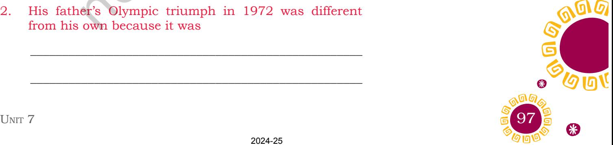
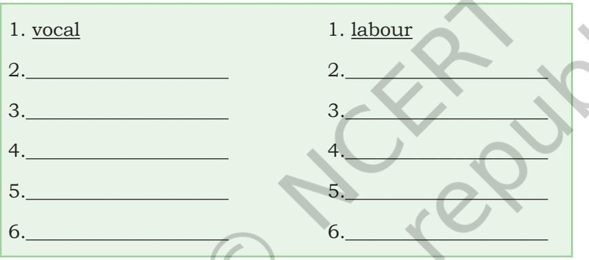
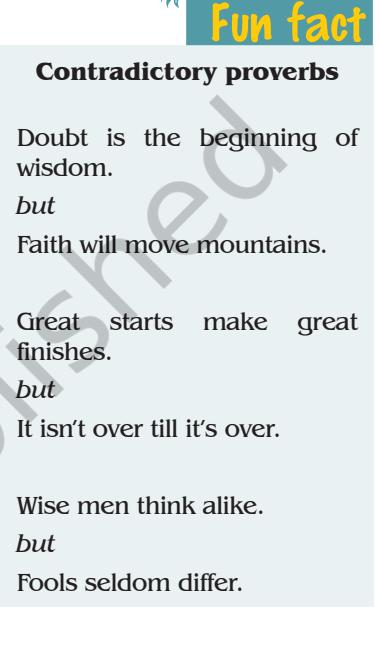
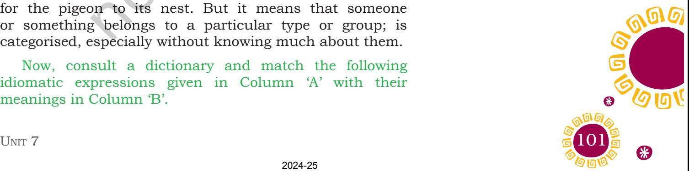
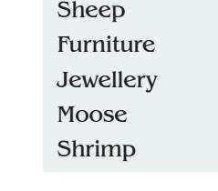
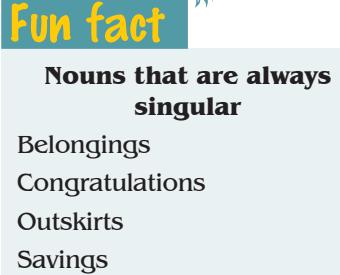
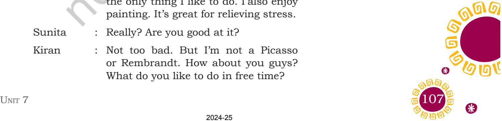
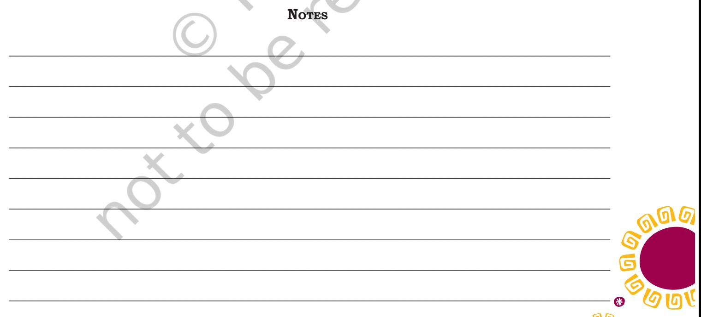

## Le t 's b eg i n

You have read about Santosh Yadav, the youngest woman in the world to have conquered Mount Everest in 1992. You must have heard or read about Poorna, who at the age of 13 years 11 months, became the youngest girl in the world to have scaled the Mount Everest in 2014, with sheer determination and willpower. You would have also read about Maria Sharapova who bagged the Women's Singles crown at Wimbledon in 2004. She was determined, tough, competitive, hard-working with unwavering desire. Both of them had big dreams from the very young age.

- 1. Do you have the passion to do something other than your studies like these two icons have? (Be it music, dance, theatre, trekking, watersport, painting, football, cricket, etc.)
- 2. Do you find any difficulty in pursuing your passion?
- 3. Who gives you support and encouragement to go ahead with your passion?

### **Reading Comprehension**

Read the following passage carefully. Based on your reading, answer the following questions in the space provided.

### **Text I**

On 3 August 1996, Leander Paes became the first Indian to win an individual medal in 44 years when he defeated Fernando Meligeni of Brazil in an exciting match in the Centennial Olympic Games at Atlanta. Paes ranked 31 places below the Brazilian, played with gusto and determination against a player who has two ATP tour titles under his belt, and clinched the bronze medal. He was given a standing

*gusto:* enjoyment and enthusiasm

Unit 7.indd 96 20-02-2023 09:25:57

ovation when Paes raised his hand in triumph and said a silent prayer.

Leander's father had won a bronze medal in the Munich Olympics 1972 as a member of the Indian hockey team. It is creditable to Leander Paes as he got it in an individual event.

Later he dedicated the medal to his coach and his doubles teammate. "They have helped me out and given me advice and kept me in good frame of mind. This medal doesn't just show my efforts; it shows the efforts of the whole team."

Paes was recognised as a prodigy by Vijay Amritraj in the '80s. Even so, Paes' true mentor has been Naresh Kumar, the former Indian Davis Cup Captain. His incredible Davis Cup record speaks for itself. While it may be said that some of his Davis Cup victories were achieved because he was playing on his favourite surface, grass and enjoyed home support. But at Atlanta, Paes had none of these advantages except his coach, close family members and the expatriates. While Davis Cup victories bring in good cash rewards and ATP (Association of Tennis Professionals) points, there he was playing for just a medal. Paes explains it all when he says, "When I am playing for my country I don't expect anything." That straightaway sets him apart.

He succeeds because of his willingness to take his chances, swift reflexes and mental strength, and the fact that he does not accept defeat easily.

(Source: http://www.jhs.ac.in/pdf/Cbse-qp/Grade-9/English/5.pdf)

- 1. Leander's victory at Atlanta is significant because

- 2. His father's Olympic triumph in 1972 was different from his own because it was
____________________________________________________

____________________________________________________

*prodigy:* a young person with exceptional qualities or abilities

*expatriate:* a person who lives outside their native country

Unit 7.indd 97 20-02-2023 09:25:57

**Commonly misspelt words**

| Incorrect | Correct |
| --- | --- |
| Posession | Possession |
| Recieve | Receive |
| Seperate | Separate |
| Supercede | Supersede |
| Threshhold | Threshold |
| Unforseen | Unforeseen |

- 3. Leander gave credit to his coach and his teammate in doubles for his victory. How did they help him?
____________________________________________________

____________________________________________________

____________________________________________________

____________________________________________________

____________________________________________________

____________________________________________________

____________________________________________________

____________________________________________________

____________________________________________________

____________________________________________________

____________________________________________________

____________________________________________________

- 4. If you are required to sum up Leander's qualities as a player, which one would you like to highlight and why?
- 5. In India, while registering his victories in Davis Cup one could say that he won because
- 6. At Atlanta he won because
- Read the following poem and answer the questions that follow.

#### **Text II**

#### **Where the Mind is Without Fear**

- Where the mind is without fear and the head is held high; Where knowledge is free;
- Where the world has not been broken up into fragments By narrow domestic walls;
- Where words come out from the depth of truth;
- Where tireless striving stretches its arms towards perfection;
	- Where the clear stream of reason has not lost its way

2024-25

Unit 7.indd 98 20-02-2023 09:25:57

Into the dreary desert sand of dead habits; Where the mind is led forward by thee Into ever-widening thought and action; Into that heaven of freedom, my Father, let my country awake

 *—Rabindranath Tagore*

- 1. Given here are certain ideas from the poem "Where the mind is without fear" by Rabindranath Tagore. Identify the lines from the poem that refer to these and write the lines in the space given below.
	- (a) Everybody should be able to learn.
	- (b) There ought not be a division among people on the basis of caste, class, creed, religion or any other such basis.

_________________________________________________

_________________________________________________

_________________________________________________

_________________________________________________

_________________________________________________

_________________________________________________

_________________________________________________

_________________________________________________

_________________________________________________

_________________________________________________

_________________________________________________

_________________________________________________

_________________________________________________

(c) People should be honest and speak out their heart.

- (d) Actions should stem from logic and not superstitions and beliefs, leading to progress.
(e) People to be free of fear and oppression.

**Spelling Error**

Fun fact

It is "calendar", not

"calender".

Unit 7.indd 99 20-02-2023 09:25:57

- 2. This poem was written by Rabindranath Tagore much before India attained freedom. What, do you think, is the significance of these lines in the context of his time?
__________________________________________________

__________________________________________________

| Fun fact | __________________________________________________ |
| --- | --- |
| Every cloud has a silver lining. | Voc abular y |
| There is some good hidden in bad things also. | 1. Suggest a word for each sentence/phrase correctly. |
|  | Refer to the chapter 'Reach for the Top, Part I' given in |
|  | your textbook, Beehive. The paragraph numbers where |
|  | these words are used, are given in brackets. |
|  | (a) A state of happiness and satisfaction. |
|  | _______________________________________________(2) |
|  | (b) An action or way of behaving that is usual in |
|  | tradition.______________________________________(3) |
|  | (c) A word or statement that expresses agreement or |
|  | confirmation.__________________________________(5) |
|  | (d) The ability to withstand hardship or adversity. |
|  | _______________________________________________(7) |
|  | (e) Final stage of something you've been working |
|  | towards.______________________________________(7) |
|  | 2. Fill in the blanks using the words given in the box. These |
|  | words are taken from the chapter 'Reach for the Top' of your textbook, Beehive. You can refer to a dictionary to |
|  | find out the meanings of these words. |
|  | prevails, positive, apology, affluent, expedition, |
|  | culmination |
|  | (a) She wears expensive dresses and jewellery. It seems |
|  | she belongs to an__________________________family. |
| 100 | Words and Expressions 1 |

2024-25

Unit 7.indd 100 20-02-2023 09:25:57

- (b) At present, political turmoil_______________________ in most parts of the world.
- (c) Mr Khanna admitted his mistake by writing a letter of_________________________________________ to the Head of the Department.
- (d) The Director was quite____________________________ while addressing his employees.
- (e) The result that you see today is a_________________ of years of hardwork and dedication.
- (f) School children went on a weeklong______________ during their summer holidays.
- 3. Playing with the words: How many words can you make from the words given below?

#### **Vocabulary**

- 4. An idiomatic expression is a group of words with a special meaning. The individual words in the expression do not mean what they otherwise stand for.
**Example:** Maria Sharapova cannot be 'pigeon-holed' or categorised. Her talent, unwavering desire to succeed and readiness to sacrifice have lifted her to the top of the world.

Here pigeon-holed does not mean that there is a hole for the pigeon to its nest. But it means that someone or something belongs to a particular type or group; is categorised, especially without knowing much about them.

Now, consult a dictionary and match the following idiomatic expressions given in Column 'A' with their meanings in Column 'B'.

Unit 7.indd 101 20-02-2023 09:25:57

| Column A | Column B |
| --- | --- |
| eager beaver | something of someone provides a lot of |
|  | money for little effort |
| cash cow | very careless in the way a person moves or |
|  | behaves |
| kangaroo court | wait and be patient |
| bull in a china | a keen and enthusiastic person who works |
| shop | very hard |
| hold your horses | an unofficial court or meeting that |
|  | disregards current laws and conducts |
|  | unfair trials |

### **Grammar**

In the chapter 'Reach for the Top' in *Beehive*, you have read that two clauses in a sentence have their own subject and verb or verb phrase. One part of the sentence (or one clause) tells us why or when something happened. **Examples:** 

- • I read Sherlock Holmes while I was on holiday.
- • It was raining heavily when I got home in the evening.
- • I will phone you when I go to the clinic.
- • Can I borrow your book when you have finished it?

#### 1. Match each of the sentence halves given below to make meaningful sentences.

| He was found guilty of driving |  |  |  |  |  |  |  |  |  |  |  |  |  |  |  |  |  |  | when she tripped over. |
| --- | --- | --- | --- | --- | --- | --- | --- | --- | --- | --- | --- | --- | --- | --- | --- | --- | --- | --- | --- |
| I get knee | a | pain | in | my |  |  |  |  |  |  |  |  |  |  | when the mother left. |  |  |  |  |
| The boy started to cry |  |  |  |  | the | on |  |  | switched |  |  |  |  |  |  |  | I |  |  |
|  |  |  |  |  |  |  |  |  |  | emergency light. |  |  |  |  |  |  |  |  |  |
| Rainy was walking along the |  |  |  |  |  |  | when you cross my house. |  |  |  |  |  |  |  |  |  |  |  |  |
| footpath |  |  |  |  |  |  |  |  |  |  |  |  |  |  |  |  |  |  |  |
| When the lights went out, |  |  |  |  |  | while he was under the |  |  |  |  |  |  |  |  |  |  |  |  |  |
|  |  |  |  |  |  |  |  |  |  |  |  |  | influence |  | of | alcohol. |  |  |  |
| You will see the river |  |  |  |  | up |  |  | when |  |  | the | stairs. |  | walk |  |  |  | I |  |

2. Make one sentence combining the two statements given below.

**Example:** 

It's getting dark.

Let's go home before that.

Let's go home before it gets dark.

102 Words and Expressions 1

2024-25

Unit 7.indd 102 20-02-2023 09:25:57

Fun fact

**Some words that do not have a plural form**

(a) She must clean the room.

 I won't enter the room until this is done.

| _____________________________________________ until |  |  |  |  |  |  |  |
| --- | --- | --- | --- | --- | --- | --- | --- |
| _________________________________________________ |  |  |  |  |  |  |  |
| (b) | I | will | do | the | cooking. |  |  |
| Then | I | will | come | to | your | house. |  |
| ____________________________________________after |  |  |  |  |  |  |  |
| _________________________________________________ |  |  |  |  |  |  |  |
| (c) | I | will | go | to | the | library. |  |
| Then | I | will | issue | the | book | for | you. |
| ___________________________________________when | Fun fact |  |  |  |  |  |  |
| _________________________________________________ | a bowl of soup |  |  |  |  |  |  |
| (d) | Evening came. | a tub of margarine | a bar of soap |  |  |  |  |
| They rested. | a carton of milk |  |  |  |  |  |  |
| ____________________________________________when |  |  |  |  |  |  |  |
| _________________________________________________ |  |  |  |  |  |  |  |
| (e) | The salesman came. |  |  |  |  |  |  |
| Rita was eating her breakfast. |  |  |  |  |  |  |  |
| ___________________________________________while |  |  |  |  |  |  |  |
| _________________________________________________ |  |  |  |  |  |  |  |
| (f) | We went to see the play with grandfather. |  |  |  |  |  |  |
| Do you remember? |  |  |  |  |  |  |  |
| ____________________________________________when |  |  |  |  |  |  |  |
| ________________________________________________? |  |  |  |  |  |  |  |
| 103 | Unit 7 |  |  |  |  |  |  |

2024-25

Unit 7.indd 103 20-02-2023 09:25:58

# **Editing**

- 1. In each of the following sentences you have to remove or add a word or a phrase to make the sentence grammatically correct. Write the correct sentences in the space given below.
	- (a) Maria Sharapova likes to be dancing, singing and fashion.

_________________________________________________

_________________________________________________

_________________________________________________

_________________________________________________

_________________________________________________

_________________________________________________

_________________________________________________

_________________________________________________

_________________________________________________

_________________________________________________

_________________________________________________

_________________________________________________

- (b) She has love for pancakes with chocolate spread and fizzy orange drinks.
- (c) Maria had to be leave her mother behind in Siberia at age of nine.

- (d) She put with insults and humiliation in order to realise dream of becoming a tennis star.
- (e) Her dream was to be number one world tennis.

2024-25

Unit 7.indd 104 20-02-2023 09:25:58

Surroundings

Thanks

- 2. There are spelling errors in the paragraph given here. Correct the spelling errors and rewrite the paragraph with appropriate punctuation marks in the given space.
#### **Savitribai Phule**

#### **"Awake Arise, and Educate. Smash traditions-Liberate"**

First female teacher of Indias first womens school, founder of the modern Marathi poetry at a time when womens potential and celibre were underrestimmated she worked for the uplifftment and educasion of females in the country with her husbands help. she opened a school for untouchable girls Orrthodox individuals from the upper cast used to mock at her eforts and throw stones and dung on her neverttheless she continued with her teaching the British govenment honoured her contribution to eduction later on.

__________________________________________________________

__________________________________________________________

__________________________________________________________

__________________________________________________________

__________________________________________________________

__________________________________________________________

__________________________________________________________

__________________________________________________________

__________________________________________________________

__________________________________________________________

__________________________________________________________

__________________________________________________________

__________________________________________________________

__________________________________________________________

__________________________________________________________

__________________________________________________________

2024-25

Unit 7.indd 105 20-02-2023 09:25:58

Your teacher or a classmate will read the excerpt given below. Listen to it carefully and answer the questions.

Harvard-MIT researcher, Hugh Herr, is familiar with the obstacles faced by amputees. A world-class mountain climber at the age of 17, Herr and a friend were trapped in a snowstorm while ascending New Hampshire's Mount Washington in 1982. After three days without food or camping gear, the two were rescued, but frostbite cost Herr both his legs, which were amputated just below the knee. Herr was fitted with prostheses, but he soon discovered that they were developed for walking on flat surfaces, and not for taking on advanced functions like climbing or running. With the same determination that he once applied to climbing, he set out to create a better prosthetic leg. He worked with an engineering shop to fashion his own prostheses, tinkering with customised sockets and lighter materials. He even designed artificial feet specially made for climbing rock (built flat and narrow for getting a toehold in cracks and ice featuring sharp spikes).

"I experienced a tremendous amount of pain from prosthetic limbs at first", Herr says. "So I decided to go back to school and learn about physics and engineering to try to solve these problems." Herr obtained a Master's degree in mechanical engineering from MIT in 1993 and a doctorate in biophysics from Harvard five years later.

After struggling for a decade to come up with a better prosthetic limb, just getting the knee to market will be a personal triumph for Herr — yet another mountain conquered. "It's been a long road", he says. "But I think I'm finally in a position to make a difference."

> (Adapted from 'Born to Run', Evan Ratliff, *Span*, Sep.–Oct. 2002, *Steps to English*, *Workbook for Class X*, NCERT, 2003, p. 43)

_____________________________________________________

_____________________________________________________

- 1. What happened to Hugh Herr at the age of 17?
*amputate:* cut off (a limb) by surgical operation

*frostbite:* injury to body tissues caused by exposure to extreme old, typically affecting the nose, fingers, or toes *prosthesis:* an artificial body part, such as a limb

*tinkering:* an act of attempting to repair something

106 Words and Expressions 1

2024-25

Unit 7.indd 106 20-02-2023 09:25:58

- 2. What happened to both of his legs?
- 3. What were the two things he was unable to do with the prostheses?

_____________________________________________________

_____________________________________________________

_____________________________________________________

_____________________________________________________

_____________________________________________________

_____________________________________________________

_____________________________________________________

_____________________________________________________

- 4. Why did he decide to go back to school?
- 5. What degrees did he get from MIT and Harvard?

# **Speaking**

- 1. In a group of three, read aloud the dialogues. You are Kiran and your two partners are Sunita and Sarita. Then fill in the table given below.
	- Sunita : What kind of things do you like to do in your free time? Kiran : I like playing basketball. I play on a city team every Saturday afternoon. It helps me stay fit and happy. I have made some good friends! Sarita : I didn't know that. How long have you been playing? Kiran : For about a year now. But it's not the only thing I like to do. I also enjoy painting. It's great for relieving stress. Sunita : Really? Are you good at it? Kiran : Not too bad. But I'm not a Picasso or Rembrandt. How about you guys? What do you like to do in free time?

#### **What's the difference?**

**Although** *Although+subject+verb*

**Example:** Although it rained a lot, we went to the park.

#### **In spite of**

*In spite of+noun/pronoun In spite of+(verb)-ing*

#### **Example:**

In spite of the traffic, I got to work on time.

#### **Despite**

We can also use **despite** to replace in spite of.

#### **Example:**

Despite the bad traffic, I got to work on time.

Unit 7.indd 107 20-02-2023 09:25:58

| Sarita | : | Well, | a | couple | of | times | a | month | I | go | up | to Widow Mountain with some buddies |  |  |  |  |  |  |  |
| --- | --- | --- | --- | --- | --- | --- | --- | --- | --- | --- | --- | --- | --- | --- | --- | --- | --- | --- | --- |
| and go hang gliding. |  |  |  |  |  |  |  |  |  |  |  |  |  |  |  |  |  |  |  |
| Sunita | : | No | way! | You | do? | That | sounds | dangerous! Aren't you scared? |  |  |  |  |  |  |  |  |  |  |  |
| Sarita | : | Not | at | all. | It's | fascinating. | It's | so | beautiful | up | there. | I | feel | as | free | as | a |  |  |
| bird. You should try it sometime. |  |  |  |  |  |  |  |  |  |  |  |  |  |  |  |  |  |  |  |
| Sunita | : | It | sounds | awesome, | but | I | think | I'm | too | much of a scared cat to try it. |  |  |  |  |  |  |  |  |  |
| Kiran | : | Wow! | I | might | want | to | try | it | sometime. | Do | you | think | I | could? |  |  |  |  |  |
| Sarita | : | Sure, | how | about | this | Saturday? | I'll | let | you know the details later. |  |  |  |  |  |  |  |  |  |  |
| Kiran | : | Sounds | great! | I | can't | believe | I'm | going | to do it. Sunita, by the way, you never |  |  |  |  |  |  |  |  |  |  |
| told us what you do in your spare time. |  |  |  |  |  |  |  |  |  |  |  |  |  |  |  |  |  |  |  |
| Sunita | : | Well, | uh, | I | like | to | knit...And | you | know | I | can't | go | very | far… | But | I | am | going | to |
| convince my parents to let me join Karate | classes. | It | will | be | great | self | defence. |  |  |  |  |  |  |  |  |  |  |  |  |

| Names | List of Interests | Why do they find these interesting? |
| --- | --- | --- |
| Sarita |  |  |
| Kiran |  |  |
| Sunita |  |  |

- 2. Work in pairs. Imagine you are Sunita. You are trying to convince your father to let you join the Karate classes.
You can use the given clues for the conversation. Take turns to be Sunita and her father.

| Want to learn Karate | Girls to stay at home |
| --- | --- |
| Friends are into sport | Who will help mother? |

2024-25

Unit 7.indd 108 20-02-2023 09:25:58

| Felt out of place not doing | School work may suffer |
| --- | --- |
| anything sporty |  |
| Decided to take up Karate | Going out may be unsafe |
| Keep me physically fit | No real benefits, expenses |
| Class in the next society | May be called unfeminine |
| Great self defence, you can see | Oh, that's nice, my daughter |
| these videos | will be no less. |

#### You can write the conversation here.

| Sunita | Father |  |  |  |  |  |  |  |
| --- | --- | --- | --- | --- | --- | --- | --- | --- |
| Papa, | I | have | a | desire | to | learn | Karate. | No, that can't be. Girls must stay home. |

### **Writing**

- 1. Given below is some information about Saina Nehwal and Sania Mirza. You can visit your school library and search the Internet to collect more information and to find out if it is correct. Write a short motivational article for your school magazine using these details. The article can aim towards encouraging girls to take up sports.

Unit 7.indd 109 20-02-2023 09:25:58

| Saina Nehwal | Sania Mirza |
| --- | --- |
| From Hisar in Haryana | Indian professional tennis |
|  | player |
| Her family shifted to | Born in Mumbai |
| Hyderabad when she was |  |
| very young. |  |
| First trained with Nani | Family moved to Hyderabad |
| Prasad, stadium was 25 | some time after her birth. |
| kms away from home |  |
| Then coached by S.M. | Started learning lawn tennis |
| Arif, Vimal Kumar and | from her father at the age of |
| P. Gopichand | six. |
| Professional badminton | Started participating in the |
| singles player | ITF tournaments in 2001. |
| World no. 2 in 2009, | Won three titles in 2002 to |
| formerly world no. 1 in | be identified as an upcoming |
| 2015 | player. |
| Right-handed player with | Turned professional in |
| many international titles | 2003, and won several titles |
|  | including the Girls' Doubles |
|  | title at Wimbledon. |
| Has seen both ups and | Has been injured and |
| downs | recovered. |
| First Indian woman to | Won several doubles titles |
| win an Olympic medal | in WTA. Formerly ranked as |
|  | India's no. 1 doubles player |
|  | by WTA. |
| Rajiv Gandhi Khel Ratna | Times Magazine's 2016 |
| award, Arjuna award, | list—Sania one of the most |
| has received the Padma | influential people in the |
| Bhushan in 2016 | world. Has been awarded |
|  | the Arjuna Award and the |
|  | Padma Shree. |

- 3. The chapter 'Reach for the Top', Part I ends with the sentence "Santosh collected and brought down 500 kilograms of garbage from the Himalayas."
You may have visited different tourist places and picnic spots. However, the beauty of the Nature is spoiled by waste and garbage thrown unmindfully by tourists.

 As a conscious and responsible citizen of India, write a letter to the editor of a national newspaper. Therein

110 Words and Expressions 1

2024-25

Unit 7.indd 110 20-02-2023 09:25:58

you may highlight the issue and measures for creating awareness about curbing environmental pollution. Discuss with your classmates how 'Swachch Bharat Abhiyan' can be promoted.

# **Project**

- 1. In January 2018, the President of India awarded 112 amazing "First Ladies" for being first in their respective fields. Find out the achievements of some of them.
	- • A class board can be prepared with your contributions.
	- • Make a collage of the "First Ladies", their struggle, endeavour and achievements. Display it in the class.
	- • Your group can make PowerPoint presentation of their life, struggle, society, inspiration and achievements.
- 2. Even now girls have to struggle for getting education and participating in games. They are victims of child marriage, harassment, etc. *Beti Bachao, Beti Padhao* is an initiative by the Government of India for ensuring survival, protection and education of the girl child. As a citizen of India what will be your contribution in promoting girls, education and safeguarding their interest?
	- • Prepare posters, write slogans and draw charts to create awareness in the society.

2024-25

Unit 7.indd 111 20-02-2023 09:25:58

