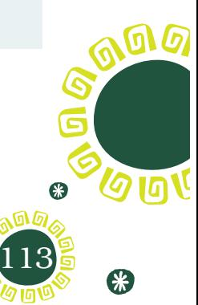
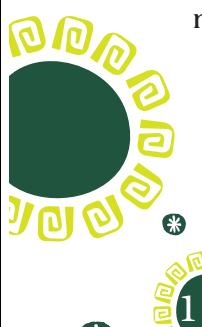
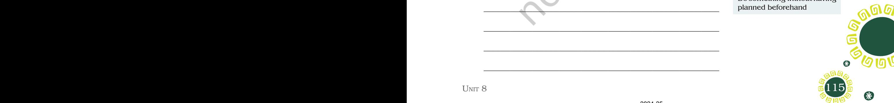
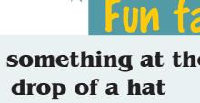
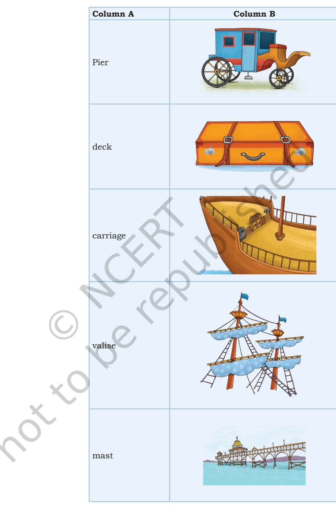
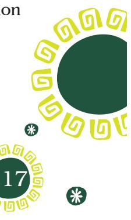
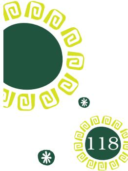
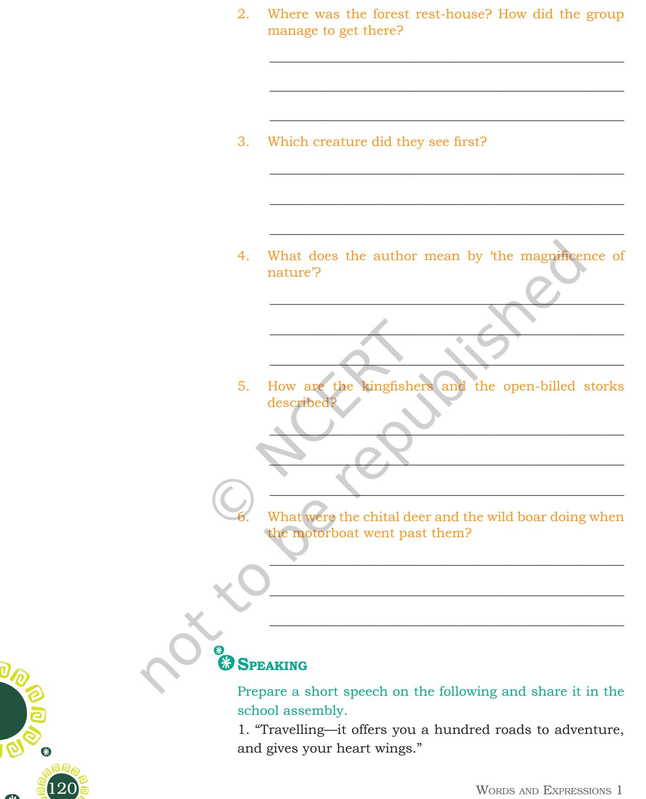
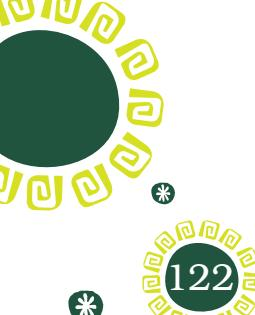

## Le t 's b eg i n

'Kathmandu' is an excerpt from the travelogue *Heaven Lake* written by Vikram Seth. The travelogue is an account of his travel from China, Tibet and Kathmandu to India. Vikram Seth beautifully describes the natural landscape, cultural richness and diversity among people from region to region.

### **Do you know?**

A river in New Zealand has become the first in the world to be recognised as a living entity with the legal status of a person after a 170-year battle by the local Maori people.

The nation's parliament passed a bill to allow Whanganui River— known by the Maoris as Te Awa Tupua— to represent its own interests and advocate on its own behalf.

This is a unique judgement for sustaining the health and well-being of the river.

> (Source: Adapted from *The Guardian International Edition*, 16 March 2017)

1. Collect information on similar judgements being taken in the context of river Ganga, and discuss in class.

- 2. Talk about the condition of Bagmati river in Kathmandu written by Vikram Seth.
Unit 8.indd 112 20-02-2023 09:28:31

### **Reading Comprehension**

Read the following passage and answer the questions that follow.

### **Text I**

When we think of tourism, we think primarily of people who are visiting a particular place for sightseeing, visiting friends and relatives, taking a vacation, and having a good time. They may spend their leisure time engaging in various sports, sunbathing, talking, singing, taking rides, touring, reading or simply enjoying further. We may include in our definition of tourism people who are participating in a convention, a business conference, or some other kind of business or professional activity. Those who are taking a study tour under an expert guide or doing some kind of scientific research or study are also doing tourism. These visitors use all forms of transportation from hiking in a wilderness park to flying in a jet to an exciting city. Transportation can include taking a chairlift up a Colorado mountainside or standing at the rail of a cruise ship looking across the blue Caribbean. Whether people travel by one of these means or by car, motor coach camper, train, motorbike or bicycle, they are taking a trip and thus are engaging in tourism.

> (Adapted from *Tourism: Principles, Practices, Philosophies* by Charles R. Goeldner and J.R. Brent Ritchie, p. 4)

- 1. Tourism is about taking a tour
	- (a) to a place under an expert guide
	- (b) for hiking in remote places
	- (c) for visiting a place for sightseeing
	- (d) All of the above
- 2. By 'hiking in wilderness' the author means
	- (a) taking a long distance walk in abandoned areas
	- (b) walk in the forest areas
	- (c) marathon in uninhabited areas
	- (d) sprinting in abandoned, uninhabited areas
- 3. A cruise ship is
	- (a) a large ship that carries people on voyages of pleasure.

Unit 8 113

*chairlift:* a series of chairs hanging from a moving cable, for carrying people up and down a mountain

**Costs an arm and a leg** Very expensive

**It's a piece of cake** It's easy

2024-25

Unit 8.indd 113 20-02-2023 09:28:31

- (b) a big ship that carries people and goods on special mission.
- (c) a large watercraft for carrying passengers from one point to another.
- (d) a large ship that carries mail, goods and first aid facilities.

_____________________________________________________

_____________________________________________________

_____________________________________________________

_____________________________________________________

_____________________________________________________

_____________________________________________________

_____________________________________________________

_____________________________________________________

- 4. What all activities do tourists engage in?

#### **Spelling errors** It's "commitment", not "comittment".

It's "independence", not "Independance".

5. What are the forms of transportation tourists use for visiting places?

Read the excerpt and answer the following questions.

### **Text II**

Following is an excerpt from the travelogue, *The Innocents Abroad* by Mark Twain.

A little after noon on that distinguished Saturday I reached the ship and went on board. All was bustle and confusion. The pier was crowded with carriages and men; passengers were arriving and hurrying on board; the vessel's decks were encumbered with trunks and valises; groups of excursionists, arrayed in unattractive traveling costumes, were moping about in a drizzling rain and looking as droopy and woebegone as so many molting chickens. The gallant flag was up, but it was under the spell, too, and hung limp and disheartened by the mast. Altogether, it was the bluest, bluest spectacle!

*pier:* a long structure built in the sea and joined to the land at one end

*woebegone:* very sad or miserable

114 Words and Expressions 1

2024-25

Unit 8.indd 114 20-02-2023 09:28:31

Unit 8.indd 115 20-02-2023 09:28:31

It was a pleasure excursion—there was no gainsaying that, because the program said so—it was so nominated in the bond—but it surely hadn't the general aspect of one.

- 1. Why is Saturday described as that distinguished Saturday?
	- (a) because the much awaited Saturday has come when the voyage has to start.
	- (b) because Saturday was a holiday.
	- (c) because it is on Saturday that people were allowed to board the ship.
	- (d) because it is in the afternoon on Saturday that ship would start the voyage.

_____________________________________________________

_____________________________________________________

_____________________________________________________

_____________________________________________________

_____________________________________________________

_____________________________________________________

_____________________________________________________

_____________________________________________________

_____________________________________________________

_____________________________________________________

- 2. Who are excursionists?
	- (a) They are the research students.
	- (b) They are pilgrims.
	- (c) They are musicians.
	- (d) They are tourists on a leisure trip.

4. What was the author looking forward to?

- 3. What was the mood of the people on the ship?

**You can't judge a book by its cover**

Don't base your opinion of something (or someone) on the way it looks.

**Hit the nail on the head** Get something exactly right

Fun fact

**Do something at the drop of a hat**

Do something without having planned beforehand

- 5. Match the words/phrases in Column A with pictures in Column B.
2024-25

Unit 8.indd 116 20-02-2023 09:28:33

116 Words and Expressions 1

- 1. Match the phrasal verbs in Column A with the meanings in Column B.

| A | B |
| --- | --- |
| Look for | to try to find a piece of information |
| Look upto | await eagerly |
| Look forward to | having a great deal of respect for a person |
| Look up | search |

- 2. Rewrite the following words by removing the suffix 'age'.
	- (a) carriage ___________________
	- (b) coverage ___________________
	- (c) hermitage ___________________
	- (d) marriage ___________________

### 3. Rewrite the following words by adding the suffix 'ful'.

- (a) beauty ___________________
- (b) colour ___________________
- (c) duty ___________________
- (d) revenge ___________________
- (e) help ___________________
- (f) mouth ___________________
- (g) mercy ___________________

### **Grammar**

#### **Tense**

- 1. Read the following passage carefully. What is the event described in the passage? Guess when it took place. Underline and name the tenses in the following passage.
This is a good place to enrich ourselves about plant species which are environment friendly. The residents could gather a lot of information about horticulture at the event.

 Several states from north India are represented at this event and the florists showcase the best of their horticulture at the show.

The organisers said that several events are lined up for Sunday and these include dance, drawing, painting and a If the word in question has two consonants before the Y, change the Y to I before adding the suffix -ly. Sloppy – Sloppily Happy – happily

Fun fact

*horticulture:* the art or practice of garden cultivation and management

116 Unit 8 117

2024-25

Unit 8.indd 117 20-02-2023 09:28:33

fashion show competition, among others. As many as 85 stalls have been put up by florists, gardening equipment wholesalers and seed retailers. Entry to the show has been made free for all. However, this year, it's the pollution control plants that have been grabbing all eyeballs.

All plants emit oxygen, but it was established in a study conducted by National Aeronautics and Space Administration back in 1989 that some indoor plants could be extremely useful in controlling the air pollution by acting as a 'vacuum cleaner' against the pollutants and absorbing them.

Detox plants, which act as 'vacuum cleaners' inside the house, are a hit in the ongoing event. Nature enthusiasts are preferring them for pollution control as well as interior decoration.

(Source: *Hindustan Times*, Saturday, 24 Feb. 2018)

### **Editing**

- 1. Punctuate the following passage with appropriate punctuation marks.
Kathmandu is vivid mercenary religious with small shrines to flower-adorned deities along the narrowest and busiest streets with fruit sellers flute sellers hawkers of postcards shops selling western cosmetics film rolls and chocolate or copper utensils and nepalese antiques film songs blare out from the radios car horns sound bicycle bells ring stray cows low questioningly at motorcycles vendors shout out their wares

This passage is taken from the text 'Kathmandu' by Vikram Seth. You can compare and check your rewritten passage with the passage in the textbook and see how far you are correct.

__________________________________________________________

__________________________________________________________

__________________________________________________________

__________________________________________________________

__________________________________________________________

118 Words and Expressions 1

2024-25

*detox:* rid the body of unhealthy substance

The shortest, oldest and most commonly used word is "I".

Unit 8.indd 118 20-02-2023 09:28:33

# **Listening**

Listen to the passage and answer the questions that follow.

__________________________________________________________

__________________________________________________________

__________________________________________________________

__________________________________________________________

#### **A Visit to Bhitarkanika**

The sun was warm but the sea breeze kept up its cooling effect all along. Soon the steamer turned away and anchored near a creek by the river. The muddy fringe and the mangrove vegetation declared the gateway to the Bhitarkanika Wildlife Sanctuary in Odisha. The steamer could not negotiate these creeks at low tide, so a similar motorboat was hired to ferry us to the Dangmal forest rest-house in the heart of the mangrove forest. From the motorboat we had a good look at a large crocodile basking in the sun.

The boat moved on, taking us deeper into the forest. Here we felt as though we had stepped into a time warp. In this awesome and mysterious place, birds of extraordinary plumage appeared before us. For the moment we revelled in the magnificence of nature which had us completely in its thrall. Among the birds, the kingfishers were the stars of the show. Crocodiles, large and small, slid into the water at our approach. Through the foliage we could see chital deer delicately browsing on fresh outcrops of leaves.

A herd of wild boar was spotted searching for succulent roots. High above us, open-billed storks stood sentry-like following our progress through their remarkable kingdom. The evening sun was beginning to paint the tree-lined horizon crimson and gold and a brooding silence enveloped us all.

(Source: *Steps to English*, *Workbook for Class IX*, NCERT, 2003)

_____________________________________________________

_____________________________________________________

_____________________________________________________

- 1. Where was the author going?
*creek:* a narrow area of water where the sea flows into the land

*plumage:* the feathers covering a bird's body

*brooding silence:* mysterious silence

Unit 8.indd 119 20-02-2023 09:28:33

2024-25

Unit 8.indd 120 20-02-2023 09:28:33

"Travelling––it leaves you speechless, then turns you into a storyteller."

(Ibn Batuta, a 14th century traveller) "Travel is fatal to prejudice, bigotry, and narrow-mindedness, and many of our people need it sorely on these accounts. Broad, wholesome, charitable views of men and things cannot be acquired by vegetating in one little corner of the earth all one's lifetime."

(Mark Twain, *The Innocents Abroad*)

| __________________________________________________________ |  |  |
| --- | --- | --- |
| __________________________________________________________ |  | Fun fact |
| __________________________________________________________ | Put/turn the clock back |  |
| __________________________________________________________ | To make things the same as |  |
|  | they were |  |
| __________________________________________________________ |  |  |
| __________________________________________________________ |  |  |
| __________________________________________________________ |  |  |
| __________________________________________________________ |  |  |
| __________________________________________________________ |  |  |
| __________________________________________________________ |  |  |
| __________________________________________________________ |  |  |
| __________________________________________________________ |  |  |
| __________________________________________________________ |  |  |
| __________________________________________________________ |  |  |
| __________________________________________________________ |  |  |
| __________________________________________________________ |  |  |
| 2. The tourism sector can be aligned with the policies of |  |  |
| sustainable development. |  |  |
| __________________________________________________________ |  |  |
| __________________________________________________________ |  |  |

2024-25

__________________________________________________________

Unit 8.indd 121 20-02-2023 09:28:33

### **Writing**

- 1. Read/watch the advertisements on tourism. You can also watch the Kerala Tourism advertisement film 'A Reading Room With a View' which is on the cultural diversity of Kerala. The film is awarded the best film in 60 second category at the prestigious Kyoorius Awards. Now create an advertisement for your city or state for promoting tourism.
__________________________________________________________

__________________________________________________________

__________________________________________________________

__________________________________________________________

__________________________________________________________

__________________________________________________________

__________________________________________________________

__________________________________________________________

__________________________________________________________

__________________________________________________________

__________________________________________________________

__________________________________________________________

- 2. Write a paragraph describing a journey, imaginery, or you have undertaken.
You can follow the steps given below:

- 1. Prepare an itinerary.
- 2. You can make use of the following expressions, phrases and proverbs frequently used by the travellers.

Jetlag, itchy feet, hit the road, time table, on the home stretch, call it a day, book in advance, travel over, travel through, travel light, any port in a storm, stopover, etc.

122 Words and Expressions 1

2024-25

Unit 8.indd 122 20-02-2023 09:28:33

# **Project**

- 1. You have read about the mesmerising effect of the music of flute on Vikram Seth in 'Kathmandu'*.*
Do you know the instruments for Sufi music differ from one culture to another? In Turkey, Iran and North Africa, the most prominent instrument is the 'Ney' which is the reed flute. In Sufi music the 'Ney' is accompanied by string instruments like *saz*, *santoor*, *rubab*, etc.

Create a class magazine on music and artists. Some suggestions are given below.

- Collect information on the commonly used musical instruments in the following categories:
	- Indian classical music
	- Ghazal singing
	- Bharatnatayam, Chau and Kathak dance
	- Folk music
	- Jazz
- Collect photographs of musical instruments.
- Prepare brief biographical sketches of musicians, dancers, costume designers, artists, etc. You can meet some of them or collect information from sources like books, Internet, magazines, newspapers, etc.
- Give a suitable name to the magazine.
- 2. Plan a trip to the North-east region of the country by road. Explore the various possibilities of the travel. Also, create a map of your travel.

| Notes |
| --- |
| _____________________________________________________________________________________ |
| _____________________________________________________________________________________ |
| _____________________________________________________________________________________ |
| _____________________________________________________________________________________ |
| _____________________________________________________________________________________ |
| _____________________________________________________________________________________ |

Unit 8.indd 123 20-02-2023 09:28:33

*reed:* a piece of thin cane or metal, which vibrates in a current of air to produce various musical sounds

