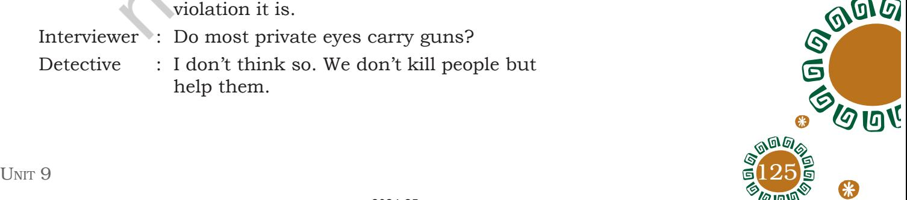
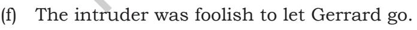

## Le t 's b eg i n

In the play 'If I Were You', you have read how Gerrard outsmarts the intruder with his 'presence of mind'. The intruder wanted to steal Gerrard's identity.

In our day-to-day life we share personal information like telephone number, house address, mobile number, date of birth, e-mail address, etc., everyday with people whom we may not know very well.

Don't you think it is not safe to share information in today's digital age? Someone like the intruder in the play 'If I Were You' might misuse your unique and personal identity details. This is called identity theft.

The cases of online identity thefts are increasing day by day. Collect information about cases of identity theft and share it in the class.

### **Reading Comprehension**

Read the following text and answer the questions that follow.

#### **Text I**

#### **Interview with a Detective**

His appearance was clean, cool and deliberately ambiguous. Under the sanctuary of his aviators, his eyes silently scanned the room. He is a Manhattan-based, third-generation private detective who's been in the business for more than three decades — specialising in surveillance and being an overall mystery-tinged badass. We asked him everything we've ever wanted to know about the profession.

Unit 9.indd 124 20-02-2023 09:29:55

| Interviewer : | So, what exactly do you do? | Notes |
| --- | --- | --- |
| Detective : | I do a lot of surveillance. Basically, |  |
|  | someone who wonders, "What is this |  |
|  | other person up to?" If it's insurance |  |
|  | company (surveying someone on |  |
|  | workers' compensation), they'll ask, "Is |  |
|  | he back working?" Things like that. |  |
|  | Another very common request is | surveillance: close |
|  | locating people, and it could be for a lot | observation, especially of a |
|  | of reasons. I had a case recently, a man | suspected spy or criminal |
|  | hadn't been in touch with his mother for |  |
|  | 20 years and I helped him find her. |  |
| Interviewer : | What kind of skills make for a good PI |  |
|  | (Private Investigator)? |  |
| Detective : | Patience— Number one. You have to |  |
|  | pay attention. You have to be the kind |  |
|  | of person, if you sit in front of a door |  |
|  | watching it for six hours, and you haven't |  |
|  | seen your guy. |  |
|  | You have to plan accordingly, and be |  |
|  | willing to make sacrifices in order to stay |  |
|  | out there. It's not a job for people who |  |
|  | want to slack off. |  |
| Interviewer : | If you needed to locate someone, what's |  |
|  | the ideal information you need to start? |  |
| Detective : | Usually, this is what I tell people, "If you |  |
|  | want to find someone, I need the name |  |
|  | with the exact spelling, the DOB if you |  |
|  | know it, the social security number, | DOB: Date of Birth |
|  | and a last known, official address where |  |
|  | they've lived within the past 15 years." |  |
|  | Because that means they'll be in our |  |
|  | database. |  |
| Interviewer : | Do most private investigators have a |  |
|  | relationship with local police? |  |
| Detective : | I would say that's kind of a myth. Most |  |
|  | cops wouldn't even do it in the first |  |
|  | place, because they know how serious a |  |
|  | violation it is. |  |
| Interviewer : | Do most private eyes carry guns? |  |
| Detective : | I don't think so. We don't kill people but |  |
|  | help them. |  |

Unit 9.indd 125 20-02-2023 09:29:55

|  | Interviewer : What do films and television shows get |
| --- | --- |
|  | wrong about being a PI? |
|  | Detective : The big difference is, the things you see |
|  | in films do happen to private detectives, |
|  | but they're shrinking down maybe 20 |
|  | years of adventure into an episode. After |
|  | 30 years, I probably have one good movie |
|  | worth of experiences. |
|  | (Adapted from https://www.thrillist.com/.../private-detective-interview |
|  | questions-you-ve-always-want) |
| 1. | What is the profession of the person being interviewed? |
|  | _____________________________________________________ |
|  | _____________________________________________________ |
|  | _____________________________________________________ |
| 2. | Complete the following sentence. |
|  | As soon as the detective entered the room, he_________ |
|  | ____________________________________________________. |
|  | (a) examined the place carefully. |
|  | (b) was vague and uncertain. |
|  | (c) knew what he was doing. |
|  | (d) got ready for the interview. |
| 3. | Which of the following was not a part of the job of the |
|  | detective? |
|  | (a) to wander about |
|  | (b) to find lost people |
|  | (c) to carry guns |
|  | (d) to keep a watch |
| 4. | According to the detective, there are some qualities that |
|  | are essential in his profession. What are these and why |
|  | are they essential? |

126 Words and Expressions 1

_____________________________________________________

_____________________________________________________

_____________________________________________________

2024-25

Unit 9.indd 126 20-02-2023 09:29:55

#### 5. What information should the PI have in order to locate someone?

_____________________________________________________

_____________________________________________________

_____________________________________________________

**Common Error Incorrect** Which kind of car? **Correct** Which type of car?

- 6. In the sentence given below the word 'aviators' means sunglasses. Now choose the appropriate meaning for the underlined word from the options given.
Under the sanctuary of his aviators, his eyes scanned the room.

- (a) shelter
- (b) shade
- (c) hideout
- (d) refuge

#### **Text II**

Read the passage and answer the questions that follow.

#### **Sharadindu Bandyopadhyay**

Do you know who is Sharadindu Bandyopadhyay? He was a Bengali writer. He is remembered for his most famous creation of a fictional detective, Byomkesh Bakshi.

He was actively involved with Bengali cinema as well as Bollywood. He wrote different forms of prose: novels, short stories, plays and screenplays. Besides, he wrote many songs and poems. However, his forte was short stories and novels. He also wrote historical fiction and supernatural stories.

Sharadindu Bandyopadhyay started writing Byomkesh stories in 1932 at the age of 33. He has written 32 Byomkesh stories. He continued to write till his death in 1970. He portrayed himself as a narrator of his stories named Ajit Bandhopadhyay who is also a companion of Byomkesh Bakshi. In some stories Ajit also investigates in the absence of Byomkesh. These stories are written in traditional Bengali language and have now been translated into other languages.

His stories are very engrossing and consist of a series of events. Byomkesh solves cases from international drug racket to household mysteries and crimes. Byomkesh *forte:* a thing at which someone excels

Unit 9.indd 127 20-02-2023 09:29:55

identifies himself as Satyanweshi meaning 'truth seeker' rather than a detective. Where he stands out from other legendary detectives like Hercule Poirot or Sherlock Holmes is that he is more concerned with truth than with the law.

(Source: An excerpt from 'A well-known literary figure of Bengal'/*The Asian Age online*: http://dailyasianage.com/news/109713/a-we-known-literaryfigure-of-bengal)

- 1. Who among the following is not a detective?
	- (a) Byomkesh Bakshi
	- (b) Sharadindu Bandyopadhyay
	- (c) Hercule Poirot
	- (d) Sherlock Holmes
- 2. Sharadindu Bandyopadhyay is known for his
	- (a) Short stories and novels
	- (b) Poems and songs
	- (c) Historical fiction
	- (d) All of the above

#### 3. State whether true or false.

- (a) Byomkesh is a 'truth seeker'.
- (b) Byomkesh is a detective like Hercule Poirot and Sherlock Holmes.
- (c) Byomkesh is concerned with truth rather than with the law.

_____________________________________________________

_____________________________________________________

_____________________________________________________

- (d) Byomkesh follows law to solve his cases.
- 5. What is the role of Ajit in Byomkesh stories?

- 6. Find the antonyms of the words given below. All of them are given in the text.
	- (a) natural___________________________________________

(b) fact______________________________________________

(c) passively_________________________________________

128 Words and Expressions 1

2024-25

- a **bolt** of lightning
- a **deck** of cards
- a **swarm** of bees
- a **school** of fish
- a **fleet** of cars
- a **flock** of birds
- an **army** of caterpillars
- a **herd** of cows

Unit 9.indd 128 20-02-2023 09:29:56

| 11 11 | 7 |
| --- | --- |
|  | S |

- (d) discontinued_____________________________________ **Notes**
- (e) presence_________________________________________
- (f) modern___________________________________________
- (g) unconcerned_____________________________________

# **Vocabulary**

- 1. The following words and phrases occur in the passages. Try to guess the meanings. Match the words with their meanings. You may refer a dicitionary later.

| database | the act of going against or refusing to obey a |
| --- | --- |
|  | law, an agreement, etc. |
| violation | open to more than one interpretation; not |
|  | having one obvious meaning. |
| surveillance | a structured set of data held in a computer, |
|  | especially one that is accessible in various |
|  | ways. |
| insurance | close observation, especially of a suspected |
|  | spy or criminal. |
| ambiguous | an agreement made with a company or the |
|  | Government that provides a guarantee of |
|  | compensation for specified loss, damage, |
|  | illness, or death in return for payment of a |
|  | specified premium. |
| forge | an action or event regarded as morally or |
|  | legally wrong and causing general public |
|  | outrage. |
| sinister | to make an illegal copy of something in order |
| looking | to deceive. |
| scandal | suggesting evil or harm |

- 2. The contextual meaning of 'sanctuary' in the comprehension passage I is 'shade'. The same word 'sanctuary' is used in a variety of sentences given below. They have different meanings in different contexts. Refer to a dictionary and write the meanings.
	- (a) Banita's home was a sanctuary for runaway kids.

_________________________________________________

_________________________________________________

Unit 9.indd 129 20-02-2023 09:29:56

- 130 Words and Expressions 1 (b) The refugees found sanctuary when they reached India. _________________________________________________ (c) The sanctuary contains the altar of sacrifice. _________________________________________________ (d) I found sanctuary in the cave to save myself from the storm. _________________________________________________ (e) Bhadra Wildlife Sanctuary is a protected area for tigers. _________________________________________________ 3. Use the following pair of opposites in sentences. One has been done for you. lose/gain You've nothing to *lose*, but what have you to *gain*? (a) hot/cold _________________________________________________ (b) beautiful/ugly _________________________________________________ (c) smart/foolish _________________________________________________ (d) lonely/busy _________________________________________________ (e) great/little _________________________________________________ (f) live/die _________________________________________________ **Commonly misspelt words Incorrect Correct** Inadvertant Inadvertent Indispensible Indispensable Withold Withhold Bizzare Bizarre Carribean Caribbean Fourty Forty Fun fact
2024-25

Unit 9.indd 130 20-02-2023 09:29:56

# **Grammar**

An affirmative sentence can be changed into a negative sentence without changing the meaning of the original sentence. Look at the examples given below.

- You may be comfortable, but I am not. /You may not be uncomfortable, but I am.
- Few people take the trouble to visit me. / People generally do not take the trouble to visit me.
- Better be quick. / Better not be late.
- 1. Change affirmative sentences into negative sentences without changing the meaning. One has been done for you.

I know all the answers. / There are no answers that I don't know.

_________________________________________________

_________________________________________________

_________________________________________________

_________________________________________________

_________________________________________________

_________________________________________________

_________________________________________________

_________________________________________________

_________________________________________________

_________________________________________________

_________________________________________________

_________________________________________________

- (a) All the members liked the programme.
- (b) Amritsar is colder than Delhi.
- (c) I am free to go places and do nothing.
- (d) The farmer was too weak to walk.

Homesick Headstrong Handmade

- (e) She is always on time.

2024-25

Unit 9.indd 131 20-02-2023 09:29:56

**Once in a blue moon** Rarely

#### **Cutting corners**

Doing something poorly in order to save time or money

# Fun fact

#### **Don't cry over spilt milk**

There is no reason to complain about something that can't be fixed

- 2. Let us look at the sentence given below.
I am glad you are pleased *to see* me.

Here, '*to see*' is an example of the infinite form of a verb. The infinite form of a verb is usually preceded by 'to'. Choose the words from the box and complete the sentences given below.

> phone up, pay, assist, change, clear off, help, team up, stay

- (a) Before we begin I would like you__________________ my place.
- (b) I'll be glad__________________you.
- (c) You mean__________________with me?
- (d) But are you sure it's going__________________you?
- (e) Those are just the things I want__________________.
- (f) Be willing to make sacrifices in order__________________out there.
- (g) Anju asked Hemant__________________Rs. 100 to avoid a scene.
- (h) Well, tell him__________________directly.

### **Editing**

Some words are missing in the passage given below, indicated by '/'. Rewrite the passage by providing the missing words, and using appropriate punctuation marks in the space given below.

Sherlock Holmes is/ fictional private detective, the first scientific detective, created/ British author Sir arthur conan doyle. He is a 'consulting detective' in the stories written by Sir Doyle. Holmes is known for his skills of observation, knowledge of forensic science, / logical reasoning. He employs all these while investigating cases for/ wide variety of clients. Sir Doyle's four novels and 56 short stories, excluding one, are set in the victorian or edwardian eras, between about 1880 and 1914 Most are narrated by Dr Watson, Holmes's friend. he is also his biographer/ usually accompanies Holmes during his investigations/ often shares quarters with him at the address of 221B Baker Street, london, where many of the stories begin.

Sherlock Holmes is arguably/best known fictional detective, with guinness World Records listing him as the

132 Words and Expressions 1

2024-25

Unit 9.indd 132 20-02-2023 09:29:56

| _____________________________________________________________________________________ |
| --- |
| _____________________________________________________________________________________ |
| _____________________________________________________________________________________ |
| _____________________________________________________________________________________ |
| _____________________________________________________________________________________ |
| _____________________________________________________________________________________ |
| _____________________________________________________________________________________ |
| _____________________________________________________________________________________ |
| _____________________________________________________________________________________ |
| _____________________________________________________________________________________ |
| _____________________________________________________________________________________ |
| _____________________________________________________________________________________ |
| _____________________________________________________________________________________ |
| _____________________________________________________________________________________ |
| _____________________________________________________________________________________ |
| _____________________________________________________________________________________ |
| _____________________________________________________________________________________ |
| _____________________________________________________________________________________ |
| _____________________________________________________________________________________ |
| _____________________________________________________________________________________ |

#### Listen to the story of Shibi Rana and answer the questions that follow.

There are many stories in our mythology when gods have disguised themselves in the forms of human beings, birds, etc. This is done either to test the efficiency and ability of the kings or to see if people are happy and contented on earth. This is another aspect of changing the identity. Let us listen to story of King Shibi.

There was a great king, Shibi Rana who had immense power then, even gods in heavens were amazed. They feared that Shibi might take away their kingdoms. They devised a plan to test his sense of justice. So they decided to reach Shibi's kingdom in disguise.

One day, Shibi Rana was sitting on his throne. His courtroom was surrounded by majestic gardens. There came a scared dove flying to him and it was followed by a fierce looking eagle. The king gave shelter to the dove and saved her. The eagle argued that the king has taken away his food — the dove. It would starve. The king assured the eagle that he would give equal quantity of any other food. The eagle asked for King Shibi's flesh. The magnanimous king agreed with a smile. A balance was brought in the court. It was soon found that with each addition of the king's flesh the dove grew heavier. The equal balance was not arrived at. But the king remained calm and unperturbed.

The Gods in the guise of dove and eagle were assured of Shibi's righteousness. The forms of the eagle and the dove soon disappeared. In their place stood Indra, the king of the Gods and Agni, the God of fire smiling and blessing the king for his benevolence and greatness.

1. Why were the Gods in heaven afraid of King Shibi?

_____________________________________________________

_____________________________________________________

_____________________________________________________

_____________________________________________________

2. What made the eagle angry?

134 Words and Expressions 1

*magnanimous:* generous or forgiving, especially towards a rival or less powerful person

*benevolence:* kindness, generosity and helpfulness

2024-25

Unit 9.indd 134 20-02-2023 09:29:56

- 3. What did the eagle demand?

**Let the cat out of the bag** Give away a secret

- 4. Was the eagle satisfied?
- 5. Who were in the disguise of the eagle and the dove?

_____________________________________________________

_____________________________________________________

_____________________________________________________

_____________________________________________________

_____________________________________________________

_____________________________________________________

_____________________________________________________

_____________________________________________________

- 6. King Shibi was blessed for his:
# **Speaking**

- 1. In a group of four, discuss and take down notes based on the discussion.
	- Theft in the digital age. Theft that occurs when someone uses another's unique personal details like his/her name, credit card numbers, without his/her permission, to commit fraud or other crimes.
- 2. You may talk to the manager of a Bank, Cyber crime cell, etc., about 'online identity theft' cases and measures to avoid them.
	- Discuss this in groups of four in the class.
	- Prepare posters on creating awareness about online identify theft.

## **Writing**

- 1. Sometimes we think about what we are like and how each of us is different. We all are interesting people with our physical differences and attitudes to life. Write in about 300–400 words what you are like, your identity and what you enjoy doing and how do you envision yourself in future.

**A stitch in time saves nine**

Fix the problem now before it gets worse

**Cross your fingers** For good luck

#### 2024-25

Unit 9.indd 135 20-02-2023 09:29:56

#### 2. Complete the following story. It has to be a scary story that terrifies people. Give a suitable title to your story.

I stopped my scooter in front of an old and dilapidated building. A haggered, skinny old man with drooping shoulders came towards me. "Don't go in, Sir", he whispered. "It is dangerous..."

__________________________________________________________

**I'm all ears** You have my full attention.

### **Project**

- 1. Going digital means more transparency, saving of papers, accountability and ease of transaction. The Government has initiated the programme 'Digital India'. Collect more information about this programme. You can interview people, collect photographs, anecdotes, data, etc. Prepare a report based on your findings.
- 2. Prepare a street play (*nukkad natak*) on how someone was duped by an unknown person when he/she was trying to withdraw money from the ATM. And how the bank manager helped him/her in getting back the money. What precautions did the bank manager suggest to avoid such incidents in future?

Enact the *nukkad natak* in your school assembly/ community hall/park, etc.

136 Words and Expressions 1

2024-25

Unit 9.indd 136 20-02-2023 09:29:56

### **Notes**

Unit 9.indd 137 20-02-2023 09:29:56

136

### **Notes**

Unit 9.indd 138 20-02-2023 09:29:56

