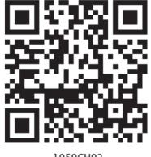
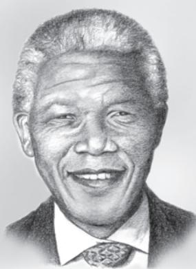
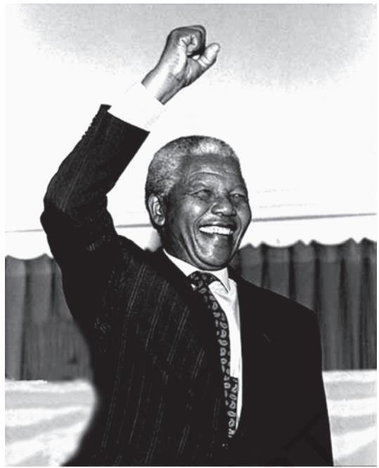
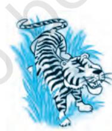
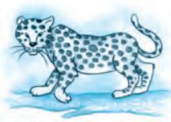
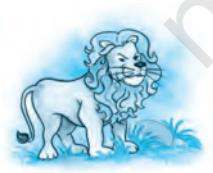

# BEFORE YOU READ

- *• 'Apartheid' is a political system that separates people according to their race. Can you say which of the three countries named below had such a political system until very recently?*
	- *(i) United States of America (ii) South Africa (iii) Australia*
- *• Have you heard of Nelson Mandela? Mandela, and his African National Congress, spent a lifetime fighting against apartheid. Mandela had to spend thirty years in prison. Finally, democratic elections were held in South Africa in 1994, and Mandela became the first black President of a new nation.*

*In this extract from his autobiography,* Long Walk to Freedom*, Mandela speaks about a historic occasion, 'the inauguration'. Can you guess what the occasion might be? Check your guess with this news item (from the BBC) of 10 May 1994.*

# Mandela Becomes South Africa's First Black President

Nelson Mandela has become South Africa's first Black President after more than three centuries of White rule. Mr Mandela's African National Congress (ANC) party won 252 of the 400 seats in the first democratic elections of South Africa's history.

The inauguration ceremony took place in the Union Buildings amphitheatre in Pretoria today, attended by politicians and dignitaries from more than 140 countries around the world. "Never, never again will this beautiful land experience the oppression of one by another, " said Nelson Mandela in his address.

… Jubilant scenes on the streets of Pretoria followed the ceremony with blacks, whites and coloureds celebrating together... More than 100,000 South African men, women and children of all races sang and danced with joy.

# Activity

*In Column A are some expressions you will find in the text. Make a guess and match each expression with an appropriate meaning from Column B.*

|  | A |  | B |
| --- | --- | --- | --- |
| (i) | A rainbow | – | A great ability (almost |
|  | gathering of |  | unimaginable) to remain |
|  | different colours |  | unchanged by suffering (not losing |
|  | and nations |  | hope, goodness or courage) |
| (ii) | The seat of white | – | A half-secret life, like a life lived in |
|  | supremacy |  | the fading light between sunset |
| (iii) | Be overwhelmed |  | and darkness |
|  | with a sense of | – | A sign of human feeling (goodness, |
|  | history |  | kindness, pity, justice, etc.) |
| (iv) | Resilience that | – | A beautiful coming together of |
|  | defies the |  | various peoples, like the colours in |
|  | imagination |  | a rainbow |
| (v) | A glimmer of | – | The centre of racial superiority |
|  | humanity | – | Feel deeply emotional, |
| (vi) | A twilight |  | remembering and understanding |
|  | existence |  | all the past events that have led |
|  |  |  | up to the moment |

TENTH May dawned bright and clear. For the past few days I had been pleasantly besieged by dignitaries and world leaders who were coming to pay their respects before the inauguration. The inauguration would be the largest gathering ever of international leaders on South African soil.

The ceremonies took place in the lovely sandstone amphitheatre formed by the Union Buildings in Pretoria. For decades this had been the seat of white supremacy, and now it was the site of a rainbow gathering of different colours and nations for the installation of South Africa's first democratic, non-racial government.

On that lovely autumn day I was accompanied by my daughter Zenani. On the podium, Mr de Klerk was first sworn in as second deputy president. Then

(to be) besieged by to be surrounded closely by

## amphitheatre

a building without a roof, with many rows of seats rising in steps (typical of ancient Greece and Rome)

Thabo Mbeki was sworn in as first deputy president. When it was my turn, I pledged to obey and uphold the Constitution and to devote myself to the wellbeing of the Republic and its people. To the assembled guests and the watching world, I said:

Today, all of us do, by our presence here... confer glory and hope to newborn liberty. Out of the experience of an extraordinary human disaster that lasted too long, must be born a society of which all humanity will be proud.

We, who were outlaws not so long ago, have today been given the rare privilege to be host to the nations of the world on our own soil. We thank all of our distinguished international guests for having come to take possession with the people of our country of what is, after all, a common victory for justice, for peace, for human dignity.

We have, at last, achieved our political emancipation. We pledge ourselves to liberate all our people from the continuing bondage of poverty, deprivation, suffering, gender and other discrimination.

Never, never, and never again shall it be that this beautiful land will again experience the oppression of one by another.

The sun shall never set on so glorious a human achievement.

Let freedom reign. God bless Africa!

### Oral Comprehension Check

18

First Flight

- *1. Where did the ceremonies take place? Can you name any public buildings in India that are made of sandstone?*
- *2. Can you say how 10 May is an 'autumn day' in South Africa?*

confer (a formal word) here, give

### We, who were outlaws

because of its policy of apartheid, many countries had earlier broken off diplomatic relations with South Africa

### emancipation

freedom from restriction

deprivation

state of not having one's rightful benefits

discrimination being treated

differently or unfavourably

- *3. At the beginning of his speech, Mandela mentions "an extraordinary human disaster". What does he mean by this? What is the "glorious … human achievement" he speaks of at the end?*
- *4. What does Mandela thank the international leaders for?*
- *5. What ideals does he set out for the future of South Africa?*

A few moments later we all lifted our eyes in awe as a spectacular array of South African jets, helicopters and troop carriers roared in perfect formation over the Union Buildings. It was not only a display of pinpoint precision and military force, but a demonstration of the military's loyalty to democracy, to a new government that had been freely and fairly elected. Only moments before, the highest generals of the South African defence force and police, their chests bedecked with ribbons and medals from days gone by, saluted me and pledged their loyalty. I was not unmindful of the fact that not so many years before they would not have saluted but arrested me. Finally a chevron of Impala jets left a smoke trail of the black, red, green, blue and gold of the new South African flag.

The day was symbolised for me by the playing of our two national anthems, and the vision of whites singing *'Nkosi Sikelel –iAfrika'* and blacks singing 'Die Stem', the old anthem of the Republic. Although that day neither group knew the lyrics of the anthem they once despised, they would soon know the words by heart.

On the day of the inauguration, I was overwhelmed with a sense of history. In the first decade of the twentieth century, a few years after the bitter Anglo-Boer war and before my own birth, the white-skinned peoples of South Africa patched up their differences and erected a system of racial domination against the dark-skinned peoples of their own land. The structure they created formed the basis of one of the harshest, most inhumane, societies the world has ever known. Now, in the last decade of the twentieth century, and my own eighth decade as a man, that system had been

spectacular array an impressive display (colourful and attractive)

not unmindful of conscious of; aware of

chevron a pattern in the shape of a V

despised

had a very low opinion of

19

overturned forever and replaced by one that recognised the rights and freedoms of all peoples, regardless of the colour of their skin.

That day had come about through the unimaginable sacrifices of thousands of my people, people whose suffering and courage can never be counted or repaid. I felt that day, as I have on so many other days, that I was simply the sum of all those African patriots who had gone before me. That long and noble line ended and now began again with me. I was pained that I was not able to thank them and that they were not able to see what their sacrifices had wrought.

The policy of apartheid created a deep and lasting wound in my country and my people. All of us will spend many years, if not generations, recovering from that profound hurt. But the decades of oppression and brutality had another, unintended, effect, and that was that it produced the Oliver Tambos, the Walter Sisulus, the Chief Luthulis, the Yusuf Dadoos, the Bram Fischers, the Robert Sobukwes of our time* — men of such extraordinary

20

First Flight

wrought (old fashioned, formal word) done, achieved

profound deep and strong

** These are some prominent names in the struggle against apartheid. (For the use of the definite article with proper nouns, see exercise II on page 25)* courage, wisdom and generosity that their like may never be known again. Perhaps it requires such depths of oppression to create such heights of character. My country is rich in the minerals and gems that lie beneath its soil, but I have always known that its greatest wealth is its people, finer and truer than the purest diamonds.

It is from these comrades in the struggle that I learned the meaning of courage. Time and again, I have seen men and women risk and give their lives for an idea. I have seen men stand up to attacks and torture without breaking, showing a strength and resilience that defies the imagination. I learned that courage was not the absence of fear, but the triumph over it. The brave man is not he who does not feel afraid, but he who conquers that fear.

No one is born hating another person because of the colour of his skin, or his background, or his religion. People must learn to hate, and if they can learn to hate, they can be taught to love, for love comes more naturally to the human heart than its opposite. Even in the grimmest times in prison, when my comrades and I were pushed to our limits, I would see a glimmer of humanity in one of the guards, perhaps just for a second, but it was enough to reassure me and keep me going. Man's goodness is a flame that can be hidden but never extinguished.

# Oral Comprehension Check

- *1. What do the military generals do? How has their attitude changed, and why?*
- *2. Why were two national anthems sung?*
- *3. How does Mandela describe the systems of government in his country (i) in the first decade, and (ii) in the final decade, of the twentieth century?*
- *4. What does courage mean to Mandela?*
- *5. Which does he think is natural, to love or to hate?*

In life, every man has twin obligations obligations to his family, to his parents, to his wife and children; and he has an obligation to his people, his community, his country. In a civil and humane

### resilience

the ability to deal with any kind of hardship and recover from its effects

### pushed to our limits

pushed to the last point in our ability to bear pain

21

society, each man is able to fulfil those obligations according to his own inclinations and abilities. But in a country like South Africa, it was almost impossible for a man of my birth and colour to fulfil both of those obligations. In South Africa, a man of colour who attempted to live as a human being was punished and isolated. In South Africa, a man who tried to fulfil his duty to his people was inevitably ripped from his family and his home and was forced to live a life apart, a twilight existence of secrecy and rebellion. I did not in the beginning choose to place my people above my family, but in attempting to serve my people, I found that I was prevented from fulfilling my obligations as a son, a brother, a father and a husband.

I was not born with a hunger to be free. I was born free — free in every way that I could know. Free to run in the fields near my mother's hut, free to swim in the clear stream that ran through my village, free to roast mealies under the stars and ride the broad backs of slow-moving bulls. As long as I obeyed my father and abided by the customs of my tribe, I was not troubled by the laws of man or God.

It was only when I began to learn that my boyhood freedom was an illusion, when I discovered as a young man that my freedom had already been taken from me, that I began to hunger for it. At first, as a student, I wanted freedom only for myself, the transitory freedoms of being able to stay out at night, read what I pleased and go where I chose. Later, as a young man in Johannesburg, I yearned for the basic and honourable freedoms of achieving my potential, of earning my keep, of marrying and having a family — the freedom not to be obstructed in a lawful life.

But then I slowly saw that not only was I not free, but my brothers and sisters were not free. I saw that it was not just my freedom that was curtailed, but the freedom of everyone who looked like I did. That is when I joined the African National Congress, and that is when the hunger for my own freedom became the greater hunger for the freedom

inclinations

natural tendencies of behaviour

inevitably unavoidably

something that appears to be real but is not

transitory not permanent

curtailed reduced

First Flight

22

of my people. It was this desire for the freedom of my people to live their lives with dignity and selfrespect that animated my life, that transformed a frightened young man into a bold one, that drove a law-abiding attorney to become a criminal, that turned a family-loving husband into a man without a home, that forced a life-loving man to live like a monk. I am no more virtuous or self-sacrificing than the next man, but I found that I could not even enjoy the poor and limited freedoms I was allowed when I knew my people were not free. Freedom is indivisible; the chains on anyone of my people were the chains on all of them, the chains on all of my people were the chains on me.

I knew that the oppressor must be liberated just as surely as the oppressed. A man who takes away another man's freedom is a prisoner of hatred; he is locked behind the bars of prejudice and narrowmindedness. I am not truly free if I am taking away someone else's freedom, just as surely as I am not free when my freedom is taken from me. The oppressed and the oppressor alike are robbed of their humanity.

prejudice a strong dislike without any good reason

23

# Oral Comprehension Check

- *1. What "twin obligations" does Mandela mention?*
- *2. What did being free mean to Mandela as a boy, and as a student? How does he contrast these "transitory freedoms" with "the basic and honourable freedoms"?*
- *3. Does Mandela think the oppressor is free? Why/Why not?*

- 1. Why did such a large number of international leaders attend the inauguration? What did it signify the triumph of?
- 2. What does Mandela mean when he says he is "simply the sum of all those African patriots" who had gone before him?
- 3. Would you agree that the "depths of oppression" create "heights of character"? How does Mandela illustrate this? Can you add your own examples to this argument?
- 4. How did Mandela's understanding of freedom change with age and experience?
- 5. How did Mandela's 'hunger for freedom' change his life?

- I. There are nouns in the text (*formation*, *government*) which are formed from the corresponding verbs (*form, govern*) by suffixing -(*at*)*ion* or *ment*. There may be a change in the spelling of some verb – noun pairs: such as *rebel*, *rebellion*; *constitute*, *constitution*.

|
|  |

| Noun | Verb |
| --- | --- |
| rebellion | rebel |
| constitution | constitute |

First Flight

24

# 2. Read the paragraph below. Fill in the blanks with the noun forms of the verbs in brackets.

Martin Luther King's (contribute) to our history as an outstanding leader began when he came to the (assist) of Rosa Parks, a seamstress who refused to give up her seat on a bus to a white passenger. In those days American Blacks were confined to positions of second class citizenship by restrictive laws and customs. To break these laws would mean (subjugate) and (humiliate) by the police and the legal system. Beatings, (imprison) and sometimes death awaited those who defied the System. Martin Luther King's tactics of protest involved non-violent (resist) to racial injustice.

### II. Using the Definite Article with Names

You know that the definite article 'the' is not normally used before proper nouns. Nor do proper nouns usually occur in the plural. (We do not say: **The Nelson Mandela*, or **Nelson Mandelas*.) But now look at this sentence from the text:

… the decades of oppression and brutality … produced the Oliver Tambos, the Walter Sisulus, … of our time.

Used in this way with *the* and/or in the plural, a proper noun carries a special meaning. For example, what do you think the names above mean? Choose the right answer.

- (a) *for example* Oliver Tambo, Walter Sisulu, …
- (b) *many other men like* Oliver Tambo, Walter Sisulu …/*many men of their type or kind,* whose names may not be as well known.

Did you choose option (b)? Then you have the right answer!

Here are some more examples of 'the' used with proper names. Try to say what these sentences mean. (You may consult a dictionary if you wish. Look at the entry for 'the'.)

- 1. Mr Singh regularly invites the Amitabh Bachchans and the Shah Rukh Khans to his parties.
- 2. Many people think that Madhuri Dixit is the Madhubala of our times.
- 3. History is not only the story of the Alexanders, the Napoleons and the Hitlers, but of ordinary people as well.

25

# III. Idiomatic Expressions

Match the italicised phrases in Column A with the phrase nearest in meaning in Column B. (*Hint*: First look for the sentence in the text in which the phrase in Column A occurs.)

|  | A |  | B |
| --- | --- | --- | --- |
| 1. | I was not unmindful of | (i) | had not forgotten; was aware of the fact |
|  | the fact | (ii) | was not careful about the fact |
|  |  | (iii) | forgot or was not aware of the fact |
| 2. | when my comrades | (i) | pushed by the guards to the wall |
|  | and I were pushed to | (ii) | took more than our share of beatings |
|  | our limits | (iii) | felt that we could not endure the |
|  |  |  | suffering any longer |
| 3. | to reassure me and | (i) | make me go on walking |
|  | keep me going | (ii) | help me continue to live in hope in this |
|  |  |  | very difficult situation |
|  |  | (iii) | make me remain without complaining |
| 4. | the basic and | (i) | earning enough money to live on |
|  | honourable freedoms | (ii) | keeping what I earned |
|  | of…earning my keep,… | (iii) | getting a good salary |

# First Flight

26

In groups, discuss the issues suggested in the box below. Then prepare a speech of about two minutes on the following topic. (First make notes for your speech in writing.)

True liberty is freedom from poverty, deprivation and all forms of discrimination.

- causes of poverty and means of overcoming it
- discrimination based on gender, religion, class, etc.
- constitutionally guaranteed human rights

# I. Looking at Contrasts

Nelson Mandela's writing is marked by *balance*: many sentences have two parts in balance.

Use the following phrases to complete the sentences given below.

- (i) they can be taught to love.
- (ii) I was born free.
- (iv) but he who conquers that fear. (v) to create such heights of character.
- (iii) but the triumph over it.
- 1. It requires such depths of oppression
- 2. Courage was not the absence of fear
- 3. The brave man is not he who does not feel afraid
- 4. If people can learn to hate
- 5. I was not born with a hunger to be free.
- II. This text repeatedly contrasts the past with the present or the future. We can use coordinated clauses to contrast two views, for emphasis or effect. Given below are sentences carrying one part of the contrast. Find in the text the second part of the contrast, and complete each item. Identify the words which signal the contrast. This has been done for you in the first item.
	- 1. *For decades* the Union Buildings had been the seat of white supremacy, *and now* ...
	- 2. Only moments before, the highest generals of the South African defence force and police ... saluted me and pledged their loyalty. ... not so many years before they would not have saluted
	- 3. Although that day neither group knew the lyrics of the anthem ..., they would soon
	- 4. My country is rich in the minerals and gems that lie beneath its soil,
	- 5. The Air Show was not only a display of pinpoint precision and military force, but
	- 6. It was this desire for the freedom of my people ... that transformed into a bold one, that drove to become a criminal, that turned into a man without a home.

# III. Expressing Your Opinion

Do you think there is colour prejudice in our own country? Discuss this with your friend and write a paragraph of about 100 to 150 words about 27

this. You have the option of making your paragraph a humorous one. (Read the short verse given below.)

When you were born you were pink When you grew up you became white When you are in the sun you are red When you are sick you are yellow When you are angry you are purple When you are shocked you are grey And you have the cheek to call me 'coloured'.

### WHAT WE HAVE DONE

Shared Nelson Mandela's moving description of his inauguration as South Africa's first black President, and his thoughts on freedom.

### WHAT YOU CAN DO

Divide your class into three groups and give each group one of the following topics to research: (i) black Americans, and their fight against discrimination, (ii) women, and their fight for equality, (iii) the Vietnamese, and their fight for independence.

Choose a student from each group to present a short summary of each topic to the class.

# Homophones

Can you find the words below that are spelt similarly, and sometimes even pronounced similarly, but have very different meanings? Check their pronunciation and meaning in a dictionary.

- The bandage was wound around the wound.
- The soldier decided to desert his dessert in the desert.

28

# A Tiger in the Zoo

*This poem contrasts a tiger in the zoo with the tiger in its natural habitat. The poem moves from the zoo to the jungle, and back again to the zoo. Read the poem silently once, and say which stanzas speak about the tiger in the zoo, and which ones speak about the tiger in the jungle.*

> He stalks in his vivid stripes The few steps of his cage, On pads of velvet quiet, In his quiet rage.

He should be lurking in shadow, Sliding through long grass Near the water hole Where plump deer pass.

He should be snarling around houses At the jungle's edge, Baring his white fangs, his claws, Terrorising the village!

But he's locked in a concrete cell, His strength behind bars, Stalking the length of his cage, Ignoring visitors.

He hears the last voice at night, The patrolling cars, And stares with his brilliant eyes At the brilliant stars.

LESLIE NORRIS

snarls: makes an angry, warning sound

- 1. Read the poem again, and work in pairs or groups to do the following tasks.
	- (i) Find the words that describe the movements and actions of the tiger in the cage and in the wild. Arrange them in two columns.
	- (ii) Find the words that describe the two places, and arrange them in two columns.

Now try to share ideas about how the poet uses words and images to contrast the two situations.

- 2. Notice the use of a word repeated in lines such as these:
	- (i) On pads of velvet quiet, In his quiet rage.
	- (ii) And stares with his brilliant eyes At the brilliant stars.

What do you think is the effect of this repetition?

- 3. Read the following two poems one about a tiger and the other about a panther. Then discuss:
Are zoos necessary for the protection or conservation of some species of animals? Are they useful for educating the public? Are there alternatives to zoos?

# The Tiger

The tiger behind the bars of his cage growls, The tiger behind the bars of his cage snarls, The tiger behind the bars of his cage roars. Then he thinks. It would be nice not to be behind bars all The time Because they spoil my view I wish I were wild, not on show. But if I were wild, hunters might shoot me, But if I were wild, food might poison me, But if I were wild, water might drown me. Then he stops thinking And... The tiger behind the bars of his cage growls, The tiger behind the bars of his cage snarls, The tiger behind the bars of his cage roars.

PETER NIBLETT

First Flight

30

# The Panther

His vision, from the constantly passing bars, has grown so weary that it cannot hold anything else. It seems to him there are a thousand bars; and behind the bars, no world. As he paces in cramped circles, over and over, the movement of his powerful soft strides is like a ritual dance around a centre in which a mighty will stands paralysed. Only at times, the curtain of the pupils lifts, quietly. An image enters in, rushes down through the tensed, arrested muscles, plunges into the heart and is gone.

RAINER MARIA RILKE

31

A Tiger in the Zoo

- 4. Take a point of view for or against zoos, or even consider both points of view and write a couple of paragraphs or speak about this topic for a couple of minutes in class.

The Greater Cats

The greater cats with golden eyes Stare out between the bars. Deserts are there, and different skies, And night with different stars.

VICTORIA SACKVILLE-WEST

