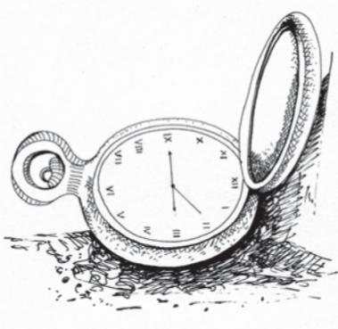

# ESSAYS

144 *Woven Words*

## INTRODUCTION

An essay is a short composition in prose that undertakes to discuss a matter, express a point of view, or persuade us to accept an idea on any subject. It is addressed to a general rather than a specialised audience; as a consequence, the essay discusses its subject in a nontechnical fashion and often with a liberal use of anecdote, illustration and humour.

A useful distinction is that between the formal and informal essay. The formal essay is relatively impersonal, logically organised and filled with serious purpose. The informal essay is personal, written in a relaxed, often whimsical fashion, and tends to deal with everyday things.

Essays have been written since ancient times. The French writer, Montaigne, wrote short literary pieces which he called *Essaies*, meaning 'attempts'. Francis Bacon inaugurated the English use of the term in his own essays. The founding of literary periodicals and magazines gave great impetus to the writing of essays (earlier essays were published in books).

The essays in this unit provide a wide thematic range. *My Watch* is a humorous re-look at an instrument that most of us take for granted. *My Three Passions* focuses on the eternal concepts of love and pity. *Tribal Verse* makes one sensitively aware of the rich oral literatures of India. *Bridges,* an autobiographical excerpt, gives us a glimpse into the life of a kathak dancer and choreographer while *Patterns of Creativity* throws light on the creativity of poetry and creativity of science.

1

*Mark Twain*

- F *Look for these expressions and words in the text and guess the meaning from the context*
*My Watch* 145

| bodings | human cabbage |
| --- | --- |
| vicious happiness | prised |
| brained him |  |

## I

My beautiful new watch had run eighteen months without losing or gaining, and without breaking any part of its machinery or stopping. I had come to believe it infallible in its judgments about the time of day, and to consider its constitution and its anatomy imperishable. But, at last, one night, I let it run down. I grieved about it as if it were a recognised messenger and forerunner of calamity. But by and by I cheered up, set the watch by guess, and commanded my bodings and superstitions to depart.

Next day I stepped into the chief jeweller's to set it by the exact time, and the head of the establishment took it

out of my hand and proceeded to set it for me. Then he said, 'she is four minutes slow regulator wants pushing up'. I tried to stop him—tried to make him understand that the watch kept perfect time. But no; all this human cabbage could see was that the watch was four minutes slow and the regulator must be pushed up a little; and so, while I danced around him

in anguish, and implored him to let the watch alone, he calmly and cruelly did the shameful deed. My watch began to gain. It gained faster and faster day by day. Within a week it sickened to a raging fever and its pulse went up to a hundred and fifty in the shade. At the end of two months it had left all the timepieces of the town far in the rear and was a fraction over thirteen days ahead of the almanac. It was away into November enjoying the snow, while the October leaves were still turning. It hurried up house rent, bills payable and such things in such a ruinous way that I could not abide it. I took it to the watchmaker to be regulated. He asked me if I had ever had it repaired. I said no, it had never needed any repairing. He looked a look of vicious happiness and eagerly pried the watch open, and then put a small dice-box into his eye and peered into its machinery. He said it wanted cleaning and oiling, besides regulating, and asked me to come in a week. After being cleaned and oiled, and regulated, my watch slowed down to that degree that it ticked all appointments I go to, missing my dinner, I gradually drifted back into yesterday, then the day before, then into last week and by and by the comprehension came upon me that, all solitary and alone, I was lingering alone in week before last and the world was out of sight. I seemed to detect in myself a sort of sneaking fellow-feeling for the mummy in the museum, and a desire to swap news with him. I went to a watchmaker again. He took the watch all to pieces while I waited and then said the barrel was 'swelled'. He said he could reduce it in three days. After this the watch averaged well, but nothing more. For a half day it would go like the very mischief, and keep up such a barking and wheezing and whooping and sneezing and snorting that I could not hear myself think for the disturbance: and as it held out there was not a watch in the land that stood any chance against it. But the rest of the day it would keep on slowing down and fooling along until all the clocks it had left behind caught up again. It would show a fair and square average, and no man could say it had done more or less than its duty.

But a correct average is only a mild virtue in a watch and I took this instrument to another watchmaker. He said the king-bolt was broken. I said I was glad it was nothing more serious. To tell the plain truth, I had no idea what the king-bolt was, but I did not choose to appear ignorant to a stranger. He repaired the king-bolt but what the watch gained in one way it lost in another. It would run a while and then stop a while, and then run a while again, and so on, using its own discretion about the intervals. And every time it went off it kicked back like a musket. I padded my breast for a few days but, finally, took the watch to another watchmaker. He picked it all to pieces and turned the ruin over and over under his glass; and then he said there appeared to be fresh start. It did well now, except that always at ten minutes to ten the hands would shut together like a pair of scissors and from that time forth they would travel together. The oldest man in the world could not make head or tail of the time of day by such a watch, and so I went again to have the thing repaired. This person said that the crystal had got bent and the mainspring was not straight. He made these things all right and then my timepiece performed unexceptionably, save that now and then, after working along quietly for nearly eight hours, everything inside would let go all of a sudden and begin to buzz like a bee, and the hands would straightway begin to spin round and round so fast that their individuality was lost completely, and they simply seemed a delicate spider's web over the face of the watch. She would reel off the next twenty-four hours in six or seven minutes, and then stop with a bang. I went with a heavy heart to one more watchmaker, and looked on while he took her to pieces. Then I prepared to cross-question him rigidly, for this thing was getting serious. The watch had cost two hundred dollars originally, and I seemed to have paid out two or three thousand for repairs. While I waited and looked on, I presently recognised in this watchmaker an old acquaintance—a steam-boat engineer of other days and not a good engineer, either. He examined all the parts carefully, just as the other watchmakers had done, and then delivered his verdict with the same confidence of manner.

He said:

'She makes too much steam— you want to hang the monkey-wrench on the safety-valve!' I brained him on the spot and had him buried at my own expense. My uncle William (now deceased, alas!) used to say that a good horse was a good horse until it had run away once, and that a good watch was a good watch until the repairers got a chance at it. And he used to wonder what became of all the unsuccessful tinkers, and gunsmiths, and shoe-makers, and engineers, and blacksmiths; but nobody could ever tell him.

#### ABOUT THE AUTHOR

Samuel L. Clemens (1835–1910), who used the pseudonym Mark Twain, was an American humorist, short story writer and novelist.

Brought up in the small town of Hannibal, Missouri, Mark Twain had less than 10 years of schooling. He worked as a printer's apprentice, a steamboat pilot, a prospector and a journalist. All this gave him varied experiences and a wide knowledge of humanity.

In the *Adventures of Tom Sawyer,* he drew on his own childhood; *The Adventures of Huckleberry Finn*, which was planned merely as a sequel, went on to become a masterpiece, the story being narrated through an uneducated boy.

#### UNDERSTANDING THE TEXT

- 1. What was the importance of the watch to the author?
- 2. What were the attempts made by the author to get his watch repaired?
- 3. Why did the author finally give up on his watch?
- 4. What was Uncle Williams' comment on the 'tinkerers' of the world?
- 5. Explain these lines
	- *a.* 'I seemd to detect in myself a sort of sneaking fellow-feeling for the mummy in the museum, and a desire to swap news with him.'
	- *b.* 'Within a week it sickened to a raging fever and its pulse went up to a hundred and fifty in the shade.'
	- *c.* 'She makes too much steam—you want to hang the monkey wrench on the safety valve!'

#### TALKING ABOUT THE TEXT

*Discuss in pairs or groups of four*

- 1. Replacing old machines with new is better than getting them repaired.
- 2. It is difficult to part with personal items like a watch which have a sentimental value attached to them.

#### APPRECIATION

- 1. How is humour employed to comment on the pains that the author took to get his watch set right?
- 2. 'The author's treatment of the subject matter makes the readers identify themselves with the experience.' Comment on this statement.
- 3. Identify some of the improbable images the author has used to effect greater humour.

#### LANGUAGE WORK

Make a list of the expressions that imbue the watch with human attributes.

#### SUGGESTED READING

- 1. *The Adventures of Huckleberry Finn* by Mark Twain
- 2. *The Mysterious Stranger and Other Stories* by Mark Twain.

u u u

