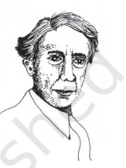

2

*Bertrand Russell*

- F *From the context of the passage, guess the meaning of the words and phrases in the box*
150 *Woven Words*

| wayward course | ocean of anguish | verge of despair |
| --- | --- | --- |
| mystic miniature | unfathomable | abyss |
| apprehend | reverberate |  |

Three passions, simple but overwhelmingly strong, have governed my life: the longing for love, the search for knowledge, and unbearable pity for the suffering of mankind. These passions, like great winds, have blown me hither and thither, in a wayward course, over a deep ocean of anguish, reaching to the very verge of despair.

I have sought love, first, because it brings ecstasy ecstasy so great that I would often have sacrificed all the rest of life for a few hours of this joy. I have sought it, next, because it relieves loneliness—that terrible loneliness in which one shivering consciousness looks over the rim of the world into the cold unfathomable lifeless abyss. I have sought it, finally, because in the union of love, I have seen, in a mystic miniature, the prefiguring vision of the heaven that saints and poets have imagined. This is what I sought and, though it might seem too good for human life, this is what at least I have found.

With equal passion, I have sought knowledge. I have wished to understand the hearts of men. I have wished to know why the stars shine. And I have tried to apprehend the Pythagorean power by which number holds sway over the flux. A little of this, but not much, I have achieved.

Love and knowledge, so far as they were possible, led upward toward the heavens. But always pity brought me back to earth. Echoes of cries of pain reverberate in my heart. Children in famine, victims tortured by oppressors, helpless old people a hated burden to their sons, and the whole world of loneliness, poverty and pain make a mockery of what human life should be. I long to alleviate the evil, but I cannot, and I too suffer.

This has been my life. I have found it worth living, and would gladly live it again if the chance were offered to me.

## ABOUT THE AUTHOR

Bertrand Russell (1872–1969), the British philosopher and mathematician, has written numerous popular works on philosophy, politics and education. He took a major part in the twentieth century revival of logic and made

continued effort to identify the methods of philosophy with those of the sciences. He received the Nobel Prize for literature in 1950. The above passage is an extract from Bertrand Russell's *Autobiography.*

## UNDERSTANDING THE TEXT

- 1. Why does Russell call the three passions 'simple'?
- 2. Why has he compared the three passions to great winds?
- 3. What, according to Russell, is the importance of love in life?
- 4. How does Russell's definition of knowledge differ from what is commonly understood by the term?
- 5. Why is the quality of pity earth-bound while the other two passions are elevating?
- 6. How have the three passions contributed to the quality of Russell's life?
- F *Read the summary of Martin Luther's King's distinction between three kinds of love given below.*

King's sixth point was central to the method of non-violent resistance. He believed that the importance of non-violence rested in the fact that it prevented physical violence and the 'internal violence of spirit'. Bitterness and hate were absent from the resister's mind, and replaced ...cont. with love. However, the kind of love King was talking about was not the affectionate type but, instead, the type that meant 'understanding, redeeming good will for all people'. He further explained that in the Greek New Testament, there were three words for love and each had a different meaning. *Eros* was romantic love and *philla* was a reciprocal love. Neither of these two types of love were the kind that King advanced. *Agape,* which was not a passive love, was the kind of redemptive love he referred to. According to King, "It is an overflowing love which is purely spontaneous, unmotivated, groundless and creative. It is not set in motion by any quality or function of its object. It is the love of God operating in the human heart."

Additionally, it was a love that was disinterested. The act of loving was not for one's own good but for the good of another. It did not distinguish between worthy and unworthy people or friends and enemies. Furthermore, it was love that fulfilled the need of another person. A person was in greatest need of love when a sinner.

King also believed that *agape* sought to preserve and create community. As a result, no distance was too far to travel in the attempt to restore community. *Agape* was,

...a willingness to forgive, not seven times, but seventy times to restore community. The cross is the eternal expression of the length to which God will go in order to restore broken community. The resurrection is a symbol of God's triumph over all the forces that seek to block community. The Holy Spirit is the continuing community creating reality that moves through history. He who works against community is working against the whole of creation.

Thus, hateful responses promote a broken community and instead one must respond to hate with love in order to avoid becoming depersonalised and to fix a broken community.

Lastly, *agape* means that every aspect of life is interrelated. All human beings are related to one another and by harming another they harm themselves.

Martin Luther King was a man who believed that the power of love could be the most effective weapon against the social ills of society. He promoted resistance that was nonviolent and, in the end, it proved to be the most successful method against an unjust system of segregation.

- How does Russell's concept of love and pity tie up with King's concepts of *agape*?
## SUGGESTED READING

- 1. 'Ideas that have Helped Mankind' by Bertrand Russell
- 2. 'Ideas that have Harmed Mankind' by Bertrand Russell.

u u u

