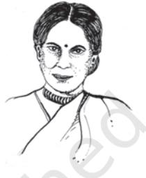

*Kumudini Lakhia*

- F *Look for these words and expressions in the text and guess their meaning from the context*

| infraction | demeanour |
| --- | --- |
| dubious assertion | synergy |

If my younger self could see me now she would be incredulous. That I would work in the field of dance or decipher and translate dance for my own comprehension, call it choreography if you wish, would have been unbelievable. In this respect, I am particularly envious of dancers who claim that they were 'born to dance', implying that it was clearly laid out for them from the beginning. I must say, I find this assertion dubious; it is rarely that easy. To dance means to struggle—I believe it is the same in any discipline because discipline itself is a struggle. I believe I was not simply born to dance; I was born to live. And now, as the patchwork of my life comes into clearer focus, I can see clear bridges between my life experiences and my work in dance.

In all truth, as a child, I never did want to dance; it was forced upon me by a doting mother and a silent father. My father probably kept his peace to avoid argument. From the beginning my lessons took place under trying conditions, though I believe that the conditions were more trying for my mother than for me. She travelled in local, over-crowded trains to dance class with an unwilling child, tired from a whole day at school. She waited a whole hour in the not-so-clean ante-room of my guru's house and then endured the same journey back. This was in Bombay, and my first dance lessons were with Guru Sunder Prasad who lived in Chowpatty while we lived in Khar. We took the train, then a bus and then walked, and the whole trip took roughly 45 minutes each way.

Interestingly, it was the film industry that spurred my mother to enrol me in dance classes. When I was seven, we went to see a movie starring Mumtaz Ali, father of the comedian, Mehmood. Ali did a dance number in the film with which I became fascinated. When we arrived home, I began prancing around the house imitating the film actor and my mother, who was quietly watching, was the one who said, 'Kumudini, you are born to dance.' Ironically, I have no recollection of this story; it was my mother who saw this innate ability in me. Her belief was so strong that she went through the gruelling exercise of taking me to dance class four days a week without complaint.

However, my childhood education was composed of much more than just dance and academics. I did not live in a vacuum. I was surrounded by life and learnt many of my lessons there, lessons that I still carry with me. I grew up during a volatile era, a time of war, India's independence movement compounded by World War II in which India played a role in military operations. My father, being an engineer, was called upon to build the cantonment areas first in Delhi, then in Naini and Allahabad. In Delhi we were allotted a sprawling house on Hardinge Avenue (now Tilak Marg) with Liaquat Ali (later, Prime Minister of Pakistan), as our neighbour. Once his gardener caught me and my brother, Suresh, picking guavas from his tree. He grabbed us by the ear and presented us before the master for punishment. Liaquat Ali not only let us keep the guavas but extended an open invitation to pick the fruits whenever we wished! However, this generous offer was accompanied by the *mali's* face which was so horrifying and revengeful that we never went near that garden again. It was one of my first lessons in the games that politicians play.

Father would now have to move to wherever army construction was required. Therefore, when I was nine years old, the decision was made to send me to boarding school. After a lot of arguments, advice, consideration and research on the part of my parents, I was packed off to Queen Mary's College (school) in Lahore (at that time in India). I had not known a day away from home, but the idea of living with a lot of girls of my age and studying in a fancy school was both exciting and worrisome, as curiosity was mixed with sadness. No more shuffling to and from class, no more over-bearing Guruji.

No such luck. Mother sent a dance teacher, Radhelal Misra, Sunder Prasad's nephew, along with me! She hired a small apartment for him in Lahore and arranged a schedule for my lessons. Despite her belief that I was 'born' to dance, I didn't enjoy dance classes. Quite frankly, they were no fun. I felt as if nothing progressed, that I was just doing what my guru ordered. I was always a curious child and I wanted to know and understand what I was doing. Why was I gyrating in this way? But my teacher could not, or would not, explain it to me. I was envious of other girls who were playing tennis and basketball while I was doing this thing called Kathak. My mother convinced the principal, a Britisher, that to dance was a form of prayer and that she could not curb religious freedom! Having spent several years in a school where most of our teachers were British, I have come to like their form of discipline. Discipline in one's daily routine does bring discipline in thinking. You begin to place your thoughts in neat little piles the way you do your uniforms and shoes.

It was three weeks before the final school examinations—matriculation at that time—when my life changed dramatically. I was called to the Principal's office. What had I done? The only reason one was called to Miss Cox's office was because of some infraction. While she was a kind and diplomatic person, she was also strict and firm and later, when I myself became a teacher, I was influenced by her demeanour. As I approached the office, I wondered did I forget to put away the tennis racquets after morning play? Did I forget to lock the door of the dormitory?

'May I come in, madam?' I asked quietly.

'Yes do come in child,' she answered with a voice full of such kindness that it made me suspicious, 'You have to go home.'

'But why? I have to study for my exams!'

'Your father called to say that your mother is sick and he would like you to visit her.'

During the walk back from Miss Cox's office to my classroom I was overwhelmed with feelings of confusion, a state of mind I have never completely got over. Even today, when I want to create a new piece, the first theme that comes to my mind vibrates with confusion.

Mother was already dead when I arrived, 36 hours and three train-rides later. When I saw her, motionless and colourless, I finally understood why I had been summoned home. I was 14 years old. The air was still and nobody looked at me. I did not know where to turn or what to do with my hands, which hung loose from my body. Then suddenly they clutched my stomach. Hunger pangs? I hadn't eaten for three days and there was an emptiness I wanted to fill. I was afraid of appearing greedy, so I underplayed my emotions, though all kinds of yearning gnawed my insides.

Even today I mistake the different kinds of hunger inside me, and this is something that shows up in my work. The dangling arms find expression in my choreography. In *Duvidha* or *Conflict*, I examined the plight of a middle-class woman who is chained to the traditions of Indian life. She is restricted to domestic circles, is forbidden from wearing sleeveless blouses, must wear her hair in a bun and must cater to her husband. Yet, from a small window she sees the newspaperman waving images of a woman with a bold streak of white in her short hair, who wears sleeveless blouses, is surrounded by men who listen to her intently, is widowed but wears colourful saris. Moreover, she commands a country with millions of people. Yet, while the woman looking out of the window is intrigued by this image, she experiences conflicting emotions. The character in *Duvidha* is torn between two lives—she feels an emptiness within her but is not sure what she is hungry for, what kind of life she wants. This is something I have felt often, yet now that I have so much behind me, I am more certain of where to place my hands.

My exams yielded surprisingly good results. So, now what? Where do I go from here? This question has cropped up throughout my life, and many years later took shape in my composition, *Atah Kim*. It's funny how we store our experiences in our brains as if we are pre-recorded cassettes. The right cassette seems to fall into place when you least expect it to. Upon finishing school, I was at a crossroads and the path ahead was not clear to me. I had lots of ideas about what I wanted to do with my life, and dance was not always a priority. I was always driven, and that partly stems from the fact that I had a relatively subdued childhood. I was enveloped by a great mist of protection and I wanted to emerge from that mist and discover myself. In particular, I wanted to feel powerful; to control a large group of people. In *Atah Kim* I address this desire for power and, yet, once you possess it, what do you do with it? Once you reach your goal, where do you go from there? It's a question without an answer but I believe the question must be asked.

At the age of 15, I had many options. It would have been easy enough to join college for a bachelor's or master's degree in psychology or English literature. But everyone does that. 'You have to do something that is off-beat, different from the done thing,' my father said to me. So it was that I decided to attend an agriculture college in Naini, Allahabad. There were twenty-nine boys and I, in a class of thirty. Having spent my school years in a girls' school, I knew little about the behaviour of boys. My brother was seven years younger so his friends were no help. However, at the agriculture college, I got a taste of relations between boys and girls. We had to travel for miles in the fields on bicycles. The boys deflated the tires of my bicycle so that they could walk back with me, resulting in miles and miles of worthless conversation about the latest film songs and actors, none of which interested me.

Also, I was fascinated by the professors, mostly American, who wore shorts because we worked in fields with clay, crops, manure and insecticides. One day, I also turned up in shorts and had 58 eyes peering at my legs! My grandmother had always said that girls must never push their chests out or uncover their legs. I now realised what she meant but couldn't accept it as valid. 'What about the short blouses you wear, with your midriff showing?' I asked her.

'Don't argue,' was her reply.

When will we understand the dignity of the female body? A dancer has to move with dignity, a quality much desired amongst dancers but sadly missing in most, especially women, as they are taught to underplay their bodies most of their lives. My grandmother, of course, was not completely to blame for this attitude. It is a problem that goes deep into the texture of our society. We must embrace our senses and use them to the fullest, rather than try to inhibit them.

Another argument I often had with my grandmother was about religion and visiting temples. 'Go to the temple before your exams, God will give you strength to do well,' she would say. I took issue with the idea that an outside force must be bargained with in order to obtain desirable results. Doesn't this strength come from within? I had a hard time believing that it was God alone who endowed me with this ability. Visiting temples activates your senses, though we often take this for granted. You see the grandeur of the architecture and can feel the curve of the stones. The scent of incense, flowers and sandalwood mingle together. You hear the ringing of the bells and taste the *panchamrut*. With your palms and the soles of your feet you touch the different surfaces. What an experience! Why do I have to bargain with God as if he is some kind of agent for a trading company? Yet these arguments with my grandmother were useful in that they made me differentiate between sensitivity and sentimentality. Later, I created a piece called *Panch Paras*, the five senses, to explore this realm.

After graduating with a degree in agriculture at the age of 18, I was left with few job prospects and was again at a crossroads. Luckily, good fortune came to me without much beckoning. It happened in Bombay. I had gone to the train station to see off Suresh who was studying at Sherwood College in Nainital. While I was waving to the train that had now disappeared, there was a tap on my shoulder. I turned around and the woman who stood there changed the course of my life. All those tedious hours of dance lessons fused into a new synergy. She was Komlata Dutt, a friend of my father's and, more importantly, the person who introduced Uday Shankar to the dance legend, Anna Pavlova, in Paris. And here she was, telling me to join the Ram Gopal Dance Company based in London!

It took some learning to adjust to working with a group of professional dancers and musicians, on the move all the time, and the opportunity exposed me to a very different aspect of dance education—there was a lot of dance to be learnt as well—*kummi* of Kerala, *ghumar* of Rajasthan, *dandia* of Gujarat—all were part of the troupe's repertoire. What I enjoyed most was learning the classical Bharatanatyam from Ram Gopal himself who was a strict disciplinarian and had a fetish for perfection of line. However, in the end he would say, 'You've perfected the technique, now throw it overboard and dance'. This is a lesson I have tried to teach my own students—before you begin experimenting, you need to perfect the technique with which you experiment.

Touring with Ram Gopal not only taught me more about dance, I discovered new things about my own personality. Encountering people from different countries gives you a chance to look at yourself in a new light. More often than not, I found that my weaknesses were brought glaringly into focus. I came to realise the importance of context how things change when you change their placement. One of the most striking moments of that tour was my time in post-war Germany. It was an unbelievably sad place. Hungry children begging for food is a common sight in India, yet, in Germany the same sight created a different sensation. It amazed me how the same situation in a different environment evokes quite different reactions, and the same is true in dance. One changes the placement of a choreographic piece on stage and it looks quite different. I myself was a changed person when placed in different surroundings.

Still, a long tour of many countries in Europe and America is exhausting. I was constantly travelling between India and various parts of the globe. In all, I was abroad for

three years and by the end, I needed to go home. But where was home? And how does one make a home for oneself? Buy a house, get married, have children, make friends? I had only the last item on the agenda. While in school in Lahore, I had made a lot of friends, but they now lived in a different country—Pakistan. I had to obtain a visa to visit my closest friend over a weekend. I would like to say I am apolitical but I've discovered that politics makes its presence felt even when uninvited.

On my return, the last of many returns, what ultimately awaited me were marriage, children and a flat in Bombay. Finally I had a home, but it came with strings attached—I now had to manage this new home. In a society like ours, where a woman wanting to work outside the home must do so in addition to her domestic responsibilities, it is easy to feel overwhelmed. Still, I didn't do too badly thanks to my supportive husband, Rajanikant. In spite of his own background in a family where men are treated as a special breed, he was a good man, with the extraordinary quality of believing everything. The word 'suspicion' was absent from his vocabulary. This made him popular but unsuccessful, both as a professional and a parent, but a very accommodating husband. My biggest benefit from my association with him was the love of music he instilled in me. If he had chosen music as a profession he would have done better in life, but his bar-at-law from Lincoln's Inn in London pushed him into the wrong line of work.

I must say, I am blessed with a wonderful family, two normal and healthy children, my son Shriraj and daughter Maitreyi, now married with their own children. Looking back, I keep wondering what my contribution was as a mother, but it must have been satisfactory to attain these results. And yet, both are completely different in their attitudes and philosophies—one has an extended sense of ambition and the other allows things to transpire as they are destined to. The only point on which they agree is that they disagree with my profession! It is interesting to have this kind of variety in a family. Living with a group of different personalities beneath one roof is like performing with other artistes on stage. The equation, the space factor, vibrations and relationships must be taken into serious consideration. You are no longer performing solo. You belong to a larger image and must develop a new set of performing skills.

## ABOUT THE AUTHOR

Kumudini Lakhia (born 1930) is a renowned Kathak dancer and choreographer who was taught and influenced by the famous Ram Gopal. She has performed in over 40 countries, but chose to give up her career as a solo performer to start the Kadamb Dance Centre in

Ahmedabad, where she trains students in the art of classical Kathak dance. Her other achievements include choreographing for two very successful Hindi films, *Umrao Jaan* and *Sur Sangam*. Her awards include the All India Sangeet Natya Kala Award (1977); Sangeet Natak Akademi National Award (1982); Kala Ratna Award; Sangeet Kala Sangam (1982); and the Padma Shri in 1987. On the occasion of 50 years of Independence, the city of Ahmedabad awarded her with the Nagar Bhushan.

## UNDERSTANDING THE TEXT

- 1. How did the author feel about her mother's passion to make her a dancer?
- 2. What were the lessons of life learnt in her younger days that Kumudini carried into her adult life?
- 3. How did Kumudini react to her mother's death?
- 4. What were the concepts that Kumidini Lakhia represent through *Duvidha*, *Atah Kim* and *Panch Paras*?
- 5. How does Kumudini Lakhia describe her guru Ramgopal's influence on her?

## TALKING ABOUT THE TEXT

*Discuss the following in pairs or in small groups*

- 1. Exceptionally talented people are born so; talent cannot be cultivated.
- 2. Discipline and a questioning spirit can coexist in an individual.
- 3. "Before you begin experimenting, you need to perfect the technique with which you experiment."
- 4. Kumudini Lakhia's life is an inspiring illustration of the emancipation of women.

# APPRECIATION

- 1. The significance of reading an autobiograophy lies in drawing lessons from another life. What is the significance of Kumudini's account for us as readers?
- 2. Pick out instances from the passage that reflect the sensitivity of the author.
- 3. 'I can see clear bridges between my life experiences and my work in dance.' How does Kumudini Lakhia weave episodes from the two realms in her account?

# LANGUAGE WORK

| 1. |  | Distinguish between the following pairs of words |  |
| --- | --- | --- | --- |
|  | incredulous | - | incredible |
|  | suspicious | - | susceptible |
|  | sensitivity | - | sentimentality |
|  | successive | - | successful |

- 2. Interpret these phrases in the context of the essay
mist of protection at a crossroads it came with strings attached

- 3. 'Kummi', 'ghumar' and 'dandia' are some dance forms mentioned in the text. Make an inventory of folk dance forms in the different regions of the country.
### SUGGESTED READING

- 1. *Women who Dared* ed Ritu Menon, National Book Trust, 2000.
u u u

### GLOSSARY

### SELECTED LITERARY FORMS

- Ballad : A form of verse, adapted for singing or recitation which presents a dramatic or exciting episode in simple, narrative form.
- Dramatic Monologue : A poetic soliloquy in which the speaker reveals his own character. Usually a listener is present who does not speak but plays a part in the development of the poem.
- Fable: A brief tale in either prose or verse, with a moral. Usually, but not always, the characters are animals and birds.
- Satire: Verse or prose blending a critical attitude with humour and wit; the purpose being to ridicule frailties and follies in human customs and institutions and by causing laughter, to inspire their reform.
- Lyric: A fairly short poem consisting of the utterance by a single speaker, who expresses a state of mind or a process of perception, thought and feeling.
- Ode: A long lyric poem that is serious in subject and treatment, elevated in style and elaborate in its stanzaic structure.
- Sonnet: A lyric poem consisting of fourteen lines, linked by an intricate hyme scheme.
- Allegory: A story, play, poem, picture etc. in which meaning or message is represented symbolically.

### SELECTED LITERARY TERMS

- Refrain: A group of words forming a phrase or sentence and repeated at regular intervals in a poem, usually at the end of a stanza. The refrain probably developed from the old ballad.
- Pathos : In literature and drama, the portrayal of an incident in such a way so as to arouse feelings of pity, tenderness or sadness in the reader or spectator.
- Irony : A form of speech in which the actual intent is expressed in words that carry the opposite meaning.

u u u

- Sarcasm : A sneering or cutting remark; an ironical taunt.
