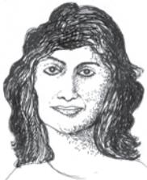

# POETRY

106 *Woven Words*

## INTRODUCTION

The word 'poetry' originates from a Greek word meaning 'to make'. A poet is thus a maker and the poem something that is made or created. No single definition of poetry is possible but some characteristic features of poetry may be mentioned. Poetry has a musical quality with rhythm, pitch, metre; and it may use figures of speech such as simile and metaphor.

While quite a few poems in this selection are in traditional forms, the unit also includes modern poems that are free from formal restrictions.

Examples of 'haiku' and 'limerick' have been included to introduce learners to these forms and to make students look to poetry for fun. Students need not be set questions or tested on this.

1

1

## The Peacock

*Sujata Bhatt*

His loud sharp call seems to come from nowhere. Then, a flash of turquoise in the pipal tree The slender neck arched away from you as he descends, and as he darts away, a glimpse of the very end of his tail.

I was told that you have to sit in the veranda And read a book, preferably one of your favourites with great concentration.. The moment you begin to live inside the book A blue shadow will fall over you. The wind will change direction, The steady hum of bees In the bushes nearby will stop. The cat will awaken and stretch. Something has broken your attention; And if you look up in time You might see the peacock turning away as he gathers his tail To shut those dark glowing eyes, Violet fringed with golden amber. It is the tail that has to blink For eyes that are always open.

## ABOUT THE POET

Sujata Bhatt (born 1956)) was educated in the USA and now lives in Germany. She won the Commonwealth Poetry Prize for the Asia section for her collection of poems, *Brunizem* (1988), from which 'The Peacock' is taken. Two other

books of poems by her are *Monkey Shadows* (1991) and *The Stinking Rose* (1994). She has also translated Gujarati poetry into English.

- F *Notice these words in the poem and guess their meaning from the context*

#### UNDERSTANDING THE POEM

- 1. Comment on the lines that make you visualise the colourful image of the peacock.
- 2. What are the cues that signal the presence of the peacock in the vicinity?
- 3. How does the connection drawn between the tail and the eyes add to the descriptive detail of the poem?
- 4. How does the poem capture the elusive nature of the peacock?
- 5. The peacock is a colourful bird. How does the poem capture the various colours that its plumage displays?

## TRY THIS OUT

- 1. In English the peacock is associated with pride. 'As proud as a peacock' is a commonly used simile. With what qualities is the peacock associated in the literature of your language?
- 2. The peacock is the national bird of India. Why do you think the peacock has been chosen?

### SUGGESTED READING

- 1. 'The Bangle Sellers' by Sarojini Naidu.

