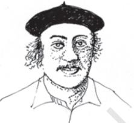

# Felling of the Banyan Tree

*Dilip Chitre*

My father told the tenants to leave Who lived on the houses surrounding our house on the hill One by one the structures were demolished Only our own house remained and the trees Trees are sacred my grandmother used to say Felling them is a crime but he massacred them all The sheoga, the oudumber, the neem were all cut down But the huge banyan tree stood like a problem Whose roots lay deeper than all our lives My father ordered it to be removed

The banyan tree was three times as tall as our house Its trunk had a circumference of fifty feet Its scraggy aerial roots fell to the ground From thirty feet or more so first they cut the branches Sawing them off for seven days and the heap was huge Insects and birds began to leave the tree

And then they came to its massive trunk Fifty men with axes chopped and chopped The great tree revealed its rings of two hundred years We watched in terror and fascination this slaughter As a raw mythology revealed to us its age Soon afterwards we left Baroda for Bombay Where there are no trees except the one

Which grows and seethes in one's dreams, its aerial roots Looking for the ground to strike.

# ABOUT THE POET

Dilip Chitre (1938–2009) was born in Baroda. He writes poetry both in Marathi and English. *Travelling in a Cage,* from which the poem selected here has been taken, was published in 1980. Apart from poetry, Chitre has also written short stories and critical essays. An

Anthology of Marathi Poetry 1945–1965 is one of his most important works of translation. He sees poetry as an expression of the spirit. He lives and works in Mumbai.

- F*Guess the meaning of the word* 'scraggy' *from the context.*
## UNDERSTANDING THE POEM

- 1. Identify the lines that reveal the critical tone of the poet towards the felling of the tree.
- 2. Identify the words that help you understand the nature of the poet's father.
- 3. 'Trees are sacred my grandmother used to say'— what does the poet imply by this line?
- 4. 'No trees except the one which grows and seethes in one's dreams'— why is the phrase 'grows and seethes' used?
- 5. How does the banyan tree stand out as different from other trees? What details of the tree does the poet highlight in the poem?
- 6. What does the reference to raw mythology imply?
- 7. 'Whose roots lay deeper than our lives'— what aspect of human behaviour does this line reflect?
- 8. Comment on the contemporary concern that the poem echoes.

### TRY THIS OUT

- 1. Most of us have had this experience of seeing trees in our neighbourhood being mercilessly cut down in order to build a house or a public building or to widen a road. Describe any such experience you have had of the felling of a tree you were attached to, with reasons for your special attachment to the tree.
- 2. Find out the equivalents for *sheoga, oudumber* and *neem* in your language and English and the equivalent of *banyan* in your language.
- 3. The adjective 'scraggy' is used to describe 'roots' in the poem. Find out two other items which could be described as 'scraggy': scraggy…………….
- 4. Use the following adjectives to describe suitable items

|
|  |

### SUGGESTED READING

- 1. 'Death of Grandmother' by Dilip Chitre.
