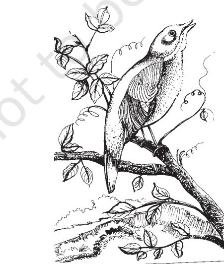
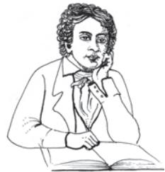

# Ode to a Nightingale

*John Keats*

My heart aches, and a drowsy numbness pains

My sense, as though of hemlock I had drunk,

Or emptied some dull opiate to the drains One minute past, and Lethe-wards had sunk:

'Tis not through envy of thy happy lot,

But being too happy in thine happiness,

That thou, light-winged Dryad of the trees, In some melodious plot

Of beechen green, and shadows numberless,

Singest of summer in full-throated ease.

*Lethe:* in ancient Greek mythology, an imaginary river whose water, when drunk, was thought to make the dead forget their life on Earth.

*Dryad:* in stories, a female spirit that lives in a tree.

***

O, for a draught of vintage! that hath been Cool'd a long age in the deep-delved earth,

Tasting of Flora and the country green,

Dance, and Provencal song, and sunburnt mirth!

O, for a beaker full of the warm South,

Full of the true, the blushful Hippocrene, With beaded bubbles winking at the brim, And purple-stained mouth;

That I might drink, and leave the world unseen,

And with thee fade away into the forest dim.

***

Fade far away, dissolve, and quite forget What thou among the leaves hast never known

The weariness, the fever, and the fret

Here, where men sit and hear each other groan;

Where palsy shakes a few, sad, last gray hairs,

Where youth grows pale, and spectre-thin, and dies;

Where but to think is to be full of sorrow And leaden-eyed despairs,

Where Beauty cannot keep her lustrous eyes,

Or new Love pine at them beyond tomorrow.

***

*Provencal:*

(pronounced Provensaal) of the district of Provence in France, known for its bards and its grapevines.

*Hippocrene:* a fountain in Mount Helicon associated with poetry; in the poem it refers to the wine that inspires poetic ability.

Thou wast not born for death, immortal Bird!

No hungry generations tread thee down;

The voice I hear this passing night was heard

In ancient days by emperor and clown:

Perhaps the self-same song that found a path

Through the sad heart of Ruth, when, sick for home,

She stood in tears amid the alien corn; The same that oft-times hath

Charm'd magic casements, opening on the foam

Of perilous seas, in faery lands forlorn.

***

Forlorn! the very word is like a bell To toll me back from thee to my sole self! Adieu! the fancy cannot cheat so well As she is fam'd to do, deceiving elf. Adieu! adieu! thy plaintive anthem fades Past the near meadows, over the still stream,

Up the hill-side; and now 'tis buried deep In the next valley-glades:

Was it a vision, or a waking dream?

Fled is that music:—Do I wake or sleep?

## ABOUT THE POET

John Keats (1795–1821) was one of the greatest of the younger generation of 'English Romantic' poets. He started his career as an apprentice to a surgeon but

*Ruth:* a woman in the Bible who left her own people to live with her mother-inlaw, Naomi. After the death of her husband, marries Boaz and is the ancestor of King David.

soon gave it up for poetry. His poetic career lasted for only four years but, during this short span, he evolved from an ordinary poet to an exceptionally mature poetic force. His poetry celebrates beauty, which he considered the ultimate truth. It is portrayed in extremely sensuous images that have been created through beautiful verbal pictures. The image of the nightingale's bower in the poem is an apt illustration of the poet's craft in this respect.

- F *Look for these words and guess their meanings from the context*

| hemlock | deep-delved |
| --- | --- |
| earth | forlorn |
| beechen green | deceiving elf |
| plaintive anthem |  |

#### UNDERSTANDING THE POEM

- 1. How does the nightingale's song plunge the poet into a state of ecstasy?
- 2. What are the unpleasant aspects of the human condition that the poet wants to escape from?
- 3. What quality of 'beauty' and 'love' does the poem highlight?
- 4. How does the poet bring out the immortality of the bird?
- 5. How is the poet tossed back from ecstasy into despair?
- 6. How does the poem bring out the elusive nature of happiness in human existence?

## TRY THIS OUT

- 1. The poet has juxtaposed sets of opposites like numbness pains, waking dream. How does this contribute to the poetic effect? What is this figure of speech called? List other such pairs from poems that you have read.
- 2. The poet has evoked the image of wine—why has this image been chosen?
- 3. The senses of sound, sight and taste are evoked in the poem. Locate instances of these.
- 4. The poet addresses the nightingale and talks to the bird throughout the poem. What is this kind of poem called?
- 5. Make a list of all the adjectives in the poem along with the nouns they describe. List the phrases that impressed you most in the poem.
- 6. Find out the other odes written by Keats and read them.
- 7. Find out the odes written by Shelley and read them.

## SUGGESTED READING

- 1. The complete version of 'Ode to a Nightingale' by John Keats
- 2. 'Ode to the West Wind' by P.B. Shelley.

