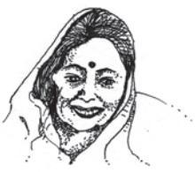

6

# Mother Tongue

*Padma Sachdev*

I approached a stem Swinging on a reed And asked him To give me a quill. Irritated, he said I gave you one only the other day A new one, what have you done with it? Are you some sort of an accountant With some *Shah* Writing account books Where you need a new pen Every other day he asked. No, I don't work for a *Shah* I said, but for a *Shahni*, very kind, Very well off And I am not the only one Working for her She has many servants Ever ready to do her bidding That *Shahni* is my mother tongue Dogri Give me, a quill, quickly She must be looking for me The reed cut off its hand Gave it to me and said Take it I too am her servant.

## ABOUT THE POET

Padma Sachdev (born 1940) writes in her mother tongue Dogri and in Hindi. She has received many awards for her poetry, including the Sahitya Academi Award she received at the age of thirty for her first collection of Dogri poems.

The above poem, translated from the original Dogri, bemoans the deprivation of Dogri of its native script Sharade, that evolved from the original Brahmi around the time Dogri developed. Once widely used by the people of all religions in the valley, Sharade, for various reasons, came to be replaced by the Persian script. Presently both Persian and Devanagri (Hindi and Urdu) scripts are used for Dogri, a language listed in Schedule VIII of the Constitution of India.

#### UNDERSTANDING THE POEM

- 1. The quill is the central element in the poem—what does it symbolise?
- 2. You notice a sense of urgency in the poet's request—what is the reason for this?
- 3. How has the poet brought out her emotional attachment to her mother tongue?
- 4. Personification is a figure of speech that attributes human qualities to inanimate things and abstract ideas. How has it been used in this poem?

### TRY THIS OUT

- 1. Talk to five people from different spheres of society around you and ask them the number of languages they know and use for various purposes. Try to gather information about their attitude to the different languages they know and use.
- 2. Dogri is a language spoken in parts of Jammu and Kashmir, Himachal Pradesh and Punjab. Its earliest mention is in Amir Khusro's list of Indian languages. It does not have a script of its own. It is written in either the Devnagari or the Persian script. Find out about other Indian languages that are spoken but do not have a script of their own.

#### SUGGESTED READING

- 1. 'Hindi' by Raghuvir Sahay.
