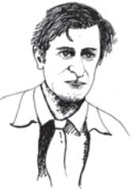

# Hawk Roosting

*Ted Hughes*

I sit in the top of the wood, my eyes closed.

Inaction, no falsifying dream

Between my hooked head and hooked feet:

Or in sleep rehearse perfect kills and eat.

The convenience of the high trees! The air's buoyancy and the sub's ray Are of advantage to me; And the earth's face upward for my inspection.

My feet are locked upon the rough bark. It took the whole of Creation To produce my foot, my each feather: Now I hold Creation in my foot.

Or fly up, and revolve it all slowly— I kill where I please because it is all mine. There is no sophistry in my body: My manners are tearing off heads.

The allotment of death. For the one path of my flight is direct Through the bones of the living. No arguments assert my right.

The sun is behind me. Nothing has changed since I began, My eye has permitted no change. I am going to keep things like this.

## ABOUT THE POET

Ted Hughes (1930–1998) completed his education at Pembroke College, Cambridge. In 1956, he married the poet Sylvia Plath. He tried to make a living in America by teaching and writing. Finally, he returned to England.

The most remarkable quality of Hughes' poems is an intense and obsessive fascination with the world of birds and animals; and though essentially about birds, animals and fishes, his poems shock us with unusual phrases and violent images.

The above poem is in the form of a monologue.

- F *Notice the use of the following phrases in the poem and guess what they mean in the context*
#### air's buoyancy sophistry in my body

### UNDERSTANDING THE POEM

- 1. Comment on the physical features of the hawk highlighted in the poem and their significance.
- 2. How does the poem emphasise the physical prowess of the hawk?
- 3. 'There is no sophistry in my body'—this statement expresses the brutal frankness of the hawk. Does the poet suggest something through this statement?
- 4. 'Now I hold Creation in my foot'—explain the centrality of this assertion in the poem. What makes the hawk's assertion of its invincibility so categorical?
- 5. Why is the poem entitled 'Hawk Roosting'?
- 6. Bring out the parallel suggested between the predatory instincts of the bird and human behaviour.

### TRY THIS OUT

- 1. Consult a dictionary or an encyclopedia to differentiate between the following birds

|
|  |

#### *Hawk Roosting* 123

- 2. To what aspects of human behaviour do the following adjectives apply
eagle-eyed hawkish

## SUGGESTED READING

- 1. 'The Lake' by Ted Hughes
- 2. 'Poem in October' by Dylan Thomas.

