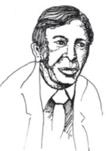

9

# Refugee Blues

*Wystan Hugh Auden*

Say this city has ten million souls, Some are living in mansions, some are living in holes: Yet there's no place for us, my dear, yet there's no place for us.

Once we had a country and we thought it fair, Look in the atlas and you'll find it there: We cannot go there now, my dear, we cannot go there now.

In the village churchyard there grows an old yew, Every spring it blossoms anew: Old passports can't do that, my dear, old passports can't do that.

The consul banged the table and said: 'If you've got no passport you're officially dead'; But we are still alive, my dear, but we are still alive.

Went to a committee; they offered me a chair; Asked me politely to return next year; But where shall we go today, my dear, but where shall we go today?

Came to a public meeting; the speaker got up and said: 'If we let them in, they will steal our daily bread'; He was talking of you and me, my dear, he was talking of you and me.

Thought I heard the thunder rumbling in the sky; It was Hitler over Europe, saying: 'they must die'; We were in his mind, my dear, we were in his mind. Saw a poodle in a jacket fastened with a pin; Saw a door opened and a cat let in: But they weren't German Jews, my dear, but they weren't German Jews.

Went down the harbour and stood upon the quay, Saw the fish swimming as if they were free: Only ten feet away, my dear, only ten feet away.

Walked through a wood, saw the birds in the trees; They had no politicians and sang at their ease: They weren't the human race, my dear, they weren't the human race.

Dreamed I saw a building with a thousand floors, A thousand windows and a thousand doors; Not one of them was ours, my dear, not one of them was ours.

Went down to the station to catch the express, Asked for two tickets to Happiness; But every coach was full, my dear, every coach was full.

Stood on a great plain in the falling snow; Ten thousand soldiers marched to and fro: Looking for you and me, my dear, looking for you and me.

### ABOUT THE POET

Wystan Hugh Auden (1907–1973) was a student and later a Professor of Poetry at Oxford University. One of the most important poets of the century, he has published several collections of poems noted for their irony, compassion and wit.

Although a modern poem, 'Refugee Blues' uses the ballad form of narration.

#### UNDERSTANDING THE POEM

- 1. The title, 'Refugee Blues' encapsulates the theme of the poem. Comment.
- 2. What is the poetic technique used by the poet to convey the plaintive theme of the poem?
- 3. What do the references to the birds and animals made in the poem suggest?
- 4. How does the poet juxtapose the human condition with the behaviour of the political class?
- 5. How is the essence of the poem captured in the lines 'two tickets to Happiness'?

## TRY THIS OUT

- 1. Here is a list of devices used in poetry. Elaborate on their use in this poem
Refrain: Pathos: Irony: Sarcasm:

- 2. What does the colour 'blue' suggest in the poem? Make a list of other colours and the emotions and moods they carry.
#### SUGGESTED READING

- 1. 'Taller Today we Remember' by W.H. Auden
- 2. 'Our Hunting Fathers' by W.H. Auden.

