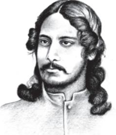
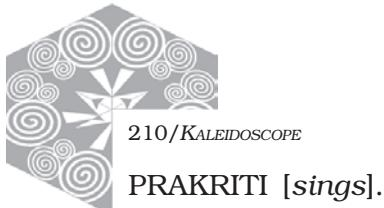
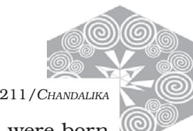
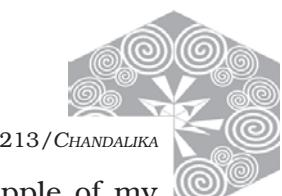
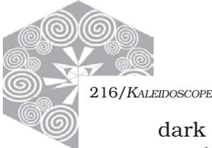
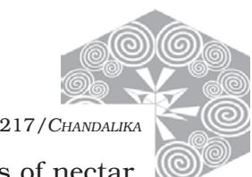
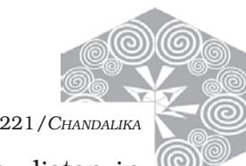
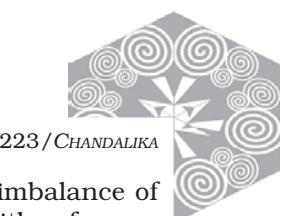

203*/CHANDALIKA*

#### INTRODUCTION

A drama is a composition in prose or verse presenting in dialogue a story of life or character, especially one intended to be acted on the stage. The essence of drama is the make-believe by which an actor impersonates a character of the play. The element of make-believe in drama is much greater than the average play-goer realises. For instance, we must regard it as entirely natural that rooms and houses have one wall 'missing' that enables the audience to witness the action.

Drama is usually divided into tragedy and comedy, but within this general framework a number of types and subtypes have been developed. The tragicomedy, for instance, mixes elements of both tragedy and comedy; the modern 'problem-play' deals with neither of these but with middle class life and problems.

Furthermore, drama is the literary form most viable with the modern mass media; and film, radio and television are producing a vast quantity of it, ranging from 'soap opera' and farce to serious new works and fine productions of old ones.

Two plays find a place in the section: *Chandalika* by Tagore which describes the angst of an untouchable woman; and an excerpt from *Broken Images* by Girish Karnad, which is a monologue by a celebrity writer that plumbs the depths of her psyche and recreates her life for the TV viewer.

*Rabindranath Tagore was a poet, novelist, shortstory writer and dramatist. He was awarded the Nobel Prize for Literature in 1913. Tagore's interest in drama was fostered while he was a boy, for his family enjoyed writing and staging plays. The music in his plays is instrumental in bringing out the delicate display of emotion around an idea. The central interest in his plays is the unfolding of character; of the opening up of the soul to enlightenment of some sort.*

1

#### INTRODUCTION

Rabindranath Tagore 1861-1941

This short drama is based on the following Buddhist legend. Ananda, the famous disciple of the Buddha, was one day returning from a visit when he felt thirsty and, approaching a well on the way, asked for water from a chandalika, a girl belonging to the lowest untouchable caste. The girl gave him water and fell in love with the beautiful monk. Unable to restrain herself, she made her mother, who knew the art of magic, work her spell on him. The spell proved stronger than Ananda's will and the spell-bound monk presented himself at their house at night; but, as he saw the girl spread the couch for him, he was overcome with shame and remorse and prayed inwardly to his master to save him. The Buddha heard the prayer and broke the magic spell and Ananda went away, as pure as he came.

This crude plot of the popular tale, showing how the psychic power of the Buddha saves his devotee from the lust of a chandal girl, has been transformed by the poet

205*/CHANDALIKA*

into a psychological drama of intense spiritual conflict. It is not the story of a wicked girl roused to lust by the physical beauty of the monk, but of a very sensitive girl, condemned by her birth to a despised caste, who is suddenly awakened to a consciousness of her full rights as a woman by the humanity of a follower of the Buddha, who accepts water from her hand and teaches her to judge herself not by the artificial values that society attaches to the accidents of birth, but by her capacity for love and service.

This is a great revelation for her, which she calls a new birth; for she is washed clean of her self-degradation and rises up a full human being with her right to love and to give. And since her own self is the most she can give, and since none is more worthy of the gift of her surrender than the *bhikshu* who has redeemed, or, as she puts it, created her, she yearns to offer herself to him. But Ananda, detached from all earthly cares and immersed in his inner self, knows nothing of all this and passes by without recognising her.

She is humiliated, wounded in her newly awakened sensibility, and determines to drag the monk from his pride of renunciation to the abjectness of desire for her. She has lost all religious scruple or fear, for she owed nothing to religion save her humiliation.

'A religion that insults is a false religion. Everyone united to make me conform to a creed that blinds and gags. But since that day something forbids me to conform any longer. I'm afraid of nothing now.'

She forces her mother to exercise her art of magic on Ananda. She refers to it as the primeval spell, the spell of the earth, which is far more potent than the immature *sadhana* of the monks. The 'spell of the earth' proves its force and Ananda is dragged to their door, his face distorted with agony and shame. Seeing her redeemer, so noble and resplendent before, thus cruelly transformed and degraded, she is horrified at the selfish and destructive nature of her desire. The hero to whom she yearned to dedicate herself was not this creature, blinded by lust and darkened with shame, but Ananda of the radiant form, who had

given her the gift of a new birth and had revealed her own true humanity. In remorse she curses herself and falls at his feet, begging for forgiveness. The mother revokes the spell and willingly pays the price of such revocation, which is death. The chandalika is thus redeemed for the second time, purged of the pride and egoism that had made her forget that love does not claim possession, but gives freedom.

*Chandalika* is a tragedy of self-consciousness overreaching its limit. Self-consciousness, up to a point, is necessary to self-development; for, without an awareness of the dignity of one's own role or function, one cannot give one's best to the world. Without rights there can be no obligations, and service and virtue when forced become marks of slavery. But self-consciousness, like good wine, easily intoxicates, and it is difficult to control the dose and have just enough of it. Vanity and pride get the upper hand and he who clings to his rights very often trespasses on those of others. This is what happened to the heroine. Prakriti, in her eagerness to give, forgot that Ananda need not take; her devotion grew so passionate that she could not make her surrender without first possessing. Yet it was inevitable that it should be so; for a new consciousness, after ages of suppression, is overpowering and one learns restraint only after suffering. Hence the tragedy. The good mother who, so unwillingly, worked the spell to please her importunate daughter, and who so willingly revoked it to save Ananda, dies in the process. The daughter, though chastened and made wise by suffering, has paid a heavy price; for wisdom is not happiness and renunciation is not fulfilment.

### ACT I

### Read and find out

How does Prakriti's mother react when she hears of Prakriti's encounter with the monk?

MOTHER. Prakriti! Prakriti! Where *has* she gone? What ails the girl, I wonder? She's never to be found in the house.

PRAKRITI. Here, mother, here I am.

MOTHER. Where?

PRAKRITI. Here, by the well.

- MOTHER. Whatever will you do next? Past noon, and a blistering sun, and the earth too hot for the feet! The morning's water was drawn long ago, and the other girls in the village have all taken their pots home. Why, the very crows on the *amloki* branches are gasping for heat. Yet you sit and roast in the *Vaisakh* sun for no reason at all! There's a story in the *Purana* about how Uma left home and did penance in the burning sun—is that what you are about?
PRAKRITI. Yes, mother, that's it—I'm doing penance.

- MOTHER. Good heavens! And for whom?
- PRAKRITI. For someone whose call has come to me.
- MOTHER. What call is that?
- PRAKRITI. 'Give me water.' He set the words echoing in my heart.
- MOTHER. Heaven defend us! He said to you 'Give me water'? Who was it? Someone of our own caste?
- PRAKRITI. That's what he said—that he belonged to our kind.
- MOTHER. You didn't hide your caste? Did you tell him that you are a chandalini?
- PRAKRITI. I told him, yes. He said it wasn't true. If the black clouds of *Sravana* are dubbed chandal, he said, what of it? It doesn't change their nature, or destroy the virtue of their water. Don't humiliate yourself, he said; self-humiliation is a sin, worse than self-murder.
- MOTHER. What words are these from you? Have you remembered some tale of a former birth?

PRAKRITI. No, this is a tale of my new birth.

- MOTHER. You make me laugh. New birth, indeed! Since when, pray?
- PRAKRITI. It was the other day. The palace gong had just struck noon and it was blazing hot. I was washing that calf at the well—the one whose mother died. Then

<i>In the original, this play, unlike the others, is not divided into acts. There is no lapse of time *in the action. The divisions here suggested indicate the intervals which would be found desirable in stage production.*

a Buddhist monk came and stood before me, in his yellow robes, and said, 'Give me water'. My heart leaped with wonder. I started up trembling and bowed before his feet, without touching them. His form was radiant as with the light of dawn. I said, 'I am a chandalini, and the well-water is unclean'. He said, 'As I am a human being, so also are you, and all water is clean and holy that cools our heat and satisfies our thirst'. For the first time in my life I heard such words, for the first time I poured water into his cupped hands—the hands of a man the very dust of whose feet I would never have dared to touch.

- MOTHER. O, you stupid girl, how could you be so reckless? There will be a price to pay for this madness! Don't you know what caste you were born in?
- PRAKRITI. Only once did he cup his hands, to take the water from mine. Such a little water, yet that water grew to a fathomless, boundless sea. In it flowed all the seven seas in one, and my caste was drowned, and my birth washed clean.
- MOTHER. Why, even the way you speak is changed. He has laid your tongue under a spell. Do you understand yourself what you are saying?
- PRAKRITI. Was there no other water, mother, in all Sravasti city? Why did he come to this well of all wells? I may truly call it my new birth! He came to give me the honour of quenching Man's thirst. That was the mighty act of merit which he sought. Nowhere else could he have found the water which could fulfill his holy vow no, not in any sacred stream. He said that Janaki bathed in such water as this, at the beginning of her forest exile, and that Guhak, the chandal, drew it for her. My heart has been dancing ever since, and night and day I hear those solemn tones— 'Give me water, give me water'.
- MOTHER. I don't know what to make of it, child; I don't like it. I don't understand the magic of their spells. Today I don't recognise your speech; tomorrow, perhaps, I shall not even recognise your face. Their spells can make a changeling of the very soul itself.

209*/CHANDALIKA*

- PRAKRITI. All these days you have never really known me, mother. He who has recognised me will reveal me. And so I wait and watch. The midday gong booms from the palace, the girls take up their water-pots and go home, the kite soars alone into the far sky, and I bring my pitcher and sit here at the well by the wayside.
- MOTHER. For whom do you wait?
- PRAKRITI. For the wayfarer.
- MOTHER. What wayfarer will come to you, you crazy girl?
- PRAKRITI. That one wayfarer, mother, the one and only. In him are all who fare along the ways of all the world. Day after day goes by, yet he does not come. Though he spoke no word, his word was given—why does he not keep his word? For my heart is become like a waterless waste, where the heat-haze quivers all day long. Its water cannot be given, for no one comes to seek it.
- MOTHER. I can make nothing of your talk today; it's as though you were intoxicated. Tell me plainly, what do you want?
- PRAKRITI. I want *him*. All unlooked for—he came, and taught me this marvellous truth, that even my service will count with the God who guides the world. O words of great wonder! That *I* may serve, *I*, a flower sprung from a poison-plant! Let him raise that truth, that flower from the dust, and take it to his bosom.
- MOTHER. Be warned, Prakriti, these men's words are meant only to be heard, not to be practised. The filth into which an evil fate has cast you is a wall of mud that no spade in the world can break through. You are unclean; beware of tainting the outside world with your unclean presence. See that you keep to your own place, narrow as it is. To stray anywhere beyond its limits is to trespass.

Blessed am I, says the flower, who belong to the earth. For I serve you, my God, in this my lowly home. Make me forget that I am born of dust,

For my spirit is free from it. When you bend your eyes upon me my petals tremble in joy;

Give me a touch of your feet and make me heavenly, For the earth must offer its worship through me.

- MOTHER. Child, I'm beginning to understand something of what you say. You are a woman; by serving you must worship, and by serving you must rule. Women alone can in a moment overstep the bounds of caste; when once the curtains of destiny are drawn aside, they all stand revealed in their queenliness. You had a good chance, you know, when the king's son was deer-hunting and came to this very well of yours. You remember, don't you?
PRAKRITI. Yes, I remember.

- MOTHER. Why didn't you go to the king's house? He had forgotten everything in your beauty.
- PRAKRITI. Yes, he *had* forgotten everything—forgotten that I was a human being. He had gone out hunting beasts; he saw nothing but the beast whom he wanted to bind in chains of gold.
- MOTHER. At least he noticed your beauty, if only as game to be hunted. As for the *Bhikshu*, does *he* see the woman in you?
- PRAKRITI. You *won't* understand, mother, you won't! I feel that in all these days he is the first who ever really recognised me. That is a marvellous thing. I want him, mother, I want him beyond all measure. I want to take this life of mine and lay it like a basket of flowers at his feet. It will not defile them. Let everyone marvel at my daring! I shall glory in my claim. 'I am your handmaid,' I shall declare—for otherwise I must lie bound for ever at the whole world's feet, a slave!

MOTHER. Why do you get so excited, child? You were born a slave. It's the writ of Destiny, who can undo it?

- PRAKRITI. Fie, fie, Mother, I tell you again, don't delude yourself with this self-humiliation—it is false, and a sin. Plenty of slaves are born of royal blood, but I am no slave; plenty of chandals are born of Brahmin families, but I am no chandal.
- MOTHER. I don't know how to answer you, child. Very good. I'll go to him myself, and cling to his feet. 'You accept food from every home', I'll say. 'Come to our house too, and accept from our hands at least a bowl of water.'
- PRAKRITI. No, no, I'll not call him in that way, from outside. I'll send my call into his soul, for him to hear. I am longing to give myself; it is like a pain at my heart. Who is going to accept the gift? Who will join with me in give-and-take? Will he not mingle his longings with mine, as the Ganges mingles with the black waters of the Jumna? For music springs up of itself, and he who came unbidden has left behind him a word of hope. What is the use of one pitcher of water when the earth is cracked with drought? Will not the clouds come of themselves to fill the whole sky, the rain seek the soil by its own weight?
- MOTHER. What is the use of such talk? If the clouds come, they come: if they don't, they don't; if the crops wither, it's no concern of theirs! What more can we do than sit and watch the sky?
- PRAKRITI. That won't do for me; I won't simply sit and watch. You know how to work spells; let those spells be the clasp of my arms, let them drag him here.
- MOTHER. What are you saying, wretched girl? Is there no limit to your recklessness? It would be playing with fire! Are these *bhikshus* like ordinary folk? How am I to work spells on them? I shudder even to think of it.
- PRAKRITI. You would have worked them boldly enough on the king's son.
- MOTHER. I'm not afraid of the king; he might have had me impaled, perhaps. But these men—they do nothing.

- PRAKRITI. I fear nothing any longer, except to sink back again, to forget myself again, to enter again the house of darkness. *That* would be worse than death! Bring him here you must! I speak so boldly, of such great matters—isn't that in itself a wonder? Who worked the wonder but he? Shall there not be further wonders? Shall he not come to my side, and sit with me on the corner of my cloth?
- MOTHER. Suppose I can bring him, are you ready to pay the price? Nothing will be left to you.
- PRAKRITI. No, nothing will be left. The burden and heritage of birth after birth—nothing will remain. Only let me bring it all to an end, then I shall live indeed. That's why I need him. Nothing will be left me. I have waited for age after age, and now in this birth my life shall be fulfilled. My mind is saying it over and over again fulfilled! It was for this that I heard those wonderful words, 'Give me water'. Today I know that even I can give. Everyone else had hidden the truth from me. I sit and watch for his coming today to give, to give, to give everything I have.

MOTHER. Have you no respect for religion?

- PRAKRITI. How can I say? I respect him who respects me. A religion that insults is a false religion. Everyone united to make me conform to a creed that blinds and gags. But since that day something forbids me to conform any longer. I'm afraid of nothing now. Chant your spells, bring the *Bhikshu* to the side of the chandalini. I myself shall do him honour—no one else can honour him so well.
- MOTHER. Aren't you afraid of bringing a curse upon yourself?
- PRAKRITI. There has been a curse upon me all my life. Poison kills poison, they say—so one curse another. Not another word, mother, not another word. Begin your spells, I cannot bear any more delay.

MOTHER. Very well, then. What is his name?

PRAKRITI. His name is Ananda.

MOTHER. Ananda? The disciple of the Lord Buddha? PRAKRITI. Yes, it is he.

- MOTHER. O my heart's treasure, you are the apple of my eye—but it's a great wrong I'm putting my hand to at your bidding!
- PRAKRITI. What wrong? I will bring to my side the one who brings all near. What crime is there in that?
- MOTHER. They draw men by the strength of their virtue. We drag them with spells, as beasts are dragged in a noose. We only churn up the mud.
- PRAKRITI. So much the better. Without the churning, how can the well be cleansed?
- MOTHER (*apostrophising Ananda*].

O thou exalted one, thy power to forgive is greater far than my power to offend. I am about to do thee dishonour, yet I bow before thee: accept my obeisance, Lord.

- PRAKRITI. What are you afraid of, mother? Yours are the lips I use, but it's I who chant the spells. If my longing can draw him here, and if that is a crime, then I will commit the crime. I care nothing for a code which holds only punishment, and no comfort.
MOTHER. You are immensely daring, Prakriti.

- PRAKRITI. You call *me* daring? Think of the might of *his* daring! How simply he spoke the words which no one had ever dared to say to me before! 'Give me water.' Such little words, yet as mighty as flame—they filled all my days with light, they rolled away the black stone whose weight so long had stopped the fountains of my heart, and the joy bubbled forth. Your fear is an illusion, for you did not see him. All morning he had begged alms in Sravasti city; when his task was done he came, across the common, past the burning-ground, along the river bank, with the hot sun on his head and all for what? To say that one word, 'Give me water', even to a girl like me. O, it is too wonderful! Whence did such grace, such love, come down—upon a wretch unworthy beyond all others? What can I fear now? 'Give me water'—yes, the water which has filled all my days to overflowing, which I must needs give or die! 'Give me water.' In a moment I knew that I had

water, inexhaustible water; to whom should I tell my joy? And so I call him night and day. If he does not hear, fear not; chant your spell, he will be able to bear it.

- MOTHER. Look, Prakriti, some men in yellow robes are going by the road across the common.
- PRAKRITI. So they are; all the monks of the *sangha*, I see. Don't you hear them chanting?

[*The chant is heard in the distance*.]

- To the most pure Buddha, mighty ocean of mercy, Seer of knowledge absolute, pure, supreme,
	- Of the world's sin and suffering the Destroyer— Solemnly to the Buddha I bow in homage.

PRAKRITI. O Mother, see, he is going, there ahead of them all. He never turned his head or looked towards this well. He could so easily have said 'Give me water' once more before he went. I thought he would never be able to cast me aside—me, his own handiwork, his new creation. [*She flings herself down and beats her head on the ground*.] This dust, this dust is your place! O wretched woman, who raised you to bloom for a moment in the light? Fallen in the end into this same dust, you must mingle for all time with this same dust, trampled underfoot by all who travel the road.

- MOTHER. Child, dear child, forget it, forget it all. They have broken your momentary dream, and they are going away—let them go, let them go. When a thing is not meant to last, the quicker it goes the better.
#### Read and find out

Will Prakriti resign herself to her lot?

PRAKRITI. Day after day this cry of desire, moment by moment this burden of shame; this prisoned bird in my breast, that beats its wings unto death—do you call it a dream? A dream, is it, that sinks its sharp

215*/CHANDALIKA*

teeth into the fibres of my heart, and will not loosen its grip? And they, who have no ties, no joy or sorrow, no earthly burden, who float along like the clouds in autumn—are only they awake, are only they real?

- MOTHER. O Prakriti, I cannot bear to see you suffer so. Come, get up, I *will* chant the spells, I *will* bring him. All along the dusty road I will bring him. 'I want nothing,' he says in his pride. I'll break that pride and make him come, running and crying 'I want, I want'.
- PRAKRITI. Mother, yours is an ancient spell, as old as life itself. Their mantras are raw things of yesterday. These men can never be a match for you—the knot of their mantras will be loosened under the stress of your spells. He is bound to be defeated.
- MOTHER. Where are they going?
- PRAKRITI. Going? They are going nowhere! During the rains they remain four months in penance and fasting, and then they are off again, how should I know where? That's what they call being awake!
- MOTHER. Then why are you talking of spells, you crazy thing? He is going so far—how am I to bring him back?
- PRAKRITI. No matter where he goes, you must bring him back. Distance is nothing for your spells. He showed no pity to me, I shall show none to him. Chant your spell, your cruellest spells; wind them about his mind till every coil bites deep. Wherever he goes, he shall never escape me!
- MOTHER. You need not fear, it is not beyond our powers. I will give you this magic mirror; you shall take it in your hand and dance. His shadow will fall on the glass, and in it you will see what happens to him and how near he has come.
- PRAKRITI. See there the clouds, the storm clouds, gathered in the west. The spell will work, mother, it will work. His dry meditations will scatter like withered leaves; his lamp will go out, his path will be lost in darkness. As a bird at dead of night falls fluttering into the

dark courtyard, its nest broken in the storm, even so shall he be whirled helpless to our doors. The thunder throbs in my heart, my mind is filled with the lightning flash, the waves foam high in an ocean whose shore I cannot see.

- MOTHER. Think well even now, lest sudden terror spring upon you with the work half done. Can you endure to the end? When the spell has reached its height, it would cost me my life to undo it. Remember that this fire will not die down till all that will burn is burnt to ashes.
- PRAKRITI. For whom are you afraid? Is he a common man? Nothing will hurt him. Let him come, let him tread the path of fire to the very end. Before me I see in vision the night of doom, the storm of union, the bliss of the breaking of worlds.

# ACT II

[*Fifteen days have passed*.]

### Read and find out

Will the spell work? What will happen when Ananda is made to come?

- PRAKRITI. O, my heart will break. I will not look in the mirror, I cannot bear it. Such agony, so furious a storm. Must the king of the forest crash to the dust at last, his cloud-kissing glory broken?
- MOTHER. Even now, child, if you say so, I will try to undo the spell. Let the cords of my life be torn apart and my life-blood spent, if only that great soul can be saved.
- PRAKRITl. That is best, mother. Let the spells stop, I'll have no more... no, no, don't! Go on—the end of the path is so near! Make him come to the very end, make him come right to my bosom! After that I will blot out all his suffering, emptying my whole world at his feet. At dead of night the wayfarer will come, and I will kindle the lamps for him in the flames of

my burning heart. Deep within are springs of nectar, where he shall bathe and anoint his weary, hot and wounded limbs. Once again he shall say 'Give me water'—water from the ocean of my heart. Yes, that day will come—go on, go on with the spell.

[*Song*]

In my own sorrow Will I quit thy sorrow; Thy hurt will I bathe

In the deep waters of my pain's immensity. My world will I give to the flames,

And my blackened shame shall be cleansed. My mortal pain will I offer as gift at thy feet.

- MOTHER. I never knew it would take so long. My spells have no more power, child; there is no breath left in my body.
- PRAKRITI. Don't be afraid, mother; hold out a little longer, only a little. It will not be long now.
- MOTHER. The month of *Ashad* is here, and their four months' fast is at hand.
- PRAKRITl. They are gone to Vaisali, to the monastery there. MOTHER. How pitiless you are! That is so far away.
- PRAKRITI. Not very far; seven days' journey. Fifteen days have already passed. His seat of meditation has been shaken at last. He is coming, he is coming! All that once lay so far away, so many million miles away, beyond the very sun and moon, immeasurably beyond the reach of my arms—it is coming, nearer and nearer! He is coming, and my heart is rocked as by an earthquake.
- MOTHER. I have worked the spell through all its stages such force might have brought down Indra of the thunderbolt himself. And yet *he* does not come. It is a fight to the death indeed. What did you see in the mirror?
- PRAKRITI. At first I saw a mist covering the whole sky, deathly pale like the weary gods after their struggle with the demons, Through rifts in the mist there

glimmered fire. After that the mist gathered itself up into red and angry clusters, like swollen, festering sores. That day passed. The next day I looked, and all the background was a deep black cloud, with lightning playing across it. Before it he was standing, all his limbs fenced with flame. My blood ran cold, and I rushed to tell you to stop your spells at once but I found you in deep trace, sitting like a log, breathing hardly, and unconscious. It seemed as though a fierce fire burned in you, and your fire was a flaming serpent that hissed and struck in deadly duel at the fire that wrapped him round. I came back and took up the mirror; the light was gone only torment, unfathomable torment, was in his face.

- MOTHER. Yet that did not kill you? The fire of his suffering burnt into my soul, till I thought I could bear no more.
- PRAKRITI. It seemed that the tortured form I saw was not his only, but mine too; it belonged to us both. In those awful fires the gold and the copper had been melted and fused.

MOTHER. And you felt no fear?

- PRAKRITI. Something far greater than fear. I beheld the God of Creation, more terrible far than the God of Destruction, lashing the flames to work His purposes, while they writhed and roared in anger. What lay at his feet in the casket of the seven elements—Life or Death? My mind swelled with a joy hard to name joy in the tremendous detachment of new creation, free of care or fear, of pity or sorrow. Creation breaking, burning and melting among the sparks of the elemental fires. I could not keep still. My whole soul and body danced and danced together, as the pointed flames dance in the fire.
MOTHER. And how did your *Bhikshu* appear?

- PRAKRITI. His eyes were fixed motionless upon the distance, like stars in the evening twilight. I longed to escape from myself far into boundless space.
MOTHER. When you danced before the mirror, he saw you? PRAKRITI. Fie upon it, how I am shamed! Again and again

his eyes grew red, as though he were about to curse.

Again and again he trampled down the glowing fires of anger, and at last his anger turned upon himself, quivering, like a spear, and pierced his own breast.

MOTHER. And you bore all this?

- PRAKRITI. I was amazed. I, this I, this daughter of yours, this nobody from nowhere—his suffering and mine are one today! What holy fire of creation could have wrought such a union? Who could dream of so great a thing?
- MOTHER. When shall his turmoil be stilled?
- PRAKRITl. When my suffering is stilled. How can he attain his *mukti* until I attain mine?
- MOTHER. When did you last look into your mirror?
- PRAKRITl. Yesterday evening. He had passed through the lion-gate of Vaisali some days before, at dead of night—seemingly in secret, unknown to the monks. After that I had sometimes seen him ferried across rivers or on difficult mountain passes. I had seen the evening fall, and him alone on the wide commons, or on the dark forest paths at dead of night. As the days went by, he fell more deeply under the spell and became heedless of everything, all the conflict with his own soul at an end. His face was mazed, his body slack, his eyes fixed in an unseeing stare, as though for him there were neither true nor false, good nor evil—only a blind and thoughtless compulsion, with no meaning in it.

MOTHER. Can you guess how far he has come today?

PRAKRITI. I saw him yesterday at Patal village on the river Upali. The river was turbulent with new rains; there was an old peepul tree by the ghat, fireflies shining in its branches, and under it a lichened altar. As he reached it he gave a sudden start and stood still. It was a place he had known for a long time; I have heard that one day the Lord Buddha preached there to King Suprabhas. He sat down and covered his eyes with his hands—I felt that his dream-spell might break at any moment. I flung away the mirror, for I was afraid of what I might see. The whole day has passed since then, and torn between hope and

fear I have sat on, not daring to know. Now it is dark again; on the road goes the watchman calling the hour, it must be an hour past midnight. O mother, the time is short, so short; don't let this night be wasted; put the whole of your strength into the spell.

- MOTHER. Child, I can do no more; the spell is weakening, I am failing body and soul.
- PRAKRITl. It mustn't weaken now—don't give up now! Maybe he has turned his face away, maybe the chain we have bound on him is stretched to the uttermost, and will not hold. What if he escapes now, away from this birth of mine, and I can never reach him again? Then it will be my turn to dream, to return to the illusion of a chandal birth. I will never endure that mockery again. I beseech you, mother, put out your whole strength once only; set in motion your spell of the primeval earth, and shake the complacent heaven of the virtuous.

MOTHER. Have you made ready as I told you?

- PRAKRITI. Yes. Yesterday was the second night of the waxing moon. I bathed in the river Gambhira, plunging below the water. Here in the courtyard I drew a circle, with rice and pomegranate blossoms, vermilion and the seven jewels. I planted the flags of yellow cloth, I placed sandal-paste and garlands on a brass tray, I lit the lamps. After my bath I put on a cloth, green like the tender rice shoots, and a scarf like the *champak* flower. I sat with my face to the East. All night long I have contemplated his image. On my left arm I have tied the bracelet of thread—sixteen strands of golden yellow bound in sixteen knots.
- MOTHER. Then dance round the circle in your dance of invocation, while I work my spells before the altar.

[*Prakriti dances and sings*.]

Now, Prakriti, take your mirror and look. See, a dark shadow has fallen over the altar. My heart is bursting and I can do no more. Look into the mirror—how long will it be now?

- PRAKRITl. No, I will not look again, I will listen—listen in my inmost being. If he reveals himself I shall see him before me. Bear up a little longer, mother, he will surely, surely reveal himself. Hark! Hark to the sudden storm, the storm of his coming! The earth quivers beneath his tread, and my heart throbs.
- MOTHER. It brings a curse for you, unhappy girl. As for me, it means surely death—the fibres of my being are shattered.
- PRAKRITI. No curse, it brings no curse, it brings the gift of my new birth. The thunderbolt hammers open the Lion-gates of Death; the door breaks, the walls crumble, the falsehood of this birth of mine is shattered. Tremors of fear shake my mind, but rhythms of joy enrapture my soul. My All-destroyer, my All-in-all, you have come! I will enthrone you on the summit of all my dishonour, and build your royal seat of my shame, my fear and my joy.
- MOTHER. My time is near, I can do no more. Look in the mirror at once.
- PRAKRITI. Mother, I'm afraid. His journey is almost at an end, and what then? What then for him? Only myself, my wretched self? Nothing else? Only this to repay the long and cruel pain? Nothing but me? Only this at the end of the weary, difficult road?—only me?
- MOTHER. Have pity, cruel girl, I can bear no more. Look in the mirror, quick!
- PRAKRITI (*looks in the mirror and flings it away*). O mother, mother, stop! Undo the spell now—at once—undo it! What have you done? What have you done? O wicked, wicked deed!—better have died. What a sight to see! Where is the light and radiance, the shining purity, the heavenly glow? How worn, how faded, has he come to my door! Bearing his self's defeat as a heavy burden, he comes with drooping head... Away with all this, away with it! [*She kicks the paraphernalia of magic to pieces*.] Prakriti, Prakriti, if in truth you are no chandalini, offer no insult to the heroic. Victory, victory to him!

O Lord, you have come to give me deliverance, therefore have you known this torment. Forgive me, forgive me. Let your feet spurn afar the endless reproach of my birth. I have dragged you down to earth, how else could you raise me to your heaven? O pure one, the dust has soiled your feet, but they have not been soiled in vain. The veil of my illusion shall fall upon them, and wipe away the dust. Victory, victory to thee, O Lord!

- MOTHER. Victory to thee, O Lord. My sins and my life lie together at thy feet, and my days end here, in the haven of thy forgiveness. [*She dies*.]
ANANDA [*chanting*].

*Buddho Susuddho karuna mahannvo Yoccanta suddhabbara-gnana locano Lokassa papupakilesa ghatako Vandami Buddham ahamadarena tam.*

To the most pure Buddha, mighty ocean of mercy, Seer of knowledge absolute, pure, supreme, Of the world's sin and suffering the Destroyer—

Solemnly to the Buddha I bow in homage.

## Thinking about the Play

- 1. Why does something so ordinary and commonplace as giving water to a wayfarer become so significant to Prakriti?
- 2. Why is the girl named Prakriti in the play? What are the images in the play that relate to this theme?
- 3. How does the churning of emotions bring about self-realisation in Prakriti even if at the cost of her mother's life?
- 4. How does the mirror reflect the turmoil experienced by the monk as a result of the working of the spell?
- 5. What is the role of the mother in Prakriti's self-realisation? What are her hopes and fears for her daughter?

- 6. 'Acceptance of one's fate is easy. Questioning the imbalance of the human social order is tumultuous.' Discuss with reference to the play.
## Appreciation

- 1. How does the dramatic technique suit the theme of the play?
- 2. By focusing attention on the consciousness of an outcast girl, the play sensitises the viewer/reader to the injustice of distinctions based on the accidents of human birth. Discuss how individual conflict is highlighted against the backdrop of social reality.
- 3. 'I will enthrone you on *the summit of all my dishonour,* and build *your royal seat of my shame, my fear and my joy'.* Pick out more such examples of the interplay of opposites from the text. What does this device succeed in conveying?
- 4. 'Shadow, mist, storm' on the one hand, 'flames, fire,' on the other. Comment on the effect of these and similar images of contrast on the viewer/reader.

# Suggested Reading

*Gora* by Rabindranath Tagore.

