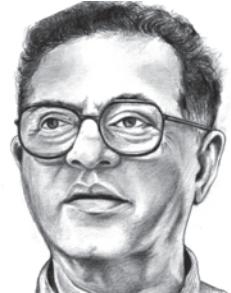
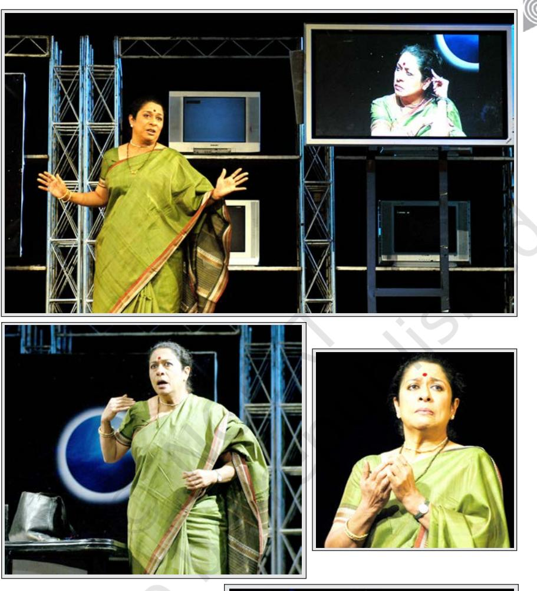
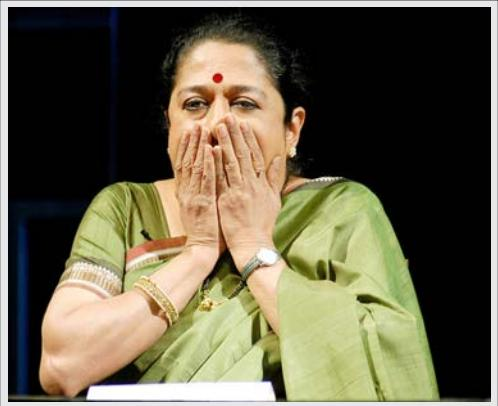

2

## Broken Images

Girish Karnad Born 1938

*Girish Karnad is a contemporary writer, playwright, actor and movie director. He is a recipient of the Padma Shri (1974), Padma Bhushan (1992) and the Jnanpith Award (1998). He writes in both Kannada and English. His plays generally use history and mythology to focus on contemporary issues. He is also active in the world of Indian cinema.*

*This play, too, can be looked at from multiple levels—the focus on values, both personal and academic, and the issue of bilingualism in today's world.*

...for you know only A heap of broken images, where the sun beats, And the dead tree gives no shelter,...

> T. S. ELIOT *THE WASTE LAND*

*The interior of a television studio. A big plasma screen hangs on one side, big enough for a close-up on it to be seen clearly by the audience. On the other side of the stage, a chair and a typically 'telly' table—strong, wide, semi-circular. At the back of the stage are several television sets, with screens of varying sizes.*

*A small red bulb glows above the table, high enough not to appear on the television screen.*

*Manjula Nayak walks in. She is in her mid-thirties/ forties, and has a confident stride. She is wearing a lapel mike. It is immediately evident that she is at home in broadcasting studios. She looks around.*

MANJULA: Nice, very nice. Neat!

*(She goes and sits on the chair. Adjusts the earpiece.)* But where is the camera?

*(Listens to the reply.)*

Ah! I see. New technology. Isn't it scary? The rate of obsolescence? (*Listens*.) Of course I have. In London. And in Toronto. But when you think of Indian television studios, you always imagine them cluttered. Lots of men and women scurrying about, shouting orders. Elephantine lights. Headphones. Cameras. You know what I mean. But here... I mean, it's all so spartan... I know. But a bit lonely too. Like a sound studio... All right. All right... No camera. I just look ahead and speak to an invisible audience in front of me... Direct. Fine. Fine... I can hear you. Clearly. Voice test?... 'Testing, Testing, One, Two, Three, Four, Five, Hello, Hello!' Shall I tap on the mike?

(*Laughs*.)

My speech will last exactly ten minutes. I have timed it... No, I won't read. 'Look ahead and speak!' Good... But that may take a little longer. A couple of minutes... if I don't fumble too much.

(*Giggles*.)

The yellow light?... Okay, okay, ready, fine!

(*She mouths 'Ten' to 'Zero' silently, emphasising each count with her forefinger. At the stroke of ten, the light turns yellow. The Announcer appears on the big plasma screen. The other screens remain blank till the last few minutes of the play*.)

- ANNOUNCER: Good evening. This is a proud evening for the Shree-TV channel. For tonight we bring to you Ms Manjula Nayak. Many of you will know her as a renowned Kannada short-story writer. Until a year ago, she was a lecturer in English in Bangalore. But she had been writing in Kannada. Not unusual, as you know. It's amazing how many of our Kannada writers are lecturers in English: from the earliest days. B. M. Shree, Gokak, Adiga.
Even modern ones. Lankesh, Shantinath, Anantha Murthy. And of course there is A. K. Ramanujan, who was equally at home in both languages. But last year Mrs Nayak stunned the world—yes, I mean, the world by writing a novel. Her first novel. In English! *The River Has No Memories*. The advance she received from her British publishers made headlines, here and in the West. And then the novel turned out to be a bestseller all over the world. Our heartiest congratulations to Mrs Nayak.

This evening we broadcast a Kannada telefilm based on this remarkable novel. The film will begin in exactly ten minutes. And we have with us in the studio Ms Nayak herself, who has graciously agreed to address our viewers about her work. Ladies and gentlemen, welcome the Literary Phenomenon of the Decade, Mrs Manjula Nayak.

*(Applause on the sound track. The light turns green. The Announcer disappears and Manjula's image appears in his place. She speaks.)*

- MANJULA: *Namaskara*. I am Manjula Nayak. 1 must mention that officially I am Mrs Manjula Murty, but my creative self continues to be Manjula Nayak. There are some areas in which we must not let marriage intrude too much.
(*Laughter*.)

Talking about one's work is a very difficult task. So let me find an easy way out. Let me just take up two questions I constantly come across. They seem to bother everyone—here, abroad. I'll answer them to the best of my ability within the short time at my disposal and shut up. Actually, that's what a writer should do, shouldn't she?—Write and shut up! (*Laughs*.)

The first question—you have probably guessed it already. After having written in Kannada all your life, why did you choose—suddenly—to write in English? Do you see yourself as a Kannada writer or an English writer? What audience do you write for? And variations on that theme.

Actually, let me confess. If I had foreseen how many people I would upset by writing in English—I really would not have committed that folly.

Intellectuals whom I respected, writers who were gurus to me, friends who I thought would pat me on my back and share my delight—they are all suddenly breathing fire. How dare I write in English and betray Kannada! (*Laughs*.)

Betray! The answer is simple; if there was betrayal, it was not a matter of conscious choice. I wrote the novel in English because it burst out in English. It surprised even me. I couldn't understand why it was all coming out in English. But it did. That's all. There is no other explanation.

What baffles me—actually, let me confess, hurts me is why our intellectuals can't grasp this simple fact! I have been accused of writing for foreign readers. Accused! As though I had committed a crime. A writer seeks audiences where she or he can find them! My British publishers said to me: 'We like your book because it's so Indian. We receive any number of manuscripts from India but they are all written with the western reader in view. Your novel has the genuine Indian feel!'

(*Laughs*.)

But who listens here? A pundit for instance has stated that no Indian writer can express herself—or himself honestly in English. 'For Indian writers, English is a medium of dishonesty.' Of course, one could also ask how many Kannada writers are honest in what they write—in Kannada. But if you did that, you would be immediately condemned as a traitor. You can't win! Recently the President of the Central Sahitya Akademi—the National Academy of the Letters— (who shall remain nameless) declared that Indians who write in English do so in order to make money. That by writing in English they confess their complicity in the global consumer market economy. He of course spoke in English. Speaking in English, as you know, gives

you the authority to make oracular pronouncements on Indian literatures and languages. But my response to the charge that I write in English for money would be: Why not? Isn't that a good enough reason? Would you like to see what royalties I earned when I wrote in Kannada?

(*Pause*.)

Yet the accusation hides—or perhaps reveals—a grim anxiety. As is clear from the dictum of the President of the Akademi, what is at issue is not Creativity but Money. What hits everyone in the eye is the money a writer in English can earn. The advance I received for my novel—the advance only, mind you—helped me resign my job and concentrate on writing. Of course it is a cause for jealousy. Having struggled in Kannada, I can understand that. A Kannada proverb says: 'A response is good. But a meaningful response is better.' Meaningful: *Arthapoorna*. The Kannada word for Meaning is *Artha*—which also means money! And of course, fame, publicity, glamour...power.

(*Laughs*.)

Let me leave it at that.

The second question everyone asks is about the book itself: thank God! How could you—you seem so strong and active—I was a long jump athlete in college, though of course no Anju Bobby George—how could you so vividly recreate the inner life of a person confined to bed all her life? How can a healthy, outdoor woman be so empathetic to the emotional world of a disabled person? Well, it is sad, but I owe that to my younger sister, Malini.

She was physically challenged. Suffered from what is technically called, meningomyelocele—the upper part of her body was perfectly normal; below the waist, the nervous system was damaged. Completely dysfunctional. A series of operations, which started soon after her birth, reduced her existence to misery she spent her entire life confined to the wheel-chair. Six years ago my parents died. She came to stay with

us in our house in Jayanagar, and I nursed her. During the last few months it was quite clear she didn't have much time left. I am childless and she became my child! Truly, the book is about her. I have dedicated it to her memory. She died last year—just a few months before the book came out. I have tried to relive what I learnt about her emotional life as I nursed her—tended to her—watched helplessly as she floated into death. I miss her. I miss my beautiful, gentle sister. (*Her eyes moisten*.)

She is the only character in the novel drawn from life. The other characters and the plot are entirely fictional. Invented.

(*Pause*.)

I must here acknowledge the support I received from one person while I wrote the novel—my husband, Pramod Murty. I was working full time as a lecturer then. College chores. And home was full of her memories. And there was I, suddenly writing in English. Floundering. Sinking. I was utterly clueless. There were moments when I broke down, when I felt I couldn't go on. But he was always there at my side, encouraging me, prodding me on. Without him, I would never have completed the novel. Thank you, Pramod. (*The overhead light turns yellow*.)

Well, that's it. I have committed the cardinal sin of writing in English.

(*Laughs*.)

There is no *prayashchitta* for it, no absolution. But fortunately the film you are about to see is in Kannada. That makes me very happy. After all, the family I have written about is Kannada. I am a Kannada writer myself, born to the language and civilization, and proud of it. The Kannada reality I conceived in English has been translated back into Kannada—to perfection—by the Director. I couldn't have done it better. My thanks to the cast and the crew and of course, Shree-TV. Well, enjoy the telefilm.

Good Night. *Namaskara*.

(*The light turns red. She leans back in her chair. Pause. Then into the lapel mike*.)

I hope that was okay? I didn't fumble too much, did I? (*Listens*.)

Thank you, Raza. The pleasure's all mine. See you outside? (*The red light switches off. She smiles contentedly*.)

Whew! That'll get them. Good. I have taken enough shit from them.

(*Laughs and gets up. Manjula's image on the screen should have given way to the film, but hasn't. Instead, the Image continues as before, watching her calmly. She is of course unaware of it.*)

(*She makes a move to the door*.)

IMAGE: Where are you going?

(*Startled, Manjula stops and looks around. Touches her earpiece to check if the sound came from there and moves on*.)

You can't go yet. —Manjula!

(*Manjula looks around baffled and sees that her image continues on the screen. She does a double take. From now on, throughout the play, Manjula and her image react to each other exactly as though they were both live characters*.)

MANJULA: Oh God! Am I still on?

(*Confused, she rushes back to the chair and stops*.)

IMAGE: You are not. The camera is off.

MANJULA: Is it?.. Then... how?

IMAGE: You are standing up. If the camera were on, I would be standing up too. I'm not.

MANJULA: Is this some kind of a trick?

(*Into her lapel mike*.)

Hello! Hello! Can you hear me? How come I'm still on the screen? Raza, hello...

(*Taps her mike. No response*.)

Is there a technical hitch?

IMAGE: No hitch.

MANJULA (*to the Image*): But how... Who are you... How... Has the tape got stuck?

Photographs from the play 'Broken Images' staged by National School of Drama in 2005.

(*Calls out into the mike.*)

Raza, Raza. Help! Help!

IMAGE: What are you screaming for? What are you afraid of? It's only me.

MANJULA: Who are you?

- IMAGE: Me? You.
- MANJULA (*to herself*): This is absurd.
- IMAGE: Quite.

(*A long pause while Manjula refuses to acknowledge the presence of the Image. Then she slowly looks up. The Image smiles*.)

- IMAGE: A good speech, I must say. My compliments. An excellent performance. The viewers loved it. All two million of them.
MANJULA: But the film? Hasn't it started?

IMAGE: Aw, screw the film... It's awful anyway.

- MANJULA: I told them it won't work. A telefilm needs lots of movement. Different locations. Pace. Action. Drama. 'A good novel does not necessarily make a good film,' I argued. But they were persistent. Sponsors were easy to find. (*Pause*.) They paid well.
- IMAGE: Your performance now... this introduction... it will be the best thing this evening. You'll be all over the papers. You have managed to upset a lot of people.
- MANJULA: Thanks. I meant to.

(*Pause*.)

- IMAGE: If one had to comment... in the extreme case that one had to...that bit about your sister Malini...the tears...that could have been played down.
MANJULA: I wasn't pretending. I loved her.

(*Pause*.)

I love her. Still. I don't think I have ever been as close to anyone else.

IMAGE: It was a close bond?

- MANJULA: The novel doesn't really do her justice. She was attractive—more attractive than me. Intelligent—more intelligent than me. And vivacious, which I never was. I accepted that. She radiated life from the wheelchair to which she was confined. I have always been reconciled to being the second best.

- IMAGE: Her illness was unfortunate. But because of it, she got the best of everything.
- MANJULA (*defensive*): She never asked for anything. Soon after her birth, the moment the gravity of her situation was realised, my parents moved to Bangalore. Took a house in the Koramangala Extension. She became the...the (*searches for a phrase and then settles for*)... the apple of their eye. When she was old enough to go to school, a teacher came home to teach her English and Mathematics. Everything else, she read up for herself. History, Philosophy, Anatomy. She was hungry—hungry for life. Gobbled it all up.

IMAGE: And you?

MANJULA: I have often wondered whether I would have been as bright if I'd received all that love and attention.

IMAGE: No, you wouldn't. Let's face it.

MANJULA (*defensively*): I did write a bestseller.

IMAGE: That's true.

- MANJULA: But you are right. I wouldn't. They left me with grandparents in Dharwad. An affectionate couple. They fussed over me. But no substitute for parents. When vacations approached I could barely wait to get to Bangalore. And once I finished college, I found a job in Bangalore and came and lived with them. Those were the happiest days of my life! Halcyon! But then I met Pramod. We got married and settled down in Jayanagar. Father helped with the house but he left most of his money in her name—for her care. She was always the focus. Naturally.
- IMAGE: But when your parents died, why didn't you move into the Koramangala house? Such a nice, big house. The garden. The sense of space.
- MANJULA: The Jayanagar house was my house. I was used to it. My college was in Jayanagar. We had selected a house which was within walking distance. Koramangala would have meant a long haul every morning.

And then such a huge house! Not easy to look after. I would have had to stay home all day like mother. Give up my job probably. No, as I said, she was one of the

most sensitive people I have known. She realised moving to Koramangala would turn my life upside down. She insisted that we sell the Koramangala house. I was reluctant but she wouldn't listen. She wanted no sacrifices on her account, no compromises. And she adjusted beautifully to the smaller house. (*Pause*.)

Actually I couldn't take Koramangala! Non-Kannadigas, most of them. And of course all those empty houses bought as investments by Non-Resident Indians. I fancied myself a Kannada writer in those days. Wanted to breathe the language. Live in the heart of Kannada culture.

- IMAGE: Now that you are a success in English, have you bought a big bungalow in Koramangala?
- MANJULA: Aw, shut up!
- IMAGE: Was Malini at home with Kannada?
- MANJULA: Of course, it is our mother-tongue. But she rarely used it. Her Kannada was limited to the cook and the maid.

IMAGE: So Kannada was the one area that became yours?

MANJULA: You could say that. I tried to occupy it and make it mine.

(*Laughs*.)

Actually, I have never said it publicly, but if you argue that a novel written in English cannot express truth about India because we do not express ourselves in English—

(*Takes a breath. Laughs*.)

God, what a sentence! But if you believe that, then let me say I could not have written about my sister in Kannada. She breathed, laughed, dreamt in English. Her friends spoke only English. Having her in my house for six years helped improve my English.

(*Pause*.)

- IMAGE: So when are you going to write your next novel? Will it also be in English?
- MANJULA: I think I have already answered that question. Why need I write another novel? Surely one is more than enough?

- IMAGE: Critically and financially. But then what are you going to do? You have resigned your job. You are rich—
MANJULA: Well-to-do.

- IMAGE: Well-to-do. You have no sister to look after. An empty house. Nothing you can use.
- MANJULA: Are you trying to make me feel guilty? Are you implying I 'used' her? It was my life as well you know. I am in the back too, though I would never admit to it publicly. Most readers find the girl's 'first cousin' quite unattractive.

IMAGE: Eek! That odious character! Is that you?

MANJULA: Well! There you are!

- IMAGE: A triumph of objective self-analysis, shall we say?
- MANJULA: If you must. But I am not that wicked really. It was a narrative necessity to have a negative character. A matter of technique. The sympathetic heroine. A villain as a counterpoint. You see?
- IMAGE: But Pramod must be pleased by your treatment of his character. He comes across as not very good-looking or striking...
- MANJULA: But not bad-looking, either. Good enough for me.
- IMAGE: ...but an intelligent, warm and lovable person. Fun-loving. Fond of practical jokes. Noble and simple. Almost simple-minded.
- MANJULA: You can say that again! You know, we met soon after I moved to Bangalore. He felt attracted to me. Didn't know how to convey it. So do you know what he did? I had a friend called Lucy. A close friend. He wrote a letter to her about me. And wrote me a letter about Lucy. Then he mailed her letter in an envelope addressed to me and vice versa. So I received this letter addressed to Lucy—moaning and groaning about how I tortured him. And I didn't even know he was interested in me. And of course Lucy received the other letter. He thought he was being absolutely clever original. We went and confronted him. Lucy tore her letter to shreds and flung the pieces on him and stormed off. Melodramatically. I felt sorry for him and

said, 'Idiot, every fifteen-year old tries that trick, convinced it's never been done before.' He blushed to the roots of his hair.

IMAGE: But you got married. So the ruse worked.

- MANJULA: No ruse. He had made such a fool of himself, he did the only thing he could to save his self-respect. He married me. I didn't mind.
- IMAGE: Mind? You would never have got another man of his calibre.

MANJULA: I suppose so.

IMAGE: And what happened to Lucy?

MANJULA: She stopped talking to me.

(*They both laugh*.)

Women found him attractive.

IMAGE: Malini too?

MANJULA: Of course. She was a woman, after all.

IMAGE: They were close to each other?

- MANJULA: Very.
IMAGE: And you didn't mind?

- MANJULA: Mind? Thank God for it. You see, he is in software development. Works from home. She was confined to her chair. Can you imagine what would have happened if they hadn't got on?
- IMAGE: He must be proud of you. That flattering portrayal of him in the novel. The moving acknowledgment in your speech today...
- MANJULA: I doubt if he will even hear of my speech. Ever. He is in the US.

IMAGE: Oh! When did he go?

- MANJULA: Last year. He lives in Los Angeles now. He is in demand as a software wizard.
IMAGE: Last year! So has he even read the novel?

- MANJULA: The launching of the novel was a major media event in the US. After all, you must remember it had already proved a super hit in Britain. They invited me to New York for the release. There was much fanfare. He sent me an email of congratulations. From Los Angeles. Apologised that he couldn't get leave to attend.
IMAGE: And you didn't go to LA?

MANJULA: He didn't even hint at it.

IMAGE: I'm sorry. But the chronology is beginning to confuse me. When did he decide to go to the States? Was it after Malini's death?

MANJULA: Yes.

IMAGE: Immediately after?

MANJULA: No. But soon after.

IMAGE: How long after?

- MANJULA (*explodes*): Who are you, for God's sake? What gives you the right to interrogate me like this—about my private life? Either you are me in which case you know everything. Or you are an electronic image, externally prying. In which case, you can just... just... switch off.
(*The Image smiles. Suddenly Manjula becomes calm*.)

## Thinking about the Play

- 1. How genuine is the love that Manjula expresses for her sister?
- 2. The sister does not appear in the play but is central to it. What picture of her is built in your mind from references in the play?
- 3. When the image says—'Her illness was unfortunate. But because of it, she got the best of everything'
	- (i) What is the nature of Manjula's reply?
	- (ii) How can it be related to what follows in the play?
- 4. What are the issues that the playwright satirises through this TV monologue of a celebrity?

## Talking about the Play

- 1. 'Broken Images' takes up a debate that has grown steadily since 1947—the politics of language in Indian literary culture, specifically in relation to modern Indian languages and English. Discuss.
- 2. The play deals with a Kannada woman writer who unexpectedly produces an international bestseller in English.
	- (i) Can a writer be a truly bilingual practitioner?
	- (ii) Does writing in an 'other tongue' amount to betrayal of the mother tongue?

- 1. Why do you think the playwright has used the technique of the image in the play?
- 2. The play is called a monologue. Why is it made to turn dialogic?
- 3. What is the posture the celebrity adopts when the camera is on and when it is off?

## Suggested Reading

*Two Monologues: Flowers, Broken Images* by Girish Karnad *The Dreams of Tipu Sultan* by Girish Karnad.

