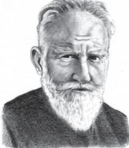
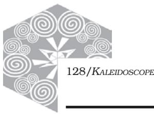
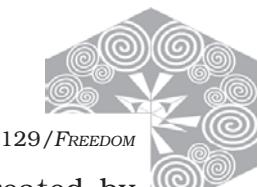
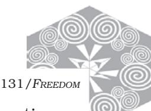
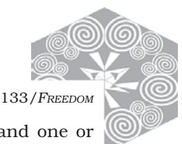
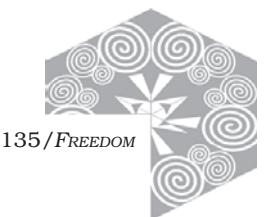

118/*KALEIDOSCOPE*

#### INTRODUCTION

Non-fiction is virtually everything that we read as literature but that does not come under the categories of novel, short story, play or poem. Nonfiction, then, is writing that is factually true. It can include articles, editorials, reports, critical essays and interviews, humorous sketches, biographies and autobiographies, lectures, speeches and sermons.

This section contains six non-fiction pieces, three by established writers of the canon: George Bernard Shaw, Virginia Woolf and D.H.Lawrence; one each by Ingmar Bergman, Amartya Sen and Isaac Asimov.

The themes are: freedom, stream of consciousness, importance of the novel as a creative form, the details that make film-making a creative art and the argumentative tradition in Indian culture based on the famous dialogue between Krishna and Arjuna in the Bhagavad Gita. Asimov's piece talks of the universe of science fiction, correlating it to accounts of mythical superhuman beings in the pre-scientific universe which served to fulfil the same emotional needs as science fiction does.

The purpose of such writing is to explain, analyse, define or clarify something—to provide us with information and to show the how and why of things.

1

G.B. Shaw 1856-1950

*George Bernard Shaw was a dramatist and critic. His work as a London newspaper critic of music and drama resulted in* The Quintessence of Ibsenism*. His famous plays include* Arms and the Man, Candida *and* Man and Superman. *His works present a fearless intellectual criticism, sugar-coated by a pretended lightness of tone. He rebelled against muddled thinking, and sought to puncture hollow pretensions.*

What is a perfectly free person? Evidently a person who can do what he likes, when he likes, and where he likes, or do nothing at all if he prefers it. Well, there is no such person, and there never can be any such person. Whether we like it or not, we must all sleep for one third of our lifetime—wash and dress and undress—we must spend a couple of hours eating and drinking—we must spend nearly as much in getting about from place to place. For half the day we are slaves to necessities which we cannot shirk, whether we are monarchs with a thousand slaves or humble labourers with no servants but their wives. And the wives must undertake the additional heavy slavery of childbearing, if the world is still to be peopled.

These natural jobs cannot be shirked. But they involve other jobs which can. As we must eat we must first provide food; as we must sleep, we must have beds, and bedding in houses with fireplaces and coals; as we must walk through the streets, we must have clothes to cover our nakedness. Now, food and houses and clothes can be

produced by human labour. But when they are produced they can be stolen. If you like honey you can let the bees produce it by their labour, and then steal it from them. If you are too lazy to get about from place to place on your own legs you can make a slave of a horse. And what you do to a horse or a bee, you can also do to a man or woman or a child, if you can get the upper hand of them by force or fraud or trickery of any sort, or even by teaching them that it is their religious duty to sacrifice their freedom to yours.

So beware! If you allow any person, or class of persons, to get the upper hand of you, he will shift all that part of his slavery to Nature that can be shifted on to your shoulders; and you will find yourself working from eight to fourteen hours a day when, if you had only yourself and your family to provide for, you could do it quite comfortably in half the time or less. The object of all honest governments should be to prevent your being imposed on in this way. But the object of most actual governments, I regret to say, is exactly the opposite. They enforce your slavery and call it freedom. But they also regulate your slavery, keeping the greed of your masters within certain bounds. When chattel slavery of the negro sort costs more than wage slavery, they abolish chattel slavery and make you free to choose between one employment or one master and another and this they call a glorious triumph for freedom, though for you it is merely the key of the street. When you complain, they promise that in future you shall govern the country for yourself. They redeem this promise by giving you a vote, and having a general election every five years or so.

At the election two of their rich friends ask for your vote and you are free to choose which of them you will vote for to spite the other—a choice which leaves you no freer than you were before, as it does not reduce your hours of labour by a single minute. But the newspapers assure you that your vote has decided the election, and that this constitutes you a free citizen in a democratic country. The amazing thing about it is that you are fool enough to believe them.

Now mark another big difference between the natural slavery of man to Nature and the unnatural slavery of

man to man. Nature is kind to her slaves. If she forces you to eat and drink, she makes eating and drinking so pleasant that when we can afford it we eat and drink too much. We must sleep or go mad: but then sleep is so pleasant that we have great difficulty in getting up in the morning. And firesides and families seem so pleasant to the young that they get married and join building societies to realise their dreams. Thus, instead of resenting our natural wants as slavery, we take the greatest pleasure in their satisfaction. We write sentimental songs in praise of them. A tramp can earn his supper by singing Home, Sweet Home.

The slavery of man to man is the very opposite of this. It is hateful to the body and to the spirit. Our poets do not praise it: they proclaim that no man is good enough to be another man's master. The latest of the great Jewish prophets, a gentleman named Marx, spent his life in proving that there is no extremity of selfish cruelty at which the slavery of man to man will stop if it be not stopped by law. You can see for yourself that it produces a state of continual civil war—called the class war—between the slaves and their masters, organised as Trade Unions on one side and Employers' Federations on the other. Saint Thomas More, who has just been canonized, held that we shall never have a peaceful and stable society until this struggle is ended by the abolition of slavery altogether, and the compulsion of everyone to do his share of the world's work with his own hands and brains, and not to attempt to put it on anyone else.

Naturally the master class, through its parliaments and schools and newspapers, makes the most desperate efforts to prevent us from realising our slavery. From our earliest years we are taught that our country is the land of the free, and that our freedom was won for us by our forefathers when they made King John sign Magna Charta (also spelt Carta)—when they defeated the Spanish Armada—when they cut off King Charles's head—when they made King William accept the Bill of Rights—when they issued and made good the American Declaration of Independence—when they won the battles of Waterloo and

122/*KALEIDOSCOPE*

Trafalgar on the playing-fields of Eton—and when, only the other day, they quite unintentionally changed the German, Austrian, Russian, and Ottoman empires into republics.

When we grumble, we are told that all our miseries are our own doing because we have the vote. When we say 'What good is the vote?' we are told that we have the Factory Acts, and the Wages Boards, and free education, and the New Deal, and the dole; and what more could any reasonable man ask for? We are reminded that the rich are taxed a quarter—a third—or even a half and more of their incomes; but the poor are never reminded that they have to pay that much of their wages as rent in addition to having to work twice as long every day as they would need if they were free.

Whenever famous writers protest against this imposture—say Voltaire and Rousseau and Tom Paine in the eighteenth century, or Cobbett and Shelley, Karl Marx and Lassalle in the nineteenth, or Lenin and Trotsky in the twentieth—you are taught that they are atheists and libertines, murderers and scoundrels, and often it is made a criminal offence to buy or sell their books. If their disciples make a revolution, England immediately makes war on them and lends money to the other Powers to join her in forcing the revolutionists restore the slave order. When this combination was successful at Waterloo, the victory was advertised as another triumph for British freedom; and the British wage-slaves, instead of going into mourning like Lord Byron, believed it all and cheered enthusiastically. When the revolution wins, as it did in Russia in 1922, the fighting stops; but the abuse, the calumnies, the lies continue until the revolutionised State grows into a firstrate military power. Then our diplomatists, after having for years denounced the revolutionary leaders as the most abominable villains and tyrants, have to do a right turn and invite them to dinner.

### Stop and Think

- 1. What are the links between natural jobs, labour and slavery?
- 2. What ought to be the object of all governments, and what do we actually find it to be?

Now, though this prodigious mass of humbug is meant to delude the enslaved masses only, it ends in deluding the master class much more completely. A gentleman whose mind has been formed at a preparatory school for the sons of gentlemen, followed by a public school and university course, is much more thoroughly taken in by the falsified history and dishonest political economy and the snobbery taught in these places than any worker can possibly be, because the gentleman's education teaches him that he is a very fine fellow, superior to the common run of men whose duty it is to brush his clothes, carry his parcels, and earn his income for him, and as he thoroughly agrees with this view of himself, he honestly believes that the system which has placed him in such an agreeable situation and done such justice to his merits is the best of all possible systems, and that he should shed his blood, and yours, to the last drop in its defence. But the great mass of our rack-rented, underpaid, treated-as-inferiors cast-off-onthe-dole workers cannot feel so sure about it as the gentleman. The facts are too harshly against it. In hard times, such as we are now passing through, their disgust and despair sometimes lead them to kick over the traces, upset everything, and they have to be rescued from mere gangsterism by some Napoleonic genius who has a fancy for being an emperor, and who has the courage and brains and energy to jump at the chance. But the slaves who give three cheers for the emperor might just as well have made a cross on a British or American ballot paper as far as their freedom is concerned.

 So far I have mentioned nothing but plain natural and historical facts. I draw no conclusions, for that would lead me into controversy, and controversy would not be fair when you cannot answer me back. I am never

controversial over the wireless. I do not even ask you to draw your own conclusions, for you might draw some very dangerous ones, unless you have the right sort of head for it. Always remember that though nobody likes to be called a slave, it does not follow that slavery is a bad thing. Great men, like Aristotle, have held that the law and order and government would be impossible unless the persons the people have to obey are beautifully dressed and decorated, robed and uniformed, speaking with a special accent, travelling in first-class carriages or the most expensive cars, or on the best-groomed and best-bred horses, and never cleaning their own boots, not doing anything for themselves that can possibly be done by ringing a bell and ordering some common person to do it. And this means, of course, that they must be made very rich without any obligation other than to produce an impression of almost godlike superiority on the minds of common people. In short, it is contended, you must make men ignorant idolaters before they will become obedient workers and law-abiding citizens.

To prove this, we are reminded that, although nine out of ten voters are common workers, it is with the greatest difficulty that a few of them can be persuaded to vote for the members of their own class. When women were enfranchised and given the right to sit in Parliament, the first use they made of their votes was to defeat all the women candidates who stood for the freedom of the workers and had given them years of devoted and distinguished service. They elected only one woman—a titled lady of great wealth and exceptionally fascinating personality.

Now this, it is said, is human nature, and you cannot change human nature. On the other hand, it is maintained that human nature is the easiest thing in the world to change if you catch it young enough, and that the idolatry of the slave class and the arrogance of the master class are themselves entirely artificial products of education and of a propaganda that plays upon our infants long before they have left their cradles. An opposite mentality could, it is argued, be produced by a contrary education and propaganda. You can turn the point over in your mind for yourself; do not let me prejudice you one way or the other.

The practical question at the bottom of it all is how the income of the whole country can best be distributed from day to day. If the earth is cultivated agriculturally in vast farms with motor ploughs and chemical fertilisers, and industrially in huge electrified factories full of machinery that a girl can handle, the product may be so great that an equal distribution of it would provide enough to give the unskilled labourers as much as the managers and the men of the scientific staff. But do not forget, when you hear tales of modern machinery enabling one girl to produce as much as a thousand men could produce in the reign of good Queen Anne, that this marvelous increase includes things like needles and steel pins and matches, which we can neither eat nor drink nor wear. Very young children will eat needles and matches eagerly—but the diet is not a nourishing one. And though we can now cultivate the sky as well as the earth, by drawing nitrogen from it to increase and improve the quality of our grass and, consequently, of our cattle and milk and butter and eggs, Nature may have tricks up her sleeve to check us if the chemists exploit her too greedily.

And now to sum up. Wipe out from your dreams of freedom the hope of being able to do as you please all the time. For at least twelve hours of your day Nature orders you to do certain things, and will kill you if you don't do them. This leaves twelve hours for working; and here again Nature will kill you unless you either earn your living or get somebody else to earn it for you. If you live in a civilised country your freedom is restricted by the laws of the land enforced by the police, who oblige you to do this, and not to do that, and to pay rates and taxes. If you do not obey these laws the courts will imprison you, and, if you go too far, kill you. If the laws are reasonable and are impartially administered you have no reason to complain, because they increase your freedom by protecting you against assault, highway robbery, and disorder generally.

But as society is constituted at present, there is another far more intimate compulsion on you: that of your landlord and that of your employer. Your landlord may refuse to let you live on his estate if you go to chapel instead

of to church, or if you vote for anyone but his nominee, or if you practise osteopathy, or if you open a shop. Your employer may dictate the cut, colour, and condition of your clothes, as well as your hours of work. He can turn you into the street at any moment to join the melancholy band of lost spirits called the Unemployed. In short, his power over you is far greater than that of any political dictator could possibly be. Your only remedy at present is the Trade Union weapon of the strike, which is only the old Oriental device of starving on your enemy's doorstep until he does you justice. Now, as the police in this country will not allow you to starve in your employer's doorstep, you must starve on your own—if you have one. The extreme form of the strike—the general strike of all workers at the same moment—is also the extreme form of human folly, as, if completely carried out, it would extinguish the human race in a week. And the workers would be the first to perish. The general strike is Trade Unionism gone mad. Sane Trade Unionism would never sanction more than one big strike at a time, with all the other trades working overtime to support it.

Now let us put the case in figures. If you have to work for twelve hours a day you have four hours a day to do what you like with, subject to the laws of the land, and your possession of money enough to buy an interesting book or pay for a seat at the pictures, or, on a half-holiday, at a football match, or whatever your fancy may be. But even here Nature will interfere a good deal, for, if your eight hours' work has been of a hard physical kind, and when you get home you want to spend your four hours in reading my books to improve your mind, you will find yourself fast asleep in half a minute, and your mind will remain in its present benighted condition.

I take it, then, that nine out of ten of us desire more freedom, and that this is why we listen to wireless talks about it. As long as we go on as we are—content with a vote and a dole—the only advice we can give one another is that of Shakespeare's Iago: 'Put money in thy purse.' But as we get very little money into our purses on pay-day, and all the rest of the week other people are taking money

out of it, Iago's advice is not very practical. We must change our politics before we can get what we want; and meanwhile we must stop gassing about freedom, because the people of England in the lump don't know what freedom is, never having had any. Always call freedom by its old English name of leisure, and keep clamouring for more leisure and more money to enjoy it in return for an honest share of work. And let us stop singing Rule, Britannia! until we make it true. Until we do, let us never vote for a parliamentary candidate who talks about our freedom and our love of liberty, for, whatever political name he may give himself, he is sure to be at bottom an Anarchist who wants to live on our labour without being taken up by the police for it as he deserves.

And now suppose we at last win a lot more leisure and a lot more money than we are accustomed to. What are we going to do with them? I was taught in my childhood that Satan will find mischief still for idle hands to do. I have seen men come into a fortune and lose their happiness, their health, and finally their lives by it as certainly as if they had taken daily doses of rat poison instead of champagne and cigars. It is not at all easy to know what to do with leisure unless we have been brought up to it.

I will, therefore, leave you with a conundrum to think over. If you had your choice, would you work for eight hours a day and retire with a full pension at forty-five, or would you rather work four hours a day and keep on working until you are seventy? Now don't send the answer to me, please talk it over with your wife.

## Stop and Think

1. What causes the master class to be more deluded than the enslaved classes?

- 2. According to Aristotle, what are the conditions to be fulfilled for the common people to accept law and order, and government, and all that they imply?
- 3. How can reasonable laws, impartially administered, contribute to one's freedom?
- 4. What are the ways in which individual freedom gets restricted?

# Understanding Freedom and Discipline

J. Krishnamurti 1895-1986

*Jiddu Krishnamurti was a world renowned writer and speaker on fundamental philosophical and spiritual subjects such as the purpose of meditation, human relationships, and how to bring about positive change in global society. His supporters, working through several non-profit foundations, oversee a number of independent schools centred on his views on education, in India, England and the United States. His talks, group and individual discussions, and other writings are published in a variety of formats including print, audio-video as well as online, in many languages.*

The problem of discipline is really quite complex, because most of us think that through some form of discipline we shall eventually have freedom. Discipline is the cultivation of resistance, is it not? By resisting, by building a barrier within ourselves against something which we consider wrong, we think we shall be more capable of understanding and of being free to live fully; but that is not a fact, is it? Surely, it is only when there is freedom, real freedom to think, to discover—that you can find out anything.

But freedom obviously cannot exist in a frame. And most of us live in a frame, in a world enclosed by ideas, do we not? For instance, you are told by your parents and your teachers what is right and what is wrong. You know what people say, what the priest says, what tradition says, and what you have learned in school. All this forms a kind of enclosure within which you live; and, living in that enclosure, you say you are free. Are you? Can a man ever be free as long as he lives in a prison?

So, one has to break down the prison walls of tradition. One has to experiment and discover on one's own, and not merely follow somebody, however good, however noble and exciting that person may be, and however happy one may feel in his presence. What has significance is to be able to

examine and not just accept all the values created by tradition, all the things that people have said are good,

beneficial, worthwhile. The moment you accept, you begin to conform, to imitate; and conforming, imitating, following, can never make one free and happy.

Our elders say that you must be disciplined. Discipline is imposed upon you by yourself, and by others from outside. But what is important is to be free to think, to inquire, so that you begin to find out for yourself. To think deeply, to go into things and discover for oneself what is true, is very difficult; it requires alert perception, constant inquiry, and most people have neither the inclination nor the energy for that. They say, 'You know better than I do; you are my guru, my teacher, and I shall follow you.'

So, it is very important that from the tenderest age you are free to find out, and are not enclosed by a wall of *do's* and *don'ts*; for if you are constantly told what to do and what not to do, what will happen to your intelligence? You will be a thoughtless entity who just walks into some career, who is told by his parents whom to marry or not to marry; and that is obviously not the action of intelligence. You may pass your examinations and be very well off, you may have good clothes and plenty of jewels, you may have friends and prestige; but as long as you are bound by tradition, there can be no intelligence.

Surely, intelligence comes into being only when you are free to question, free to think out and discover, so that your mind becomes very active, very alert and clear. Then you are a fully integrated individual—not a frightened entity who, not knowing what to do, inwardly feels one thing and outwardly conforms to something different.

Intelligence demands that you break away from tradition and live on your own; but you are enclosed by your parents' ideas and by the traditions of society. So there is a conflict going on inwardly, is there not? You are all young, but I don't think you are too young to be aware of this. So there is an inward struggle going on; and as long as you do not resolve that struggle you are going to be caught in conflict, in pain, in sorrow, everlastingly wanting to do something and being prevented from doing it.

130/*KALEIDOSCOPE*

If you go into it very carefully you will see that discipline and freedom are contradictory, and that in seeking real freedom there is set going quite a different process which brings its own clarification so that you just do not do certain things.

While you are young it is very important that you be free to find out, and be helped to find out, what you really want to do in life. If you don't find out while you are young, you will never find out, you will never be free and happy individuals. The seed must be sown now, so that you begin now to take the initiative.

On the road you have often passed villagers carrying heavy loads, have you not? Those poor women with torn and dirty clothes, with insufficient food, working day after day for a pittance—do you have any feeling for them? Or are you so frightened, so concerned about yourself, about your examinations, about your looks, about your saris, that you never pay any attention to them? Do you feel you are much better than they, that you belong to a higher class and therefore need have no regard for them? Don't you want to help them? No? That indicates how you are thinking. Are you so dulled by centuries of tradition, by what your fathers and mothers say, so conscious of belonging to a certain class, that you do not even look at the villagers? Are you actually so blinded that you do not know what is happening around you?

It is fear—fear of what your parents will say, of what the teachers will say, fear of tradition, fear of life—that gradually destroys sensitivity, is it not? To be sensitive is to feel, to receive impressions, to have sympathy for those who are suffering, to have affection, to be aware of the things that are happening around you. When the temple bell is ringing, are you aware of it? Do you listen to the sound? Do you ever see the sunlight on the water? Are you aware of the poor people, the villagers who have been controlled, trodden down for centuries by exploiters? When you see a servant carrying a heavy carpet, do you give him a helping hand?

All this implies sensitivity. But, you see, sensitivity is destroyed when one is disciplined, when one is fearful or concerned with oneself. To be concerned about one's looks,

about one's saris, to think about oneself all the time which most of us do in some form or other—is to be insensitive, for then the mind and heart are enclosed and one loses all appreciation of beauty.

To be really free implies great sensitivity. There is no freedom if you are enclosed by self-interest or by various walls of discipline. As long as your life is a process of imitation there can be no sensitivity, no freedom. It is very important, while you are here, to sow the seed of freedom, which is to awaken intelligence; for with that intelligence you can tackle all the problems of life.

### Stop and Think

1. Why do most people find it easier to conform, imitate, and follow a self-appointed guru?

- 2. What is the inward struggle that the author refers to?
# Understanding the Text

- 1. Point out the difference between the slavery of man to Nature and the unnatural slavery of man to Man.
- 2. What are the ways in which people are subjected to greater control in the personal spheres than in the wider political sphere?
- 3. List the common misconceptions about 'freedom' that Shaw tries to debunk.
- 4. Why, according to Krishnamurti, are the concepts of freedom and discipline contradictory to one another?
- 5 How does the process of inquiry lead to true freedom?

# Talking about the Text

- 1. According to the author, the masses are prevented from realising their slavery; the masses are also continually reminded that they have the right to vote. Do you think this idea holds good for our country too?
- 2. 'Nature may have tricks up her sleeve to check us if the chemists exploit her too greedily.' Discuss.
- 3. Respect for elders is not to be confused with blind obedience. Discuss.

## Appreciation

- 1. Both the texts are on 'freedom'. Comment on the difference in the style of treatment of the topic in them.
- 2. When Shaw makes a statement he supports it with a number of examples. Identify two sections in the text which explain a statement with examples. Write down the main statement and the examples.

Notice how this contributes to the effectiveness of the writing.

- 3. Notice the use of personal pronouns in the two texts. Did this make you identify yourself more with the topic than if it had been written in an impersonal style? As you read the texts, were you able to relate the writer's thoughts with the way you lead your own life?
## Language Work

#### A. Grammar

#### I. Sentence Types

The smallest meaningful unit in language is the word. Words combine to form phrases, clauses and sentences.

- a sentence consists of one or more clauses
- a clause consists of one or more phrases
- a phrase consists of one or more words.

Look at these examples

- (i) Nature *is* kind to her slaves.
- (ii) As we *must eat* we *must* first *provide* food.
- (iii) You *are* all young, but I don't think you *are* too young to be aware of this.

In example (i) you find only one verb, *is*. There is only one idea expressed. It is a single clause sentence known as *a simple sentence.*

In example (ii) you find two sets of verbs, *must eat* and *must provide*. It is a two clause sentence.

- (a) As we must eat
- (b) We must first provide food.

You can see that (b) is complete in its sense. This is the main clause. The meaning of clause (a) depends on (b)*.* This is the

subordinate clause. Sentences with a main clause and one or more subordinate clauses are *complex sentences*.

In example (iii) you again find two verbs: *are* and *are*

- (a) You are all young.
- (b) But I don't think you are too young to be aware of this.

In this case (a) and (b) both make sense independent of each other though there is a link. There are two main clauses joined by the conjunction *but.* Sentences with more than one main clause are called *compound sentences*.

When sentences are too long and complicated, it is useful to look for the main clause which carries the main idea and the subordinate clauses which carry ideas that depend on the idea expressed in the main clause.

## TASK

*Split the following sentences into their constituent clauses*

- There is no freedom if you are enclosed by self interest or by various walls of discipline.
- When you see a servant carrying a heavy carpet, do you give him a helping hand?
- Very young children will eat needles and matches eagerly—but the diet is not a nourishing one.
- We must sleep or go mad: but then sleep is so pleasant that we have great difficulty in getting up in the morning.
- Always call freedom by its old English name of leisure, and keep clamouring for more leisure and more money to enjoy it in return for an honest share of work.

Sometimes we have long sentences which have one main clause and several subordinate clauses of the same kind depending upon the main clause or another subordinate clause for meaning.

Notice this long sentence from the first section

*From our earliest years we are taught* that our country is the land of the free, and that our freedom was won for us by our forefathers—when they made King John sign Magna Charta—when they defeated the Spanish Armada—when they cut off King Charles's head when they made King William accept the Bill of Rights—when they issued and made good the American Declaration of Independence—when they

won the battles of Waterloo and Trafalgar on the playing-fields of Eton—and when, only the other day, they quite unintentionally changed the German, Austrian, Russian, and Ottoman empires into republics.

*From our earliest years we are taught* is the main clause; *taught* what?

- (i) that our country is the land of the free
- (ii) that our freedom was won for us by our forefathers

The succeeding five 'when' clauses depend upon clause ii for their meaning. Try to understand long sentences by splitting them into constituent clauses. Such sentences are usually used by authors to add force to their writing by combining ideas that are connected to one another.

#### II. Rhetorical Questions

A sentence which has the form of a question need not necessarily ask a question. Its communicative intention may actually be a statement.

Look at this example from the second section by J.Krishnamurti

On the road you have often passed villagers carrying heavy loads, have you not? What is your feeling about them? Those poor women with torn and dirty clothes, with insufficient food, working day after day for a pittance—do you have any feeling for them? Or are you so frightened, so concerned about yourself, about your examinations, about your looks, about your saris, that you never pay any attention to them? Do you feel you are much better than they, that you belong to a higher class and therefore need have no regard for them? When you see them go by, what do you feel? Don't you want to help them? No? That indicates how you are thinking. Are you so dulled by centuries of tradition, by what your fathers and mothers say, so conscious of belonging to a certain class, that you do not even look at the villagers? Are you actually so blinded that you do not know what is happening around you?

Such questions are called rhetorical questions which are used as persuasive devices by public speakers. If the rhetorical question is positive the implied statement is negative and vice versa. The implied statement is the mental answer that the speaker intends the hearer to infer from the rhetorical question.

## TASK

*Pick out examples of such rhetorical questions from the text and understand what the writer/speaker wishes to communicate through them.*

#### B. Pronunciation

The way that sounds combine to produce syllables, words and sentences is interesting. Two classes of sound are established

- (i) Vowels, or sounds that can occur on their own or are at the centre of a sequence of sounds (indicated as V)
- (ii) Consonants, or sounds that cannot occur on their own or are at the edge of a sequence (indicated as C).

#### *Examples*

| Word | Sound Sequence |
| --- | --- |
| I | V |
| see | CV |
| train | CCVC |
| boat | CVC |

Notice that the two letters *ee* correspond to a single vowel sound. Similarly, the two letters *ai* in *train* correspond to a single vowel sound, as do the two letters *oa* in *boat*.

Do not confuse the vowel sounds with the names of letters of the alphabet that are sometimes called 'vowels'.

## TASK

*Write the sound sequences for the following words*

| sleep | thrift | snake | task |
| --- | --- | --- | --- |
| smear | facts | sweet | boasts |
| strain | street | strangle | strengths |

## Suggested Reading

*Candida* by George Bernard Shaw *Arms and the Man* by George Bernard Shaw *Life Ahead* by J. Krishnamurti

