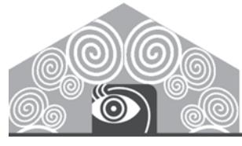
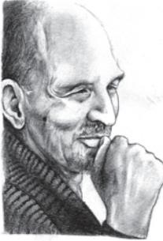
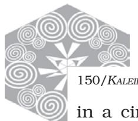
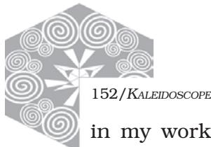
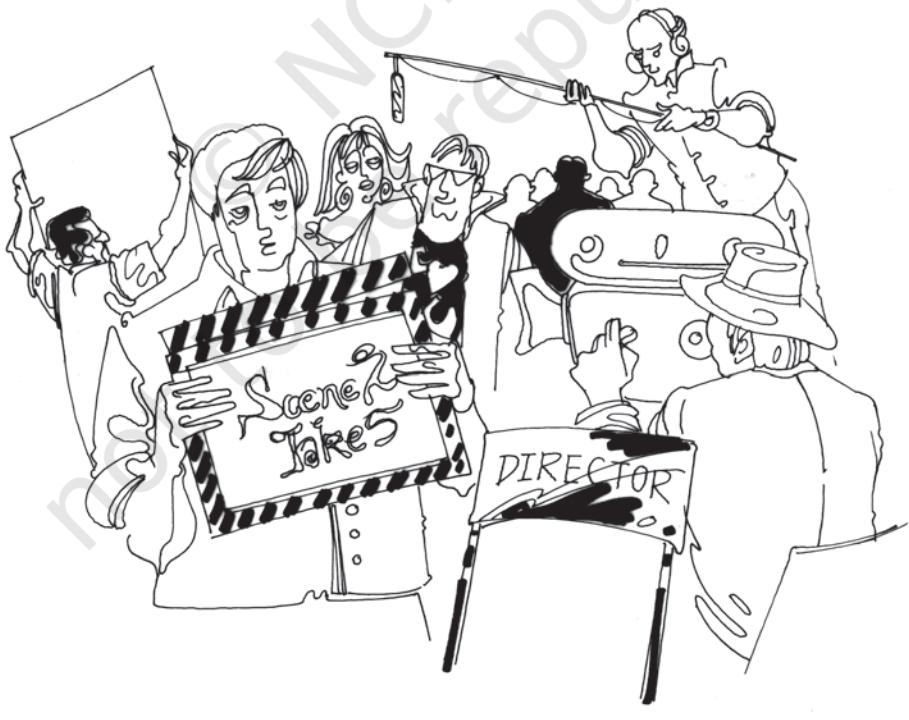
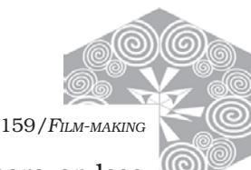
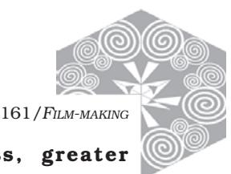
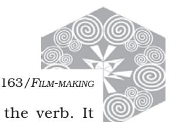
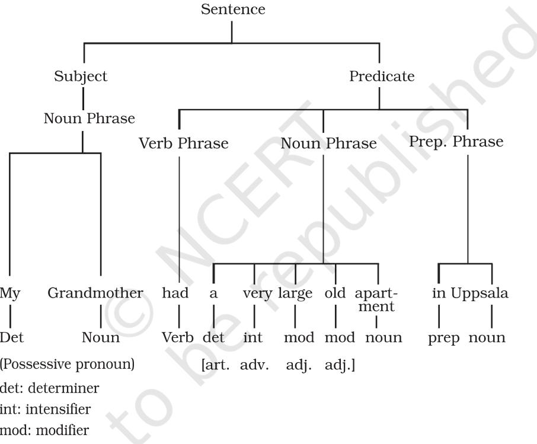
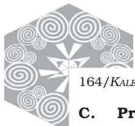

3

Film-making

Ingmar Bergman 1918-2007

*Ingmar Bergman is a well known Swedish director of films noted for their starkness, their subtle use of black and white and 'shades' of those extremes, the ambiguity of their content, and a certain brooding presence that seems to pervade them all. The list of Bergman films is long; his best known include* The Seventh Seal (1957), Wild Strawberries (1958), The Virgin Spring (1960), The Silence (1963), Persona (1967), The Passion of Anna (1970), and Cries and Whispers *(1973)—this last film in colour, though emphasising red in all its shadings. In the following selection, the Introduction to* Four Screen-plays by Ingmar Bergman *(1960), Bergman discusses how he views the art of film-making.*

During the shooting of *The Virgin Spring*, we were up in the northern province of Dalarna in May and it was early in the morning, about half past seven. The landscape there is rugged, and our company was working by a little lake in the forest. It was very cold, about 30 degrees, and from time to time a few snowflakes fell through the grey, raindimmed sky. The company was dressed in a strange variety of clothing—raincoats, oil slickers, Icelandic sweater jackets, old blankets, coachmen's coats, medieval robes. Our men had laid some ninety feet of rusty, buckling rail over the difficult terrain, to dolly the camera on. We were all helping with the equipment—actors, electricians, makeup men, script girl, sound crew—mainly to keep warm. Suddenly someone shouted and pointed toward the sky. Then we saw a crane floating high above the fir trees, and then another, and then several cranes floating majestically

in a circle above us. We all dropped what we were doing and ran to the top of a nearby hill to see the cranes better. We stood there for a long time, until they turned westward and disappeared over the forest. And suddenly I thought: this is what it means to make a movie in Sweden. This is what can happen, this is how we work together with our old equipment and little money, and this is how we can suddenly drop everything for the love of four cranes floating above the tree tops.

# Childhood Foretells Future

My association with film goes back to the world of childhood. My grandmother had a very large old apartment in Uppsala. I used to sit under the dining-room table there, 'listening' to the sunshine which came in through the gigantic windows. The cathedral bells went ding-dong, and the sunlight moved about and 'sounded' in a special way. One day, when winter was giving way to spring and I was five years old, a piano was being played in the next apartment. It played waltzes, nothing but waltzes. On the wall hung a large picture of Venice. As the sunlight moved across the picture the water in the canal began to flow, the pigeons flew up from the square, people talked and gesticulated. Bells sounded, not those of Uppsala Cathedral but from the picture itself. And the piano music also came from that remarkable picture of Venice.

A child who is born and brought up in a vicarage acquires an early familiarity with life and death behind the scenes. Father performed funerals, marriages, baptisms, gave advice and prepared sermons. The devil was an early acquaintance, and in the child's mind there was a need to personify him. This is where my magic lantern came in. It consisted of a small metal box with a carbide lamp—I can still remember the smell of the hot metal—and coloured glass slides: Red Riding Hood and the Wolf, and all the others. And the wolf was the Devil, without horns but with a tail and a gaping red mouth, strangely real yet incomprehensible, a picture of wickedness and temptation on the flowered wall of the nursery.

When I was ten years old I received my first, rattling film projector, with its chimney and lamp. I found it both mystifying and fascinating. The first film I had was nine feet long and brown in colour. It showed a girl lying asleep in a meadow, who woke up and stretched out her arms, then disappeared to the right. That was all there was to it. The film was a great success and was projected every night until it broke and could not be mended any more.

This little rickety machine was my first conjuring set. And even today I remind myself with childish excitement that I am really a conjurer, since cinematography is based on deception of the human eye. I have worked it out that if I see a film which has a running time of one hour, I sit through twenty-seven minutes of complete darkness—the blankness between frames. When I show a film I am guilty of deceit. I use an apparatus which is constructed to take advantage of a certain human weakness, an apparatus with which I can sway my audience in a highly emotional manner—make them laugh, scream with fright, smile, believe in fairy stories, become indignant, feel shocked, charmed, deeply moved or perhaps yawn with boredom. Thus I am either an impostor or, when the audience is willing to be taken in, a conjurer. I perform conjuring tricks with apparatus so expensive and so wonderful that any entertainer in history would have given anything to have it.

### Stop and Think

- 1. What childhood memories does the author recollect that had a bearing on his later involvement with filmmaking?
- 2. What connection does the author draw between filmmaking and conjuring?

# Split Second Impressions

A film for me begins with something very vague—a chance remark or a bit of conversation, a hazy but agreeable event unrelated to any particular situation. It can be a few bars of music, a shaft of light across the street. Sometimes

in my work at the theatre I have envisioned actors made up for yet unplayed roles.

These are split second impressions that disappear as quickly as they come, yet leave behind a mood—like pleasant dreams. It is a mental state, not an actual story, but one abounding in fertile associations and images. Most of all, it is a brightly coloured thread sticking out of the dark sack of the unconscious. If I begin to wind up this thread, and do it carefully, a complete film will emerge.

This primitive nucleus strives to achieve definite form, moving in a way that may be lazy and half asleep at first. Its stirring is accompanied by vibrations and rhythms which are very special and unique to each film. The picture sequences then assume a pattern in accordance with these rhythms, obeying laws born out of and conditioned by my original stimulus.

If that embryonic substance seems to have enough strength to be made into a film, I decide to materialise it. Then comes something very complicated and difficult: the

transformation of rhythms, moods, atmosphere, tensions, sequences, tones and scents into words and sentences, into an understandable screenplay.

This is an almost impossible task. The only thing that can be satisfactorily transferred from that original complex of rhythms and moods is the dialogue, and even dialogue is a sensitive substance which may offer resistance. Written dialogue is like a musical score, almost incomprehensible to the average person. Its interpretation demands a technical knack plus a certain kind of imagination and feeling qualities which are so often lacking, even among actors. One can write dialogue, but how it should be delivered, its rhythm and tempo, what is to take place between lines—all this must be omitted for practical reasons. Such a detailed script would be unreadable. I try to squeeze instructions as to location, characterisation and atmosphere into my screenplays in understandable terms, but the success of this depends on my writing ability and the perceptiveness of the reader, which are not always predictable.

# The Rhythm of a Film

Now we come to essentials, by which I mean montage, rhythm and the relation of one picture to another—the vital third dimension without which the film is merely a dead product from a factory. Here I cannot clearly give a key, as in a musical score, nor a specific idea of the tempo which determines the relationship of the elements involved. It is quite impossible for me to indicate the way in which the film 'breathes' and pulsates.

I have often wished for a kind of notation which would enable me to put on paper all the shades and tones of my vision, to record distinctly the inner structure of a film. For when I stand in the artistically devastating atmosphere of the studio, my hands and head full of all the trivial and irritating details that go with motion-picture production, it often takes a tremendous effort to remember how I originally saw and thought out this or that sequence, or what was the relation between the scene of four weeks ago and that of today. If I could express myself clearly, in

explicit symbols, then this problem would be almost eliminated and I could work with absolute confidence that whenever I liked I could prove the relationship between the part and the whole and put my finger on the rhythm, the continuity of the film.

Thus the script is a very imperfect *technical* basis for a film. And there is another important point in this connection which I should like to mention. Film has nothing to do with literature; the character and substance of the two art forms are usually in conflict. This probably has something to do with the receptive process of the mind. The written word is read and assimilated by a conscious act of the will in alliance with the intellect; little by little it affects the imagination and the emotions. The process is different with a motion picture. When we experience a film, we consciously prime ourselves for illusion. Putting aside will and intellect, we make way for it in our imagination. The sequence of pictures plays directly on our feelings.

Music works in the same fashion; I would say that there is no art form that has so much in common with film as music. Both affect our emotions directly, not via the intellect. And film is mainly rhythm; it is inhalation and exhalation in continuous sequence. Ever since childhood, music has been my great source of recreation and stimulation, and I often experience a film or play musically.

### Stop and Think

1. What is the nature of the first impressions that form the basis for a film?

2. Which art form is film-making closest to? What is the reason for the similarity?

# Film and Written Literature

It is mainly because of this difference between film and literature that we should avoid making films out of books. The irrational dimension of a literary work, the germ of its existence, is often untranslatable into visual terms and it, in turn, destroys the special, irrational dimension of the film. If, despite this, we wish to translate something

literary into film terms, we must make an infinite number of complicated adjustments which often bear little or no fruit in proportion to the effort expended.

I myself have never had any ambition to be an author. I do not want to write novels, short stories, essays, biographies, or even plays for the theatre. I only want to make films—films about conditions, tensions, pictures, rhythms and characters which are in one way or another important to me. The motion picture, with its complicated process of birth, is my method of saying what I want to my fellow men. I am a film-maker, not an author.

Thus the writing of the script is a difficult period but a useful one, for it compels me to prove logically the validity of my ideas. In doing this, I am caught in a conflict—a conflict between my need to transmit a complicated situation through visual images, and my desire for absolute clarity. I do not intend my work to be solely for the benefit of myself or the few, but for the entertainment of the general public. The wishes of the public are imperative. But sometimes I risk following my own impulse, and it has been shown that the public can respond with surprising sensitivity to the most unconventional line of development.

When shooting begins, the most important thing is that those who work with me feel a definite contact, that all of us somehow cancel out our conflicts through working together. We must pull in one direction for the sake of the work at hand. Sometimes this leads to dispute. But the more definite and clear the 'marching orders', the easier it is to reach the goal which has been set. This is the basis for my conduct as director, and perhaps the explanation of much of the nonsense that has been written about me.

While I cannot let myself be concerned with what people think and say about me personally, I believe that reviewers and critics have every right to interpret my films as they like. I refuse to interpret my work to others, and I cannot tell the critic what to think; each person has the right to understand a film as he sees it. Either he is attracted or repelled. A film is made to create reaction. If the audience does not react one way or another, it is an indifferent work and worthless.

I do not mean by this that I believe in being 'different' at any price. A lot has been said about the value of originality, and I find this foolish. Either you are original or you are not. It is completely natural for artists to take from and give to each other, to borrow from and experience one another. In my own life, my great literary experience was Strindberg. There are works of his which can still make my hair stand on end—*The People of Hemso,* for example. And it is my dream to produce *Dream Play* some day. Olof Molander's production of it in 1934 was for me a fundamental dramatic experience.

### Stop and Think

- 1. Quite often a film made out of a book is not very successful. Discuss.
- 2. What, according to Bergman, is the relationship between a film-maker and his audience?

### Significant Persons

On a personal level, there are many people who have meant a great deal to me. My father and mother were certainly of vital importance, not only in themselves but because they created a world for me to revolt against. In my family there was an atmosphere of hearty wholesomeness which I, a sensitive young plant, scorned and rebelled against. But that strict middle-class home gave me a wall to pound on, something to sharpen myself against. At the same time they taught me a number of values—efficiency, punctuality, a sense of financial responsibility—which may be 'bourgeois' but are nevertheless important to the artist. They are part of the process of setting oneself severe standards. Today as a film maker I am conscientious, hard-working and extremely careful; my films involve good craftsmanship, and my pride is the pride of a good craftsman.

Among the people who have meant something in my professional development is Torsten Hammaren of Gothenburg. I went there from Hälsingborg, where I had been head of the municipal theatre for two years. I had no

conception of what theatre was; Hammaren taught me during the four years I stayed in Gothenburg. Then, when I made my first attempts at film, Alf Sjöberg—who directed *Torment—*taught me a great deal. And there was Lorens Marmstedt, who really taught me filmmaking from scratch after my first unsuccessful movie. Among other things I learned from Marmstedt is the one unbreakable rule: you must look at your own work very coldly and clearly; you must be a devil to yourself in the screening room when watching the day's rushes. Then there is Herbert Grevenius, one of the few who believed in me as a writer. I had trouble with script-writing, and was reaching out more and more to the drama, to dialogue, as a means of expression. He gave me great encouragement.

Finally, there is Carl Anders Dymling, my producer. He is crazy enough to place more faith in the sense of responsibility of a creative artist than in calculations of profit and loss. I am thus able to work with an integrity that has become the very air I breathe, and one of the main reasons I do not want to work outside of Sweden. The moment I lose this freedom I will cease to be a film-maker, because I have no skill in the art of compromise. My only significance in the world of film lies in the freedom of my creativity.

# The Tightrope of Film-making

Today, the ambitious film-maker is obliged to walk a tightrope without a net. He may be a conjurer, but no one conjures the producer, the bank director or the theatre owners when the public refuses to go see a film and lay down the money by which producer, bank director, theatre owner and conjurer can live. The conjurer may then be deprived of his magic wand; I would like to be able to measure the amount of talent, initiative and creative ability which has been destroyed by the film industry in its ruthlessly efficient sausage machine. What was play to me once has now become a struggle. Failure, criticism, public indifference all hurt more today than yesterday. The brutality of the industry is undisguised—yet that can be an advantage.

So much for people and the film business. I have been asked, as a clergyman's son, about the role of religion in my thinking and film-making. To me, religious problems are continuously alive. I never cease to concern myself with them; it goes on every hour of every day. Yet this does not take place on the emotional level, but on an intellectual one. Religious emotion, religious sentimentality, is something I got rid of long ago—I hope. The religious problem is an intellectual one to me: the relationship of my mind to my intuition. The result of this conflict is usually some kind of tower of Babel.

Philosophically, there is a book which was a tremendous experience for me: Eiono Kaila's *Psychology of the Personality.* His thesis that man lives strictly according to his needs negative and positive—was shattering to me, but terribly true. And I built on this ground.

# Cathedral-building

People ask what are my intentions with my films—my aims. It is a difficult and dangerous question, and I usually give an evasive answer: I try to tell the truth about the human condition, the truth as I see it. This answer seems to satisfy everyone, but it is not quite correct. I prefer to describe what I *would like* my aim to be.

There is an old story of how the cathedral of Chartres was struck by lightning and burned to the ground. Then thousands of people came from all points of the compass, like a giant procession of ants, and together they began to rebuild the cathedral on its old site. They worked until the building was completed—master builders, artists, labourers, clowns, noblemen, priests, burghers. But they all remained anonymous and no one knows to this day who built the cathedral of Chartres.

Regardless of my own beliefs and my own doubts, which are unimportant in this connection, it is my opinion that art lost its basic creative drive the moment it was separated from worship. It severed an umbilical cord and now lives its own sterile life, generating and degenerating itself. In former days the artist remained unknown and his work was to the

glory of God. He lived and died without being more or less important than other artisans; 'eternal values', 'immortality' and 'masterpiece' were terms not applicable in his case. The ability to create was a gift. In such a world flourished invulnerable assurance and natural humility.

Today the individual has become the highest form and the greatest bane of artistic creation. The smallest wound or pain of the ego is examined under a microscope as if it were of eternal importance. The artist considers his isolation, his subjectivity, his individualism almost holy. Thus we finally gather in one large pen, where we stand and bleat about our loneliness without listening to each other and without realising that we are smothering each other to death. The individualists stare into each other's eyes and yet deny the existence of each other. We walk in circles, so limited by our anxieties that we can no longer distinguish between true and false, between the gangster's whim and the purest ideal.

Thus if I am asked what I would like the general purpose of my films to be, I would reply that I want to be one of the artists in the cathedral on the great plain. I want to make a dragon's head, an angel, a devil—or perhaps a saint—out of stone. It does not matter which; it is the sense of satisfaction that counts. Regardless of whether I believe or not, whether I am a Christian or not, I would play my part in the collective building of the cathedral.

### Stop and Think

- 1. What is the story of the Cathetdral of Chartres and how does the author relate it to his profession?
- 2. What are some of the flaws of the world of filmmaking today?

# Interview with Umberto Eco

*With over 30 honorary doctorates and a string of literary and academic awards, Umberto Eco has the reputation of being one of the world's foremost intellectuals. A professor at the University of Bologna in Italy, Umberto Eco is known for his ideas on semiotics, literary interpretation and medieval aesthetics. He is a distinguished novelist and writer. His novel,* The Name of the

Rose*, published in 1980 sold over ten million copies. Here is an excerpt from an interview with Eco where he expresses his views on the filming of books.*

- *The Name of the Rose* is a very serious novel. It's a detective yarn at one level but it also delves into metaphysics, theology, and medieval history. Yet it enjoyed a huge mass audience. Were you puzzled at all by this?
- No. Journalists are puzzled. And sometimes publishers. And this is because journalists and publishers believe that people like trash and don't like difficult reading experiences. Consider there are six billion people in this planet. *The Name of the Rose* sold between 10 and 15 million copies. So in a way I reached only a small percentage of readers. But it is exactly these kinds of readers who don't want easy experiences. Or at least don't always want this. I myself, at 9 pm after dinner, watch television and want to see either 'Miami Vice' or 'Emergency Room'. I enjoy it and I need it. But not all day.

### Could the huge success of the novel have anything to do with the fact that it dealt with a period of medieval history that...

- That's possible. But let me tell you another story, because I often tell stories like a Chinese wise man. My American publisher said while she loved my book, she didn't expect to sell more than 3,000 copies in a country where nobody has seen a cathedral or studies Latin. So I was given an advance for 3,000 copies, but in the end it sold two or three million in the U.S.
A lot of books have been written about the medieval past far before mine. I think the success of the book is a mystery. Nobody can predict it. I think if I had written *The Name of the Rose* ten years earlier or ten years later, it wouldn't have been the same. Why it worked at that time is a mystery.

- What did you think about the film [directed by Jean Jacques Annaud and starring Sean Connery]? Why weren't you happy with it?
- I expected the film to be different. My novel is a kind of club sandwich—lettuce, tomato, cheese...

#### Different layers of meaning?

- Yes. A film cannot select all the layers. It has to make do with jambon or cheese... I didn't react like authors who, immediately after the film is made, say it is not at all like my book. But after that experience, I asked my publisher not to sell the rights of the novel to cinema. I did this because I discovered that 80 per cent of readers read the book after the movie. And that is very painful for a novelist.

#### But surely this also means greater success, greater remuneration?

- Yes. But it is embarrassing to know that somebody else has already told the reader that the novel should be read in a particular way. That he should imagine the face of a character in a particular way. The only enviable position is that of Homer's who had the film made more than 2000 years after the book (*laughs*).
- So this is why Stanley Kubrick never got to make *Foucault's Pendulum*?
- Since I had laid down a general rule, the publisher said no. Then Stanley Kubrick died. But it may have been a great movie (*laughs*).
- Talking about *Foucault's Pendulum*, there is a sense in which you did the Da Vinci Code before Dan Brown did. Of course, you did it as a myth that takes on a strange reality and he did it as it was historical truth.
- I told Dan Brown's story. My characters are his. I gave the broad picture of this kind of literature.

*MUKUND PADMANABHAN*

# Understanding the Text

- 1. Pick out examples from the text that show Bergman's sensitivity to sensory impressions which have made him a great filmmaker.
- 2. What do you understand of the complexity of the little invisible steps that go into the making of a good film?
- 3. What are some of the risks that film-making involves?
- 4. What misgivings does Bergman have about the contemporary film industry?
- 5. Compare Bergman's views about making films out of books with that of Umberto Eco's.

# Talking about the Text

- 1. According to the author, split-second impressions form a 'mental state, not an actual story, but one abounding in fertile associations and images'.
Compare this with Virginia Woolf's experiment with the stream of consciousness technique in 'The Mark on the Wall'.

- 2. Bergman talks about the various influences in his life including his parents and his religious upbringing. To what extent are an individual's achievements dependent on the kind of influences he or she has had in life? Discuss.
# Appreciation

- 1. Autobiographical accounts make interesting reading when the author selects episodes that are connected to the pursuit of excellence. How does this apply to Ingmar Bergman's narration of the details of film-making?
- 2. Comment on the conversational tone of the narration. Compare this with the very informal style adopted by Umberto Eco in the interview.

# Language Work

#### A. Vocabulary

Find out and write down the definitions of the following terms used in the film industry

| script | project | montage | flashback |
| --- | --- | --- | --- |
|  | stage prop | footlights |  |

#### B. Grammar

We saw in the grammar section of the unit on *Freedom* that a sentence can consist of clauses and phrases.

Let us now look at the basic form of a sentence and study its parts. A sentence consists of a subject and a predicate. Take the sentence

My grandmother *had a very large old apartment in Uppsala.*

The sentence here talks about 'the grandmother'. 'The grandmother' is the subject of the sentence. What is said about the subject 'grandmother' is the predicate of the sentence. 'had a very large old apartment in Uppsala' is the predicate.

Generally a sentence begins with the subject. The predicate begins with a verb. 'had' is the verb in the example above. The subject answers the question 'who' or 'what' before the verb.

Question: 'Who had?'

Answer: 'the grandmother had'.

The object of a sentence generally comes after the verb. It answers the question 'what' after the verb. 'Had what?' 'had an apartment' is the answer. 'Apartment' is the object of the sentence. The word 'apartment' has an article and two adjectives preceding it.

'a very large old apartment'; the word 'very' is an intensifier for the adjective 'large'. We are also given information about the location of the apartment, 'in Uppsala'. This is a prepositional phrase and consists of a preposition and a noun. 'in Uppsala' is an adjunct. It gives additional information.

### TASK

*Analyse the parts of the following sentences according to the pattern above*

- My association with film goes back to the world of childhood.
- This is an almost impossible task.
- Thus the script is a very imperfect technical basis for a film.
- I would play my part in the collective building of the cathedral.
- The ability to create was a gift.

### C. Pronunciation

We have seen that it is not necessary, nor desirable, to pronounce every sound perfectly to be understood. Quite a lot of sounds that you might expect to hear are not actually pronounced. In rapid speech, sounds may be left out or elided, especially when they occur as part of a cluster of consonants. For example in the phrase 'next day', the /t/ is lost

nex*t/* day

# TASK

*Mark the consonants that are left out or elided in the following utterances*

- new textbooks
- written scripts
- he must be ill
- mashed potatoes

# Things to do

Think of a particular episode that could be enacted. Now imagine that you are a scriptwriter and write the screenplay for the first ten minutes of the episode, in the following format

| Title : |  |
| --- | --- |
| Actors : |  |
| Scene -1 |  |
| Description | Dialogue |

The column 'Dialogue' would contain the words to be actually spoken by the characters. 'Description' would include instructions regarding stage props, position of lights, movement of actors and so on.

# Suggested Reading

*Four Screen-plays* by Ingmar Bergman.

