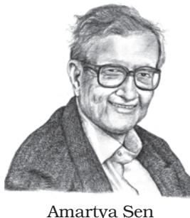

The Argumentative Indian

5

Amartya Sen Born 1933

*Amartya Sen was awarded the Nobel Prize in Economics in 1998 for his contribution in the field of welfare economics. He is Lamont Professor at Harvard.*

*This text forms the opening sections of the first essay in Sen's book of the same title published in 2005. The sub-title of the book is 'Writings on Indian Culture, History and Identity'. Sen argues in this essay that in India there has been a long tradition of questioning the truth of ideas through discussion and dialogue.*

Prolixity is not alien to us in India. We are able to talk at some length. Krishna Menon's* record of the longest speech ever delivered at the United Nations (nine hours non-stop), established half a century ago (when Menon was leading the Indian delegation), has not been equalled by anyone from anywhere. Other peaks of loquaciousness have been scaled by other Indians. We do like to speak.

This is not a new habit. The ancient Sanskrit epics, the *Ramayana* and the *Mahabharata,* which are frequently compared with the *Iliad* and the *Odyssey,* are colossally longer than the works that the modest Homer could manage. Indeed, the *Mahabharata* alone is about seven times as long as the *Iliad* and the *Odyssey* put together. The *Ramayana* and the *Mahabharata* are certainly great . .

* <i>Krishna Menon was India's Defence Minister from 1957 to 1962. He led the Indian delegation *to the United Nations, and on 23 January 1957 delivered an unprecedented 9-hour speech defending India's stand on Kashmir.*

epics: I recall with much joy how my own life was vastly enriched when I encountered them first as a restless youngster looking for intellectual stimulation as well as sheer entertainment. But they proceed from stories to stories woven around their principal tales, and are engagingly full of dialogues, dilemmas and alternative perspectives. And we encounter masses of arguments and counterarguments spread over incessant debates and disputations.

# Dialogue and Significance

The arguments are also, often enough, quite substantive. For example, the famous *Bhagavad Gita,* which is one small section of the *Mahabharata,* presents a tussle between two contrary moral positions —Krishna's emphasis on doing one's duty, on one side, and Arjuna's focus on avoiding bad consequences (and generating good ones), on the other. The debate occurs on the eve of the great war that is a central event in the *Mahabharata.* Watching the two armies readying for war, profound doubts about the correctness of what they are doing are raised by Arjuna, the peerless and invincible warrior in the army of the just and honourable royal family (the Pandavas) who are about to fight the unjust usurpers (the Kauravas). . .

Arjuna questions whether it is right to be concerned only with one's duty to promote a just cause and be indifferent to the misery and the slaughter—even of one's kin—that the war itself would undoubtedly cause. Krishna, a divine incarnation in the form of human being (in fact, he is also Arjuna's charioteer), argues against Arjuna. His response takes the form of articulating principles of action based on the priority of doing one's duty—which have been repeated again and again in Indian philosophy. Krishna insists on Arjuna's duty to fight, irrespective of his evaluation of the consequences. It is a just cause, and, as a warrior and a general on whom his side must rely, Arjuna cannot waver from his obligations, no matter what the consequences are.

Krishna's hallowing of the demands of duty wins the argument, at least as seen in the religious perspective. Indeed, Krishna's conversations with Arjuna, the *Bhagavad Gita,* became a treatise of great theological importance in Hindu philosophy, focusing particularly on the 'removal' of Arjuna's doubts. Krishna's moral position has also been eloquently endorsed by many philosophical and literary commentators across the world, such as Christopher Isherwood and T. S. Eliot. Isherwood in fact translated the *Bhagavad Gita* into English. This admiration for the *Gita*, and for Krishna's arguments in particular, has been a lasting phenomenon in parts of European culture. It was spectacularly praised in the early nineteenth century by Wilhelm von Humboldt as 'the most beautiful, perhaps the only true philosophical song existing in any known tongue'. In a poem in *Four Quartets,* Eliot summarises Krishna's view in the form of an admonishment: 'And do not think of the fruit of action! Fare forward'. Eliot explains: 'Not fare well/But fare forward, voyagers'.

And yet, as a debate in which there are two reasonable sides, the epic *Mahabharata* itself presents, sequentially, each of the two contrary arguments with much care and sympathy. Indeed, the tragic desolation that the postcombat and post-carnage land—largely the Indo-Gangetic plain—seems to face towards the end of the *Mahabharata* can even be seen as something of a vindication of Arjuna's profound doubts. Arjuna's contrary arguments are not really vanquished, no matter what the 'message' of the *Bhagavad Gita* is meant to be. There remains a powerful case for 'faring well', and not just 'forward'.*

J. Robert Oppenheimer, the leader of the American team that developed the ultimate 'weapon of mass destruction' during the Second World War, was moved to quote Krishna's words ('I am become death, the destroyer of worlds') as he watched, on 16 July 1945, the awesome

* <i>As a high-school student, when I asked my Sanskrit teacher whether it would be permissible *to say that the divine Krishna got away with an incomplete and unconvincing argument, he replied: 'Maybe you could say that, but you must say it with adequate respect.' I have presented elsewhere a critique—I hope with adequate respect—of Krishna's deontology, alongwith a defence of Arjuna's consequential perspective, in 'Consequential Evaluation and Practical Reason', Journal of Philosophy 97 (Sept. 2000).*

force of the first nuclear explosion devised by man. Like the advice that Arjuna had received about his duty as a warrior fighting for a just cause, Oppenheimer, the physicist, could well find justification in his technical commitment to develop a bomb for what was clearly the right side. Scrutinizing—indeed criticising—his own actions, Oppenheimer said later on: 'When you see something that is technically sweet, you go ahead and do it and you argue about what to do about it only after you have had your technical success.' Despite that compulsion to 'fare forward', there was reason also for reflecting on Arjuna's concerns: How can good come from killing so many people? And why should I seek victory, kingdom or happiness for my own side?

These arguments remain thoroughly relevant in the contemporary world. The case for doing what one sees as one's duty must be strong, but how can we be indifferent to the consequences that may follow from our doing what we take to be our just duty? As we reflect on the manifest problems of our global world (from terrorism, wars and violence to epidemics, insecurity and gruelling poverty), or on India's special concerns (such as economic development, nuclear confrontation or regional peace), it is important to take on board Arjuna's consequential analysis, in addition to considering Krishna's arguments for doing one's duty. The univocal 'message of the *Gita'* requires supplementation by the broader argumentative wisdom of the *Mahabharata,* of which the *Gita* is only one small part.

#### Stop and Think

- 1. Sen quotes Eliot's lines: 'Not fare well/But fare forward voyagers'. Distinguish between 'faring forward' (Krishna's position in the Gita) and 'faring well' (the position that Sen advocates).
- 2. Sen draws a parallel between the moral dilemma in the Krishna-Arjuna dialogue and J. R. Oppenheimer's response to the nuclear explosion in 1945. What is the basis for this?

## Gender, Caste and Voice

There is, however, a serious question to be asked as to whether the tradition of arguments and disputations has been confined to an exclusive part of the Indian population—perhaps just to the members of the male elite. It would, of course, be hard to expect that argumentational participation would be uniformly distributed over all segments of the population, but India has had deep inequalities along the lines of gender, class, caste and community (on which more presently). The social relevance of the argumentative tradition would be severely limited if disadvantaged sections were effectively barred from participation. The story here is, however, much more complex than a simple generalisation can capture.

I begin with gender. There can be little doubt that men have tended, by and large, to rule the roost in argumentative moves in India. But despite that, the participation of women in both political leadership and intellectual pursuits has not been at all negligible. This is obvious enough today, particularly in politics. Indeed, many of the dominant political parties in India—national as well as regional—are currently led by women and have been so led in the past. But even in the national movement for Indian independence, led by the Congress Party, there were many more women in positions of importance than in the Russian and Chinese revolutionary movements put together. It is also perhaps worth noting that Sarojini Naidu, the first woman President of the Indian National Congress, was elected in 1925, fifty years earlier than the election of the first woman leader of a major British political party (Margaret Thatcher in 1975).* The second woman head of the Indian National Congress, Nellie Sengupta, was elected in 1933.

* <i>The Presidentship of the Congress Party was not by any means a formal position only. *Indeed, the election of Subhas Chandra Bose (the fiery spokesman of the increasing—and increasingly forceful—resistance to the British Raj) as the President of Congress in 1938 and in 1939 led to a great inner-party tussle, with Mohandas Gandhi working tirelessly to oust Bose. This was secured—not entirely with propriety or elegance—shortly after Bose's Presidential Address proposing a strict 'time limit' for the British to quit India or to face a less nonviolent opposition. The role of the Congress President in directing the Party has remained important. In the general elections in 2004, when Sonia Gandhi emerged victorious as the President of Congress, she chose to remain in that position, rather than take up the role of Prime Minister.*

Earlier or later, these developments are products of relatively recent times. But what about the distant past? Women's traditional role in debates and discussions has certainly been much less pronounced than that of men in India (as would also be true of most countries in the world). But it would be a mistake to think that vocal leadership by women is completely out of line with anything that has happened in India's past. Indeed, even if we go back all the way to ancient India, some of the most celebrated dialogues have involved women, with the sharpest questionings often coming from women interlocutors. This can be traced back even to the Upanisads—the dialectical treatises that were composed from about the eighth century BCE and which are often taken to be foundations of Hindu philosophy. .

For example, in the *Brihadaranyaka Upanisad* we are told about the famous 'arguing combat' in which Yajnavalkya, the outstanding scholar and teacher, has to face questions from the assembled gathering of pundits, and here it is a woman scholar, Gargi, who provides the sharpest edge to the intellectual interrogation. She enters the fray without any special modesty: 'Venerable Brahmins, with your permission I shall ask him two questions only. If he is able to answer those questions of mine, then none of you can ever defeat him in expounding the nature of God.' . ~

Even though Gargi, as an intellectual and pedagogue, is no military leader (in the mode, for example, of the Rani of Jhansi—another feminine hero—who fought valiantly along with the 'mutineers' in the middle of the nineteenth century against British rule—one of the great 'warriorqueens' of the world, as Antonia Fraser describes her), her use of imagery is strikingly militant: 'Yajnavalkya, I have two questions for you. Like the ruler of Videha or Kasi [Benares], coming from a heroic line, who strings his unstrung bow, takes in hand two penetrating arrows and approaches the enemy, so do I approach you with two questions, which you have to answer.' Yajnavalkya does, however, manage to satisfy Gargi with his answers (I am not competent to examine the theological merits of this interchange and will refrain from commenting on the ~ ~

substantive content of their discussion). Gargi acknowledges this handsomely, but again without undue modesty: 'Venerable Brahmins, you should consider it an achievement if you can get away after bowing to him. Certainly, none of you can ever defeat him in expounding the nature of God.'

Interestingly, Yajnavalkya's wife Maitreyi raises a profoundly important motivational question when the two discuss the reach of wealth in the context of the problems and predicaments of human life, in particular what wealth can or cannot do for us. Maitreyi wonders whether it could be the case that if 'the whole earth, full of wealth' were to belong just to her, she could achieve immortality through it. 'No', responds Yajnavalkya, 'like the life of rich people will be your life. But there is no hope of immortality by wealth'. Maitreyi remarks: 'What should I do with that by which I do not become immortal?' ~ ~

Maitreyi's rhetorical question has been repeatedly cited in Indian religious philosophy to illustrate both the nature of the human predicament and the limitations of the material world. But there is another aspect of this exchange that has, in some ways, more immediate interest. This concerns the relation—and the distance—between income and achievement, between the commodities we can buy and the actual capabilities we can enjoy, between our economic wealth and our ability to live as we would like.* While there is a connection between opulence and our ability to achieve what we value, the linkage may or may not be very close. Maitreyi's worldly worries might well have some transcendental relevance (as Indian religious commentators have discussed over many centuries), but they certainly have worldly interest as well. If we are concerned with the freedom to live long and live well, our focus has to be directly on life and death, and not just on wealth and economic opulence.

The arguments presented by women speakers in epics and classical tales, or in recorded history, do not always

* <i>Maitreyi's central question ('what should I do with that by which I do not become immortal?') *was useful for me to motivate and explain an understanding of development that is not parasitic on judging development by the growth of GNP or GDP; see my* Development as Freedom *( New York: Knopf, and Oxford: Oxford University Press, 1999), p. I.*

conform to the tender and peace-loving image that is often assigned to women. In the epic story of the *Mahabharata,* the good King Yudhisthira, reluctant to engage in a bloody battle, is encouraged to fight the usurpers of his throne with 'appropriate anger', and the most eloquent instigator is his wife, Draupadi. .

In the sixth-century version of this dialogue, presented in the *Kiratarjuniya* by Bharavi, Draupadi speaks thus—

> For a woman to advise men like you is almost an insult. And yet, my deep troubles compel me to overstep the limits of womanly conduct, make me speak up.

The kings of your race, brave as Indra, have for a long time ruled the earth without a break. But now with your own hand you have thrown it away, like a rutting elephant tearing off his garland with his trunk...

If you choose to reject heroic action and see forbearance as the road to future happiness, then throw away your bow, the symbol of royalty, wear your hair matted in knots, stay here and make offerings in the sacred fire!

. It is not hard to see which side Draupadi was on in the Arjuna-Krishna debate, which deals with a later stage of the same sequence of events, by which time Yudhisthira had made his choice to fight (rather than embrace the life of a local hermit, mockingly assigned to him by his wife, with unconcealed derision).

If it is important not to see the Indian argumentative tradition as the exclusive preserve of men, it is also necessary to understand that the use of argumentative encounters has frequently crossed the barriers of class and caste. Indeed, the challenge to religious orthodoxy has

often come from spokesmen of socially disadvantaged groups. Disadvantage is, of course, a comparative concept. When Brahminical orthodoxy was disputed in ancient India by members of other groups (including merchants and craftsmen), the fact that the protesters were often quite affluent should not distract attention from the fact that, in the context of Brahmin-dominated orthodoxy, they were indeed distinctly underprivileged. This may be particularly significant in understanding the class basis of the rapid spread of Buddhism, in particular, in India. The undermining of the superiority of the priestly caste played quite a big part in these initially rebellious religious movements, which include Jainism as well as Buddhism. It included a 'levelling' feature that is not only reflected in the message of human equality for which these movements stood, but is also captured in the nature of the arguments used to undermine the claim to superiority of those occupying exalted positions. Substantial parts of early Buddhist and Jain literatures contain expositions of protest and resistance.

Movements against caste divisions that have figured repeatedly in Indian history, with varying degrees of success, have made good use of engaging arguments to question orthodox beliefs. Many of these counterarguments are recorded in the epics, indicating that opposition to hierarchy was not absent even in the early days of caste arrangements. We do not know whether the authors to whom the sceptical arguments are attributed were the real originators of the doubts expressed, or mere vehicles of exposition of already established questioning, but the prominent presence of these anti-inequality arguments in the epics as well as in other classical documents gives us a fuller insight into the reach of the argumentative tradition than a monolithic exposition of the so-called, 'Hindu point of view' can possibly provide.

For example, when, in the *Mahabharata,* Bhrigu tells Bharadvaja that caste divisions relate to differences in physical attributes of different human beings, reflected in skin colour, Bharadvaja responds not only by pointing to

the considerable variations in skin colour *within* every caste ('if different colours indicate different castes, then all castes are mixed castes'), but also by the more profound question: 'We all seem to be affected by desire, anger, fear, sorrow, worry, hunger, and labour; how do we have caste differences then?' There is also a genealogical scepticism expressed in another ancient document, the *Bhavisya Purana:* 'Since members of all the four castes are children of God, they all belong to the same caste. All human beings have the same father, and children of the same father cannot have different castes.' These doubts do not win the day, but nor are their expressions obliterated in the classical account of the debates between different points of view. . .

To look at a much later period, the tradition of 'medieval mystical poets', well established by the fifteenth century, included exponents who were influenced both by the egalitarianism of the Hindu Bhakti movement and by that of the Muslim Sufis, and their far-reaching rejection of social barriers brings out sharply the reach of arguments across the divisions of caste and class. Many of these poets came from economically and socially humble backgrounds, and their questioning of social divisions as well as of the barriers of disparate religions reflected a profound attempt to deny the relevance of these artificial restrictions. It is remarkable how many of the exponents of these heretical points of views came from the working class: Kabir, perhaps the greatest poet of them all, was a weaver, Dadu a cottoncarder, Ravi-das a shoe-maker, Sena a barber, and so on.* Also, many leading figures in these movements were women, including of course the famous Mira Bai (whose songs are still very popular, after four hundred years), but also Andal, Daya-bai, Sahajo-bai and Ksema, among others.

In dealing with issues of contemporary inequality, the relevance and reach of the argumentative tradition must be examined in terms of the contribution it can make today in resisting and undermining these inequities which characterise so much of contemporary Indian society. It

* <i>On this, see Kshiti Mohan Sen, Medieval Mysticism of India, with a Foreword by Rabindranath *Tagore, trans. from Bengali by Manomohan Ghosh (London: Luzac, I930).*

would be a great mistake in that context to assume that because of the possible effectiveness of well-tutored and disciplined arguments, the argumentative tradition must, in general, favour the privileged and the well educated, rather than the dispossessed and the deprived. Some of the most powerful arguments in Indian intellectual history have, in fact, been about the lives of the least privileged groups, which have drawn on the substantive force of these claims, rather than on the cultivated brilliance of welltrained dialectics.

#### Stop and Think

- 1. Maitreyi's remark—'what should I do with that by which I do not become immortal'—is a rhetorical question cited to illustrate both the nature of the human predicament and the limitations of the material world. What is the connection that Sen draws between this and his concept of economic development?
- 2. It is important to see that the Indian argumentative tradition has frequently crossed the barriers of gender, caste, class and community. List the examples cited by Sen to highlight this.

#### Democracy as Public Reasoning

Does the richness of the tradition of argument make much difference to subcontinental lives today? I would argue it does, and in a great many different ways. It shapes our social world and the nature of our culture. It has helped to make heterodoxy the natural state of affairs in India; persistent arguments are an important part of our public life. It deeply influences Indian politics, and is particularly relevant, I would argue, to the development of democracy in India and the emergence of its secular priorities.

The historical roots of democracy in India are well worth considering, if only because the connection with public argument is often missed, through the temptation to attribute the Indian commitment to democracy simply to the impact of British influence (despite the fact that such an influence should have worked similarly for a hundred

other countries that emerged from an empire on which the sun used not to set). The point at issue, however, is not specific to India only: in general, the tradition of public reasoning is closely related to the roots of democracy across the globe. But since India has been especially fortunate in having a long tradition of public arguments, with toleration of intellectual heterodoxy, this general connection has been particularly effective in India. When, more than half a century ago, independent India became the first country in the non-Western world to choose a resolutely democratic constitution, it not only used what it had learned from the institutional experiences in Europe and America (particularly Great Britain), it also drew on its own tradition of public reasoning and argumentative heterodoxy.

It is very important to avoid the twin pitfalls of (1) taking democracy to be just a gift of the Western world that India simply accepted when it became independent, and (2) assuming that there is something unique in Indian history that makes the country singularly suited to democracy. The point, rather, is that democracy is intimately connected with public discussion and interactive reasoning. Traditions of public discussion exist across the world, not just in the West. And to the extent that such a tradition can be drawn on, democracy becomes easier to institute and also to preserve.

# Understanding the Text

- 1. What is Sen's interpretation of the positions taken by Krishna and Arjuna in the debate between them? [Note Sen's comment: 'Arjuna's contrary arguments are not really vanquished... There remains a powerful case for 'faring well' and not just 'faring forward'.]
- 2. What are the three major issues Sen discusses here in relation to India's dialogic tradition?
- 3. Sen has sought here to dispel some misconceptions about democracy in India. What are these misconceptions?

- 4. How, according to Sen, has the tradition of public discussion and interactive reasoning helped the success of democracy in India?
# Talking about the Text

- 1. Does Amartya Sen see argumentation as a positive or a negative value?
- 2. How is the message of the Gita generally understood and portrayed? What change in interpretation does Sen suggest?

#### Appreciation

This essay is an example of argumentative writing. Supporting statements with evidence is a feature of this kind of writing. For each of the statements given below state the supportive evidence provided in the essay

- (i) Prolixity is not alien to India.
- (ii) The arguments are also, often enough, substantive.
- (iii) This admiration for the Gita, and Krishna's arguments in particular, has been a lasting phenomenon in parts of European culture.
- (iv) There remains a powerful case for 'faring well', and not just 'forward'.

## Language Work

- I. (a) The opening two paragraphs have many words related to the basic idea of using words (particularly in speech) like 'prolixity'. List them. You may look for more such words in the rest of the essay.
	- (b) Most of the statements Sen makes are tempered with due qualification, e.g., 'The arguments are also, *often enough,* quite substantive'. Pick out other instances of qualification from the text.
- II. A noun can be the subject or object of a sentence. Notice this sentence

*Democracy* is a Western *idea.*

In this sentence *democracy* and *idea* are nouns. (they are abstract nouns)

A *noun* is the simplest form of a *noun phrase.* A noun can be preceded by

- (i) an article or demonstrative: an idea, the idea, this idea; and/or
- (ii) an adjective: *a Western idea*

[There can be more than one adjective, or an adverb and an adjective]: *a quintessentially Western* idea.

- (iii) and/or numerals and quantifying phrases: *three very influential Western* ideas; *such a* tradition. (quantifying phrases such as a few/some/one of the many)
A noun can be followed by prepositional phrases and relative or complement clauses. There will be nouns and noun phrases within the prepositional phrase as in 'traditions *of public discussion'.*

- III. Noun phrases can also have phrases in apposition following the main noun.
Notice the following sentence

The ancient Sanskrit epics, *the Ramayana and the Mahabharata*, are colossally longer than the works that the modest Homer could manage.

*The Ramayana and the Mahabharata* add to the meaning of the main noun (epics)and are placed next to it. They are separated from the main sentence by commas. Notice the expansion here:

The ancient Sanskrit epics, the *Ramayana* and the *Mahabharata,* which are frequently compared with the *Iliad* and the *Odyssey*, are colossally longer than the works that the modest Homer could manage.

The relative clause—which are frequently compared with the *Iliad* and the *Odyssey—* that follows, adds more information to the epics.

- IV. Parenthetical phrases or clauses may also follow the noun phrase.
	- (i) This can be traced back even to the Upanisads—*the dialectical treatises that were composed from about the eighth century BCE and which are often taken to be foundations of Hindu philosophy.* .

The clause italicised here gives additional information about the noun 'Upanisads'. .

*Examine the noun phrases in these sentences from the text*

- The second woman head of the Indian National Congress, Nellie Sengupta, was elected in 1933.
- This concerns the relation—and the distance—between income and achievement.
- This may be particularly significant in understanding the class basis of the rapid spread of Buddhism, in particular, in India.

# Suggested Reading

*Development as Freedom* by Amartya Sen.

