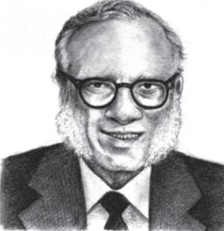
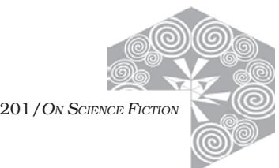
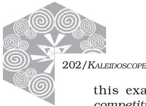

6

Isaac Asimov 1920-1992

*Isaac Asimov was a Russian born American author and biochemist. He was a highly successful and exceptionally prolific writer best known for his works on science fiction and for his popular science books.*

*Most of Asimov's popularised science books explain science concepts in a historical way, going back as far as possible to a time when the science in question was at its simplest stage. He also lent his name to the magazine,* Asimov's Science Fiction.

# I The Prescientific Universe

#### Foreword

To every history there is a prehistoric period. In the case of science fiction, the prehistory lingers on even today in some of the aspects of the field.

But what of that? Just as Ice Age art can hold up its head with any form of art produced by sophisticated modern man, so can the prehistoric aspects of science fiction prove an accomplished literary form.

I have often made the point that true science fiction is a creature of the last two centuries. Science fiction cannot exist as a picture of the future unless, and until, people get the idea that it is science and technology that produce the future; that it is advances in science and technology

(or, at the very least, changes in them) that are bound to make the future different from the present and the past, and that thereby hangs a tale.

Naturally, no one could possibly get that idea until the rate of scientific and technological change became great enough to be noticed by people in the course of their lifetime. That came about with the Industrial Revolution say, by 1800—and it was only thereafter that science fiction could be written.

And yet there must have been something that came before science fiction, something that was not science fiction and yet filled the same emotional needs. There must have been tales of the strange and different, of life not as we know it, and of powers transcending our own.

Let's consider—

The respect that people have for science and for scientists (or the fear that people have or a combination of both) rests on the certain belief that science is the key to the understanding of the Universe and that scientists can use science to manipulate that key. Through science, people can make use of the laws of nature to control the environment and enhance human powers. By the steadily increasing understanding of the details of those laws, human powers will be greater in the future than in the past. If we can imagine the different ways in which they will be greater, we can write our stories.

In previous centuries, however, most men had but a dim understanding, if any at all, of such things as laws of nature. They did not know of rules that were unbreakable; of things-as-they-must-be that could serve neither to help us nor to thwart us but that might allow themselves to be ridden to glory, if we but knew how.

Instead, there was the notion that the Universe was the plaything of life and the will; that if there were events that seemed analogous to human deeds but that were far greater in magnitude, they were carried through by lifeform's resembling those we know but greater in size and power.

The beings who controlled natural phenomena were therefore pictured in human form, but of superhuman strength, size, abilities, and length of life. Sometimes they were pictured as superanimal, or as supercombinations of animals. (The constant reference to the ordinary in the invention of the unusual is only to be expected, for imaginations are sharply limited, even among the best of us, and it is hard to think of anything really new or unusual—as Hollywood 'Sci-fi' constantly demonstrates.)

Since the phenomena of the Universe don't often make sense, the gods are usually pictured as whimsical and unpredictable; frequently little better than childish. Since natural events are often disastrous, the gods must be easily offended. Since natural events are often helpful, the gods are basically kindly, provided they are well-treated and that their anger is not roused.

It is only too reasonable to suppose that people would invent formulas for placating the gods and persuading them to do the right thing. Nor can the validity of these formulas be generally disproven by events. If the formulas don't work, then undoubtedly someone has done something to offend the gods. Those who had invented or utilised the formulas had no problems in finding guilty parties on whom to blame the failure of the formula in specific instances, so that faith in the formulas themselves never wavered. (We needn't sneer. By the same principle, we continue to have faith in economists, sociologists, and meteorologists today, even though their statements seem to match reality only erratically at best.)

In prescientific times, then, it was the priest, magician, wizard, shaman (again the name doesn't matter) who filled the function of the scientist today. It was the priest, etc., who was perceived as having the secret of controlling the Universe, and it was advances in the knowledge of magical formulas that could enhance power.

The ancient myths and legends are full of stories of human beings with supernormal powers. There are the legendary heroes, for instance, who learn to control winged horses or flying carpets. Those ancient pieces of magic 194/*KALEIDOSCOPE*

still fascinate us today, and I imagine a youngster could thrill to such mystical methods of aeronavigation and long for the chance to partake in it, even if he were reading the tales while on a jet plane.

Think of the crystal ball, into which one can see things that are happening many miles away, and magic shells that can allow us to hear the whisperings of humans many miles away. How much more wonderful than the television sets and the telephones of today!

Consider the doors that open with 'Open sesame' rather than by the click of a remote-control device. Consider the seven-league boots that can transport you across the countryside almost as quickly as an automobile can.

Or, for that matter, think of the monsters of legend, the powerful travesties of life invented by combining animal characteristics: the man-horse Centaur, the man-goat Satyr, the woman-lion Sphinx, the woman-hawk Harpy, the eagle-lion Gryphon, the snake-woman Gorgon, and so on. In science fiction we have extraterrestrials that are often built up on the same principle.

The goals of these ancient stories are the same as those of modern science fiction—the depiction of life as we don't know it.

The emotional needs that are fulfilled are the same the satisfaction of the longing for wonder.

The difference is that the ancient myths and legends fulfil those needs and meet those goals against the background of a Universe that is controlled by gods and demons who can, in turn, be controlled by magical formulas either in the form of enchantments to coerce, or prayers to cajole. Science fiction, on the other hand, fulfils those needs against the background of a Universe that is controlled by impersonal and unswervable laws of nature, which can, in turn, be controlled by an understanding of their nature.

In a narrow sense, only science fiction is valid for today since, as far as we can tell, the Universe *does* follow the dictates of the laws of nature and is *not* at the mercy of gods and demons.

Nevertheless, there are times when we shouldn't be two narrow or haughty in our definitions. It would be wrong to throw out a style of literature that has tickled the human fancy for thousands of years for the trivial reason that it is not in accord with reality. Reality isn't all there is, after all.

Shall we no longer thrill to the climactic duel of Achilles and Hector because people no longer fight with spears and shields? Shall we no longer feel the excitement of the naval battles of the War of 1812 and of the Napoleonic Wars because our warships are no longer made of wood and are no longer equipped with sails?

Never!

Why, then, shouldn't people who enjoy an exciting science fiction adventure story not enjoy a rousing mythological fiction adventure story? The two are set in different kinds of Universes but follow analogous paths.

So though I am sufficiently stick-in-the-muddish to be narrow in my definition of science fiction and would not be willing to consider sword-and-sorcery examples of science fiction, I am willing to consider it the *equivalent* of science fiction set in another kind of Universe—a prescientific Universe.

I don't even ask that they be wrenched out of context and somehow be made to fit the universe of reality by being given a scientific or pseudoscientific gloss. I ask only that they be self-consistent in their prescientific Universe and that they be well-written and exciting stories.

### Stop and Think

- 1. What is the parallel drawn between myths and legends of the past and science fiction?
- 2. What gives science fiction its validity?
- 3. Which literary works does the author have in mind when he refers to 'Open Sesame' or the concept of winged horses or flying carpets?

196/*KALEIDOSCOPE*

# II The Universe of Science Fiction

#### Foreword

Of late I have taken to the preparation of science fiction anthologies, which is perhaps a sign of literary senescence, though I like to think of it, rather, as putting my mature wisdom and expertise at the service of the science fiction reading public. After all, I am by no means ceasing, or even slowing, my own proper output. Besides, I must admit I generally make use of coeditors, and sweet-talk them into taking care of the more turgid aspects of the job—correspondence, bookkeeping, and so on.

One of these recent anthologies was *The 13 Crimes of Science Fiction* (Doubleday, 1979) in which my coeditors were Martin Harry Greenberg and Charles G. Waugh. For the anthology, I wrote an introduction relating science fiction to other specialised fields of writing, especially mysteries, and here it is.

Science fiction is a literary universe of no mean size because science fiction is what it is, not through its content but through its background. Let me explain the difference that makes.

A 'sports story' must have, as part of its content, some competitive activity, generally of an athletic nature. A 'Western story' must have, as part of its content, the nomadic life of the cowboy of the American West in the latter half of the nineteenth century. The 'jungle story' must have, as part of its content, the dangers implicit in a forested tropical wilderness.

Take the content of any of these and place it against a background that involves a society significantly different from our own and you have not changed the nature of the story—you have merely added to it.

A story may involve, not the clash of baseball and bat, or of hockeystick and puck, but of gas gun and sphere in an atmosphere enclosed on a space station under zero gravity. It is still a sports story by the strictest definition you care to make, but it is science fiction *also*.

In place of the nomadic life of a cowboy and his horse herding cattle, you might have the nomadic life of a fishboy and his dolphin, herding his schools of mackerel and cod. It could still have the soul of a Western story and be science fiction *also*.

In place of the Matto Grosso, you can have the jungle on a distant planet, different in key factors of the environment, with exotic dangers in atmosphere, in vegetation, in planetary characteristics never encountered on Earth. It would still be a jungle story and be science fiction also.

For that matter, you needn't confine yourself to category fiction. Take the deepest novel you can imagine, one that most amply plumbs the secret recesses of the soul and holds up a picture that illuminates nature and the human condition, and place it in a society in which interplanetary travel is common, and give it a plot which involves such travel and it is not only great literature—it is science fiction also.

John W. Campbell, the late great science fiction editor, used to say that science fiction took as its domain, all conceivable societies, past and future, probable or improbable, realistic or fantastic, and dealt with all events and complications that were possible in all those societies. As for 'mainstream fiction' which deals with the here and now and introduces only the small novelty of make believe events and characters, that forms only an inconsiderable fraction of the whole.

And I agree with him.

In only one respect did John retreat from this grand vision of the limitless boundaries of science fiction. In a moment of failure of nerve, he maintained that it was impossible to write a science fiction mystery. The opportunities in science fiction were so broad, he said, that the strict rules that made the classical mystery story fair to the reader could not be upheld.

I imagine that what he expected was the sudden change of rules without warning in the midst of the story. Something like this, I suppose—

'Ah, Watson, what that scoundrel did not count on was that with this pocket-frannistan which I have in my pocket-frannistan Container I can see through the lead lining and tell what is inside the casket.'

'Amazing, Holmes, but how does it work?' 'By the use of Q-rays, a little discovery of my own which I have never revealed to the world.'

Naturally, there is the temptation to do this. Even in the classical mystery story that is not science fiction there is the temptation to give the detective extraordinary abilities in order to advance the plot. Sherlock Holmes's ability to distinguish, at sight, the ashes of hundreds of different kinds of tobacco, while not perhaps in the same class as the invention of a Q-ray at a moment's notice, is certainly a step in the direction of the unfair.

Then, too, there is nothing to prevent even the strictest of strict mystery writers from using actual science, even using the latest available findings of science, which the reader may not have heard of. That is still considered fair.

There are dangers to that, however, since many mystery writers know no science and cannot prevent themselves from making bloopers. John Dickson Carr, in one book, revealed that he didn't know the difference between the element, antimony, and the compound, antimony potassium tartrate. That was only irritating, but in another book, he demonstrated that he couldn't tell the difference between carbon monoxide and carbon dioxide and reduced the plot to a shambles. One of Dorothy Sayers' more grisly short stories involved the effect of thyroid hormones and, though she had the right idea, she made the effects impossibly rapid and extreme.

Writing a scientific mystery, then, has its extraordinary pitfalls and difficulties; how much more so the writing of a science fiction mystery. In science fiction, you not only must know your science, but you must also have a rational notion as to how to modify or extrapolate that science.

That, however, only means that writing a science fiction mystery is difficult; it does *not* mean that it is conceptually impossible as John Campbell thought.

After all, it is as perfectly possible to cling to the rules of the game in science fiction mysteries as in ordinary ones.

The science fiction mystery may be set in the future and in the midst of a society far different from ours; one in which human beings have developed telepathy, for instance, or in which light-speed mass transport is possible, or in which all human knowledge is computerized for instant retrieval—but the rules still hold.

The writer must carefully explain to the reader all their boundary conditions of the imaginary society. It must be perfectly clear what can be done and what can't be done and with those boundaries fixed, the reader must then see and hear everything the investigator sees and hears, and he must be aware of every clue the investigator comes across.

There may be misdirection and red herrings to obscure and confuse, but it must remain possible for the reader to introduce the investigator, however *outré* the society.

Can it be done? You bet! Modestly, I refer you to my own science fiction mysteries, *The Caves of Steel* and *The Naked Sun* which I wrote, back in the 1950s, in order to show John that he was being too modest about science fiction.

### Understanding the Text

- 1. What makes for the distinction between the various genres of fiction—'a sports story', 'a Western story', 'a jungle story' and science fiction?
- 2. How does Asimov establish that John Campbell was wrong in his opinion that it is not possible for a science fiction mystery to be fair to a reader in the same way as a classical mystery is?
- 3. What are the pitfalls that the writer of science fiction mystery must guard against?

## Talking about the Text

#### *Discuss in small groups*

- 1. Imagination and fantasy help human beings to speculate upon the possible explanations for the complexity and unpredictability of the phenomena in the universe.
- 2. The difference that science and technology have made to everyday life today was visualised in science fiction fifty years ago.

# Appreciation

- 1. Discuss the author's attitude towards the pre-scientific imagination and the tone he adopts while talking about it.
- 2. Observe how the paragraph, as a form, has been used in the essay. Some paragraphs consist of just one sentence. What purpose do you think the author had in putting them in this manner?
- 3. Mark the linkers used by the author to connect the point he makes in one paragraph with that in the next. For example, *Let me explain the difference that makes* in the last line of para 1 of Section II. These are called discourse markers or discourse signalers.

## Language Work

#### A. Literary Allusions

- (i) Look up a literary dictionary or encyclopedia or the internet to understand the references to the following mythical creatures

| Centaur | Satyr | Sphinx | Harpy |
| --- | --- | --- | --- |
| Gryphon | Gorgon | Pegasus |  |

Find out parallel creatures in Indian mythology.

(ii) Find out about the story of Achilles and Hector.

#### B. Pronunciation

Languages vary greatly in the way in which they use rhythm in fluent speech. English rhythm is based not only on word stress (i.e. the stress on a certain syllable or syllables in a word) but also on sentence stress (i.e. the basic emphasis pattern of a sentence). Both of these elements are important for intelligibility.

*Look at the following sentences*

- (i) Delhi is a big city.
- (ii) He asked me how I felt in a big city like Delhi.

You will notice that the first sentence can be said in one breath, but you may like to pause while saying the second sentence. Pauses can be indicated by the mark (/). Each pause marks the end of a 'breath' or *tone group*. Because tone groups are said in a single breath, they are limited in length and average about two seconds, or five words.

We break up spoken language into tone groups because we need to breathe, so there is a physical reason for the structure. But there is also the need to think. Thus the pace of the tone groups, and the information they convey, matches the speakers' thoughts. Tone groups can contain only one word or as many as seven or eight, as you can see in the example given below

No,/I really can't put up with it any more/good bye./

## TASK

*Mark the pauses in the following dialogue.*

- A: Good morning, this is Ten-2-Ten supermarket. Can I help you?
- B: Good morning, I'd like to speak to the person in charge of your After Sales Service, please.
- A: That's Mr Patel.
- B: Could you put me through to him, please?
- A: Who's speaking, please?
- B: My name's Karandikar.
- A: Just a moment, Mr Karandikar... I am sorry, Mr Patel's line seems to be busy.
- B: Well, is there someone else who could help me?
- A: There's Mrs Paul. She's the assistant manager, but she's out at the moment.
- B: Look, this is quite important!
- A: I'll try Mr Patel's line again for you,... trying to connect you.
- B: Ah! finally, ... is that Mr Patel? Good morning, this is... Hello?... oh no! I'm cut off.

#### C. Grammar: Some More Verb Classes

The verb *have* is followed by a noun phrase. Find the noun phrases that follow *have* in the paragraph of the text that begins "A 'sports story must have…some competitive activity…" (In

this example, *have* is followed by the noun phrase *some competitive activity*.)

Sentences with *have* do not usually have a passive form. But in general, verbs which take a noun phrase after them are *transitive*, and they have a passive form. Look at the verbs in the paragraph following the paragraph you have just worked with. Find the noun phrases that follow the verbs *take*, *place*, *involve*, *change* and *add*.

Notice that these verbs can all be passivized, and their objects can become subjects (these have been set in bold below). So that we can say

Let the contents of any of these *be taken* and *be placed* against a background where a society significantly different from our own *is involved* and the nature of the story *has not been changed*—it *has* merely *been added* to.

### TASK

- 1. Here are a few sentences with transitive verbs, adapted from the text. Identify the noun phrases that are the verbs' objects, and underline them. Then turn these sentences into a passive form.
- He expected a sudden change of rules.
- Nothing prevents writers from using actual science.
- He revealed that he didn't know the difference between the element and the compound.
- He demonstrated that he couldn't tell the difference between carbon monoxide and carbon dioxide and reduced the plot to a shambles.
- The writer must carefully explain to the reader all the boundary conditions of the imaginary society.
- 2. Some verbs take a *that*-clause after them. Find the verb *ask* in the last paragraph of the first part of this text (which begins 'I don't even ask that…') and note how it is followed by *that*clauses. Look for other verbs, in this text as well as in the earlier ones, that are followed by a *that*-clause (verbs such as *believe*, *know*, *realise*, *promise*…).

# Suggested Reading

*Foundation* by Isaac Asimov *Chronology of Science and Discovery* by Isaac Asimov.

