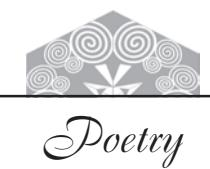
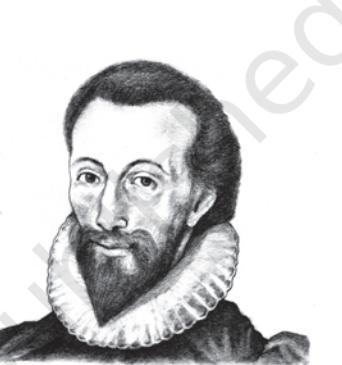
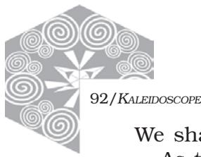
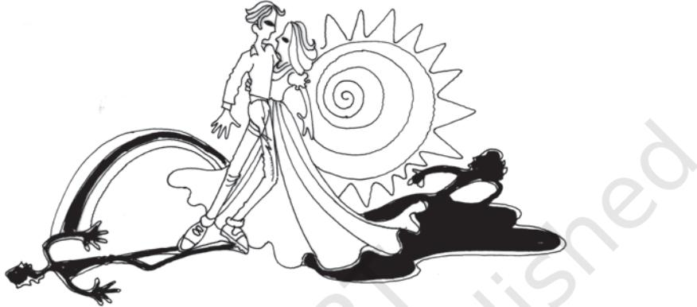

90/*KALEIDOSCOPE*

#### INTRODUCTION

A poem is a composition in verse, usually characterised by concentrated and heightened language in which words are chosen for their sound and suggestive power as well as for their meaning, and using techniques such as rhythm and metre. To read and hear good poetry is to appreciate the subtleties of cadence and rhythm, the variety of pace and pattern and all that goes to make up the music of poetry.

Every poem that we read adds to, in some degree, our total conception of poetry.

Of the eight poets in this selection, four are from the classical tradition: Donne, Milton, Blake and Coleridge. The other four are closer to contemporary times: Yeats, A.K.Ramanujan, Emily Dickinson and Kamala Das.

1

# A Lecture Upon the Shadow

*John Donne was representative of the metaphysical poets of his time. He set the metaphysical mode by vibrancy of language and startling imagery, and a preference for a diction modelled on direct utterances. He was brought up as a Roman Catholic (later he converted to Anglicanism), and was Dean of St. Paul's Church till his death. The total effect of a metaphysical poem at its best is to startle the reader into seeing and knowing what he has not really noticed or*

*thought about before. Like all Donne's poetry this poem too reflects an emphasis on the intellect and wit as against feeling and emotion.*

John Donne 1572-1631

Stand still and I will read to thee A Lecture, Love, in loves philosophy, These three houres that we have spent, Walking here, Two shadowes went Along with us, which we our selves produc'd; But, now the Sunne is just above our head, We doe those shadowes tread; And to brave clearnesse all things are reduc'd. So whilst our infant loves did grow, Disguises did, and shadowes, flow, From us, and our cares; but now 'tis not so. That love hath not attain'd the high'st degree, Which is still diligent lest others see. Except our loves at this noone stay,

We shall new shadowes make the other way.

As the first were made to blinde

 Others; these which come behinde Will worke upon our selves, and blind our eyes. If our loves faint, and westwardly decline;

 To me thou, falsely thine; And I to thee mine actions shall disguise. The morning shadowes were away, But these grow longer all the day, But oh, loves day is short, if love decay.

Love is a growing, or full constant light; And his first minute, after noone, is night.

## Understanding the Poem

- 1. How do the shadows before noon differ from the shadows after noon? What do the two kinds of shadow represent?
- 2. Love is described as light. What makes the poet talk about shadows?
- 3. Comment on the use of the image of the shadows for the idea that the poet wants to convey.
- 4. The poet seems to be addressing his beloved in the poem. What is the message he wishes to convey to her?
- 5. Instead of 'A Lecture Upon Love' the poet calls the poem 'A Lecture Upon the Shadow'. What is the effect that this has on our reading of the poem?

93*/A LECTURE UPON THE SHADOW*

# Language Work

- 1. Notice the spelling of the following words

| houres | shadowes | Sunne |
| --- | --- | --- |
| noone | clearnesse | behinde |

The 'e' that was used in Donne's period got dropped from English orthography later. Pick out the other words in the poem that have this peculiar feature.

- 2. Take note also that the apostrophe is not used for indicating the possessive form: loves philosophy.
- 3. Examples from other poems from this period:
	- How neatly doe we give one onely name
	- To parents issue and the sunnes bright starre!

### Try this out

Notice the adjectives in phrases such as 'infant loves' and 'brave clearnesse'. What is the meaning of these adjectives

- (i) in isolation
- (ii) as part of these phrases.

#### Suggested Reading

'Go and Catch a Falling Star' by John Donne 'The Flea' by John Donne.

