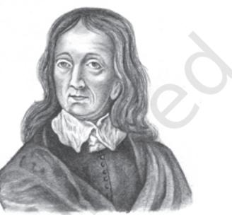

2

Poems by Milton

*John Milton began writing poetry at the age of ten. After finishing his formal education at Cambridge, he read almost everything available in Latin, Greek, Italian and English. He was appointed Latin Secretary where he worked so hard that eyestrain, from years of late night reading, caused him to become totally blind at the age of forty- five. In the final years of his life he wrote (through dictation)* Paradise Lost *and* Paradise Regained.

John Milton 1608-1674

## I On Time

Fly envious *Time,* till thou run out thy race, Call on the lazy leaden-stepping hours, Whose speed is but the heavy Plummets pace; And glut thy self with what thy womb devours, Which is no more than what is false and vain, And merely mortal dross; So little is our loss, So little is thy gain. For when as each thing bad thou hast entomb'd, And last of all, thy greedy self consum'd, Then long Eternity shall greet our bliss With an individual kiss; And Joy shall overtake us as a flood, When every thing that is sincerely good And perfectly divine, With Truth, and Peace, and Love shall ever shine

95*/POEMS BY MILTON*

About the supreme Throne Of him, t'whose happy-making sight alone, When once our heav'nly guided soul shall clime, Then all this Earthy grossnes quit, Attir'd with Stars, we shall for ever sit, Triumphing over Death, and Chance, and thee O Time.

#### NOTES

*Envious Time:* According to ancient mythology Cronos devoured each of his children at birth.

*Plummets:* A lead weight whose slow mechanism activates the ticking mechanism in a clock.

# Understanding the Poem

- 1. Why has the poet pitted the flight of Time against the 'lazy leaden-stepping hours' and 'the heavy Plummets pace'?
- 2. What are the things associated with the temporal and what are associated with the eternal?
- 3. What guides human souls towards divinity? Who is the final winner in the race against Time?

### II On Shakespear.* 1630 .* 1630

What needs my *Shakespear* for his honour'd Bones, The labour of an age in piled Stones, Or that his hallow'd reliques should be hid Under a Star-ypointing *Pyramid?* Dear son of memory, great heir of Fame, What need'st thou such weak witness of thy name? Thou in our wonder and astonishment Hast built thy self a live-long Monument. For whilst to th'shame of slow endeavouring art, Thy easie numbers flow, and that each heart Hath from the leaves of thy unvalu'd Book, Those Delphic lines with deep impression took, Then thou our fancy of it self bereaving

Dost make us Marble with too much conceaving; And so Sepulcher'd in such pomp dost lie, That Kings for such a Tomb would wish to die.

**Notice the spelling of 'Shakespear' and of the words 'easie', 'conceaving'.*

# Understanding the Poem

- 1. Why does Milton feel it is not necessary to put up a monument in stone for Shakespeare?
- 2. What does the 'weak witness of thy name' refer to?
- 3. How does Milton describe Shakespeare as the source of inspiration for all succeeding generations of poets?
- 4. What is the best tribute that posterity has bestowed on Shakespeare?

### Language Study

Etymology is the study of the history of linguistic change. When applied to individual words, it is an account of (i) the history of a word (ii) the derivation of a word.

The dictionary meaning of a word is followed by notes on its origin.

For the word 'entomb'd' the information we get is: [late ME *entoumbe(n)* MF *entombe(r)*]. This means that

- The word is found in late Middle English
- The word is of French origin and is found in use from 1578
- Also, about 30 per cent of the words in English are of French origin. Borrowings from French reached its height after the Norman Conquest (1066)—between 1250 and 1400.

### Suggested Reading

'On his Blindness' by John Milton.

