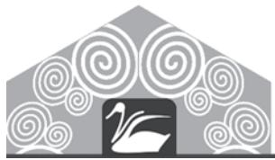
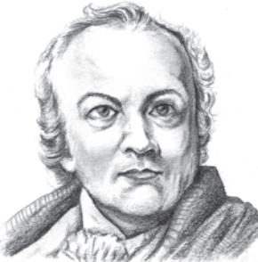
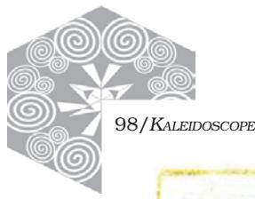
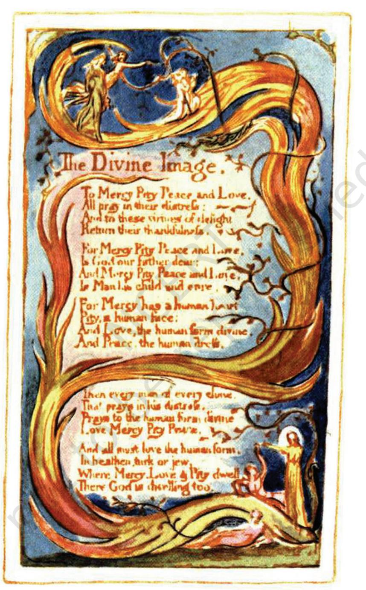
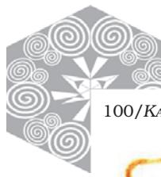
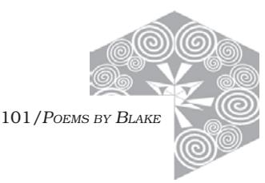
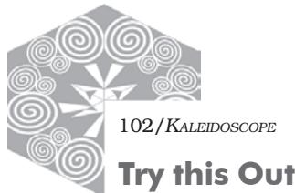

3

William Blake 1757-1827

*William Blake was a poet, painter and engraver. He abhorred the rationalism and materialism of his times. What he saw and painted were human beings beset with evil, yet striving for the divine within them.*

*Blake's lyrics appeared in two sets of volumes:* Songs of Innocence *(from which* The Divine Image *has been chosen) and* Songs of Experience *(from which* The Human Abstract *has been taken) representing the two contrary states of the human soul. Most of the poems in the first volume have counterparts in the second.*

I The Divine Image

To Mercy, Pity, Peace, and Love All pray in their distress; And to these virtues of delight Return their thankfulness.

For Mercy, Pity, Peace, and Love Is God our father dear, And Mercy, Pity, Peace, and Love Is Man, his child and care.

For Mercy has a human heart, Pity a human face, And Love, the human form divine, And Peace, the human dress.

99*/POEMS BY BLAKE*

Then every man, of every clime, That prays in his distress, Prays to the human form divine, Love, Mercy, Pity, Peace.

And all must love the human form, In heathen, turk, or jew; Where Mercy, Love, and Pity dwell There God is dwelling too.

## II The Human Abstract

Pity would be no more If we did not make somebody Poor; And Mercy no more could be If all were as happy as we.

And mutual fear brings peace, Till the selfish loves increase: Then Cruelty knits a snare, And spreads his baits with care.

He sits down with holy fears, And waters the ground with tears; Then Humility takes its root Underneath his foot.

Soon spreads the dismal shade Of Mystery over his head; And the Caterpillar and Fly Feed on the Mystery.

And it bears the fruit of Deceit, Ruddy and sweet to eat; And the Raven his nest has made In its thickest shade.

100/*KALEIDOSCOPE*

The Gods of the earth and sea Sought thro' Nature to find this Tree; But their search was all in vain: There grows one in the Human Brain.

- Note: Blake's poetry was published in a manner most unusual in literature and art history; he personally manufactured each copy. The verses were not typeset but were, with the engravings that illustrated them, cut into copper plates. The pages themselves he illuminated in water colours. Thus Blake can be called the first multi-media artist.
## Understanding the Poem

- 1. How are these two matched poems related to each other in content? How is the human being depicted in the *Song of Innocence* and how is he/she depicted in the *Song of Experience*? Do we find both aspects working in an average human being?
- 2. How would you explain the lines

For Mercy has a human heart, Pity a human face, And Love, the human form divine, And Peace, the human dress.

- 3. How do Mercy, Pity, Peace and Love get distorted in the human brain?
- 4. Blake's poetry expresses one aspect of his multi-dimensional view of human experience—of mankind once whole and happy, now fallen into discord and tyranny, from which it must be rescued. Explain with reference to these two poems.

## Language Work

- 1. Certain words in the poem have been capitalised. Can you think of reasons for this?
- 2. Count the syllables in the lines of 'The Divine Image'. Do you see a pattern?

The first line has eight and the second line has six syllables. Two syllables make a foot in poetry. Here the first syllable of each foot is unstressed and the second syllable is stressed.

Read 'The Chimney Sweeper' in *Songs of Innocence*, and then 'The Chimney Sweeper' in *Songs of Experience*, and contrast the two. You could also read 'The Lamb' and 'The Tiger'.

## Suggested Reading

*Songs of Innocence* by William Blake *Songs of Experience* by William Blake.

