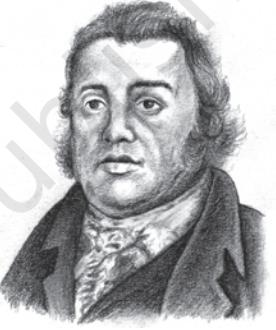
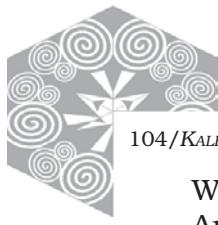

4

Kubla Khan

Or

A Vision in a Dream: A Fragment

*S.T. Coleridge was imaginative even as a child. He studied at Cambridge. In 1797, he met Wordsworth; the two belonged to the first generation of Romantic poets. Coleridge was responsible for presenting the supernatural as real and Wordsworth would try to render ordinary reality as remarkable and strange. Byron, Shelley and Keats belonged to the next generation of Romantic Poets.*

*The genesis of this poem was a vision seen by Coleridge in a trance-like state of mind. He tried to capture its essence but an interruption caused an irreparable break in his poetic flow.*

S.T.Coleridge 1772-1834

In Xanadu did Kubla Khan A stately pleasure-dome decree: Where Alph, the sacred river, ran Through caverns measureless to man Down to a sunless sea. So twice five miles of fertile ground With walls and towers were girdled round: And there were gardens bright with sinuous rills,

* <i>Kubla Khan founded the Mongol dynasty in China in the thirteenth century.

* <i>You will notice that this poem is incomplete. There is a reason behind this. In 1797, when *Coleridge fell ill, some medicine was prescribed, from the effects of which he fell asleep in his chair while reading about Kubla Khan. In the three hours of profound sleep, he had a wonderful dream. On awakening he distinctly recollected it, and began to write it down, when he was interrupted by a chance visitor. The poem thus remained incomplete.*

104/*KALEIDOSCOPE*

Where blossomed many an incense-bearing tree; And here were forests ancient as the hills, Enfolding sunny spots of greenery.

But oh! that deep romantic chasm which slanted Down the green hill athwart a cedarn cover! A savage place! as holy and enchanted As e'er beneath a waning moon was haunted By woman wailing for her demon-lover! And from this chasm, with ceaseless turmoil seething, As if this earth in fast thick pants were breathing, A mighty fountain momently was forced; Amid whose swift half-intermitted burst Huge fragments vaulted like rebounding hail, Or chaffy grain beneath the thresher's flail: And 'mid these dancing rocks at once and ever It flung up momently the sacred river. Five miles meandering with a mazy motion Through wood and dale the sacred river ran, Then reached the caverns measureless to man, And sank in tumult to a lifeless ocean: And 'mid this tumult Kubla heard from far Ancestral voices prophesying war! The shadow of the dome of pleasure Floated midway on the waves; Where was heard the mingled measure From the fountain and the caves. It was a miracle of rare device, A sunny pleasure dome with caves of ice!

A damsel with a dulcimer In a vision once I saw: It was an Abyssinian maid, And on her dulcimer she played, Singing of Mount Abora. Could I revive within me Her symphony and song, To such a deep delight, 'twould win me, That with music loud and long,

I would build that dome in air, That sunny dome! those caves of ice! And all who heard should see them there, And all should cry, Beware! Beware! His flashing eyes, his floating hair! Weave a circle round him thrice, And close your eyes with holy dread, For he on honeydew hath fed, And drunk the milk of Paradise.

## Understanding the Poem

*Find out where the river Alph is.*

- 1. Does the poem have a real geographical location? How does the poet mix up the real and the imaginary to give a sense of the surreal?
- 2. Pick out
	- (i) contrasting images that are juxtaposed throughout the poem.
	- (ii) images that strike the eye and images that strike the ear, both positive and negative.
	- (iii) the words used to describe the movement of water.
- 3. What is the discordant note heard at the end of the third stanza? Can we relate this to the grandeur and turmoil that are a part of an emperor's life?
- 4. Which are the lines that refer to magical elements?
- 5. What is poetic ecstasy likened to?
- 6. The poem is a fragment. What do you think has made it a lasting literary piece?

## Language Study

*Dulcimer* is a string instrument struck with two light hammers, used both in China and in Europe in different forms.

## TASK

*Write short descriptions of five other rare musical instruments that are used by folk cultures.*

The poem is a product of subconscious fusion of dream images and ideas from Coleridge's wide reading. Which of the details in the poem do you think are factual, and which imaginary? Surf the internet to get interesting details.

## Suggested Reading

'The Rime of the Ancient Mariner' by S.T. Coleridge 'Christabel' by S.T. Coleridge.

