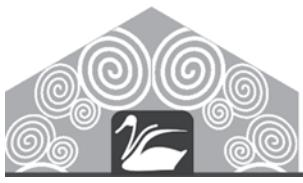
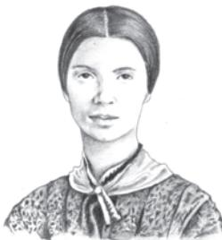
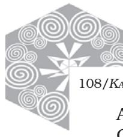

Emily Dickinson 1830-1886

Emily Dickinson is regarded as one of America's quintessential poets of the nineteenth century. She lived an introverted and hermetic life, and published very few of her poems in her lifetime. Her output, 1789 poems in all, were published posthumously.

Her poetry is characterised by unconventional capitalisation and extensive use of dashes, along with unusual imagery and lyric style.

The Trees like Tassels hit - and - swung -There seemed to rise a Tune From Miniature Creatures Accompanying the Sun -

Far Psalteries of Summer -Enamoring the Ear They never yet did satisfy -Remotest - when most fair

The Sun shone whole at intervals -Then Half - then utter hid -As if Himself were optional And had Estates of Cloud

Sufficient to enfold Him Eternally from view -Except it were a whim of His To let the Orchards grow -

108/*KALEIDOSCOPE*

A Bird sat careless on the fence – One gossiped in the Lane On silver matters charmed a Snake Just winding round a Stone –

Bright Flowers slit a Calyx And soared upon a Stem Like Hindered Flags – Sweet hoisted – With Spices – in the Hem –

'Twas more – I cannot mention – How mean – to those that see Vandyke's Delineation Of Nature's – Summer Day!

## Responding to the Poem

- 1. What imagery does the poet use to delineate Summer's day more picturesquely than any painter could?
- 2. What do you understand by 'Psalteries of Summer'?
- 3. In which lines are creatures attributed with human qualities? How does this add to the beauty of the Summer's day?
- 4. How would you explain the image of the 'Hindered Flags'?
- 5. Why are the pronouns referring to the Sun capitalised?
- 6. Give examples from the poem to show that great poetry is a result of close observation of natural phenomena.

## Language Study

You came across 'dulcimer' in the poem 'Kubla Khan'. Did you note down 'Psaltery' as another musical instrument? They are very similar. Look up the illustrations for the two in an illustrated dictionary. Find out in what ways they are different from one another.

## Suggested Reading

*The Complete Poems* of Emily Dickinson.

