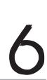
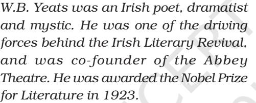
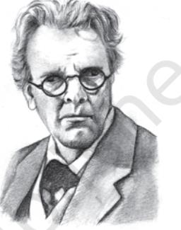
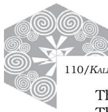

## The Wild Swans at Coole

W.B.Yeats 1865-1939

| The trees are in their autumn beauty, | A |
| --- | --- |
| The woodland paths are dry, | B |
| Under the October twilight the water | C |
| Mirrors a still sky; | B |
| Upon the brimming water among the stones | D |
| Are nine-and-fifty swans. | E |
| The nineteenth autumn has come upon me | G |
| Since I first made my count; |  |
| I saw, before I had well finished, |  |
| All suddenly mount |  |
| And scatter wheeling in great broken rings |  |
| Upon their clamorous wings. |  |
| I have looked upon those brilliant creatures, |  |
| And now my heart is sore. |  |

All's changed since I, hearing at twilight,

110/*KALEIDOSCOPE*

The first time on this shore, The bell-beat of their wings above my head, Trod with a lighter tread. Unwearied still, lover by lover, They paddle in the cold Companionable streams or climb the air; Their hearts have not grown old; Passion or conquest, wander where they will, Attend upon them still.

But now they drift on the still water, Mysterious, beautiful; Among what rushes will they build, By what lake's edge or pool Delight men's eyes when I awake some day To find they have flown away?

## Understanding the Poem

- 1. How do the 'trees in their autumn beauty', 'dry woodland paths', 'October twilight', 'still sky' connect to the poet's own life?
- 2. What do 'the light tread' and 'the sore heart' refer to?
- 3. What is the contrast between the liveliness of the swans and human life?
- 4. What contributes to the beauty and mystery of the swans' lives?

## Language Study

Notice the rhyme scheme in the poem. Do you notice a consistent pattern? We use a new letter for every new sound at the end of the lines. The rhyme scheme for the first stanza is given alongside the lines. Do it for the rest of the poem.

## Suggested Reading

*The Green Helmet* by W.B. Yeats The *Celtic Twilight* by W.B. Yeats.

