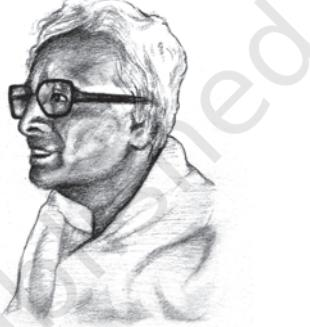
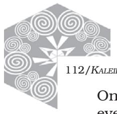
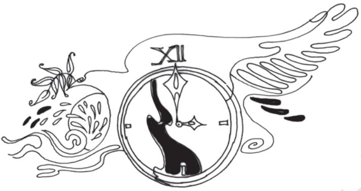

7

Time and Time Again

*A.K. Ramanujan is one of India's finest Englishlanguage poets. He is best known for his pioneering translations of ancient Tamil poetry into modern English. At the time of his death he was professor of linguistics at the University of Chicago and was recognised as the world's most profound scholar of South Indian languages and culture.*

*His interests included anthropology and folklore. These influenced his work as a craftsman of English. This poem represents the complex distillation of a lifetime of unusual thought and feeling.*

A.K.Ramanujan 1929-1993

Or listen to the clocktowers of any old well-managed city

beating their gongs round the clock, each slightly off the others' time, deeper or lighter

in its bronze, beating out a different sequence each half-hour, out of the accidents

of alloy, a maker's shaking hand in Switzerland, or the mutual distances

commemorating a donor's whim, the perennial feuds and seasonal alliance

of Hindu, Christian, and Muslim cut off sometimes by a change of wind,

a change of mind, or a siren between the pieces of a backstreet quarrel.

112/*KALEIDOSCOPE*

One day you look up and see one of them eyeless, silent, a zigzag sky showing

through the knocked-out clockwork, after a riot, a peace-march time bomb, or a precise act

Of nature in a night of lightnings.

## Responding to the Poem

- 1. What did you think the poem was about when you read the first few lines?
- 2. From which line does the import of the title strike the reader?
- 3. What makes for the differences between the timekeeping of the various clocks? What is the implicit comparison?
- 4. Why is the act of nature described as 'precise'?
- 5. Which of the following reflects the poet's attitude towards communal disharmony
	- (i) Critical condemnation
	- (ii) Helpless acceptance
	- (iii) Wistful lament
- 6. Is the poet's attitude a representation of how the average Indian feels both towards human violence and nature's fury?

## Suggested Reading

*The Interior Landscape* by A.K. Ramanujan *Poems of Love and War* by A.K. Ramanujan.

