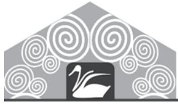
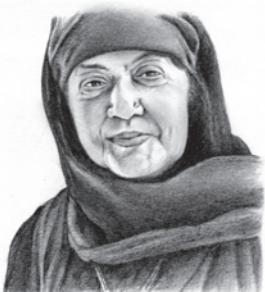
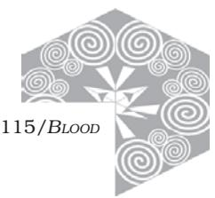
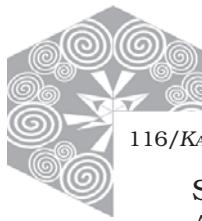
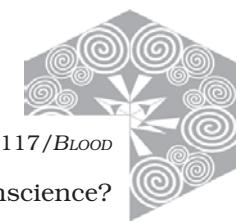

8

Blood

Kamala Das 1934-2009

*One of the greatest literary figures in Malayalam, Kamala Das was born in the year 1934 in Punnayurkulum, in South Malabar, Kerala. Her work, in poetry and in prose, has given her a permanent place in modern Malayalam literature as well as in Indian writing in English. She is best known for her feminist writings and focus on womanhood.*

*She has been the recipient of such famous awards as the Poetry Award for the Asian PEN Anthology, the Kerala Sahitya Akademi Award for the best collection of short stories in Malayalam, and the Chaman Lal Award for fearless journalism.*

When we were children My brother and I And always playing on the sands Drawing birds and animals Our great-grandmother said one day, You see this house of ours Now three hundred years old, It's falling to little bits Before our very eyes The walls are cracked and torn And moistened by the rains, The tiles have fallen here and there The windows whine and groan And every night The rats come out of the holes And scamper past our doors. The snake-shrine is dark with weeds

114/*KALEIDOSCOPE*

And all the snake-gods in the shrine Have lichen on their hoods. O it hurts me she cried, Wiping a reddened eye For I love this house, it hurts me much To watch it die. When I grow old, I said, And very very rich I shall rebuild the fallen walls And make new this ancient house. My great-grandmother Touched my cheeks and smiled. She was really simple. Fed on God for years All her feasts were monotonous For the only dish was always God And the rest mere condiments. She told us how she rode her elephant When she was ten or eleven Every Monday without fail To the Siva shrine And back to home again And, told us of the jewel box And the brocade from the north And the perfumes and the oils And the sandal for her breasts And her marriage to a prince Who loved her deeply for a lovely short year And died of fever, in her arms She told us That we had the oldest blood My brother and she and I The oldest blood in the world A blood thin and clear and fine While in the veins of the always poor And in the veins Of the new-rich men Flowed a blood thick as gruel And muddy as a ditch.

Finally she lay dying In her eighty sixth year A woman wearied by compromise Her legs quilted with arthritis And with only a hard cough For comfort I looked deep into her eyes Her poor bleary eyes And prayed that she would not grieve So much about the house. I had learnt by then Most lessons of defeat, Had found out that to grow rich Was a difficult feat. The house was crouching On its elbows then, It looked that night in the pallid moon So grotesque and alive. When they burnt my great grandmother Over logs of the mango tree I looked once at the house And then again and again For I thought I saw the windows close Like the closing of the eyes I thought I heard the pillars groan And the dark rooms heave a sigh. I set forth again For other towns, Left the house with the shrine And the sands And the flowering shrubs And the wide rabid mouth of the Arabian Sea.

* * * I know the rats are running now Across the darkened halls They do not fear the dead I know the white ants have reached my home And have raised on walls

116/*KALEIDOSCOPE*

Strange totems of burial. At night, in stillness, From every town I live in I hear the rattle of its death The noise of rafters creaking And the windows' whine. I have let you down Old house, I seek forgiveness O mother's mother's mother I have plucked your soul Like a pip from a fruit And have flung it into your pyre Call me callous Call me selfish But do not blame my blood So thin, so clear, so fine The oldest blood in the world That remembers as it flows All the gems and all the gold And all the perfumes and the oils And the stately Elephant ride...

## Responding to the Poem

- 1. What makes the depiction of a crumbling village house so authentic in the poem? Is this a common feature of most village houses in the context of rapid urbanisation? Is the poet speaking from actual experience?
- 2. What aspects of Indian society and history get highlighted in the poem?
- 3. Does the poem bring out the contrast between tradition and modernity? Illustrate your answer with examples from the poem.
- 4. While the poet respected her grandmother's sentiments of royal grandeur, we can also see that she revolts against it. Identify the lines which bring this out.
- 5. Which lines reveal the poet's criticism of class distinctions?
- 6. Is it 'selfishness' and 'callousness' that makes the poet break her childhood promise to her grandmother of renovating the house? Why does she do nothing about rebuilding the house?

- 7. What do you understand of the conflict in the poet's conscience?
## Language Study

Comment on the changes in poetic expression in English from the time of Donne to that of Kamala Das with reference to

- prosodic features (rhyme, rhythm and metre)
- vocabulary
- language
- themes.

## Suggested Readings

*The Old Playhouse and Other Poems* by Kamala Das *Summer in Calcutta* by Kamala Das *The Descendants* by Kamala Das.

