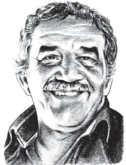

# Short stories

#### INTRODUCTION

A short story is a prose narrative of limited length. It organises the action and thoughts of its characters into the pattern of a plot. The plot form may be comic, tragic, romantic or satiric. The central incident is selected to manifest, as much as possible, the protagonist's life and character, and the details contribute to the development of the plot.

The term 'short story' covers a great diversity of prose fiction, right from the really short 'short story' of about five hundred words to longer and more complex works. The longer ones, with their status of middle length, fall between the tautness of the short narrative and the expansiveness of the novel.

There can be thematic variation too. The stories deal with fantasy, reality, alienation and the problem of choice in personal life. There are three short stories and two long ones in this section representing writers from five cultures.

# I Sell my Dreams

Gabriel Garcia Marquez 1927-2014

*Gabriel Garcia Marquez was brought up by his grandparents in Northern Columbia because his parents were poor and struggling. A novelist, shortstory writer and journalist, he is widely considered the greatest living Latin American master of narrative. Marquez won the Nobel Prize in Literature in 1982. His two masterpieces are* One Hundred Years in Solitude *(1967, tr. 1970) and* Love in The Time of Cholera *(1985, tr. 1988). His themes are violence, solitude and the overwhelming human need for love. This story reflects, like most of his works, a high point in Latin American magical realism; it is rich and lucid, mixing reality with fantasy.*

1

One morning at nine o'clock, while we were having breakfast on the terrace of the Havana Riviera Hotel under a bright sun, a huge wave picked up several cars that were driving down the avenue along the seawall or parked on the pavement, and embedded one of them in the side of the hotel. It was like an explosion of dynamite that sowed panic on all twenty floors of the building and turned the great entrance window to dust. The many tourists in the lobby were thrown into the air along with the furniture, and some were cut by the hailstorm of glass. The wave must have been immense, because it leaped over the wide twoway street between the seawall and the hotel and still had enough force to shatter the window.

The cheerful Cuban volunteers, with the help of the fire department, picked up the debris in less than six hours, and sealed off the gate to the sea and installed another,

and everything returned to normal. During the morning nobody worried about the car encrusted in the wall, for people assumed it was one of those that had been parked on the pavement. But when the crane lifted it out of its setting, the body of a woman was found secured behind the steering wheel by a seat belt. The blow had been so brutal that not a single one of her bones was left whole. Her face was destroyed, her boots had been ripped apart, and her clothes were in shreds. She wore a gold ring shaped like a serpent, with emerald eyes. The police established that she was the housekeeper for the new Portuguese ambassador and his wife. She had come to Havana with them two weeks before and had left that morning for the market, driving a new car. Her name meant nothing to me when I read it in the newspaper, but I was intrigued by the snake ring and its emerald eyes. I could not find out, however, on which finger she wore it.

This was a crucial piece of information, because I feared she was an unforgettable woman whose real name I never knew, and who wore a similar ring on her right forefinger which, in those days, was even more unusual than it is now. I had met her thirty-four years earlier in Vienna, eating sausage with boiled potatoes and drinking draft beer in a tavern frequented by Latin American students. I had come from Rome that morning, and I still remember my immediate response to her splendid soprano's bosom, the languid foxtails on her coat collar, and that Egyptian ring in the shape of a serpent. She spoke an elementary Spanish in a metallic accent without pausing for breath, and I thought she was the only Austrian at the long wooden table. But no, she had been born in Colombia and had come to Austria between the wars, when she was little more than a child, to study music and voice. She was about thirty, and did not carry her years well, for she had never been pretty and had begun to age before her time. But she was a charming human being. And one of the most awe-inspiring.

Vienna was still an old imperial city, whose geographical position between the two irreconcilable worlds left behind by the Second World War had turned it into a 4/*KALEIDOSCOPE*

paradise of black marketeering and international espionage. I could not have imagined a more suitable spot for my fugitive compatriot, who still ate in the students' tavern on the corner only out of loyalty to her origins, since she had more than enough money to buy meals for all her table companions. She never told her real name, and we always knew her by the Germanic tongue twister that we Latin American students in Vienna invented for her: Frau Frieda. I had just been introduced to her when I committed the happy impertinence of asking how she had come to be in a world so distant and different from the windy cliffs of Quindio, and she answered with a devastating:

'I sell my dreams.'

In reality, that was her only trade. She had been the third of eleven children born to a prosperous shopkeeper in old Caldas, and as soon as she learned to speak she instituted the fine custom in her family of telling dreams before breakfast, the time when their oracular qualities are preserved in their purest form. When she was seven she dreamed that one of her brothers was carried off by a flood. Her mother, out of sheer religious superstition, forbade the boy to swim in the ravine, which was his favourite pastime. But Frau Frieda already had her own system of prophecy.

'What that dream means,' she said, 'isn't that he's going to drown, but that he shouldn't eat sweets.'

Her interpretation seemed an infamy to a five-year-old boy who could not live without his Sunday treats. Their mother, convinced of her daughter's oracular talents, enforced the warning with an iron hand. But in her first careless moment the boy choked on a piece of caramel that he was eating in secret, and there was no way to save him.

Frau Frieda did not think she could earn a living with her talent until life caught her by the throat during the cruel Viennese winters. Then she looked for work at the first house where she would have liked to live, and when she was asked what she could do, she told only the truth: 'I dream.' A brief explanation to the lady of the house was all she needed, and she was hired at a salary that just

covered her minor expenses, but she had a nice room and three meals a day—breakfast in particular, when the family sat down to learn the immediate future of each of its members: the father, a refined financier; the mother, a joyful woman passionate about Romantic chamber music; and two children, eleven and nine years old. They were all religious and therefore inclined to archaic superstitions, and they were delighted to take in Frau Frieda, whose only obligation was to decipher the family's daily fate through her dreams.

She did her job well, and for a long time, above all during the war years, when reality was more sinister than nightmares. Only she could decide at breakfast what each should do that day, and how it should be done, until her predictions became the sole authority in the house. Her control over the family was absolute: even the faintest sigh was breathed by her order. The master of the house died at about the time I was in Vienna, and had the elegance to leave her a part of his estate on the condition that she continue dreaming for the family until her dreams came to an end.

I stayed in Vienna for more than a month, sharing the straitened circumstances of the other students while I waited for money that never arrived. Frau Frieda's unexpected and generous visits to the tavern were like fiestas in our poverty-stricken regime. One night, in a beery euphoria, she whispered in my ear with a conviction that permitted no delay.

'I only came to tell you that I dreamed about you last night,' she said. 'You must leave right away and not come back to Vienna for five years.'

Her conviction was so real that I boarded the last train to Rome that same night. As for me, I was so influenced by what she said that from then on I considered myself a survivor of some catastrophe I never experienced. I still have not returned to Vienna.

6/*KALEIDOSCOPE*

## Stop and Think

- 1. How did the author recognise the lady who was extricated from the car encrusted in the wall of Havana Riviera Hotel after the storm?
- 2. Why did the author leave Vienna never to return again?

Before the disaster in Havana, I had seen Frau Frieda in Barcelona in so unexpected and fortuitous a way that it seemed a mystery to me. It happened on the day Pablo Neruda stepped on Spanish soil for the first time since the Civil War, on a stopover during a long sea voyage to Valparaiso. He spent a morning with us hunting big game in the second-hand bookstores, and at Porter he bought an old, dried-out volume with a torn binding for which he paid what would have been his salary for two months at the consulate in Rangoon. He moved through the crowd like an invalid elephant, with a child's curiosity in the inner workings of each thing he saw, for the world appeared to him as an immense wind-up toy with which life invented itself.

I have never known anyone closer to the idea one has of a Renaissance pope: He was gluttonous and refined. Even against his will, he always presided at the table. Matilde, his wife, would put a bib around his neck that belonged in a barbershop rather than a dining room, but it was the only way to keep him from taking a bath in sauce. That day at Carvalleiras was typical. He ate three whole lobsters, dissecting them with a surgeon's skill, and at the same time devoured everyone else's plate with his eyes and tasted a little from each with a delight that made the desire to eat contagious: clams from Galicia, mussels from Cantabria, prawns from Alicante, sea cucumbers from the Costa Brava. In the meantime, like the French, he spoke of nothing but other culinary delicacies, in particular the prehistoric shellfish of Chile, which he carried in his heart. All at once he stopped eating, tuned his lobster's antennae, and said to me in a very quiet voice:

'There's someone behind me who won't stop looking at me.'

I glanced over his shoulder, and it was true. Three tables away sat an intrepid woman in an old-fashioned felt hat and a purple scarf, eating without haste and staring at him. I recognised her right away. She had grown old and fat, but it was Frau Frieda, with the snake ring on her index finger.

She was travelling from Naples on the same ship as Neruda and his wife, but they had not seen each other on board. We invited her to have coffee at our table, and I encouraged her to talk about her dreams in order to astound the poet. He paid no attention, for from the very beginning he had announced that he did not believe in prophetic dreams.

'Only poetry is clairvoyant,' he said.

After lunch, during the inevitable stroll along the Ramblas, I lagged behind with Frau Frieda so that we could renew our memories with no other ears listening. She told me she had sold her properties in Austria and retired to Oporto, in Portugal, where she lived in a house that she described as a fake castle on a hill, from which one could see all the way across the ocean to the Americas. Although she did not say so, her conversation made it clear that, dream by dream, she had taken over the entire fortune of her ineffable patrons in Vienna. That did not surprise me, however, because I had always thought her dreams were no more than a stratagem for surviving. And I told her so.

She laughed her irresistible laugh. 'You're as impudent as ever,' she said. And said no more, because the rest of the group had stopped to wait for Neruda to finish talking in Chilean slang to the parrots along the Rambla de los Pájaros. When we resumed our conversation, Frau Frieda changed the subject.

'By the way,' she said, 'you can go back to Vienna now.'

Only then did I realise that thirteen years had gone by since our first meeting.

'Even if your dreams are false, I'll never go back,' I told her. 'Just in case.'

At three o'clock we left her to accompany Neruda to his sacred siesta, which he took in our house after solemn

preparations that in some way recalled the Japanese tea ceremony. Some windows had to be opened and others closed to achieve the perfect degree of warmth, and there had to be a certain kind of light from a certain direction, and absolute silence. Neruda fell asleep right away, and woke ten minutes later, as children do, when we least expected it. He appeared in the living room refreshed, and with the monogram of the pillowcase imprinted on his cheek.

'I dreamed about that woman who dreams,' he said.

Matilde wanted him to tell her his dream.

'I dreamed she was dreaming about me,' he said.

'That's right out of Borges,' I said.

He looked at me in disappointment.

'Has he written it already?'

'If he hasn't he'll write it sometime,' I said. 'It will be one of his labyrinths.'

As soon as he boarded the ship at six that evening, Neruda took his leave of us, sat down at an isolated table, and began to write fluid verses in the green ink he used for drawing flowers and fish and birds when he dedicated his books. At the first 'All ashore' we looked for Frau Frieda, and found her at last on the tourist deck, just as we were about to leave without saying good-bye. She too had taken a siesta.

'I dreamed about the poet,' she said.

In astonishment I asked her to tell me her dream.

'I dreamed he was dreaming about me,' she said, and my look of amazement disconcerted her. 'What did you expect? Sometimes, with all my dreams, one slips in that has nothing to do with real life.'

#### Stop and Think

 1. How did Pablo Neruda know that somebody behind him was looking at him?

- 2. How did Pablo Neruda counter Frau Frieda's claims to clairvoyance?
I never saw her again or even wondered about her until I heard about the snake ring on the woman who died in the Havana Riviera disaster. And I could not resist

the temptation of questioning the Portuguese ambassador when we happened to meet some months later at a diplomatic reception. The ambassador spoke about her with great enthusiasm and enormous admiration. 'You cannot imagine how extraordinary she was,' he said. 'You would have been obliged to write a story about her.' And he went on in the same tone, with surprising details, but without the clue that would have allowed me to come to a final conclusion.

'In concrete terms,' I asked at last, 'what did she do?' 'Nothing,' he said, with a certain disenchantment. 'She dreamed.'

## Understanding the Text

- 1. Did the author believe in the prophetic ability of Frau Frieda?
- 2. Why did he think that Frau Frieda's dreams were a stratagem for surviving?
- 3. Why does the author compare Neruda to a Renaissance pope?

## Talking about the Text

*Discuss in groups*

- 1. In spite of all the rationality that human beings are capable of, most of us are suggestible and yield to archaic superstitions.
- 2. Dreams and clairvoyance are as much an element of the poetic vision as religious superstition.

# Appreciation

- 1. The story hinges on a gold ring shaped like a serpent with emerald eyes. Comment on the responses that this image evokes in the reader.
- 2. The craft of a master story-teller lies in the ability to interweave imagination and reality. Do you think that this story illustrates this?
- 3. Bring out the contradiction in the last exchange between the author and the Portuguese ambassador *'In concrete terms,' I asked at last, 'what did she do?' 'Nothing,'*

*he said, with a certain disenchantment. 'She dreamed.'*

- 4. Comment on the ironical element in the story.

A. Vocabulary

Look up the meanings of the following phrases under 'dream' and 'sell' in the dictionary

| dream | sell |
| --- | --- |
| dream on | sell-by date |
| dream something away | selling-point |
| (not) dream of doing something | sell-out |
| dream something up | selling price |
| look like a dream | seller's market |

#### B. Grammar: Emphasis

*Read this sentence carefully*

One morning at nine o'clock, while we were having breakfast on the terrace of the Havana Riviera Hotel under a bright sun, a huge wave picked up several cars that were driving down the avenue along the seawall or parked on the pavement, and embedded one of them in the side of the hotel.

The position of a word, phrase or an idea within a sentence usually indicates the emphasis it receives. Generally, the most emphatic place in the sentence is its end; the next most emphatic is its beginning; and the least emphatic, its middle.

In the sentence above the most important fact is that the huge wave embedded one of the cars in one side of the hotel.

The other details of time and place are given at the beginning. The general statement of the 'huge wave picking up several cars' precedes the particular car which is pertinent to the theme of the story.

Let us rewrite the sentence, beginning with 'a huge wave' and the first part following 'hotel' and notice the difference in the effect.

A huge wave picked up several cars that were driving down the avenue along the seawall or parked on the pavement, and embedded one of them in the side of the hotel, one morning at nine o'clock, while we were having breakfast on the terrace of the Havana Riviera Hotel under a bright sun.

### TASK

*Study the following sentences and underline the part which receives emphasis*

- I never saw her again or even wondered about her until I heard about the snake ring on the woman who died in the Havana Riviera disaster.
- That did not surprise me, however, because I had always thought her dreams were no more than a stratagem for surviving.
- Although she did not say so, her conversation made it clear that, dream by dream, she had taken over the entire fortune of her ineffable patrons in Vienna.
- Three tables away sat an intrepid woman in an old-fashioned felt hat and a purple scarf, eating without haste and staring at him.
- I stayed in Vienna for more than a month, sharing the straitened circumstances of the other students while I waited for money that never arrived.

#### C. Pronunciation

The syllable is the basic unit of pronunciation. A word may have a single syllable, such as 'will', 'pen' etc. A word, sometimes, can have more than one syllable as for instance 'willing' (willing). Each syllable contains a vowel sound, and usually one or more consonants.

You can show division of a word into syllables like this

| foolish | fool-ish(2) |
| --- | --- |
| agreement | a-gree-ment(3) |
| arithmetic | a-rith-me-tic(4) |

#### TASK

- Say your name aloud and decide how many syllables there are in it. Do the same with the names of your classmates.
- Pick out five words each for two syllable, three syllable and four syllable words from the lesson.

# Suggested Reading

*One Hundred Years in Solitude* by Gabriel Garcia Marquez *Love in the Time of Cholera* by Gabriel Garcia Marquez.

