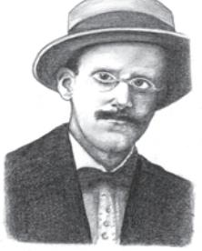
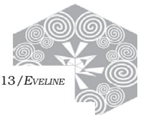
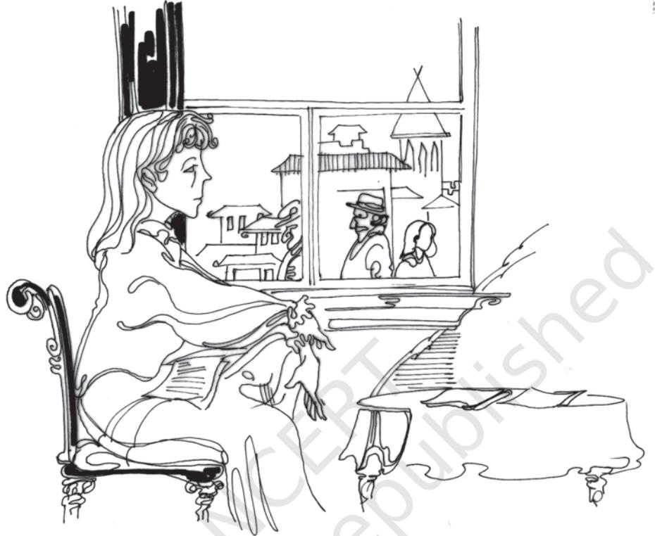
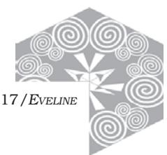
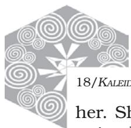
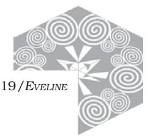

James Joyce 1882-1941

*James Joyce is a major literary figure of the first quarter of the twentieth century. He is known for his bold experiments in narrative techniques in fiction, and* Ulysses *is his most famous work. 'Eveline' is one of the fifteen stories of Dublin life that form* Dubliners*, first published in 1914. It is a sympathetic portrayal of Eveline, who has within her reach escape from the drudgery of her life but cannot gather enough courage to seize it.*

2

She sat at the window watching the evening invade the avenue. Her head was leaned against the window curtains and in her nostrils was the odour of dusty cretonne. She was tired.

Few people passed. The man out of the last house passed on his way home; she heard his footsteps clacking along the concrete pavement and afterwards crunching on the cinder path before the new red houses. One time there used to be a field there in which they used to play every evening with other people's children. Then a man from Belfast bought the field and built houses in it—not like their little brown houses but bright brick houses with shining roofs. The children of the avenue used to play together in that field—the Devines, the Waters, the Dunns, little Keogh the cripple, she and her brothers and sisters. Ernest, however, never played: he was too grown up. Her father used often to hunt them in and out of the field with his blackthorn stick; but usually little Keogh used to keep

nix* and call out when he saw her father coming. Still they seemed to have been rather happy then. Her father was not so bad then; and besides, her mother was alive. That was a long time ago; she and her brothers and sisters were all grown up; her mother was dead. Tizzie Dunn was dead, too, and the Waters had gone back to England. Everything changes. Now she was going to go away like the others, to leave her home.

Home! She looked round the room, reviewing all its familiar objects which she had dusted once a week for so many years, wondering where on earth all the dust came from. Perhaps she would never see again those familiar objects from which she had never dreamed of being divided. And yet during all those years she had never found out the name of the priest whose yellowing photograph hung on the wall above the broken harmonium beside the coloured

<i>* *nix: an old slang word, originally used by thieves, to refer to the member of a gang who kept watch*

print of the promises made to Blessed Margaret Mary Alacoque. He had been a school friend of her father. Whenever he showed the photograph to a visitor her father used to pass it with a casual word: 'He is in Melbourne now.'

She had consented to go away, to leave her home. Was that wise? She tried to weigh each side of the question. In her home anyway she had shelter and food; she had those whom she had known all her life about her. Of course she had to work hard, both in the house and at business. What would they say of her in the Stores when they found out that she had run away with a fellow? Say she was a fool, perhaps; and her place would be filled up by advertisement. Miss Gavan would be glad. She had always had an edge on her, especially whenever there were people listening.

'Miss Hill, don't you see these ladies are waiting?' 'Look lively, Miss Hill, please.'

She wouId not cry many tears at leaving the Stores.

But in her new home, in a distant unknown country, it would not be like that. Then she would be married—she, Eveline. People would treat her with respect then. She would not be treated as her mother had been. Even now, though she was over nineteen, she sometimes felt herself in danger of her father's violence. She knew it was that that had given her the palpitations. When they were growing up he had never gone for her, like he used to go for Harry and Ernest, because she was a girl; but latterly he had begun to threaten her and say what he would do to her only for her dead mother's sake. And now she had nobody to protect her. Ernest was dead and Harry, who was in the church decorating business, was nearly always down somewhere in the country. Besides, the invariable squabble for money on Saturday nights had begun to weary her unspeakably. She always gave her entire wages—seven shillings—and Harry always sent up what he could but the trouble was to get any money from her father. He said she used to squander the money, that she had no head, that he wasn't going to give her his hard earned money to throw about the streets, and much more, for he was usually fairly bad on Saturday night. In the end he would give her

the money and ask her had she any intention of buying Sunday's dinner. Then she had to rush out as quickly as she could and do her marketing, holding her black leather purse tightly in her hand as she elbowed her way through the crowds and returning home late under her load of provisions. She had hard work to keep the house together and to see that the two young children who had been left to her charge went to school regularly and got their meals regularly. It was hard work—a hard life—but now that she was about to leave it she did not find it a wholly undesirable life.

### Stop and Think

- 1. Why did Eveline review all the familiar objects at home?
- 2. Where was Eveline planning to go?

She was about to explore another life with Frank. Frank was very kind, manly, open-hearted. She was to go away with him by the night boat to be his wife and to live with him in Buenos Aires where he had a home waiting for her. How well she remembered the first time she had seen him; he was lodging in a house on the main road where she used to visit. It seemed a few weeks ago. He was standing at the gate, his peaked cap pushed back on his head and his hair tumbled forward over a face of bronze. Then they had come to know each other. He used to meet her outside the Stores every evening and see her home. He took her to see *The Bohemian Girl* and she felt elated as she sat in an unaccustomed part of the theatre with him. He was awfully fond of music and sang a little. People knew that they were courting and, when he sang about the lass that loves a sailor, she always felt pleasantly confused. He used to call her Poppens out of fun. First of all it had been an excitement for her to have a fellow and then she had begun to like him. He had tales of distant countries. He had started as a deck boy at a pound a month on a ship of the Allan Line going out to Canada. He told her the names of the ships he had been on and the names

of the different services. He had sailed through the Straits of Magellan and he told her stories of the terrible Patagonians. He had fallen on his feet in Buenos Aires, he said, and had come over to the old country just for a holiday. Of course, her father had found out the affair and had forbidden her to have anything to say to him.

'I know these sailor chaps,' he said.

One day he had quarrelled with Frank and after that she had to meet her lover secretly.

The evening deepened in the avenue. The white of two letters in her lap grew indistinct. One was to Harry; the other was to her father. Ernest had been her favourite but she liked Harry too. Her father was becoming old lately, she noticed; he would miss her. Sometimes he could be very nice. Not long before, when she had been laid up for a day, he had read her out a ghost story and made toast for her at the fire. Another day, when their mother was alive, they had all gone for a picnic to the Hill of Howth. She remembered her father putting on her mother's bonnet to make the children laugh.

Her time was running out but she continued to sit by the window, leaning her head against the window curtain, inhaling the odour of dusty cretonne. Down far in the avenue she could hear a street organ playing. She knew the air. Strange that it should come that very night to remind her of the promise to her mother, her promise to keep the home together as long as she could. She remembered the last night of her mother's illness; she was again in the close dark room at the other side of the hall and outside she heard a melancholy air of Italy. The organ player had been ordered to go away and given six-pence. She remembered her father strutting back into the sickroom saying: 'Damned Italians! coming over here!'

As she mused—the pitiful vision of her mother's life laid its spell on the very quick of her being that life of commonplace sacrifices closing in final craziness. She trembled as she heard again her mother's voice saying constantly with foolish insistence: 'Derevaun Seraun! Derevaun Seraun!'*

<i>* *Derevaun.... Seraun, possibly corrupt Gaelic for 'the end of pleasure is pain'*

### Stop and Think

- l. Who was Frank? Why did Eveline's father quarrel with him?
- 2. What significance does Eveline find in the organplayer's appearance on the day she had decided to leave?

She stood up in a sudden impulse of terror. Escape! She must escape! Frank would save her. He would give her life, perhaps love, too. But she wanted to live. Why should she be unhappy? She had a right to happiness. Frank would take her in his arms, fold her in his arms. He would save her.

She stood among the swaying crowd in the station at the North Wall. He held her hand and she knew that he was speaking to her, saying something about the passage over and over again. The station was full of soldiers with brown baggages. Through the wide doors of the sheds she caught a glimpse of the black mass of the boat, lying in beside the quay wall, with illumined portholes. She answered nothing. She felt her cheek pale and cold and, out of a maze of distress, she prayed to God to direct her, to show her what was her duty. The boat blew a long mournful whistle into the mist. If she went, tomorrow she would be on the sea with Frank, steaming toward Buenos Aires. Their passage had been booked. Could she still draw back after all he had done for her? Her distress awoke a nausea in her body and she kept moving her lips in silent fervent prayer.

A bell clanged upon her heart. She felt him seize her hand:

'Come!'

All the seas of the world tumbled about her heart. He was drawing her into them: he would drown her. She gripped with both hands at the iron railing.

'Come!'

No! No! No! It was impossible. Her hands clutched the iron in frenzy. Amid the seas she sent a cry of anguish.

'Eveline! Evvy!'

He rushed beyond the barrier and called to her to follow. He was shouted at to go on but he still called to

her. She set her white face to him, passive, like a helpless animal. Her eyes gave him no sign of love or farewell or recognition.

## Understanding the Text

- 1. Name the two characters in this story whom Eveline liked and loved, and two she did not. What were the reasons for her feelings towards them?
- 2. Describe the conflict of emotions felt by Eveline on the day she had decided to elope with Frank.
- 3. Why do you think Eveline let go of the opportunity to escape?
- 4. What are the signs of Eveline's indecision that we see as the hour of her departure with Frank neared?

# Talking about the Text

- 1. Deciding between filial duty and the right to personal happiness is problematic. Discuss.
- 2. Share with your partner any instance of your personal experience where you, or somebody you know, had to make a difficult choice.

## Appreciation

- 1. The description in this story has symbolic touches. What do you think the 'window', the 'gathering dusk', the 'dusty cretonne and its odour' symbolise?
- 2. Note how the narrative proceeds through the consciousness of Eveline.
- 3. In the last section of the story, notice these expressions
	- (i) A bell clanged upon her heart.
	- (ii) AlI the seas of the world tumbled upon her heart.
	- (iii) Her hands clutched the iron in frenzy.
	- (iv) She set her white face to him, passive, like a helpless animal.

What are the emotions that these images evoke?

- 4. Do you think the author indicates his judgement of Eveline in the story?

# Language Work

#### A. Grammar: Parallelism

*Notice the following sentence*

One *was to* Harry; the other *was to* her father.

When you coordinate two or more elements in a sentence, they are in the same grammatical form, that is they are *parallel.* This ensures balance in the sentence.

In the sentence above, there is a reference to what was said in the previous sentence: two letters.

The predicative pattern is the same and the two parts are separated by a semi-colon.

Parallelism is a basic rhetorical principle. Equal form reinforces equal meaning.

By placing equally important ideas successively you emphasise their relationship to one another. It can show either similarity or contrast as in

Then a man from Belfast bought the field and built houses in it—not like their *little brown houses* but *bright brick houses* with shining roofs.

Sometimes the choice of words establishes the parallel and reinforces equal meaning as in

Ernest had been *her favourite* but *she liked* Harry too.

## TASK

*Underline the parts that are parallel in the following sentences*

- She had consented to go away, to leave her home.
- Strange that it should come that very night to remind her of the promise to her mother, her promise to keep the home together as long as she could.
- She prayed to God to direct her, to show her what was her duty.
- Frank would take her in his arms, fold her in his arms.
- Her time was running out but she continued to sit by the window, leaning her head against the window curtain, inhaling the odour of dusty cretonne.
- Not long before, when she had been laid up for a day, he had read her out a ghost story and made toast for her at the fire.

### B. Pronunciation

A word has as many syllables as it has vowels.

|
|  |

|
|  |

The mark( ) indicates that the first syllable in 'manner' is more prominent than the other.

In a word having more than one syllable, the one that is more more prominent than the other syllable(s) is called the stressed syllable.

## TASK

Mark the stressed syllables in the following words chosen from the lesson. Consult the dictionary or ask the teacher if necessary.

| photograph | escape | changes |
| --- | --- | --- |
| threaten | excitement | farewell |
| illumined | sailor | sacrifice |
| invariable |  |  |

# Suggested Reading

*Dubliners* by James Joyce.

