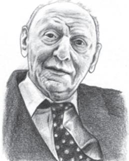
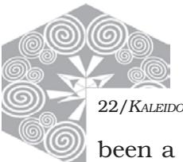
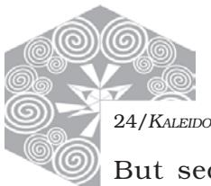
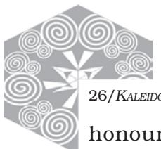
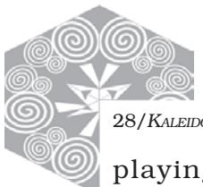
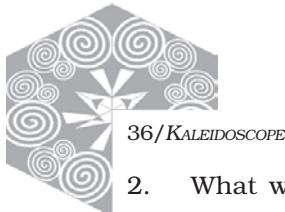

# 3

# A Wedding in Brownsville

Isaac Bashevis Singer 1902–1991

*Isaac Bashevis Singer was born in Poland. His father and grandfather were rabbis and he was educated at the Warsaw Rabbinical Seminary. In 1935 he emigrated to the US and since then has worked as a regular journalist and columnist for the New York paper,* The Jewish Daily Forward*. Apart from some early work published in Warsaw, nearly all his fiction has been written in Yiddish for this journal. It is relatively recently that Singer's work has been translated on any scale and that his merit, and the endurance of his writing, have been recognised by a general audience. He was awarded the Nobel Prize for literature in 1978. His publications include—*A Friend of Kafka, The Seance and Other Stories.

The wedding had been a burden to Dr Solomon Margolin from the very beginning. True, it was to take place on a Sunday, but Gretl had been right when she said that was the only evening in the week they could spend together. It always turned out that way. His responsibilities to the community made him give away the evenings that belonged to her. The Zionists had appointed him to a committee; he was a board member of a Jewish scholastic society; he had become co-editor of an academic Jewish quarterly. And though he often referred to himself as an agnostic and even an atheist, nevertheless for years he had been dragging Gretl to Seders at Abraham Mekheles', a *Landsman* from Sencimin. Dr Margolin treated rabbis, refugees, and Jewish writers without charge, supplying them with medicines and, if necessary, a hospital bed. There had

been a time when he had gone regularly to the meetings of the Senciminer Society, had accepted positions in their ranks, and had attended all the parties. Now Abraham Mekheles was marrying off his youngest daughter, Sylvia. The minute the invitation arrived, Gretl had announced her decision: she was not going to let herself be carted off to a wedding somewhere out in the wilds of Brownsville. If he, Solomon, wanted to go and gorge himself on all kinds of greasy food, coming home at three o'clock in the morning, that was his prerogative.

Dr Margolin admitted to himself that his wife was right. When would he get a chance to sleep? He had to be at the hospital early Monday morning. Moreover he was on a strict fat-free diet. A wedding like this one would be a feast of poisons. Everything about such celebrations irritated him now: the Anglicised Yiddish, the Yiddishised English, the ear-splitting music and unruly dances. Jewish laws and customs were completely distorted; men who had no regard for Jewishness wore skullcaps; and the reverend rabbis and cantors aped the Christian ministers. Whenever he took Gretl to a wedding or Bar Mitzvah, he was ashamed. Even she, born a Christian, could see that American Judaism was a mess. At least this time he would be spared the trouble of making apologies to her.

Usually after breakfast on Sunday, he and his wife took a walk in Central Park, or, when the weather was mild, went to the Palisades. But today Solomon Margolin lingered in bed. During the years, he had stopped attending functions of the Senciminer Society; meanwhile the town of Sencimin had been destroyed. His family there had been tortured, burned, gassed. Many Senciminers had survived, and, later, come to America from the camps, but most of them were younger people whom he, Solomon, had not known in the old country. Tonight everyone would be there; the Senciminers belonging to the bride's family and the Tereshpolers belonging to the groom's. He knew how they would pester him, reproach him for growing aloof, drop hints that he was a snob. They would address him familiarly, slap him on the back, drag him off to dance.

Well, even so, he had to go to Sylvia's wedding. He had already sent out the present.

The day had dawned, grey and dreary as dusk. Overnight, a heavy snow had fallen. Solomon Margolin had hoped to make up for the sleep he was going to lose, but unfortunately he had woken even earlier than usual. Finally he got up. He shaved himself meticulously at the bathroom mirror and also trimmed the grey hair at his temples. Today of all days he looked his age: there were bags under his eyes, and his face was lined. Exhaustion showed in his features. His nose appeared longer and sharper than usual; there were deep folds at the sides of his mouth. After breakfast he stretched out on the living-room sofa. From there he could see Gretl, who was standing in the kitchen, ironing—blonde, faded, middle-aged. She had on a skimpy petticoat, and her calves were as muscular as a dancer's. Gretl had been a nurse in the Berlin hospital where he had been a member of the staff. Of her family, one brother, a Nazi, had died of typhus in a Russian prison camp. A second, who was a Communist, had been shot by the Nazis. Her aged father vegetated at the home of his other daughter in Hamburg, and Gretl sent him money regularly. She herself had become almost Jewish in New York. She had made friends with Jewish women, joined Hadassah, learned to cook Jewish dishes. Even her sigh was Jewish. And she lamented continually over the Nazi catastrophe. She had her plot waiting for her beside his in that part of the cemetery that the Senciminers had reserved for themselves.

Dr Margolin yawned, reached for the cigarette that lay in an ashtray on the coffee table beside him, and began to think about himself. His career had gone well. Ostensibly he was a success. He had an office on West End Avenue and wealthy patients. His colleagues respected him, and he was an important figure in Jewish circles in New York. What more could a boy from Sencimin expect? A self-taught man, the son of a poor teacher of Talmud? In person he was tall and quite handsome, and he had always had a way with women. He still pursued them—more than was good for him at his age and with his high blood pressure.

But secretly Solomon Margolin had always felt that he was a failure. As a child he had been acclaimed a prodigy, reciting long passages of the Bible and studying the Talmud and Commentaries on his own. When he was a boy of eleven, he had sent for a Responsum to the rabbi of Tarnow who had referred to him in his reply as 'great and illustrious'. In his teens he had become a master in the *Guide for the Perplexed* and the Kuzari. He had taught himself algebra and geometry. At seventeen he had attempted a translation of Spinoza's *Ethics* from Latin into Hebrew, unaware that it had been done before. Everyone predicted he would turn out to be a genius. But he had squandered his talents, continually changing his field of study; and he had wasted years in learning languages, in wandering from country to country. Nor had he had any luck with his one great love, Raizel, the daughter of Melekh the watchmaker. Raizel had married someone else and later had been shot by the Nazis. All his life Solomon Margolin had been plagued by the eternal questions. He still lay awake at night trying to solve the mysteries of the universe. He suffered from hypochondria and the fear of death haunted even his dreams. Hitler's carnage and the extinction of his family had rooted out his last hope for better days, had destroyed all his faith in humanity. He had begun to despise the matrons who came to him with their petty ills while millions were devising horrible deaths for one another.

Gretl came in from the kitchen.

'What shirt are you going to put on?'

Solomon Margolin regarded her quietly. She had had her own share of troubles. She had suffered in silence for her two brothers, even for Hans, the Nazi. She had gone through a prolonged change of life. Now her face was flushed and covered with beads of sweat. He earned more than enough to pay for a maid, yet Gretl insisted on doing all the housework herself, even the laundry. It had become a mania with her. Every day she scoured the oven. She was forever polishing the windows of their apartment on the sixteenth floor and without using a safety belt. All the

other housewives in the building ordered their groceries delivered, but Gretl lugged the heavy bags from the supermarket herself.

Now husband and wife sized each other up wryly, feeling the strangeness that comes of great familiarity. He was always amazed at how she had lost her looks. No one feature had altered, but something in her aspect had given way: her pride, her hopefulness, her curiosity. He blurted out:

'What shirt? It doesn't matter. A white shirt.'

'You're not going to wear the tuxedo? Wait, I'll bring you a vitamin.'

'I don't want a vitamin.'

'But you yourself say they're good for you.'

'Leave me alone.'

'Well, it's your health, not mine.'

And slowly she walked out of the room, hesitating as if she expected him to remember something and call her back.

### Stop and Think

- 1. Who were the Senciminers? 2. Why did Dr Margolin not particularly want his wife to accompany him to the wedding?

Dr Solomon Margolin took a last look in the mirror and left the house. He felt refreshed by the half-hour nap he had had after dinner. Despite his age, he still wanted to impress people with his appearance—even the Senciminers. He had his illusions. In Germany he had taken pride in the fact that he looked like a *Junker*, and in New York he was often aware that he could pass for an Anglo-Saxon. He was tall, slim, blond, blue-eyed. His hair was thinning, had turned somewhat grey, but he managed to disguise these signs of age. He stooped a little, but in company was quick to straighten up. Years ago in Germany he had worn a monocle and though in New York that would have been too pretentious, his glance still retained a European severity. He had his principles. He had never broken the Hippocratic Oath. With his patients he was

honourable to an extreme, avoiding every kind of cant; and he had refused a number of dubious associations that smacked of careerism. Gretl claimed his sense of honour amounted to a mania. Dr Margolin's car was in the garage not a Cadillac like that of most of his colleagues—but he decided to go by taxi. He was unfamiliar with Brooklyn and the heavy snow made driving hazardous. He waved his hand and at once a taxi pulled over to the curb. He was afraid the driver might refuse to go as far as Brownsville, but he flicked the meter on without a word. Dr Margolin peered through the frosted window into the wintry Sunday night but there was nothing to be seen. The New York streets sprawled out, wet, dirty, impenetrably dark. After a while, Dr Margolin leaned back, shut his eyes, and retreated into his own warmth. His destination was a wedding. Wasn't the world, like this taxi, plunging away somewhere into the unknown toward a cosmic destination? May be a cosmic Brownsville, a cosmic wedding? Yes. But why did God—or whatever anyone wanted to call Him—create a Hitler, a Stalin? Why did He need world wars? Why heart attacks, cancers? Dr Margolin took out a cigarette and lit it hesitantly. What had they been thinking of, those pious uncles of his, when they were digging their own graves? Was immortality possible? Was there such a thing as the soul? All the arguments for and against weren't worth a pinch of dust.

The taxi turned onto the bridge across the East River and for the first time Dr Margolin was able to see the sky. It sagged low, heavy, red as glowing metal. Higher up, a violet glare suffused the vault of the heavens. Snow was sifting down gently, bringing a winter peace to the world, just as it had in the past—forty years ago, a thousand years ago, and perhaps a million years ago. Fiery pillars appeared to glow beneath the East River; on its surface, through black waves jagged as rocks, a tugboat was hauling a string of barges loaded with cars. A front window in the cab was open and icy gusts of wind blew in, smelling of gasoline and the sea. Suppose the weather never changed again? Who then would ever be able to imagine a summer day, a moonlit night, spring? But how much imagination—

for what it's worth—does a man actually have? On Eastern Parkway the taxi was jolted and screeched suddenly to a stop. Some traffic accident, apparently. The siren on police car shrieked. A wailing ambulance drew nearer. Dr Margolin grimaced. Another victim. Someone makes a false turn of the wheel and all a man's plans in this world are reduced to nothing. A wounded man was carried to the ambulance on a stretcher. Above a dark suit and bloodspattered shirt and bow tie the face had a chalky pallor; one eye was closed, the other partly open and glazed. Perhaps he, too, had been going to a wedding, Dr Margolin thought. He might even have been going to the same wedding as I...

Some time later the taxi started moving again. Solomon Margolin was now driving through streets he had never seen before. It was New York, but it might just as well have been Chicago or Cleveland. They passed through an industrial district with factory buildings, warehouses of coal, lumber, scrap iron. Negroes, strangely black, stood about on the sidewalks, staring ahead, their great dark eyes full of gloomy hopelessness. Occasionally the car would pass a tavern. The people at the bar seemed to have something unearthly about them, as if they were being punished here for sins committed in another incarnation. Just when Solomon Margolin was beginning to suspect that the driver, who had remained stubbornly silent the whole time, had gotten lost or else was deliberately taking him out of his way, the taxi entered a thickly populated neighbourhood. They passed a synagogue, a funeral parlour, and there, ahead, was the wedding hall, all lit up, with its neon Jewish sign and Star of David. Dr Margolin gave the driver a dollar tip and the man took it without uttering a word.

Dr Margolin entered the outer lobby and immediately the comfortable intimacy of the Senciminers engulfed him. AII the faces he saw were familiar, though he didn't recognise individuals. Leaving his hat and coat at the checkroom, he put on a skullcap and entered the hall. It was filled with people and music, with tables heaped with food, a bar stacked with bottles. The musicians were

playing an Israeli march that was a hodge-podge of American jazz with Oriental flourishes. Men were dancing with men, women with women, men with women. He saw black skullcaps, white skullcaps, bare heads. Guests kept arriving, pushing their way through the crowd, some still in their hats and coats, munching hors d'oeuvres, drinking schnapps. The hall resounded with stamping, screaming, laughing, clapping. Flash bulbs went off blindingly as the photographers made their rounds. Seeming to come from nowhere, the bride appeared, briskly sweeping up her train, followed by a retinue of bridesmaids. Dr Margolin knew everybody, and yet knew nobody. People spoke to him, laughed, winked, and waved, and he answered each one with a smile, a nod, a bow. Gradually he threw off all his worries, all his depression. He became half-drunk on the amalgam of odours: flowers, sauerkraut, garlic, perfume, mustard, and that nameless odour that only Senciminers emit. 'Hello, Doctor!' 'Hello Schloime-Dovid, you don't recognise me, eh? Look, he forgot!' There were the encounters, the regrets, the reminiscences of long ago. 'But after all, weren't we neighbours? You used to come to our house to borrow the Yiddish newspaper!' Someone had already kissed him: a badly shaven snout, a mouth reeking of whiskey and rotten teeth. One woman was so convulsed with laughter that she lost an earring. Margolin tried to pick it up, but it had already been trampled underfoot. 'You don't recognise me, eh? Take a good look! It's Zissel, the son of Chaye Beyle!' 'Why don't you eat something?' 'Why don't you have something to drink? Come over here. Take a glass. What do you want? Whiskey? Brandy? Cognac? Scotch? With soda? With Coca Cola? Take some, it's good. Don't let it stand. So long as you're here, you might as well enjoy yourself.' 'My father? He was killed. They were all killed. I'm the only one left of the entire family.' 'Berish the son of Feivish? Starved to death in Russia—they sent him to Kazakhstan. His wife? In Israel. She married a Lithuanian.' 'Sorele? Shot. Together with her children.' 'Yentl? Here at the wedding. She was standing here just a moment ago. There she is, dancing with that tall fellow.' 'Abraham Zilberstein? They burned him in the

synagogue with twenty others. A mound of charcoal was all that was left, coal and ash.' 'Yosele Budnik? He passed away years ago. You must mean Yekele Budnik. He has a delicatessen store right here in Brownsville—married a widow whose husband made a fortune in real estate.'

*'Lechayim*, Doctor! *Lechayim,* Schloime-Dovid! It doesn't offend you that I call you Schloime-Dovid? To me you're still the same Schloime-Dovid, the little boy with the blond side-curls who recited a whole tractate of the Talmud by heart. You remember, don't you? It seems like only yesterday. Your father, may he rest in peace, was beaming with pride...' 'Your brother Chayim? Your Uncle Oyzer? They killed everyone, everyone. They took a whole people and wiped them out with German efficiency: *gleichgeschaltet!'* 'Have you seen the bride yet? Pretty as a picture, but too much make-up. Imagine, a grandchild of Reb Todros of Radzin! And her grandfather used to wear two skullcaps, one in front and one in back. 'Do you see that young woman dancing in the yellow dress? It's Riva's sister—their father was Moishe the candlemaker. Riva herself? Where all the others ended up: Auschwitz. How close we came ourselves! All of us are really dead, if you want to call it that. We were exterminated, wiped out. Even the survivors carry death in the hearts. But it's a wedding, we should be cheerful.' *'Lechayim*, Schloime-Dovid! I would like to congratulate you. Have you a son or daughter to marry off? No? Well, it's better that way. What's the sense of having children if people are such murderers?'

# Stop and Think

- 1. What is the Hippocratic oath?
2. What topic does the merry banter at the wedding invariably lead to?

It was already time for the ceremony, but someone still had not come. Whether it was the rabbi, the cantor, or one of the in-laws who was missing, nobody seemed able to find out. Abraham Mekheles, the bride's father, rushed around, scowled, waved his hand, whispered in

people's ears. He looked strange in his rented tuxedo. The Tereshpol mother-in-law was wrangling with one of the photographers. The musicians never stopped playing for an instant. The drum banged, the bass fiddle growled, the saxophone blared. The dances became faster, more abandoned, and more and more people were drawn in. The young men stamped with such force that it seemed the dance floor would break under them. Small boys romped around like goats, and little girls whirled about wildly together. Many of the men were already drunk. They shouted boasts, howled with laughter, kissed strange women. There was so much commotion that Solomon Margolin could no longer grasp what was being said to him and simply nodded yes to everything. Some of the guests had attached themselves to him, wouldn't move, and kept pulling him in all directions, introducing him to more and more people from Sencimin and Tereshpol. A matron with a nose covered with warts pointed a finger at him, wiped her eyes, called him Schloimele. Solomon Margolin inquired who she was and somebody told him. Names were swallowed up in the tumult. He heard the same words over and over again: died, shot, burned. A man from Tereshpol tried to draw him aside and was shouted down by several Senciminers calling him an intruder who had no business there. A latecomer arrived, a horse and buggy driver from Sencimin who had become a millionaire in New York. His wife and children had perished, but, already, he had a new wife. The woman, weighted with diamonds, paraded about in a low-cut gown that bared a back, covered with blotches, to the waist. Her voice was husky. 'Where did she come from? Who was she?' 'Certainly no saint. Her first husband was a swindler who amassed a fortune and then dropped dead. Of what? Cancer. Where? In the stomach. First you don't have anything to eat, then you don't have anything to eat with. A man is always working for the second husband.' 'What is life anyway? A dance on the grave.' 'Yes, but as long as you're playing the game, you have to abide by the rules.' 'Dr Margolin, why aren't you dancing? You're not among strangers. We're all from the same dust. Over there you

weren't a doctor. You were only Schloime-Dovid, the son of the Talmud teacher. Before you know it, we'll all be lying side by side.'

Margolin didn't recall drinking anything but he felt intoxicated all the same. The foggy hall was spinning like a carousel; the floor was rocking. Standing in a corner, he contemplated the dance. What different expressions the dancers wore. How many combinations and permutations of being the Creator had brought together here. Every face told its own story. They were dancing together, these people, but each one had his own philosophy, his own approach. A man grabbed Margolin and for a while he danced in the frantic whirl. Then, tearing himself loose, he stood apart. Who was that woman? He found his eye caught by her familiar form. He knew her! She beckoned to him. He stood baffled. She looked neither young nor old. Where had he known her—that narrow face, those dark eyes, that girlish smile? Her hair was arranged in the old manner, with long braids wound like a wreath around her head. The grace of Sencimin adorned her—something he, Margolin, had long since forgotten. And those eyes, he was in love with those eyes and had been all his life. He half smiled at her and the woman smiled back. There were dimples in her cheeks. She too appeared surprised. Margolin, though he realised he had begun to blush like a boy, went up to her.

'I know you—but you're not from Sencimin?'

'Yes, from Sencimin.'

He had heard that voice long ago. He had been in love with that voice.

> 'From Sencimin—who are you, then?' Her lips trembled. 'You've forgotten me already?' 'It's a long time since I left Sencimin.' 'You used to visit my father.' 'Who was your father?' 'Melekh the watchmaker.' Dr Margolin shivered. 'If I'm not out of my mind then I'm seeing things.' 'Why do you say that?' 'Because Raizel is dead.'

'I'm Raizel.'

'You're Raizel? Here? Oh my God, if that's true—then anything is possible! When did you come to New York?'

'Some time ago.'

'From where?'

'From over there.'

'But everyone told me that you were all dead.'

'My father, my mother, my brother Hershl...'

'But you were married!'

'I was.'

'If that's true, then anything is possible!' repeated Dr Margolin, still shaken by the incredible happening. Someone must have purposely deceived him. But why? He was aware there was a mistake somewhere but could not determine where.

'Why didn't you let me know? After all...'

He fell silent. She too was silent for a moment.

'I lost everything. But I still had some pride left.'

'Come with me somewhere quieter—anywhere. This is the happiest day of my life!'

'But it's night...'

'Then the happiest night! Almost—as if the Messiah had come, as if the dead had come to life!'

'Where do you want to go? All right, let's go.'

Margolin took her arm and felt at once the thrill, long forgotten, of youthful desire. He steered her away from the other guests, afraid that he might lose her in the crowd, or that someone would break in and spoil his happiness. Everything had returned on the instant: the embarrassment, the agitation, the joy. He wanted to take her away, to hide somewhere alone with her. Leaving the reception hall, they went upstairs to the chapel where the wedding ceremony was to take place. The door was standing open. Inside, on a raised platform stood the permanent wedding canopy. A bottle of wine and a silver goblet were placed in readiness for the ceremony. The chapel with its empty pews and only one glimmering light was full of shadows. The music, so blaring below, sounded soft and distant up here. Both of them hesitated at the threshold.

Margolin pointed to the wedding canopy.

'We could have stood there.'

'Yes.'

'Tell me about yourself. Where are you now? What are you doing?'

'It is not easy to tell.'

'Are you alone? Are you attached?'

'Attached? No.'

'Would you never have let me hear from you?' he asked. She didn't answer.

Gazing at her, he knew his love had returned with full force. Already, he was trembling at the thought that they might soon have to part. The excitement and expectancy of youth filled him. He wanted to take her in his arms and kiss her, but at any moment someone might come in. He stood beside her, ashamed that he had married someone else, that he had not personally confirmed the reports of her death. 'How could I have suppressed all this love? How could I have accepted the world without her? And what will happen now with Gretl?—I'll give her everything, my last cent.' He looked round toward the stairway to see if any of the guests had started to come up. The thought came to him that by Jewish law he was not married, for he and Gretl had had only a civil ceremony. He looked at Raizel.

'According to Jewish law, I'm a single man.'

'Is that so?'

'According to Jewish law, I could lead you up there and marry you.'

> She seemed to be considering the import of his words. 'Yes, I realise...'

'According to Jewish law, I don't even need a ring. One can get married with a penny.'

'Do you have a penny?'

He put his hand to his breast pocket, but his wallet was gone. He started searching in his other pockets. Have I been robbed? he wondered. But how? I was sitting in the taxi the whole time. Could someone have robbed me here at the wedding? He was not so much disturbed as surprised. He said falteringly:

'Strange, but I don't have any money.'

'We'll get along without it.' 'But how am I going to get home?'

'Why go home?' she said, countering with a question. She smiled with that homely smile of hers that was so full of mystery. He took her by the wrist and gazed at her. Suddenly it occurred to him that this could not be his Raizel. She was too young. Probably it was her daughter who was playing along with him, mocking him. For God's sake, I'm completely confused! he thought. He stood bewildered, trying to untangle the years. He couldn't tell her age from her features. Her eyes were deep, dark, and melancholy. She also appeared confused, as if she, too, sensed some discrepancy. The whole thing is a mistake, Margolin told himself. But where exactly was the mistake? And what had happened to the wallet? Could he have left it in the taxi after paying the driver? He tried to remember how much cash he had had in it, but was unable to. 'I must have had too much to drink. These people have made me drunk—dead drunk!' For a long time he stood silent, lost in some dreamless state, more profound than a narcotic trance. Suddenly he remembered the traffic collision he had witnessed on Eastern Parkway. An eerie suspicion came over him: perhaps he had been more than a witness? Perhaps he himself had been the victim of that accident! That man on the stretcher looked strangely familiar. Dr Margolin began to examine himself as though he were one of his own patients. He could find no trace of pulse or breathing. And he felt oddly deflated as if some physical dimension were missing. The sensation of weight, the muscular tension of his limbs, the hidden aches in his bones, all seemed to be gone. It can't be, it can't be, he murmured. Can one die without knowing it? And what will Gretl do?

# Stop and Think

- 1. Who was the woman that Dr Margolin suddenly encountered at the wedding?
- 2. What were the events that led to his confused state of mind?

35*/A WEDDING IN BROWNSVILLE*

He blurted out: 'You're not the same Raizel.' 'No? Then who am I?' 'They shot Raizel.' 'Shot her? Who told you that?'

She seemed both frightened and perplexed. Silently she lowered her head like someone receiving the shock of bad news. Dr Margolin continued to ponder. Apparently Raizel didn't realise her own condition. He had heard of such a state—what was it called? Hovering in the World of Twilight. The Astral Body wandering in semi-consciousness, detached from the flesh, without being able to reach its destination, clinging to the illusions and vanities of the past. But could there be any truth to all this superstition? No, as far as he was concerned, it was nothing but wishful thinking. Besides, this kind of survival would be less than oblivion. 'I am most probably in a drunken stupor,' Dr Margolin decided. 'All this may be one long hallucination, perhaps a result of food poisoning...'

He looked up, and she was still there. He leaned over and whispered in her ear:

'What's the difference? As long as we're together.'

'I've been waiting for that all these years.'

'Where have you been?'

She didn't answer, and he didn't ask again. He looked around. The empty hall was full, all the seats taken. A ceremonious hush fell over the audience. The music played softly. The cantor intoned the benedictions. With measured steps, Abraham Mekheles led his daughter down the aisle.

*(Translated by Chana Faerslein and Elizabeth Pollet)*

# Understanding the Text

- 1. What do you understand of Dr Margolin's past? How does it affect his present life?

- 2. What was Dr Margolin's attitude towards his profession?
- 3. What is Dr Margolin's view of the kind of life the American Jewish community leads?
- 4. What were the personality traits that endeared Dr Margolin to others in his community?
- 5. Why do you think Dr Margolin had the curious experience at the wedding hall?
- 6. Was the encounter with Raizel an illusion or was the carousing at the wedding-hall illusory? Was Dr Margolin the victim of the accident and was his astral body hovering in the world of twilight?

# Talking about the Text

#### *Discuss in small groups*

- 1. Fiction often deals with human consciousness, rather than with the reality of existence.
- 2. The ways in which survivors of holocausts deal with life.

# Appreciation

- 1. Surrealism was an artistic and literary movement in France between the two World Wars. Its basic idea is that the automatic, illogical and uncontrolled associations of the mind represent a higher reality than the world of practical life and ordinary literature. Do you think this story could be loosely classified as surrealistic? What elements in this story would support the idea?
- 2. Comment on the technique used by the author to convey the gruesome realities of the war and its devastating effect on the psyche of human beings through an intense personal experience.

# Language Work

#### A. Grammar: Sentence Variety

A long series of sentences of similar structure and length would be monotonous. Sentences of varied length and pattern contribute to a lively style. Let us look at this paragraph

(1) Usually after breakfast on Sunday, he and his wife took a walk in Central Park, or, when the weather

was mild, went to the Palisades. (2) But today Solomon Margolin lingered in bed. (3) During the years, he had stopped attending functions of the Senciminer Society; meanwhile the town of Sencimin had been destroyed. (4) His family there had been tortured, burned, gassed. (5) Many Senciminers had survived, and, later, come to America from the camps, but most of them were younger people whom he, Solomon, had not known in the old country. (6) Tonight everyone would be there; the Senciminers belonging to the bride's family and the Tereshpolers belonging to the groom's. (7) He knew how they would pester him, reproach him for growing aloof, drop hints that he was a snob. (8) They would address him familiarly, slap him on the back, drag him off to dance. (9) Well, even so, he had to go to Sylvia's wedding. (10) He had already sent out the present.

The paragraph has ten sentences in all. The word-lengths of the sentences in the order in which they occur in the paragraph are: 25, 07, 20, 08, 29, 19, 19, 15,10, 07. We find the range to be between 7 and 29.

We find a similar variation in sentence patterns

*Sentence (1*) Compound sentence. Two independent clauses joined by the coordinating conjunction 'or'

*Sentence (2*) Simple sentence

*Sentence (3*) Two simple sentences joined by a semi-colon. Conjunction: meanwhile

*Sentence (4*) Simple sentence

*Sentence (5*) Compound-Complex sentence consisting of two independent clauses joined by 'and'; the third part has another independent clause joined with the second by 'but'. It has a relative clause joined to it by the subordinator 'whom'

*Sentence (6*) Simple sentence. A main clause followed by two non-finite clauses set in apposition to the main clause

*Sentence (7*) Complex sentence. One main clause and three parallel subordinate clauses, hinging on the subordinator 'how', 'they' and 'would' going with each clause and another subordinate clause depending on 'drop hints'

*Sentence (8*) Parallel independent clauses following the same subject 'They'. The auxiliary 'would' goes with each verb

*Sentence (9*) Simple sentence

*Sentence (10*) Simple sentence.

You will also notice the use of the past tense, past perfect for events and the future. The story is narrated in the *past*. The protagonist's remote past are in the *past perfect.* The protagonist's expectation of what would happen at the wedding is in the *future.*

Note that the variation of form emerges from the emphasis in meaning.

# TASK

*Examine the paragraph beginning 'Some time later the taxi started moving again...' for variety in sentence length and sentence structure.*

#### B. Pronunciation

In a word such as 'afternoon' the third syllable (noon) is the most prominent. This is called the primary stress

after noon

You will also notice that the first syllable is less prominent than the third syllable. This is called the secondary stress. In the dictionary, the primary stress and the secondary stress are indicated as

#### after noon

The middle syllable is unstressed.

# TASK

- Say the following words with correct stress. These words carry stress-pattern similar to the example given above.

| understand | apprehend | rearrange |
| --- | --- | --- |
| refugee | addressee |  |

- Given below are some words chosen from the lesson. Mark the primary and secondary stresses for each word.

| invitation | responsible | seventeen |
| --- | --- | --- |
| American | illustrious | ambulance |
| association | honourable | permanent |
| creator |  |  |

# Suggested Reading

*The Seance and Other Stories* by Isaac Bashevis Singer *The Slave* by Isaac Bashevis Singer.

