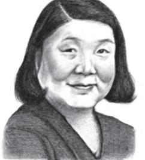
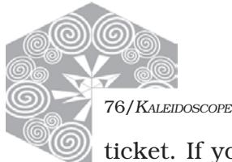
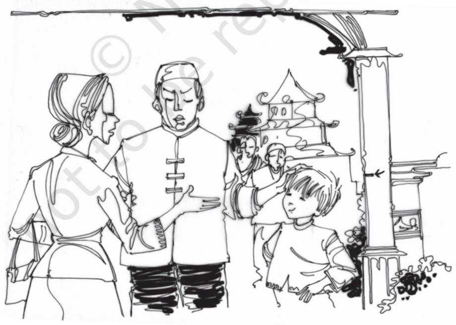
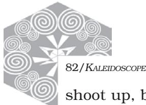
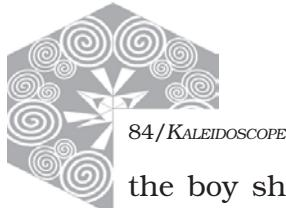

5

Bi Shu-min Born 1952

*Bi Shu-min has been serving her country, China, as a doctor for over twenty years. She also has a Master's degree in literature from the Beijing Teacher's College.*

*Bi Shu-min is one of the best known writers currently working in China. Her works have been translated into many languages. She has won innumerable literary awards both in China and in Taiwan. 'One Centimetre' is a fine example of a mature artist working at the height of her powers.*

When Tao Ying rides on the bus alone, quite often she does not bother to buy a ticket.

Why should she? Without her, the bus would still be stopping at every stop, a driver and a conductor would still have to be employed, and the same amount of petrol used.

Clearly Tao Ying has to be astute. When the bus conductor looked like the responsible type, she would buy a ticket as soon as she got on board. But if he appeared to be casual and careless, she would not dream of paying, considering it a small punishment for him and a little saving for herself.

Tao Ying works as a cook in the canteen of a factory. She spends all day next to an open fire, baking screwshaped wheat cakes with sesame butter.

Today she is with her son Xiao Ye. She follows him onto the bus. As the doors shut her jacket is caught, ballooning up like a tent behind her. She twists this way and that, finally wrenching herself free.

'Mama, tickets!' Xiao Ye says. Children are often more conscious of rituals than adults. Without a ticket in his hand, the ride doesn't count as a proper ride.

On the peeling paint of the door somebody has painted the shape of a pale finger. It points at a number: 1.10 m.

Xiao Ye pushed through. His hair looks as fluffy as a bundle of straw—dry and without lustre. As a rule, Tao Ying is very careful with her purse, but she has never skimped on her child's diet. Nonetheless the goodness in his food refuses to advance beyond his hairline. As a result Xiao Ye is healthy and clever, but his hair is a mess.

Tao Ying tries to smooth it down, as if she was brushing away topsoil to get to a firm foundation. She can feel the softness of her son's skull, rubbery and elastic to the touch. Apparently there is a gap on the top of everyone's head, where the two halves meet. If they don't meet properly, a person can end up with a permanently gaping mouth. Even when the hemispheres are a perfect match, it still takes a while for them to seal. This is the door to life itself—if it remains open, the world outside will feel like water, flowing into the body through this slit. Every time Tao Ying happens upon this aperture on her son's head, she would be overwhelmed by a sense of responsibility. It was she who had brought this delicate creature into the world after all. Although she senses her own insignificance in the world, that her existence makes no difference to anyone else, she also realises that to this little boy she is the centre of the universe and she must try to be the most perfect, flawless mother possible.

Between Xiao Ye's round head and the tip of the painted digit setting out the height requirement for a ticket rests the beautiful slender fingers of Tao Ying. Since she is in contact with oil all day, her nails are shiny, glistening like the smooth curved back of a sea shell.

'Xiao Ye, you are not quite tall enough, still one centimetre away,' she tells him softly. Tao Ying does not come from a privileged background, and has not read very many books. But she likes to be gentle and gracious, to set an example for her son and make a good impression. This

'Mama! I'm tall enough, I'm tall enough!' Xiao Ye shouts at the top of his voice, stamping on the floor as if it were a tin drum. 'You told me the last time I could have a ticket the next time, this is the next time. You don't keep your word!' He looks up at his mother angrily.

Tao Ying looks down at her son. A ticket costs twenty cents. Twenty cents is not to be scoffed at. It can buy a cucumber, two tomatoes or, at a reduced price, three bunches of radishes or enough spinach to last four days. But Xiao Ye's face is raised up like a half-open blossom, waiting to receive his promise from the sun.

'Get in! Don't block the entrance! This is not a train, where you stand from Beijing to Bao Ding. We're almost at the next stop...!' the conductor bellows.

Normally, an outburst like this would certainly have discouraged Tao Ying from buying a ticket. But today she says, 'Two tickets, please.'

The fierce conductor has beady eyes. 'This child is one centimetre short of requiring a ticket.'

Xiao Ye shrinks, not just one but several centimetres the need for a ticket has all of a sudden become interwoven with the pride of a small child.

To be able to purchase self-esteem with twenty cents is something that can only happen in childhood and certainly no mother can resist an opportunity to make her son happy.

'I would like to buy two tickets,' she says politely.

Xiao Ye holds the two tickets close to his lips and blows, making a sound like a paper windmill.

They had entered through the central doors of the bus, but alight towards the front. Here another conductor is poised to examine their tickets. Tao Ying thinks that this man can't be very bright. What mother accompanied by a child would try to avoid paying the correct fare? However poor she would never have allowed herself to lose face in front of her own son.

She hands over the tickets nonchalantly. The conductor asks: 'Are you going to claim these back?' 'No.' In fact Tao Ying ought to have kept the tickets so that the next time there is a picnic or an outing at work she could use her bicycle and then claim back the fare with the stubs. Both she and her husband are blue-collar workers, and any saving would have been a help. But Xiao Ye is a smart boy, and might well question her aloud, 'Mama, can we claim back tickets even when we are on a private outing?' In front of the child, she would never lie.

It is exhausting to follow rules dictated by parental guide-books all the time, but Tao Ying is determined to be the ideal mother and create a perfect example for her son to look up to. She needs really to concentrate—living this way is not unlike carrying an audience with you wherever you go. But her actions are full of love and tenderness. For instance, whenever she eats a watermelon in front of Xiao Ye, she would take care not to bite too close to the rind even though she doesn't actually think there is much difference between the flesh and the skin. True, the sweetness gradually diminishes as you work your way through the red towards the green, but every part of the melon is equally refreshing. In any case the skin of a melon is supposed to have a beneficial cooling effect, and is often used as medicine.

One day, she came across her son eating a melon in the same manner she did. When Xiao Ye looked up, Tao Ying could see a white melon seed stuck to his forehead. She was furious: 'Who taught you to gnaw at a melon like that? Are you going to wash your face in it too?' Xiao Ye was terrified. The small hand holding the melon began to tremble, but the big round eyes remained defiant.

Children are the best imitators in the world. From then on Tao Ying realised that if she wanted her son to behave as if he were the product of a cultured home, then she must concentrate and never fail in her own example. This was very difficult, like 'shooting down aeroplanes with a small gun'—but with determination, she knew that nothing was impossible. With this clear objective in mind,

Tao Ying found her life becoming more focused, more challenging.

#### Stop and Think

- 1. What made Tao Ying decide whether to buy a ticket or not when she rode a bus alone?
- 2. Why did she insist on buying tickets both for herself and her son that day?

Today she is taking Xiao Ye to visit a big temple. He has never seen the Buddha before. Tao Ying is not a believer and she does not intend to ask him to kow-tow. That is superstition, she knows.

The tickets cost five dollars a piece—these days even temples are run like businesses. Tao Ying's ticket was a gift from Lao Chiang, who worked at the meat counter. The ticket was valid for a month, and today was the last day. Lao Chiang was one of those people who seemed to know everybody. Occasionally he would produce a battered coverless month-old magazine and say: 'Seen this before? This is called the Big Reference, not meant for the eyes of the common people.' Tao Ying had never seen anything like this before and wondered how such a small rag, smaller even than a regular newspaper, could be called a Big Reference. She asked Lao Chiang but he seemed confused. He said everybody called it that—perhaps if you were to take out the pages and laid them flat they would end up bigger than a normal newspaper. It seemed to make sense. Studying this publication written in large print, Tao Ying could see that it was full of speculation about the war in the Middle East. Foremost on everyone's mind seemed to be whether the export of dates from Iraq to China would continue as it did in the sixties during the famine. In any case, Tao Ying was full of admiration for Lao Chiang. In return for her indiscriminate respect, Lao Chiang decided to reward her with a ticket for the temple. 'Is there just the one?' Tao asked, not without gratitude but with some uncertainty. 'Forget your husband, take your son and open his eyes! Children under 110 centimeters do not need a

ticket. If you don't want to go, sell it at the door and you'll earn enough to buy a couple of watermelons!' Lao Chiang had always been a practical man.

Tao Ying decided to take the day off and go on an outing with Xiao Ye.

It is rare to find such a large patch of grass in the middle of the city. Even before they got there, there was something refreshing, something green in the air, as if they were approaching a valley, or a waterfall. Xiao Ye snatches the ticket from his mother's hand, puts it between his lips, and flies towards the gilded gates of the temple. A little animal rushing to quench his thirst.

Tao Ying suddenly feels a little sad. Is the mere attraction of a temple enough for Xiao Ye to abandon his mother? But almost immediately she banishes the thought hasn't she brought her son here today to make him happy?

The guard at the gate is a young man dressed in a red top and black trousers. Tao Ying feels somehow that he ought to have been in yellow. This uniform makes him look somewhat like a waiter.

Xiao Ye knows exactly what he has to do. Moving amongst the crowd, he seems like a tiny drop of water in the current of a large river.

The young man takes the ticket from his mouth, plucking a leaf from a spring branch.

Tao Ying's gaze softly envelopes her son, a strand of silk unwinding towards him, following his every gesture.

'Ticket.' The youth in red bars her way with one arm, his voice as pithy as if he was spitting out a date stone.

Tao Ying points at her son with infinite tenderness. She feels that everybody should see how lovely he is.

'I am asking for your ticket.' The red youth does not budge.

'Didn't the child just give it to you?' Tao Ying's voice is peaceful. This boy is too young, years away from being a father, she thinks. Tao Ying is not working today and is in a really good mood. She is happy to be patient.

'That was his ticket, now I need to see yours.' The youth remains unmoved.

Tao Ying has to pause for a moment before it sinks in—there are two of them and they need a ticket each.

'I thought that children were exempt?' She is confused. 'Mama, hurry up!' Xiao Ye shouts to her from inside

the doors. 'Mama is coming!' Tao Ying shouts back. A crowd is beginning to gather, so many fishes swarming towards a bright light.

Tao Ying starts to panic. She wants this fracas to end, her child is waiting for her.

'Who told you he doesn't need a ticket?' The guard tilts his head—the more onlookers the better.

'It says so on the back of the ticket.'

'Exactly what does it say?' This boy is obviously not a professional.

'It says that children under 110 centimetres do not have to pay.' Tao Ying is full of confidence. She moves to pick up one of the tickets from a box next to the guard and reads out what is printed on the back for all to hear.

'Stop right there!' The youth has turned nasty. Tao Ying realises she should not have touched the box and quickly withdraws her hand.

'So you are familiar with the rules and regulations are you?' Now the young man addresses her with the formal 'you'. Tao Ying detects the sarcasm in his tone but she simply nods.

'Well, your son is over 110 centimetres,' he says with certainty.

'No he isn't.' Tao Ying is still smiling.

Everybody begins to look at the mother with suspicion.

'He just ran past the mark. I saw it clearly.' The guard is equally firm, pointing at a red line on the wall which looks like an earthworm inching across the road after a rainstorm.

'Mama, why are you taking so long? I thought I had lost you!' Xiao Ye shouts to her affectionately. He runs towards his mother, as if she was one of his favourite toys.

The crowd titters. Good, they think, here is proof, the whole matter can be cleared up at once.

The youth is getting a little nervous. He is just doing his job. He is certain he is right. But this woman seems very confident, perhaps that would be awful...

Tao Ying remains calm. In fact, she feels a little smug. Her son loves excitement. This is turning into something of an event so it is bound to delight him.

'Come over here,' the youth commands.

The crowd holds its breath.

Xiao Ye looks at his mother. Tao Ying gives him a little nod. He walks over to the guard graciously, coughs a little, adjusts his jacket. In front of the gaze of the crowd, Xiao Ye is every inch the hero as he approaches the earthworm.

Then—the crowd looks, and sees—the worm comes to Xiao Ye's ear.

How is this possible?

Tao Ying is by his side in two paces. The flat of her hand lands heavily on the little boy's head, making a sound as crisp as a ping-pong ball popping underfoot.

Xiao Ye stares at his mother. He is not crying. He is shocked by the pain. He has never been hit before.

The crowd draws its breath.

'Punishing a child is one thing, hitting him on the head is totally unacceptable!'

'What a way for a mother to behave! So what if you have to buy another ticket? This is a disgrace, hitting a child to cover up your own mistake!'

'She can't be his natural mother...'

Everybody has an opinion.

Tao Ying is feeling a little agitated now. She had not meant to hit Xiao Ye. She meant to smooth down his hair, But she realises that even if Xiao Ye were bald at this instant, he would still be towering above the worm on the wall.

'Xiao Ye, don't stand on tip-toe!' Tao Ying's voice is severe.

'Mama, I'm not...' Xiao Ye begins to cry.

It's true. He isn't. The worm crawls somewhere next to his brow.

The guard stretches himself lazily. His vision is sharp,

'But my son is less than one meter ten!' Tao Ying insists even though she realises she stands alone.

'Everyone who tries to escape paying always says the same thing. Do you think these people are going to believe you, or are they going to believe me? This is a universally accepted measurement. The International Standard Ruler is in Paris, made of pure platinum. Did you know that?'

Tao is flummoxed. All she knows is that to make a dress she needs two metres eighty centimetres, she does not know where the International Ruler is kept. She is only astonished at the power of the Buddha which can make her son grow several centimetres within minutes!

'But we were on the bus just now and he wasn't as tall...'

'No doubt when he was born he wasn't as tall either!' the youth sneers, chilling the air.

Standing in the middle of the jeering crowd, Tao Ying's face has turned as white as her ticket.

'Mama, what is happening?' Xiao Ye comes away from the earthworm to hold his mother's frozen hand with his own little warm one.

'It's nothing. Mama has forgotten to buy a ticket for you.' Tao Ying can barely speak.

'Forgotten? That's a nice way of putting it! Why don't you forget you have a son as well?' The youth will not forgive her calm confidence of a moment ago.

'What more do you want?' Tao Ying's temper rises. In front of her child, she must preserve her dignity.

'You have a nerve! This is not to do with what I want, clearly you must apologise! God knows how you had managed to get hold of a complimentary ticket in the first place. To get in free is not enough, now you want to sneak in an extra person. Have you no shame? Don't think you can get away with this, go, get yourself a valid ticket!' The youth is now leaning on the wall, facing the crowd as if he is pronouncing an edict from on high.

Tao Ying's hands are trembling like the strings on a *pei-pa.* What should she do? Should she argue with him? She is not afraid of a good fight but she doesn't want her child to be witness to such a scene. For the sake of Xiao Ye, she will swallow her pride.

'Mama is going to buy a ticket. You wait here, don't run off.' Tao Ying tries to smile. This outing is such a rare occasion, whatever happens she mustn't spoil the mood. She is determined to make everything all right.

'Mama, did you really not buy a ticket?' Xiao Ye looks at her, full of surprise and bewilderment. The expression on her child's face frightens her.

She cannot buy this ticket today! If she went ahead, she would never be able to explain herself to her son.

'Let's go!' She gives Xiao Ye a yank. Thankfully the child has strong bones, or his arm might have fallen off.

'Let's go and play in the park.' Tao Ying wants her son to be happy, but the little boy has fallen silent, sullen. Xiao Ye has suddenly grown up.

# Stop and Think

- 1. Did Tao Ying really intend to cheat at the temple?
- 2. Why did Tao Ying change her intention to buy another ticket?

As they walk past an ice-cream seller, Xiao Ye says, 'Mama, give me money!'

Taking the money, Xiao Ye runs towards an old woman behind the stall and says to her: 'Please measure me!' It is only then that Tao Ying notices the old lady sitting next to a pair of scales for measuring weight and height.

The old woman extends with difficulty the measuring pole, pulling it out centimetre by centimetre.

She strains to make out the numbers: 'One metre eleven.'

Tao Ying begins to wonder if she has encountered a ghost or is her son beginning to resemble a shoot of bamboo, growing every time you look at him?

Something moist begins to glisten in Xiao Ye's eyes. Leaving his mother behind and without a backward glance, he starts to run away. He trips. One moment he is in the air, taking flight like a bird, another and he has dropped to the ground with a heavy thud. Tao Ying rushes over to lend a hand but just as she is about to reach him Xiao Ye has picked himself up and is off again. Tao Ying stops in her tracks. If she gives chase Xiao Ye will only keep falling. Watching her son's vanishing silhouette, her heart begins to break: Xiao Ye, aren't you going to look back at your mother?

Xiao Ye runs for a long time and eventually comes to a halt. He throws a quick glance backwards to find his mother, but the moment he can see her, he takes off once more...

Tao Ying finds the whole incident incomprehensible. She wanders back to the old woman and asks politely: 'Excuse me, these scales you have...'

'My scales are here to make you happy! Don't you want your son to grow tall? Every mother wants her sons to

shoot up, but don't forget when he is tall, that means you'll be old! Mine are flattering scales,' the old woman explains kindly, but Tao Ying remains baffled.

'You see my scales are old and not very accurate and they make people seem lighter than they really are. I have also adjusted it to make them seem taller. These days it is fashionable to be long and lean—mine are fitness scales!' The old woman might be kind, but she is not without cunning.

So that is the reason! Xiao Ye should have heard this speech! But he is a long way away and in any case would he have understood the convoluted logic?

Xiao Ye still looks suspicious, as if mother has turned into a big bad wolf, ready to eat him up. Later when they are back at home, Tao Ying takes out her own tape measure and insists on measuring him again.

'I don't want to! Everybody says I am tall enough except you. It's because you don't want to buy me a ticket, don't think I don't know. If you measure me I am bound to get shorter again. I don't trust you! I don't trust you!'

The yellow tape in Tao Ying's hands has turned into a poisonous viper.

### Stop and Think

- 1. Were the old lady's scales a reliable measure of height and weight? What convoluted logic were her measurements based on?

2. What was the conflict between the mother and son?

'Chef! Your cakes look as if they are wearing camouflage uniforms, all black and brown!' a customer queuing in front of her counter shouts out.

***

The cakes are ruined. They are full of burnt marks, and look like tiny terrapins,

Sorry sorry sorry.

Tao Ying feels very guilty. She is usually very conscientious in her work, but these couple of days she often finds herself distracted.

She must rescue the situation! At night, after Xiao Ye has gone to sleep, Tao Ying straightens his little legs so that he is lying as flat as a piece of newly shrunken fabric. Tao Ying then stretches her tape from the soles of his feet to the top of his head—one metre nine centimetres.

She decides to write a letter to the administrators at the temple.

She picks up her brush but suddenly realises that this is harder than she thinks! Seeing her deep in thought with knitted brows, her husband says, 'So what do you imagine might happen even if you wrote to them?'

He is right, she doesn't know if anything would come of it. But in order to melt the ice in her son's eyes, she must do something.

At last the letter is done. There is a man in the factory nicknamed 'the Writer'. People say he has had some small articles published at the back of a news rag once. Tao Ying finds him and respectfully offers up her literary work.

'This sounds like an official communication. Not lively enough, not moving.' The Writer traces the letter with his nicotine-stained fingers.

Tao Ying doesn't know what an official communication is but she detects a tone of dissatisfaction in the scholar's voice. She looks at the lines he is pointing to, and nods in agreement.

'What you need to do is this. You must open with a strong and righteous claim, fawned by a passage of stunning originality so that your work stands out and grabs the attention of the editor. This would make him pick it out of a large pile on his desk. It has to catch his eyes like a blinding light, an apple in a mound of potatoes. But most important of all, your letter must touch his heart. Have you heard of the saying, grieving soldiers always win?'

Tao Ying keeps nodding.

The Writer is encouraged to continue: 'Let us look at the opening paragraph—it should go something like this: ''The power of the Buddha is surely infinite! The foot of a five-year-old boy has scarcely touched the threshold of the temple and he has grown two centemetres; but alas, the power of the Buddha is finite after all—on his return home

the boy shrinks back to his original size...'' I know this is not yet perfect, but have a think about it along these lines...'

Tao Ying tries to memorise the words of the Writer, but she finds it hard to recall all of it. Back home she makes a few corrections as best she can, and sends out the letter.

***

The Writer comes by her stall at lunch-time. Tao Ying's face is framed in a small window where she is collecting vouchers. She looks like a photograph, staring out at the camera with a sombre expression.

'Please wait a moment,' and she disappears behind the frame.

The Writer suspects the cakes are burnt again. Perhaps Tao Ying has gone to find a few which are less burnt than others, to thank him for pointing her in the right direction.

'This is for you, with extra sugar and sesame,' Tao Ying says shyly.

This is the greatest gift a baker could offer a friend as a token of gratitude.

***

Then comes the long wait.

Tao Ying looks through the newspapers every day, reading everything from cover to cover including small classified advertisements for videos. In the meantime she would listen to the radio, imagining that one morning she will hear her own letter read out by one of those announcers with a beautiful voice. Afterwards she would go down to the post office, in case the administrative department of the temple has replied to her letter, apologising for their misdeed...

She has imagined a hundred different scenarios, but not what actually happens.

The days have been like the white flour she works with, one very much like another. Xiao Ye appears to have recovered from the ordeal but Tao Ying firmly believes that he has not really forgotten.

Finally, one day, she hears a question, 'Which way is it to comrade Tao's home?'

'I know, I'll take you.' Xiao Ye excitedly shows two elderly gentlemen in uniform through the front door. 'Mama, we have visitors!'

Tao Ying is doing the laundry, immersed in soap up to her armpits.

'We are from the administrative office at the temple. The local newspaper has forwarded your letter to us and we have come to ascertain the truth.'

Tao Ying is very nervous, and somewhat depressed. Chiefly because her house is very messy, and she has not had the time to tidy up. If they think that she is prone to laziness they might not believe her.

'Xiao Ye, why don't you go out to play?' In Tao Ying's fantasies, Xiao Ye would be in the room to witness the revelation of the truth. Now that the moment has finally arrived, she feels uncomfortable having him there. She cannot predict what will happen. These are after all the people who employed the youth in red, so how reasonable can they be?

The younger of the two speaks. 'We have investigated the matter with the party concerned, and he insisted he was in the right. Don't tell the boy to leave, we want to measure him.'

Xiao Ye obeys and stands next to the wall. The white of the wall looks like a virgin canvas and Xiao Ye a painting filling up the space. He leans tightly against the wall as if the act of measuring his height has once again stirred up some terrifying memory in the recesses of his mind.

The men are very serious. First of all they draw a bold line across the wall from the top of Xiao Ye's head. Then they take out a metallic tape and take the measurement from the line to the floor. The metal of the tape glistens like a flowing stream in sunlight.

Tao Ying regains her calm.

'What does it say?'

'One metre ten, just so,' the younger man answers.

'This is not just so. There was a delay of one month and nine days before you came. A month ago he wasn't this tall.'

The two officials look at each other. This is a statement they cannot refute.

They produce a five-dollar bill from a pocket. The note pokes out of an envelope. They have evidently come prepared. Before they left the temple, they must have checked the height of the earthworm, and realised it was not drawn accurately.

'The other day you and your son were unable to enter. This is a small token to redress the situation.' This time it is the elder of the two gentlemen who speaks. His demeanour is kind, so he must be the more senior of the two.

Tao Ying remains still. That day's happiness can never be bought again.

'If you don't want the money, here are two tickets. You and your son are welcome to visit the temple any time.' The younger man is even more polite.

This is a tempting proposition indeed, but Tao Ying shakes her head. To her, to her son, that place will always be associated with unhappy memories now.

'So which would you prefer,' both men ask in unison.

In fact Tao Ying is asking herself the same question. She is gracious by nature—if the youth in red had come in person to apologise today, she would not have made him feel awkward.

So what is it that she wants?

She shoves Xiao Ye in front of the two elderly officials. 'Say Grandpa,' she tells him.

'Grandpa.' Xiao Ye sounds infinitely sweet.

'Dear Leaders, please take back the money, and the tickets. Kindly do not punish the guard on duty, he was only doing his job...'

The two officials are puzzled.

Tao Ying nudges Xiao Ye closer: 'Gentlemen, would you be so kind as to explain to my son exactly what happened on that day. Please tell him that his mother has not done anything wrong...'

# Understanding the Text

- 1. How did Tao Ying's son influence the way she led her life?
- 2. Pick out instances from the story to show that official rules are often arbitrary.
- 3. Tao Ying was very careful about spending money. What were her reasons for refusing the compensation offered by the temple officials?
- 4. Why was her final vindication important to Tao Ying?

## Talking about the Text

*Discuss the following in pairs or in small groups*

- 1. The way a child looks at the world is very different from that of an adult.
- 2. There is always a gap between what we really are and what we wish to appear to be to others.

## Appreciation

- 1. Comment on the significance of the first sentence of the story to its theme.
- 2. Would you describe the author's portrayal of Tao Ying's character in the story as sympathetic, critical or realistic?
- 3. Identify the episodes that bring out the ambivalent attitude to ethics commonly seen in human life?
- 4. How effectively does the narrative technique adopted in this story illustrate 'unity of thought'?

Language Work

#### A . Figures of Speech

- a. *Simile*
Notice the underlined phrases in the following sentences

- (i) As the doors shut her jacket is caught, *ballooning up like a tent* behind her.
The comparison here is between the ballooning of the jacket and a tent made explicit by the use of the conjunction, 'like'.

- (ii) The *white of the wall looks like a virgin canvas* and *Xiao Ye a painting filling up the space.*
The comparison in (ii) is between the whiteness of the wall and a virgin canvas made explicit by the use of 'like'. In the second 'like' is understood. Xiao Ye is like a painting…

Such explicit comparisons are called similes.

- b. *Metaphor*
Sometimes comparisons are made by the application of words or phrases to a concept that they do not literally denote.

An example of this is

But in order *to melt the ice in her son's eyes,* she must do something.

Here the ice stands for the coldness and distance in her son's eyes and how she wishes to make him come closer to her.

The comparison of a mental attitude to ice is not explicitly emphasised but is understood. Similes and metaphors add to the richness of language and help to make the reader visualise more vividly the thoughts of the author.

#### TASK

*Pick out examples of simile and metaphor from the story and state the two elements or concepts that are compared and the manner of comparison.*

#### B. Pronunciation

Look at the word 'object'

We can see that

- (i) It is a two-syllable word: ob ject
- (ii) It can be used as both a noun and a verb.

*Examples*

- (i) Place the *object* on the table. (noun) [Pronounce *ob* as in *bob*]
- (ii) I *ob ject*, your honour. (verb)

[Pronounce *ob* as in *hub*]

- The stress and the way the word is pronounced change accordingly.
- You will notice that, when used as a noun, the word carries the stress on the first syllable; when used as a verb, the stress is received on the second syllable.
- Also, the way you pronounce the initial syllable would change.

### TASK

The following words can be used as both a noun and a verb

| conduct |  | protest | permit |
| --- | --- | --- | --- |
|  | progress | desert |  |

- Where would the stress fall? Mark the stress when the word is used
	- (i) as a noun
	- (ii) as a verb
- Is there a change in the pronunciation of the first syllable? Form words that rhyme with the pronunciation of the first syllable, as in the example of 'object' given above.

# Suggested Reading

*The Vintage Book of Contemporary Chinese Fiction* ed. by Carolyn Choa and David Su Li-Qun

*This Kind of Woman: Ten Stories by Japanese Women Writers* 1960-1976. ed. by Yukiko Tanaka and Elizabeth Hansen.

