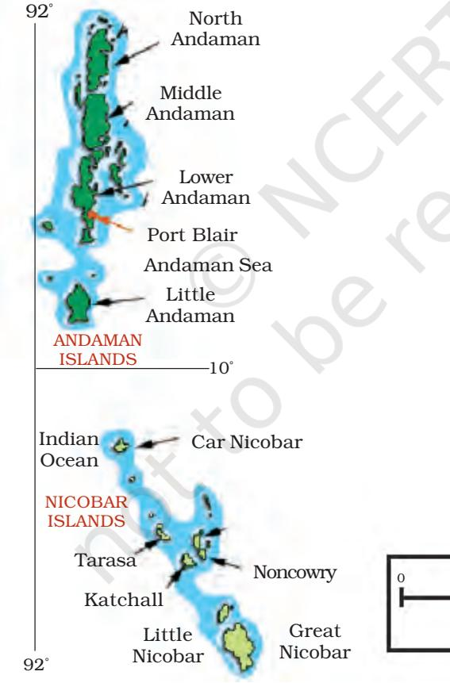
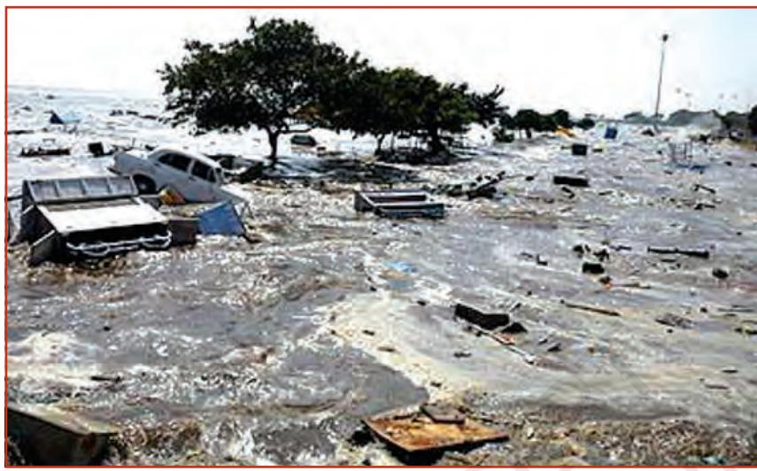
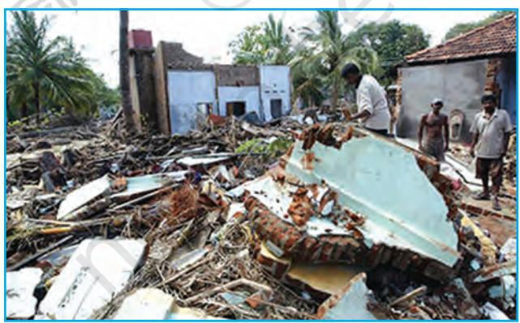
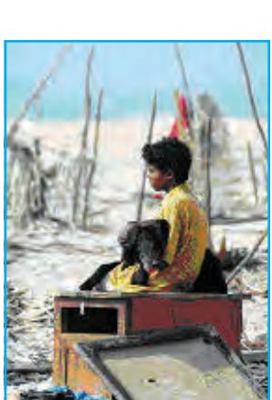

## Before you read

*Look at the map of the Andaman and Nicobar Islands given here.*

## Andaman and Nicobar Islands

*Now read the sentences below. Rewrite the incorrect ones after correcting the mistakes.*

- 1. Katchall is an island.
- 2. It is part of the Andaman group of islands.
- 3. Nancowry is an island in the Nicobar group.
- 4. Katchall and Nancowry are more than a hundred miles apart. (Hint: the scale of the map is given.)
- 5. The Andaman and Nicobar Islands are to the west of India.
- 6. The Nicobar Islands are to the north of the Andaman Islands.

100 km

70 miles *A tsunami is a very large and powerful wave caused by earthquakes under the sea. On 26 December 2004, a tsunami hit Thailand and parts of India such as the Andaman and Nicobar Islands, and the Tamil Nadu coast. Here are some stories of courage and survival.*

*Did animals sense that a tsunami was coming? Some stories suggest that they did.*

I

These stories are all from the Andaman and Nicobar archipelago.

Ignesious was the manager of a cooperative society in Katchall. His wife woke him up at 6 a.m. because she felt an earthquake. Ignesious carefully took his television set off its table and put it down on the ground so that it would not fall and break. Then the family rushed out of the house.

When the tremors stopped, they saw the sea rising. In the chaos and confusion, two of his children caught hold of the hands of their mother's father and mother's brother, and rushed in the opposite direction. He never saw them again. His wife was also swept away. Only the three other children who came with him were saved.

## archipelago:

a group of many islands and the surrounding sea

### tremor:

a slight shake Earth tremors: the earth's shakes during an earthquake chaos:

- complete disorder or confusion [pronounced, kay-os]
The Tsunami 25

relief helicopters:

helicopters bringing help to people (e.g. during floods)

### recede:

move back from where it was

Sanjeev was a policeman, serving in the Katchall island of the Nicobar group of islands. He somehow managed to save himself, his wife and his baby daughter from the waves. But then he heard cries for help from the wife of John, the guesthouse cook. Sanjeev jumped into the water to rescue her, but they were both swept away.

Thirteen year-old Meghna was swept away along with her parents and seventy-seven other people. She spent two days floating in the sea, holding on to a wooden door. Eleven times she saw relief helicopters overhead, but they did not see her. She was brought to the shore by a wave, and was found walking on the seashore in a daze.

Almas Javed was ten years old. She was a student of Carmel Convent in Port Blair where her father had a petrol pump. Her mother Rahila's home was in Nancowry island. The family had gone there to celebrate Christmas.

When the tremors came early in the morning, the family was sleeping. Almas's father saw the sea water recede. He understood that the water would come rushing back with great force. He woke everyone up and tried to rush them to a safer place.

As they ran, her grandfather was hit on the head by something and he fell down. Her father rushed to help him. Then came the first giant wave that swept both of them away.

Almas's mother and aunts stood clinging to the leaves of a coconut tree, calling out to her. A wave uprooted the tree, and they too were washed away.

Almas saw a log of wood floating. She climbed on to it. Then she fainted. When she woke up, she was in a

2 6 Honeydew

hospital in Kamorta. From there she was brought to Port Blair.

The little girl does not want to talk about the incident with anyone. She is still traumatised.

## *Comprehension Check*

*Say whether the following are true or false.*

- *1. Ignesious lost his wife, two children, his father-in-law, and his brother-in-law in the tsunami.*
- *2. Sanjeev made it to safety after the tsunami.*
- *3. Meghna was saved by a relief helicopter.*
- *4. Almas's father realised that a tsunami was going to hit the island.*
- *5. Her mother and aunts were washed away with the tree that they were holding on to.*

## II

*Tilly Smith (a British school girl) was able to save many lives when the tsunami struck Phuket beach in Thailand. Though she has won a number of awards, her parents have not allowed their daughter to be interviewed on television and made into a heroine. Why do you think they took that decision?*

Now here is a story from Thailand.

The Smith family from South-East England were celebrating Christmas at a beach resort in southern Thailand. Tilly Smith was a ten-year-old schoolgirl; her sister was seven years old. Their parents were Penny and Colin Smith.

It was 26 December 2004. Deadly tsunami waves were already on their way. They had been triggered by a massive earthquake off northern Sumatra earlier that morning.

"The water was swelling and kept coming in," Penny Smith remembered. "The beach was getting smaller and smaller. I didn't know what was happening."

## traumatised:

greatly shocked and distressed

## resort: a place where

people go on holiday

#### triggered: caused

(describes a sudden, violent reaction – here, an undersea earthquake caused the tsunami)

hysterical: when you are hysterical, you shout, laugh or cry in a wild excited way, without any control over yourself

### refuge:

shelter or protection from danger

#### withstood:

endured without collapsing

surge: force; momentum

But Tilly Smith sensed that something was wrong. Her mind kept going back to a geography lesson she had taken in England just two weeks before she flew out to Thailand with her family.

Tilly saw the sea slowly rise, and start to foam, bubble and form whirlpools. She remembered that she had seen this in class in a video of a tsunami that had hit the Hawaiian islands in 1946. Her geography teacher had shown her class the video, and told them that tsunamis can be caused by earthquakes, volcanoes and landslides.

 Tilly started to scream at her family to get off the beach. "She talked about an earthquake under the sea. She got more and more hysterical," said her mother Penny. "I didn't know what a tsunami was. But seeing my daughter so frightened, I thought something serious must be going on."

Tilly's parents took her and her sister away from the beach, to the swimming pool at the hotel. A number of other tourists also left the beach with them. "Then it was as if the entire sea had come out after them. I was screaming, 'Run!'"

The family took refuge in the third floor of the hotel. The building withstood the surge of three tsunami waves. If they had stayed on the beach, they would not have been alive.

The Smiths later met other tourists who had lost entire families. Thanks to Tilly and her geography lesson, they had been forewarned. Tilly went back to her school in England and told her classmates her terrifying tale.

### *Comprehension Check*

*Answer the following in a phrase or sentence.*

- *1. Why did Tilly's family come to Thailand?*
- *2. What were the warning signs that both Tilly and her mother saw?*
- *3. Do you think Tilly's mother was alarmed by them?*
- *4. Where had Tilly seen the sea behaving in the same strange fashion?*

2 8 Honeydew

- *5. Where did the Smith family and the others on the beach go to escape from the tsunami?*
- *6. How do you think her geography teacher felt when he heard about what Tilly had done in Phuket?*

## III

*Look carefully at the picture of the boy and his dog, and try to describe the things that you see, using just words and phrases. Either the teacher or one of the students can write down the words and phrases on the blackboard.*

> *This is how you can start calm, blue sea …. ruined huts………*

Before the giant waves slammed into the coast in India and Sri Lanka, wild and domestic animals seemed to know what was about to happen. They fled to safety. According to eyewitness accounts, elephants screamed and ran for higher ground; dogs refused to go outdoors; flamingoes abandoned their low-lying breeding areas; and zoo animals rushed into their shelters and could not be enticed to come back out.

Many people believe that animals possess a sixth sense and know when the earth is going to shake. Some experts believe that animals' more acute hearing helps them to hear or feel the earth's vibration. They can sense an approaching disaster long before humans realise what's going on.

We cannot be sure whether animals have a sixth sense or not. But the fact is that the giant waves that rolled through the Indian Ocean killed more than 150,000 people in a dozen countries; but not many animals have been reported dead.

Along India's Cuddalore coast, where thousands of people perished, buffaloes, goats and dogs were found unharmed. The Yala National Park in Sri Lanka is home to a variety of animals including elephants, leopards, and 130 species of birds. Sixty visitors were washed away from the Patanangala beach inside the park; but

*When do you think this picture was taken?*

> *Did you know that very few animals actually died in the tsunami?*

The Tsunami 29

no animal carcasses were found, except for two water buffaloes. About an hour before the tsunami hit, people at Yala National Park had observed three elephants running away from the Patanangala beach.

A Sri Lankan gentleman who lives on the coast near Galle said his two dogs would not go for their daily run on the beach. "They are usually excited to go on this outing," he said. But on that day they refused to go, and most probably saved his life.

## *Comprehension check*

*Answer using a phrase or a sentence.*

- *1. In the tsunami 150,000 people died. How many animals died?*
- *2. How many people and animals died in Yala National Park?*
- *3. What do people say about the elephants of Yala National Park?*
- *4. What did the dogs in Galle do?*

Discuss the following questions in class. Then write your own answers.

- 1. When he felt the earthquake, do you think Ignesious immediately worried about a tsunami? Give reasons for your answer. Which sentence in the text tells you that the Ignesious family did not have any time to discuss and plan their course of action after the tsunami struck?
- 2. Which words in the list below describe Sanjeev, in your opinion? (Look up the dictionary for words that you are not sure of.)

| cheerful | ambitious | brash | brave | careless |
| --- | --- | --- | --- | --- |
| heroic | selfless | heartless | humorous |  |

Use words from the list to complete the three sentences below.

- (i) I don't know if Sanjeev was cheerful, ___________ or ___________.
- (ii) I think that he was very brave,___________ and___________.
- (iii) Sanjeev was not heartless, ___________or___________.
- 3. How are Meghna and Almas's stories similar?
- 3 0 Honeydew
- 4. What are the different ways in which Tilly's parents could have reacted to her behaviour? What would you have done if you were in their place?
- 5. If Tilly's award was to be shared, who do you think she should share it with — her parents or her geography teacher?
- 6. What are the two different ideas about why so few animals were killed in the tsunami? Which idea do you find more believable?

- 1. Go through Part-I carefully, and make a list of as many words as you can find that indicate movement of different kinds. (There is one word that occurs repeatedly — count how many times!) Put them into three categories.
fast movement slow movement neither slow nor fast Can you explain why there are many words in one column and not in the others?

- 2. Fill in the blanks in the sentences below (the verbs given in brackets will give you a clue).
	- (i) The earth trembled, but not many people felt the _________. (tremble)
	- (ii) When the zoo was flooded, there was a lot of _________ and many animals escaped into the countryside. (confuse)
	- (iii) We heard with _________ that the lion had been recaptured. (relieve)
	- (iv) The zookeeper was stuck in a tree and his _________ was filmed by the TV crew. (rescue)
	- (v) There was much _________ in the village when the snake charmer came visiting. (excite)
- 3. Study the sentences in the columns A and B.

| A | B |
| --- | --- |
| Meghna was swept away. | The waves swept Meghna away. |
| Almas's grandfather was hit on the | Something hit Almas's grandfather on |
| head. | the head. |
| Sixty visitors were washed away. | The waves washed away sixty visitors. |
| No animal carcasses were found. | People did not find any animal carcasses. |

The Tsunami 31

Compare the sentences in A to the ones in B. Who is the 'doer' of the action in every case? Is the 'doer' mentioned in A, or in B?

Notice the verbs in A: 'was swept away', 'was hit', 'were washed away', 'were found'. They are in the passive form. The sentences are in the *Passive Voice*. In these sentences, the focus is not on the person who does the action.

In B, the 'doer' of the action is named. The verbs are in the active form. The sentences are in the *Active Voice*.

Say whether the following sentences are in the Active or the Passive voice. Write A or P after each sentence as shown in the first sentence.

- (i) Someone stole my bicycle. __A__
- (ii) The tyres were deflated by the traffic police. _______________
- (iii) I found it last night in a ditch near my house. _______________
- (iv) It had been thrown there. _______________
- (v) My father gave it to the mechanic. _______________
- (vi) The mechanic repaired it for me. _______________

- 1. Suppose you are one of the volunteers who went to the Andaman and Nicobar Islands for relief work after the tsunami. You work in the relief camps, distributing food, water and medicine among the victims. You listen to the various stories of bravery of ordinary people even as they fight against odds to bring about some semblance of normalcy in their lives. You admire their grit and determination. Write a diary entry.
*You may start in this way.*

31 December, 2004

*The killer tsunami struck these islands five days ago. But the victims are being brought in even now. Each one has a story to tell...*

- 2. The story shows how a little girl saved the lives of many tourists when a tsunami struck the beach, thanks to the geography lesson that she had learnt at school. She remembered the visuals of a tsunami and warned her parents.
3 2 Honeydew

Do you remember any incident when something that you learnt in the classroom helped you in some way outside the classroom?

Write your experiences in a paragraph of about 90–100 words or narrate it to the whole class like an anecdote.

> *Katchall is one of the largest islands in the central group. It is about 61 sq miles in area. It is slightly hilly at the centre, but otherwise remarkably flat.*

# Betty at the Petty at the P etty at the Party

'When I was at the party,' Said Betty, aged just four, 'A little girl fell off her chair Right down upon the floor; And all the other little girls Began to laugh, but me – I didn't laugh a single bit', Said Betty seriously.

'Why not?'– her mother asked her, Full of delight to find That Betty – bless her little heart! – Had been so sweetly kind. 'Why didn't you laugh, my darling? Or don't you like to tell?' 'I didn't laugh,' said Betty, 'Because it was I that fell.'

–Unknown

The Tsunami 33

*Can you imagine what your city would look like if you saw it from ten thousand feet above the ground? Neatly planned and perfect in proportion like a geometric design, it would strike you as something very different from what it actually is while you are in the thick of it.*

*Here is a poet's description of just such a view of the city, and some questions that come to his mind.*

When the jet sprang into the sky, it was clear why the city had developed the way it had, seeing it scaled six inches to the mile. There seemed an inevitability about what on ground had looked haphazard, unplanned and without style When the jet sprang into the sky.

When the jet reached ten thousand feet, it was clear why the country had cities where the rivers ran and why the valleys were populated. The logic of geography that land and water attracted man was clearly delineated When the jet reached ten thousand feet.

When the jet rose six miles high, it was clear the earth was round and that it had more sea than land. But it was difficult to understand that the men on the earth found causes to hate each other, to build walls across cities and to kill. From that height, it was not clear why.

ZULFIKAR GHOSE

inevitable: that cannot be avoided haphazard: without plan or order delineated: shown

- 1. Find three or four phrases in stanzas one and two which are likely to occur in a geography lesson.
- 2. Seen from the window of an aeroplane, the city appears
	- (i) as haphazard as on ground.
	- (ii) as neat as a map.
	- (iii) as developed as necessary.

Mark the right answer.

## 3. Which of the following statements are examples of "the logic of geography"?

- (i) There are cities where there are rivers.
- (ii) Cities appear as they are not from six miles above the ground.
- (iii) It is easy to understand why valleys are populated.
- (iv) It is difficult to understand why humans hate and kill one another.
- (v) The earth is round, and it has more sea than land.
- 4. Mention two things that are
	- (i) clear from the height.
	- (ii) not clear from the height.

Geography Lesson 35

